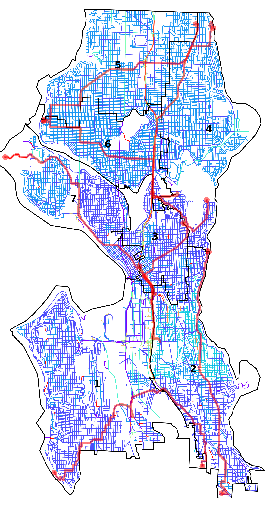
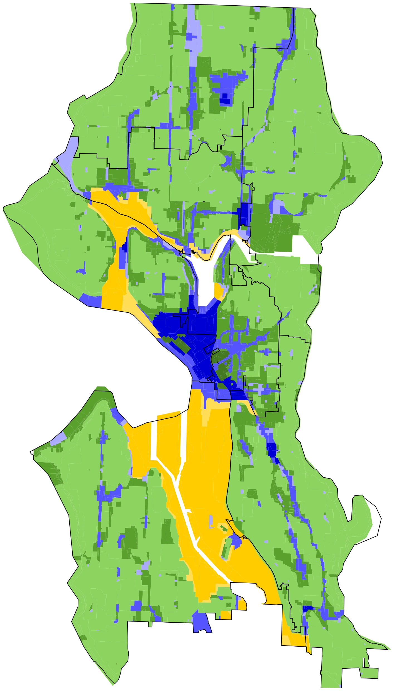

## Districts
```geojson
{"type": "FeatureCollection", "features": [{"id": "1", "type": "Feature", "properties": {"GEOID20": 530330121001013}, "geometry": {"type": "Polygon", "coordinates": [[[-122.39987259523312, 47.51762819384606], [-122.3981840211832, 47.520466423181425], [-122.398049094024, 47.520693194120206], [-122.39794693212653, 47.520864896760884], [-122.39770555079286, 47.521270579541415], [-122.39722975917707, 47.52207022477779], [-122.39723093441371, 47.523017033997604], [-122.39723142713382, 47.523413975366786], [-122.39723147461461, 47.52345222616809], [-122.3972318219119, 47.523735795309086], [-122.39723217670794, 47.524020543753664], [-122.39723246181427, 47.52424586564457], [-122.39723253584765, 47.524304374522885], [-122.39723256924417, 47.52433412551203], [-122.39723298827141, 47.52467439513704], [-122.39751139159786, 47.52493374873595], [-122.39751141486896, 47.52493377180574], [-122.39811735971811, 47.52549824060785], [-122.39888282774776, 47.526211291193825], [-122.40009028168174, 47.52733601213531], [-122.40318639378143, 47.53021970685695], [-122.40123733938422, 47.53225395173684], [-122.4012207051104, 47.53227131225644], [-122.398022477855, 47.53560891239441], [-122.39797529827914, 47.53565814626825], [-122.39797495437197, 47.53565850545575], [-122.39778730777653, 47.53585430865375], [-122.39774051668519, 47.53590313404371], [-122.39773695644963, 47.53590684911104], [-122.39749107832125, 47.5361634187548], [-122.39796012576015, 47.53669180512357], [-122.39796056741136, 47.53669231182751], [-122.39799105355002, 47.53672714917978], [-122.40048345310355, 47.53957532645905], [-122.40054774476135, 47.53976758730258], [-122.40055635949527, 47.539793353378045], [-122.4006022962726, 47.54004596005912], [-122.4007027058313, 47.54059810448505], [-122.40148640787955, 47.54490726927115], [-122.40149751563578, 47.544968339494346], [-122.40178677870821, 47.54655865195452], [-122.40179322588585, 47.54659409994695], [-122.40183707190357, 47.54683514387816], [-122.40184455603537, 47.54687630096889], [-122.4024933919806, 47.55044313489031], [-122.40308335731756, 47.553683909632596], [-122.40313881100863, 47.55399051500746], [-122.40318419778377, 47.554051211989865], [-122.40319100094143, 47.554059857244276], [-122.40821780103964, 47.56044688491888], [-122.40821819270859, 47.56044738250281], [-122.40836103460325, 47.560628848932566], [-122.4083797092587, 47.5606525751206], [-122.40859775315735, 47.56092957775892], [-122.40872857802249, 47.56109577269947], [-122.40891906713685, 47.56133776893351], [-122.40894662018137, 47.56137277024522], [-122.41166232541917, 47.56482244086041], [-122.41341862957965, 47.56705313449147], [-122.41363528476263, 47.567328285270804], [-122.41379924134436, 47.567536518801504], [-122.41396025874698, 47.567741017593576], [-122.4141769184606, 47.56801617185393], [-122.41418001127055, 47.568020099805544], [-122.41532409193162, 47.56876650642632], [-122.41899505248037, 47.57116124768929], [-122.41901014082389, 47.57117108982808], [-122.42072747300834, 47.572291270231986], [-122.42214343742468, 47.57321481752059], [-122.42214497912215, 47.57409820498226], [-122.42218914992448, 47.574744682154154], [-122.42255979370735, 47.574881215710036], [-122.42287702958444, 47.57498306458555], [-122.42314193006906, 47.57508564792833], [-122.42344424879438, 47.57527036898313], [-122.42367679078609, 47.575456063386845], [-122.42383739728201, 47.57557191051544], [-122.42386448310995, 47.57563138311643], [-122.42391221930562, 47.57573619427573], [-122.42389910062147, 47.57587808835327], [-122.4238503742736, 47.5759968634141], [-122.42375830080621, 47.57609463923086], [-122.4237489533516, 47.57610456603718], [-122.42348980922687, 47.57619085183175], [-122.42309146750436, 47.57629089442197], [-122.42214933331843, 47.576594003714675], [-122.4221495062785, 47.576692255210695], [-122.42126235998553, 47.57702624031083], [-122.41936575795496, 47.577740743543586], [-122.41886820295566, 47.57792817816329], [-122.41634552089536, 47.57887658677144], [-122.41634403823512, 47.578877148087365], [-122.41452339130868, 47.579562408749545], [-122.41341489986478, 47.57997930189336], [-122.41333307220624, 47.58002936324636], [-122.41329059925388, 47.58005534695547], [-122.41201247036224, 47.58083724957485], [-122.41194294832127, 47.58087977876926], [-122.4084574184039, 47.58301186472433], [-122.40840252032949, 47.58304536784277], [-122.40797960763784, 47.58303677356546], [-122.40797128029466, 47.5833085479714], [-122.40717683248897, 47.5837933687769], [-122.40659778384472, 47.584252697720025], [-122.40614792841646, 47.58460953694287], [-122.40487244983753, 47.585612006334905], [-122.40485328662474, 47.585627067369956], [-122.40392475299703, 47.586359221494135], [-122.40373800100043, 47.58650647317016], [-122.40346836256218, 47.586719192252254], [-122.40246463051614, 47.58751101646317], [-122.40205049083842, 47.58783771884734], [-122.40183917341861, 47.58800441255163], [-122.39919692497718, 47.59008861628869], [-122.39898563619154, 47.59025527255359], [-122.39837226419142, 47.59073906054498], [-122.39835235288312, 47.59075492193923], [-122.39828360066984, 47.59080969001175], [-122.39701834275282, 47.592117482629746], [-122.39666112633941, 47.592487134118045], [-122.39648708933409, 47.59266723025153], [-122.3946233604443, 47.59459574710233], [-122.39445025481682, 47.59478177813877], [-122.39155008773147, 47.597783376183635], [-122.39144074437688, 47.59789653850789], [-122.39141623404254, 47.59789624897558], [-122.39126809210326, 47.597894512966676], [-122.38854731117804, 47.59786258649525], [-122.38784350830937, 47.597854317517594], [-122.38690961452575, 47.59784333700291], [-122.38689379235774, 47.597843150051006], [-122.38686500599368, 47.59784281267928], [-122.38591831336808, 47.5978316740551], [-122.3831690816024, 47.59780033969074], [-122.38316210194236, 47.5978002593546], [-122.38292737881049, 47.59765693857787], [-122.38261824565433, 47.597468178897905], [-122.38191693377316, 47.597039947970266], [-122.38044004082415, 47.59388530734417], [-122.38031663334881, 47.59362168445506], [-122.37994419940473, 47.59282608976285], [-122.37957671137734, 47.59204103866729], [-122.37945421167014, 47.59177934129229], [-122.37921566658568, 47.59126972250053], [-122.37909332118846, 47.59100835194625], [-122.37905961742163, 47.590936332175694], [-122.37881903568191, 47.5907598907612], [-122.37852684061296, 47.590545586078306], [-122.37847894555597, 47.59051046607987], [-122.37843066139062, 47.59047504817625], [-122.37838801230642, 47.590443770220546], [-122.37829157361818, 47.59037536512782], [-122.37824816650111, 47.59034457331643], [-122.37810833069382, 47.59024538150943], [-122.37615044824432, 47.588856530227275], [-122.37599423878312, 47.58874571714801], [-122.37587077562955, 47.58865813342056], [-122.37579896599402, 47.588607192122694], [-122.37559323604431, 47.588458319820305], [-122.37531141629663, 47.588261319128506], [-122.37422636614971, 47.58749154586613], [-122.37409590124852, 47.587398989244626], [-122.3740001219698, 47.587331039585344], [-122.37394670819938, 47.58729314432504], [-122.37366688513863, 47.587094707476346], [-122.37307832465072, 47.5866773152353], [-122.37092790441406, 47.58515221458828], [-122.3705657084371, 47.5852206866535], [-122.3691560741116, 47.585487155220534], [-122.36571280377643, 47.58654711839824], [-122.36529369361871, 47.58667612151923], [-122.36425563172487, 47.58699528456664], [-122.36391073928284, 47.58710131846699], [-122.36194514970637, 47.587415735010325], [-122.36143846539123, 47.587496776293825], [-122.36141830936073, 47.58750000143222], [-122.36037207331279, 47.58766736538994], [-122.36007205264691, 47.587715357473755], [-122.35841848567942, 47.58797985091198], [-122.35839874613976, 47.58798300695269], [-122.35800377632242, 47.58804524572211], [-122.35797198203666, 47.58805025575484], [-122.35789163113446, 47.588062916245036], [-122.35667037436127, 47.58825870138749], [-122.35640767777436, 47.58830081359182], [-122.35620689489613, 47.58833300020255], [-122.3555810865757, 47.58843331828201], [-122.35542025536078, 47.5884590985014], [-122.35507449173356, 47.58851452137199], [-122.3546460668002, 47.58858319309295], [-122.3545708879785, 47.58859524496759], [-122.35354615073425, 47.58875905538719], [-122.35237914845442, 47.58894559161517], [-122.35183192635648, 47.58903305684624], [-122.3512487569501, 47.58912626278994], [-122.35092020745414, 47.589178772606054], [-122.3505092116275, 47.589244459430354], [-122.35001807852218, 47.58932295151717], [-122.34991198456682, 47.58933990518177], [-122.3498673281817, 47.58934704618112], [-122.34957565876017, 47.58939365547237], [-122.34894046514597, 47.58949516358892], [-122.34885360946826, 47.5895317863075], [-122.34779828851363, 47.58997676482216], [-122.34654201404356, 47.5905058478165], [-122.34603584085237, 47.59071902252664], [-122.34475778232046, 47.59125724250357], [-122.34447274565193, 47.59137727466426], [-122.34438095179414, 47.59141584106639], [-122.34268411883329, 47.592128727698146], [-122.34251131024355, 47.59220132876881], [-122.34251092239373, 47.59220221643249], [-122.34250844945996, 47.59220792488458], [-122.3425080578827, 47.59220882159378], [-122.34247375816228, 47.59228789991445], [-122.34233275432456, 47.59305971376294], [-122.34174707016989, 47.59626525594532], [-122.34120901222794, 47.59921101658611], [-122.34120634080894, 47.599225641414165], [-122.34087772723451, 47.60102459182743], [-122.34088000979165, 47.60158735569492], [-122.34088226779014, 47.60214440286191], [-122.34088234360657, 47.60216306994324], [-122.34013389389654, 47.6021316154962], [-122.33807189356972, 47.602147615723155], [-122.33750089347912, 47.60215161578597], [-122.33698589339677, 47.6021526158425], [-122.33659889323141, 47.601721615862274], [-122.3364798932128, 47.60172361587544], [-122.33634389319195, 47.60172761589055], [-122.33621089317107, 47.60172961590527], [-122.33605089314517, 47.601728615922774], [-122.33553689306328, 47.60173061597925], [-122.3348958929595, 47.601726616049305], [-122.33419589284723, 47.601726616126086], [-122.33391589280207, 47.60172561615671], [-122.33289089263748, 47.60172461626907], [-122.3319998924941, 47.60172261636664], [-122.33143289240294, 47.60172161642878], [-122.33047389224858, 47.601719616533856], [-122.33028189221781, 47.60171961655491], [-122.32999989217258, 47.60171961658581], [-122.32940089207601, 47.60171761665142], [-122.32900489201728, 47.60173761669585], [-122.32900089181078, 47.6008786166512], [-122.32899989180507, 47.60085561665011], [-122.32899889177088, 47.60071361664275], [-122.32899189160823, 47.600039616608065], [-122.32900389140907, 47.59920061656271], [-122.32808289126109, 47.59919961666363], [-122.32794489123896, 47.59919961667875], [-122.32768389119681, 47.59919861670735], [-122.32768689099622, 47.59835961666293], [-122.32769189079599, 47.597520616618255], [-122.3276968905938, 47.5966736165732], [-122.3277128904584, 47.596097616541186], [-122.327732890394, 47.59581561652416], [-122.32737689034288, 47.59584061656453], [-122.32639089018474, 47.59584061667262], [-122.32508488997475, 47.595838616815676], [-122.32378088976509, 47.59583661695852], [-122.3224748895551, 47.59583461710161], [-122.32148888939716, 47.59583561720975], [-122.32120788935183, 47.5958346172405], [-122.32106488932892, 47.59583461725619], [-122.32094988931043, 47.59583461726877], [-122.32075188927845, 47.59583361729041], [-122.32049688923749, 47.59583361731836], [-122.32026588919999, 47.59583161734361], [-122.32027288915654, 47.595645617333055], [-122.32028788911606, 47.59546661732202], [-122.32030988907836, 47.59529461731054], [-122.32035388903176, 47.59507061729394], [-122.32042988896686, 47.59474861726868], [-122.32055388885016, 47.59417861722511], [-122.32061388879153, 47.59389361720356], [-122.32063388876836, 47.59378361719558], [-122.32064288875567, 47.59372461719149], [-122.32067388871707, 47.59354261717853], [-122.32093188846522, 47.59231861708586], [-122.32099488837302, 47.59189161705653], [-122.32099988836069, 47.591836617053076], [-122.32101788831997, 47.591654617041556], [-122.32102288820154, 47.59115661701478], [-122.3209708880801, 47.59068461699566], [-122.32090388799845, 47.590388616987454], [-122.3207588878571, 47.58989561697739], [-122.32040488750866, 47.58867761695211], [-122.32029588736735, 47.58816061693688], [-122.32025088727153, 47.587790616922376], [-122.3201388870716, 47.58703061689464], [-122.32009888692437, 47.586442616868084], [-122.32007488683675, 47.5860926168523], [-122.31996388646718, 47.58462361678714], [-122.31988388630162, 47.58398561676238], [-122.31975788613154, 47.583359616743266], [-122.31968888604624, 47.58304961673446], [-122.31957188590303, 47.58252961671995], [-122.31908288536023, 47.58058961667142], [-122.31900888524474, 47.58015661665676], [-122.31897688511681, 47.579643616633255], [-122.31898088501454, 47.579213616610176], [-122.31906388486871, 47.57854861656605], [-122.31922288472602, 47.57784561651161], [-122.31924988470136, 47.57772461650232], [-122.3194928845176, 47.57679361642668], [-122.31957088446646, 47.576527616404114], [-122.31963988440836, 47.57623861638135], [-122.31968588434802, 47.575955616361405], [-122.31984388364563, 47.572913616183946], [-122.31986288356734, 47.57257361616397], [-122.3198688835408, 47.57245861615725], [-122.31989688344676, 47.572046616132475], [-122.31991288340363, 47.57185561612065], [-122.32000188307585, 47.57042561603562], [-122.32005288297162, 47.569955616005274], [-122.32015388276587, 47.56902761594535], [-122.3206128821597, 47.56618461574533], [-122.32068588208148, 47.56580861571751], [-122.32102588171401, 47.564043615587316], [-122.32121088151567, 47.56308961551676], [-122.32147788108877, 47.561124615383996], [-122.32148588100235, 47.560757615363826], [-122.32136388075571, 47.559807615327124], [-122.3212598806394, 47.55939061531653], [-122.32108388048496, 47.558862615307994], [-122.32091688036569, 47.55847561530585], [-122.32062188018386, 47.55791261530851], [-122.32029988000028, 47.55736061531467], [-122.32017587993643, 47.55717661531853], [-122.31999187984147, 47.55690261532423], [-122.31948787958834, 47.556181615341416], [-122.31897287932966, 47.555444615359], [-122.31891087929746, 47.55535161536088], [-122.31866187916798, 47.554976615368325], [-122.31858087912558, 47.55485361537073], [-122.3182118789252, 47.55426261537996], [-122.31772687865632, 47.55346261539086], [-122.31821787873575, 47.55346561533732], [-122.3186518788059, 47.553467615289904], [-122.31909987887845, 47.55347061524101], [-122.3192408788984, 47.55345961522499], [-122.3193768789159, 47.55344161520915], [-122.31949587892284, 47.55339061519343], [-122.3195438789229, 47.55335861518651], [-122.31956287892282, 47.55334561518372], [-122.31965987891904, 47.55326461516886], [-122.31970987890483, 47.553171615158476], [-122.31972487889482, 47.553119615154095], [-122.31993387899118, 47.55338261514506], [-122.31997387901116, 47.5534396151437], [-122.32015287910177, 47.553698615137726], [-122.32162587937458, 47.553851614984524], [-122.32148387930712, 47.55366461499023], [-122.32137687926462, 47.55355861499639], [-122.32120087920799, 47.55343961500937], [-122.32109287917726, 47.553383615018255], [-122.32098887914435, 47.55331561502599], [-122.32084487909066, 47.55318761503506], [-122.31982487867629, 47.552137615091354], [-122.31978187866055, 47.55210061509411], [-122.31972887864107, 47.552054615097454], [-122.3189428783292, 47.551276615142534], [-122.31842887812422, 47.550763615171746], [-122.31777087786175, 47.55010661520916], [-122.3172248776436, 47.54955961524008], [-122.31691187751885, 47.549247615257855], [-122.31654587737347, 47.548884615278766], [-122.31645887734493, 47.54882361528506], [-122.31619387726732, 47.54867661530633], [-122.31608687723896, 47.54862961531556], [-122.31597487721096, 47.5485876153256], [-122.31576187715747, 47.54850661534464], [-122.31501087697539, 47.548248615413236], [-122.31486487693505, 47.54817761542548], [-122.314760876904, 47.54811761543371], [-122.31467487687614, 47.548058615440034], [-122.31402887662469, 47.54743961547806], [-122.3138328766162, 47.547535615504565], [-122.3135148766022, 47.547690615547545], [-122.31253087655922, 47.548171615680644], [-122.31220987654642, 47.5483336157243], [-122.31203687654038, 47.54842461574806], [-122.31083787618233, 47.547730615842674], [-122.31010087594808, 47.54724461589772], [-122.30966187587981, 47.547253615946246], [-122.3092198757382, 47.54695761597899], [-122.30866287555047, 47.546545616018214], [-122.308450875479, 47.54638861603313], [-122.30796387530654, 47.54599361606557], [-122.30753487514774, 47.54561661609263], [-122.30557187438971, 47.54376061620948], [-122.30479387408947, 47.543025616255846], [-122.30392287376237, 47.54224061630968], [-122.3027458733222, 47.54118761638288], [-122.30020887240133, 47.53903461654679], [-122.2985948718126, 47.53765261665033], [-122.29759187143549, 47.536746616712186], [-122.29722087128769, 47.536376616733236], [-122.2968088711097, 47.535907616753505], [-122.29642187093019, 47.53541561676983], [-122.29609487077278, 47.534975616782376], [-122.29582587063588, 47.53458261679104], [-122.2955358704739, 47.53409861679715], [-122.2948968700782, 47.532869616802095], [-122.29443086977493, 47.53191161680246], [-122.29374186932667, 47.530495616802924], [-122.29345886914513, 47.529924616803676], [-122.2933768690864, 47.52973361680257], [-122.29195086886352, 47.52975861695984], [-122.29197486908605, 47.53067561700575], [-122.29279586922782, 47.53071761691813], [-122.29270886929778, 47.5310696169463], [-122.29209386920077, 47.531076617013916], [-122.29193886931016, 47.531639617060634], [-122.29141586922552, 47.53163661711769], [-122.29140986925742, 47.531774617125635], [-122.2916188692941, 47.53178761710349], [-122.29161586935608, 47.53204961711764], [-122.29104386926214, 47.53204061717972], [-122.29081686922498, 47.53203761720441], [-122.29081986918207, 47.53185561719446], [-122.29080286916383, 47.531790617192875], [-122.29076586914236, 47.53172561719349], [-122.2906728691198, 47.531693617201974], [-122.29053586909406, 47.53167761721613], [-122.29036886906627, 47.53167361723416], [-122.29021486904276, 47.5316786172513], [-122.29001786900969, 47.531672617272534], [-122.28937186890865, 47.53168361734373], [-122.28905786886129, 47.53169661737879], [-122.28848586876761, 47.53168861744094], [-122.28835986868442, 47.531424617440756], [-122.28826986861156, 47.53117961743762], [-122.28819186855684, 47.53100261743679], [-122.2893888687504, 47.5310086173062], [-122.28938486843833, 47.529702617237575], [-122.28842586828416, 47.52970161734238], [-122.28810886823086, 47.529691617376564], [-122.28804386785161, 47.528144617301805], [-122.28803286778906, 47.52788961728951], [-122.28795786735623, 47.52612461720435], [-122.28793486728723, 47.52585061719232], [-122.28786386720505, 47.52555361718443], [-122.28778786714518, 47.525353617182134], [-122.28767086707325, 47.52513061718314], [-122.28751286699112, 47.5248926171878], [-122.28733786691349, 47.52468461719593], [-122.28724386687767, 47.524597617201636], [-122.28696486677187, 47.52434161721855], [-122.28626386651585, 47.523739617263374], [-122.28717586654592, 47.52325161713783], [-122.28718886610523, 47.52139361703806], [-122.28719886571292, 47.51974061694946], [-122.28691186566449, 47.51973061698033], [-122.28597786551813, 47.51974561708324], [-122.28599286529276, 47.51878961703098], [-122.28600886516931, 47.51826061700122], [-122.28507986501948, 47.51825761710264], [-122.28487086498737, 47.51826361712578], [-122.2848838649525, 47.51810861711619], [-122.28487986468481, 47.51698761705728], [-122.2837878645067, 47.516975617176], [-122.28378986440194, 47.51653461715243], [-122.28416286446226, 47.516536617111775], [-122.28444886450895, 47.51653961708064], [-122.28466486452238, 47.51645061705234], [-122.28477886452401, 47.516380617036184], [-122.28486186451663, 47.51629361702246], [-122.28491886449409, 47.516160617009234], [-122.28490686445927, 47.51602261700322], [-122.28485386442767, 47.51592561700387], [-122.28473086438171, 47.51581561701147], [-122.2845508643297, 47.51571861702602], [-122.28582986453165, 47.51570461688546], [-122.28590086453545, 47.51567261687604], [-122.2859458645353, 47.51564161686948], [-122.28596286452462, 47.51558561686462], [-122.2859638644696, 47.51535361685223], [-122.28596386442338, 47.51515961684197], [-122.28594786439602, 47.515055616838225], [-122.28588786436491, 47.51496561683999], [-122.28577086433616, 47.51492361685053], [-122.28559686430468, 47.51490861686879], [-122.28413086406508, 47.5148906170281], [-122.28331186393557, 47.51489861711808], [-122.2831498639262, 47.514968617139445], [-122.28300286389309, 47.514928617153444], [-122.28277786385127, 47.514904617176754], [-122.28174286367799, 47.51487461728833], [-122.28159286365675, 47.51488661730536], [-122.28146186364309, 47.51491761732132], [-122.28145086366085, 47.51499961732685], [-122.28144486382446, 47.51569061736409], [-122.28141886394657, 47.51622061739506], [-122.2814358639769, 47.51633661739933], [-122.28147586399812, 47.51639861739823], [-122.28153186416027, 47.517041617426166], [-122.28077186404566, 47.51707261751089], [-122.27957586386748, 47.51713061764472], [-122.27946486384678, 47.517118617656216], [-122.27924886381925, 47.51714861768142], [-122.27911786368438, 47.516670617670435], [-122.27903986357227, 47.516252617656825], [-122.27890786336745, 47.51548161763045], [-122.27877886307567, 47.514343617584196], [-122.2786878628334, 47.51338761754351], [-122.2789548628765, 47.513388617514366], [-122.27881486267061, 47.512618617488904], [-122.27866386238018, 47.51150061744614], [-122.27854186223915, 47.510990617432455], [-122.27856186197329, 47.50986061737037], [-122.27865986198927, 47.50986161735972], [-122.27873586200194, 47.50986361735155], [-122.27986486218911, 47.509888617229436], [-122.28077586234036, 47.50990961713095], [-122.2812928624262, 47.50992161707511], [-122.282478862623, 47.509948616946915], [-122.2825718626384, 47.509950616936834], [-122.28298186270611, 47.509958616892455], [-122.28337986277212, 47.509967616849394], [-122.28370086282652, 47.509979616814995], [-122.28388486285631, 47.509980616794884], [-122.28443886294832, 47.50999361673505], [-122.28468786298946, 47.509998616708074], [-122.28481286301023, 47.51000161669456], [-122.28489986302465, 47.51000361668518], [-122.28526286308482, 47.51001161664594], [-122.2856598631507, 47.51002061660303], [-122.28577186316942, 47.51002361659094], [-122.28594286319777, 47.51002761657245], [-122.28616186323435, 47.51003361654883], [-122.28624986324895, 47.510035616539305], [-122.28653286329603, 47.51004261650876], [-122.28751886345951, 47.51006461640214], [-122.28766086348323, 47.51006861638682], [-122.28783986351291, 47.51007261636746], [-122.2898618638481, 47.51011761614882], [-122.29006686388219, 47.5101226161267], [-122.29018286390131, 47.51012461611413], [-122.29027186391606, 47.51012661610449], [-122.29080986400525, 47.51013861604631], [-122.29133809553997, 47.51015121604354], [-122.29133724166432, 47.51022983896528], [-122.29133218832484, 47.510695879091166], [-122.29133217525695, 47.510696978569065], [-122.29132655393828, 47.51121497333814], [-122.29132654741169, 47.511216116812435], [-122.29132134388448, 47.51169545224338], [-122.29132130301124, 47.51169883346157], [-122.29132074955466, 47.51175030753216], [-122.29132071096961, 47.51175334327495], [-122.29131666437303, 47.512124353018976], [-122.29131664241346, 47.512126511439185], [-122.29131578811533, 47.51220748992596], [-122.29131290424188, 47.51248106175677], [-122.29131288537518, 47.512482903478386], [-122.29130819658953, 47.51293251044668], [-122.29130816472907, 47.51293545434403], [-122.29130472249375, 47.51326574137333], [-122.2913043407412, 47.513301943444176], [-122.29130429731181, 47.513306182912764], [-122.29130314954209, 47.51341645611475], [-122.29130308909774, 47.51342231867857], [-122.29130303142901, 47.513427844244546], [-122.2913019657566, 47.51352995214313], [-122.29130185209979, 47.51354269552425], [-122.29130122983364, 47.51361336072692], [-122.29130120111668, 47.5136181262722], [-122.29130094886355, 47.51365857908575], [-122.29130019617176, 47.51369970222761], [-122.29130018708437, 47.51370037434483], [-122.29129863255014, 47.51384116087379], [-122.29129572015835, 47.514105458204114], [-122.29128712055892, 47.51488533967247], [-122.29128565394974, 47.51501834139505], [-122.2912856365315, 47.5150199501019], [-122.29128128495671, 47.51541492278565], [-122.29127534291563, 47.51595367722536], [-122.29127533212004, 47.515954525685906], [-122.2912689701733, 47.51653130527411], [-122.29126503318554, 47.51688897795459], [-122.29126501538657, 47.516889053749445], [-122.29126395666752, 47.516985803933814], [-122.29126588304256, 47.518309562746666], [-122.29126588594254, 47.51831208788428], [-122.29126613734525, 47.518485307872204], [-122.29126616663625, 47.518505314350584], [-122.29126629791578, 47.51859498134185], [-122.29126638360616, 47.518654165770016], [-122.29126661551854, 47.518812539923594], [-122.29126661675916, 47.51881329647054], [-122.29126673328922, 47.51888303190152], [-122.29126674762936, 47.51889000181172], [-122.29126674854041, 47.51889008186435], [-122.29126695479958, 47.51904753875629], [-122.29126718495284, 47.519144553973035], [-122.29126718596729, 47.51914487511689], [-122.29126718374545, 47.519144938117364], [-122.2912672042155, 47.51919106030353], [-122.29126729102096, 47.51923105536796], [-122.2912672978484, 47.519239694102566], [-122.29126737153469, 47.51933292854173], [-122.2912674336369, 47.51937522149951], [-122.29126760968055, 47.519497650187645], [-122.2912676090963, 47.5194980091352], [-122.29126784613477, 47.519660744480575], [-122.29126794411268, 47.519725590828564], [-122.2912679444814, 47.519726173764106], [-122.29126825177704, 47.51993751830246], [-122.29126853622473, 47.52013314752896], [-122.2912686080381, 47.52018414398422], [-122.29126860927049, 47.52018461535843], [-122.2912687904515, 47.5205445768435], [-122.29126883840387, 47.52064063272815], [-122.2912688378137, 47.52064222592585], [-122.29126919728677, 47.520915834398636], [-122.29126919853844, 47.520917113612605], [-122.29126931404119, 47.52100134070061], [-122.29126944817085, 47.52109876826776], [-122.29126945066896, 47.52110042439779], [-122.29126973989055, 47.52131729965171], [-122.29126976478504, 47.52133461751576], [-122.29126976572648, 47.521336028075204], [-122.29126984251405, 47.52139954688746], [-122.2912699570356, 47.52148179217127], [-122.29127005493791, 47.52155879030653], [-122.29127038469294, 47.52180735881918], [-122.2912704330572, 47.521842655771145], [-122.29127043768449, 47.521846667024455], [-122.29127043978869, 47.52184773931967], [-122.2912709689804, 47.52224573319373], [-122.29127102634355, 47.52228685943294], [-122.29127107972408, 47.522327985723216], [-122.29127164554485, 47.52275914734976], [-122.2912717767507, 47.52285655783617], [-122.29127188976965, 47.52294046562608], [-122.29127223658446, 47.52319467620762], [-122.29127228981598, 47.52323579710249], [-122.29127234718128, 47.5232769233418], [-122.29127291513511, 47.523486812332145], [-122.29127292096494, 47.52348910983359], [-122.2912734491232, 47.52368404439813], [-122.29127357089104, 47.52372965701175], [-122.29127449733873, 47.52391001025932], [-122.29127550235587, 47.524104989758285], [-122.29127640903359, 47.524280889567635], [-122.29130486745407, 47.52428140105078], [-122.29130486745508, 47.52428561674099], [-122.29130786747963, 47.524386616745986], [-122.29131086749966, 47.52446861675002], [-122.29138686751159, 47.52446761674168], [-122.29181586758044, 47.524467616694785], [-122.29295386776285, 47.52446661657024], [-122.29337186782992, 47.52446661652449], [-122.29366486787671, 47.52446561649243], [-122.29384186787291, 47.524330616465924], [-122.294071867911, 47.52433561644105], [-122.29549886814642, 47.52436261628639], [-122.29774486851635, 47.5244026160429], [-122.29978157479462, 47.524433504894766], [-122.30001392296944, 47.52443766559883], [-122.30049486897089, 47.52445861574511], [-122.30051586897429, 47.5244586157428], [-122.30100286905241, 47.52445861568954], [-122.30057486901497, 47.52458961574326], [-122.3003168689924, 47.52466861577566], [-122.30024986899288, 47.52471561578547], [-122.30022686899848, 47.52475461579005], [-122.30022286900524, 47.524785615792155], [-122.30015386902446, 47.5249126158064], [-122.30011394570202, 47.524986200028394], [-122.30008921465208, 47.52500189434396], [-122.30002551169962, 47.525044353959096], [-122.29996336014342, 47.52508786043525], [-122.29989294623498, 47.52514080960054], [-122.29982933207098, 47.52519757611061], [-122.29977296837365, 47.52525775203695], [-122.29972425912577, 47.525320920158755], [-122.29968354104778, 47.52538663263643], [-122.29965644807892, 47.52544237707576], [-122.29963805541011, 47.52548895202748], [-122.29961844289139, 47.52555896923129], [-122.29960757399084, 47.52562985324299], [-122.29960551832033, 47.525701102988805], [-122.29961228717615, 47.52577222174428], [-122.29962019114129, 47.525821843375795], [-122.29963008939554, 47.52587130162741], [-122.29964196494979, 47.5259205589348], [-122.29965581679747, 47.525969579326265], [-122.29967162807581, 47.52601832973363], [-122.29968938963476, 47.52606676799301], [-122.29970909385442, 47.52611485911739], [-122.29973071590526, 47.52616257014123], [-122.29976257712157, 47.52622196929357], [-122.29976086928319, 47.526262615920764], [-122.29979086937313, 47.52661961593635], [-122.29986186945438, 47.526912615944084], [-122.29987686947105, 47.5269726159456], [-122.2999048695049, 47.52709561594907], [-122.30028686977842, 47.5279856159543], [-122.30093087013303, 47.5290396159396], [-122.30106157372204, 47.52910163526787], [-122.30106983820909, 47.52911154330085], [-122.30112995063313, 47.52918050738937], [-122.30117458000522, 47.5292260362613], [-122.30122089825416, 47.529270784931946], [-122.30126887536086, 47.52931472499985], [-122.30131848128082, 47.529357827164375], [-122.30136968601958, 47.52940006392321], [-122.30142245289298, 47.52944140606155], [-122.30147674807462, 47.52948183152419], [-122.30153253893879, 47.52952131374263], [-122.3015897914304, 47.52955982256828], [-122.30164846510839, 47.52959733693112], [-122.3017085247412, 47.52963383209549], [-122.30176993116407, 47.52966928517578], [-122.30183264388421, 47.529703673303466], [-122.3018966197529, 47.52973697364459], [-122.30196182764703, 47.52976916590843], [-122.30202821246719, 47.52980022741541], [-122.30209574053531, 47.529830141506466], [-122.30216437000372, 47.52985888443127], [-122.30223404868086, 47.52988644246903], [-122.3022340930296, 47.529886460787296], [-122.30231517702349, 47.52991904312542], [-122.30239713910215, 47.52995077742344], [-122.30247991964329, 47.52998152771087], [-122.30256348256567, 47.53001128635604], [-122.30264780506535, 47.53004004555578], [-122.3027328722036, 47.53006779380664], [-122.30282578985233, 47.530092917971615], [-122.30284926927214, 47.5300996446687], [-122.30291793858599, 47.53011931594817], [-122.30300927296148, 47.53014697753094], [-122.30309975940912, 47.53017588966226], [-122.30318935644323, 47.53020604118597], [-122.30327803455292, 47.53023742169097], [-122.30336575340213, 47.53027001370928], [-122.30345247155492, 47.53030380788374], [-122.30353816202829, 47.53033878927258], [-122.30357031270417, 47.53035252623115], [-122.30389093086916, 47.53050099057222], [-122.3039498961005, 47.53053097982234], [-122.30402866225639, 47.53057275971072], [-122.30410615725177, 47.53061561753222], [-122.3041823539741, 47.53065953384919], [-122.30423294884407, 47.53068991690596], [-122.30425721463718, 47.53070448756308], [-122.30426649142639, 47.53070957345633], [-122.30431138442924, 47.530734180187544], [-122.30436416994974, 47.53076499272258], [-122.30441551602404, 47.5307968997961], [-122.30446538187955, 47.530829868652674], [-122.30451371484382, 47.53086386849028], [-122.3045604688578, 47.5308988675216], [-122.30460559770934, 47.5309348285638], [-122.30464906070061, 47.53097172155926], [-122.30469081159328, 47.531009508425846], [-122.30473081880545, 47.53104815269072], [-122.30476903216541, 47.53108761812178], [-122.30480543071279, 47.5311278681086], [-122.30483996412286, 47.53116886102338], [-122.30487260206367, 47.53121055767819], [-122.3049033209182, 47.531252921496744], [-122.3049320876219, 47.531295910627534], [-122.30495887299207, 47.5313394795703], [-122.30498365343598, 47.53138359264787], [-122.30500639974478, 47.53142820346055], [-122.30502709741668, 47.53147326901644], [-122.30504572268052, 47.53151874734316], [-122.3050622571015, 47.53156459729882], [-122.30507668602496, 47.53161077049557], [-122.30508899497363, 47.531657224840295], [-122.30509917197347, 47.5317039128099], [-122.30552748389246, 47.531706513212455], [-122.30553557993252, 47.531706561239176], [-122.30778605580751, 47.53172676706714], [-122.3078305841268, 47.5317271397667], [-122.3084448719821, 47.53173861526024], [-122.30893887206324, 47.53174661520665], [-122.30919187210476, 47.53175061517916], [-122.31329987277059, 47.53177961473127], [-122.31368654704603, 47.53177918111946], [-122.31375246151319, 47.531779802032645], [-122.31375396424488, 47.531779816637], [-122.31385370564098, 47.53178075337656], [-122.31395494982367, 47.531781706428795], [-122.31398559551668, 47.531781997052825], [-122.31405619278436, 47.53178266300526], [-122.3141425850807, 47.53178347299737], [-122.31415743957892, 47.53178361404392], [-122.31423973431028, 47.53178438650804], [-122.31425867973815, 47.531784565078944], [-122.31426624250152, 47.53178463652734], [-122.31435992794455, 47.531785518617724], [-122.31446117214574, 47.53178647121889], [-122.3144783757082, 47.531786633777614], [-122.3145624163761, 47.531787424629215], [-122.31466366053354, 47.531788375251445], [-122.31472550318416, 47.53178895611832], [-122.3147649060992, 47.531789328464015], [-122.31484695027466, 47.531790117249614], [-122.31488633077191, 47.5317904952432], [-122.31496839611941, 47.53179128096629], [-122.31500775935677, 47.531791659142854], [-122.31510893846573, 47.531792563437484], [-122.31521011758007, 47.53179351442141], [-122.31531129534471, 47.53179446443325], [-122.31541247719879, 47.53179541790016], [-122.31551365632421, 47.531796368613776], [-122.31561483279778, 47.53179731927199], [-122.31571601195611, 47.531798270704684], [-122.31581719104145, 47.531799219349516], [-122.31591837158618, 47.531800172383264], [-122.31601955073008, 47.531801122646414], [-122.31612072857547, 47.531802073736095], [-122.31622191033112, 47.5318030219859], [-122.31632308550266, 47.53180397203079], [-122.31642426598916, 47.53180492191628], [-122.31652544525382, 47.53180587532609], [-122.31664686121846, 47.53180701155133], [-122.3168824919987, 47.53180922523438], [-122.31690883418271, 47.531809472681964], [-122.31690912911158, 47.53180947422844], [-122.31692149365793, 47.53180958985242], [-122.31702671872816, 47.53181058084642], [-122.31804961051515, 47.53182017729454], [-122.31846564230959, 47.531824075102996], [-122.31847558469022, 47.531824167343316], [-122.31847583428107, 47.531776028801794], [-122.31847891219131, 47.53118238559172], [-122.31847987344382, 47.53111961412972], [-122.31848187339642, 47.530919614118936], [-122.31848287337988, 47.53084961411513], [-122.31848787331532, 47.53057561410011], [-122.31848816481273, 47.530546463708156], [-122.31848884440562, 47.530507939855475], [-122.31848910566686, 47.53049310374836], [-122.31848941359017, 47.53047563154578], [-122.31849055522427, 47.53041085278032], [-122.31849539095208, 47.530136726616554], [-122.31849772023875, 47.53000468033916], [-122.31850187312867, 47.52978361405678], [-122.31850238292228, 47.52974028076454], [-122.31850312625849, 47.52969811919975], [-122.31850522934938, 47.52957891588679], [-122.3185078730488, 47.52944461403821], [-122.3185075988301, 47.529444612937276], [-122.31850766978866, 47.52944059097301], [-122.31842199127907, 47.529440321079484], [-122.3183750507466, 47.52944017539583], [-122.31831999245526, 47.52944000085795], [-122.31824147656334, 47.52943975505519], [-122.31821799636504, 47.52943968320788], [-122.3181159975437, 47.52943936280322], [-122.31801399872361, 47.52943904230697], [-122.31791199857706, 47.5294387217365], [-122.3178100038196, 47.52943840370291], [-122.31770800234776, 47.52943808296666], [-122.31759070333388, 47.529437714116696], [-122.31758987289538, 47.52941861413725], [-122.31758287283608, 47.529174614125154], [-122.31758987280311, 47.529031614116825], [-122.31760487275758, 47.528830614104585], [-122.31761387269319, 47.52855461408899], [-122.31756887260515, 47.528215614076046], [-122.31749787258447, 47.528176614081744], [-122.31510487202378, 47.527434614304354], [-122.31500587200028, 47.527402614313495], [-122.31491287197872, 47.52737461432218], [-122.3128478715164, 47.52682461451899], [-122.31265987147624, 47.526782614537346], [-122.31190187130844, 47.52658861461003], [-122.31185087129404, 47.52656261461422], [-122.31173887125888, 47.5264906146227], [-122.31162387121138, 47.52636861462883], [-122.31144287113919, 47.52618761463906], [-122.3110988709829, 47.52576361465427], [-122.31083702749527, 47.525522884889405], [-122.31081697822883, 47.52549672600179], [-122.3107924614884, 47.52546470950779], [-122.3107345094622, 47.52538909854516], [-122.31073213042029, 47.52538599436635], [-122.30995548023549, 47.52471361179728], [-122.3098708705061, 47.52458961472655], [-122.3097231868897, 47.52431451801689], [-122.30986431609105, 47.523963064592465], [-122.30986597712507, 47.52389024260371], [-122.30981284146888, 47.52374168904627], [-122.3096767525148, 47.523361210026536], [-122.30963638503401, 47.52324834504962], [-122.30964420045628, 47.52319698858444], [-122.30977403767756, 47.52234348207665], [-122.30973662895602, 47.52217634430379], [-122.30979807048271, 47.522176486713626], [-122.3102702319541, 47.52217791893266], [-122.31140667046682, 47.52218126547048], [-122.311875756143, 47.52218264107918], [-122.3128529772781, 47.52218550311509], [-122.31289884575774, 47.522185637070365], [-122.31290224583785, 47.5222253192973], [-122.31291311243591, 47.52222575350683], [-122.31291409366595, 47.52222579290336], [-122.31291496412027, 47.5222258130518], [-122.3129741905783, 47.522226985654584], [-122.31347061620129, 47.522228446565904], [-122.31352272980642, 47.52222859875226], [-122.31498173249422, 47.52223288227839], [-122.31499836724348, 47.522232933793745], [-122.31755562697822, 47.52224082498661], [-122.31755560358877, 47.522227332166906], [-122.31767087119387, 47.52222761374868], [-122.3176558710975, 47.52183361372947], [-122.317625870898, 47.521016613689596], [-122.31760787078501, 47.52055461366714], [-122.31760287074702, 47.52039861365946], [-122.31759287067725, 47.52011261364546], [-122.3175858706387, 47.519955613637904], [-122.31758187060993, 47.51983761363211], [-122.3175588704568, 47.519210613601494], [-122.31754703846242, 47.518895377845915], [-122.31754648714184, 47.51873063215991], [-122.31814587043702, 47.51873261351206], [-122.3184278704815, 47.51872961348108], [-122.31861587051122, 47.51872761346043], [-122.32015087075534, 47.51871961329213], [-122.32035787078856, 47.51871961326949], [-122.32130687094119, 47.51872161316578], [-122.32162187099115, 47.518719613131246], [-122.32169484621866, 47.51871829276737], [-122.3222565438368, 47.518719407467245], [-122.32225628506191, 47.518708132945186], [-122.32316887123251, 47.518691612960545], [-122.3232448712442, 47.51868961295217], [-122.32345287127778, 47.518690612929454], [-122.32387287134539, 47.518691612883586], [-122.32408787137983, 47.518691612860046], [-122.32414987138974, 47.51869161285328], [-122.3245248714501, 47.51869261281234], [-122.32467464245806, 47.518689313040866], [-122.32479008428852, 47.5186895570556], [-122.32491467614922, 47.51868982100568], [-122.32496886097204, 47.5186899361992], [-122.32497538300429, 47.51868994770883], [-122.32497707878782, 47.5186899461306], [-122.32503608877882, 47.518690036610245], [-122.32563135416945, 47.51869088439562], [-122.32587962277847, 47.51869630175987], [-122.32587977446562, 47.51877308401925], [-122.3258799436345, 47.51885533105729], [-122.32588020394292, 47.518981898731305], [-122.32588039501641, 47.519074650191556], [-122.32588046250198, 47.519108822672685], [-122.32588072062397, 47.51923489649149], [-122.32588075712907, 47.51925184730493], [-122.32588075882019, 47.5192521846353], [-122.3258809732673, 47.51935975861175], [-122.32588097850731, 47.51936165761308], [-122.32588141238557, 47.51957359390418], [-122.32588215023918, 47.51993393615402], [-122.32588223482728, 47.519975059673335], [-122.32588228806001, 47.52000024706801], [-122.32588238486386, 47.52004703795042], [-122.32588287424171, 47.52028804341122], [-122.32588293021777, 47.52031545999585], [-122.32588319998486, 47.520448572187114], [-122.32588332079796, 47.52050621921051], [-122.32588347428073, 47.520579848221274], [-122.32588374074165, 47.5207111288565], [-122.3258840058248, 47.52084240771068], [-122.32588414690474, 47.520910223624604], [-122.32589098411196, 47.52091021355893], [-122.32589087220126, 47.52092561278083], [-122.32791387252578, 47.520926612559634], [-122.32960687279518, 47.52091861237401], [-122.33008787287062, 47.52091161232103], [-122.33061387295398, 47.5209076122633], [-122.33079387298257, 47.52090661224358], [-122.33092087300312, 47.52090761222971], [-122.3309173062311, 47.52090258519216], [-122.33091941606227, 47.52090258181787], [-122.3309645751983, 47.52090250910791], [-122.32974447163166, 47.51865545757926], [-122.32970487222552, 47.51846261223365], [-122.32962587217594, 47.51830761223412], [-122.3295708721416, 47.51820061223448], [-122.3295328721181, 47.51812761223477], [-122.32953087209802, 47.5180446122306], [-122.32952887208414, 47.51798761222783], [-122.32951987200238, 47.517650612210986], [-122.32951687197924, 47.51755561220634], [-122.3295118719408, 47.51739761219854], [-122.32950187192348, 47.51733161219612], [-122.32950087192116, 47.517322612195755], [-122.32949011978721, 47.51731432777666], [-122.32949030367523, 47.51725038660528], [-122.32944862712074, 47.5172272857837], [-122.32942160919471, 47.517227207146604], [-122.32940623303656, 47.51722716408179], [-122.32937033578797, 47.51722706114773], [-122.32936897979971, 47.51722705561789], [-122.32925451904762, 47.51722501778849], [-122.32922904144772, 47.51722635638775], [-122.32922187184474, 47.51718961221926], [-122.32921487184026, 47.51717561221928], [-122.3291918718261, 47.51713161221947], [-122.32886387168516, 47.51676061223577], [-122.32872787162475, 47.51659861224207], [-122.3286538715919, 47.51651061224553], [-122.32734478798497, 47.51401009498969], [-122.32818531364833, 47.51400541591077], [-122.3282017270283, 47.51400532437577], [-122.32847922039815, 47.51400377648627], [-122.32850516815375, 47.514003631875816], [-122.32857987098295, 47.514004612121276], [-122.3300938712251, 47.514002611955625], [-122.33027342910968, 47.51400446305915], [-122.33043660124001, 47.51431573665663], [-122.3304394508661, 47.51432045352266], [-122.33044096068024, 47.51432299750384], [-122.33044247049443, 47.514325541485086], [-122.33044397242207, 47.514328088269004], [-122.33044547434983, 47.514330635052914], [-122.3304469656588, 47.51433318197683], [-122.33044846102752, 47.514335731546026], [-122.33044995506904, 47.51433828113266], [-122.33045144512857, 47.514340830771765], [-122.33045293120618, 47.514343380463394], [-122.33045441470664, 47.514345932887764], [-122.33045590226686, 47.514348487957434], [-122.33045738826746, 47.514351034951176], [-122.33045887044098, 47.51435358739298], [-122.330460353942, 47.514356139817274], [-122.33046183736576, 47.51435868954377], [-122.33046332352187, 47.51436124193303], [-122.33046480960057, 47.51436379162448], [-122.33046629442958, 47.51436634403118], [-122.33046778449072, 47.51436889367008], [-122.33046927455202, 47.51437144330899], [-122.33047076859559, 47.51437399289539], [-122.33047226654385, 47.51437653973144], [-122.33047376449234, 47.514379086567516], [-122.33047527040517, 47.51438163329857], [-122.33047677225852, 47.5143841773843], [-122.330478281973, 47.51438671776792], [-122.33047979983255, 47.51438926434147], [-122.3304813175373, 47.51439180551933], [-122.3304828431289, 47.51439434389446], [-122.33048437137549, 47.51439688223447], [-122.3304859075347, 47.51439941867103], [-122.33048744892605, 47.5144019523398], [-122.33048899958335, 47.5144044849867], [-122.33049054883595, 47.514407014953335], [-122.33049211524117, 47.51440954109541], [-122.33049368573198, 47.51441207078204], [-122.33049526392884, 47.51441459137106], [-122.33049684746122, 47.51441711278923], [-122.33049844814617, 47.514419630382896], [-122.33050005010706, 47.51442214616054], [-122.33050166391112, 47.51442465818355], [-122.33050328435212, 47.51442717011905], [-122.33050492059257, 47.514429677348275], [-122.3305066686164, 47.514432192999635], [-122.33050832325956, 47.51443469368891], [-122.33050998313497, 47.514437191610405], [-122.3305116536036, 47.5144396884927], [-122.3305133385443, 47.51444218068609], [-122.33051503277682, 47.514444672756944], [-122.3305167268544, 47.51444715943226], [-122.33051843142212, 47.51444964147114], [-122.33052014392837, 47.51445212250581], [-122.33052186447641, 47.51445460613324], [-122.33052359283396, 47.51445708426002], [-122.33052532790596, 47.514459564997196], [-122.33052706670195, 47.51446203668907], [-122.33052881075595, 47.514464506512454], [-122.33053056550655, 47.514466978893594], [-122.33053232023154, 47.51446945037547], [-122.33053408279171, 47.51447191725596], [-122.33053585201478, 47.514474384948265], [-122.33053762241042, 47.51447684722738], [-122.33053939691742, 47.51447931395032], [-122.33054117132131, 47.514481777076185], [-122.33054295238807, 47.5144842410138], [-122.33054473733378, 47.51448670130183], [-122.33054652363283, 47.51448916247157], [-122.33054830857887, 47.51449162275954], [-122.33055009753306, 47.51449408389426], [-122.3305518916936, 47.51449654136189], [-122.33055368330284, 47.51449900246153], [-122.33055547746365, 47.51450145992911], [-122.33055727305536, 47.514503920976196], [-122.33055906323446, 47.51450637849621], [-122.33056085612009, 47.514508837779694], [-122.33056264900588, 47.51451129706315], [-122.33056443918544, 47.5145137545831], [-122.33056623079585, 47.51451621568253], [-122.33056801707116, 47.51451867595269], [-122.33056980337243, 47.5145211371221], [-122.33057159097542, 47.514523597374705], [-122.33057336939025, 47.51452606134686], [-122.33057514783117, 47.514528526218214], [-122.33057692096267, 47.51453099115951], [-122.33057869805069, 47.51453345514907], [-122.3305804605894, 47.5145359211296], [-122.33058222315411, 47.514538388009385], [-122.33058383913988, 47.51454083703003], [-122.33058606117675, 47.51454321238997], [-122.33058805638817, 47.51454559613766], [-122.33059005045321, 47.514547986197705], [-122.33059204168288, 47.51455036999781], [-122.33059402908557, 47.514552759246], [-122.33059601263552, 47.51455515304297], [-122.33059799079862, 47.514557544212124], [-122.33059996633297, 47.51455993631556], [-122.33060194199668, 47.51456233291519], [-122.33060391227357, 47.514564726886995], [-122.33060588390389, 47.514567121740555], [-122.33060785032818, 47.514569520261134], [-122.33060981414957, 47.51457192061525], [-122.33061178049671, 47.51457431643799], [-122.33061374424098, 47.51457671409418], [-122.33061570280512, 47.51457911631669], [-122.33061766386913, 47.51458151310862], [-122.3306196250883, 47.514583915296036], [-122.33062158755762, 47.514586314768145], [-122.33062355130279, 47.51458871242421], [-122.33062550984192, 47.5145911137473], [-122.33062747358748, 47.514593511403284], [-122.3306294361091, 47.5145959126738], [-122.33063139985495, 47.514598310329724], [-122.33063336628167, 47.514600708849876], [-122.3306353339325, 47.51460310375542], [-122.3306373043675, 47.514605503122304], [-122.33063927597497, 47.51460789707597], [-122.33064124893589, 47.514610291911445], [-122.33064322582747, 47.514612684895845], [-122.33064520933024, 47.514615076893435], [-122.330647190101, 47.514617466228195], [-122.33064917888785, 47.514619857256434], [-122.33065117017462, 47.51462224285404], [-122.33065316148738, 47.51462462935089], [-122.33065516068714, 47.51462701304492], [-122.33065716777372, 47.514629393936104], [-122.33065917491227, 47.51463177662584], [-122.33066118580064, 47.514634151169574], [-122.33066320467923, 47.51463652650756], [-122.3306652276176, 47.51463890449082], [-122.33066726094275, 47.51464127424062], [-122.33066929809522, 47.5146436385423], [-122.33067134066067, 47.514646006371024], [-122.33067338830338, 47.51464836603635], [-122.33067544661687, 47.51465072736012], [-122.33067751008512, 47.51465308321824], [-122.33067958146607, 47.51465543717281], [-122.33068166065654, 47.51465778562676], [-122.33068374513088, 47.514660133111406], [-122.33068584277578, 47.514662476823915], [-122.33068794560128, 47.514664815970114], [-122.33069005636534, 47.51466715411192], [-122.33069217884349, 47.514669484002845], [-122.33069430665722, 47.51467181472299], [-122.33069647879105, 47.51467416285097], [-122.33069862360279, 47.51467648435087], [-122.33070078423982, 47.51467880204368], [-122.33070295133314, 47.51468111335411], [-122.33070512628757, 47.514683420962314], [-122.33070730920647, 47.51468572846556], [-122.33070950258953, 47.51468803043317], [-122.33071170385959, 47.51469032959788], [-122.33071391038764, 47.5146926268941], [-122.3307161260526, 47.5146949186721], [-122.33071834825128, 47.5146972067655], [-122.3307205797159, 47.514699493837114], [-122.33072281511126, 47.51470177905766], [-122.33072505173092, 47.5147040606636], [-122.33072730282265, 47.51470633758061], [-122.33072955521621, 47.51470861358082], [-122.3307318141693, 47.51471088679572], [-122.3307340797853, 47.514713160822296], [-122.3307363492803, 47.51471543119929], [-122.33073862400752, 47.51471769880843], [-122.3307409026396, 47.5147199636672], [-122.33074318530566, 47.51472223027202], [-122.33074547312646, 47.514724491411165], [-122.330747763628, 47.51472675341449], [-122.33075005272485, 47.51472901273749], [-122.33075235369088, 47.51473126920514], [-122.3307546506749, 47.514733525725205], [-122.33075695562344, 47.514735782140335], [-122.33075925924477, 47.514738038572844], [-122.33076156544355, 47.51474029227251], [-122.33076387687458, 47.514742543204314], [-122.33076618572846, 47.51474479686886], [-122.3307684984873, 47.51474704778306], [-122.3307708099189, 47.51474929871479], [-122.3307731227556, 47.514751552326715], [-122.3307754394971, 47.51475380318828], [-122.33077775491141, 47.51475605406733], [-122.33078007024845, 47.514758302248495], [-122.3307823803537, 47.51476055319742], [-122.33078469587196, 47.51476280767341], [-122.33078701128711, 47.51476505855222], [-122.33078931735915, 47.514767307754994], [-122.33079163285214, 47.51476956133155], [-122.33079393764889, 47.514771812350205], [-122.33079625048755, 47.51477406596168], [-122.33079855411229, 47.51477632239343], [-122.33080085633232, 47.5147785761448], [-122.33080315995747, 47.51478083257642], [-122.33080545442033, 47.51478309362682], [-122.33080775013322, 47.51478535196186], [-122.33081004056265, 47.51478761126619], [-122.33081232974243, 47.51478987328573], [-122.33081461494021, 47.514792135357744], [-122.33081689365632, 47.51479440291281], [-122.33082022514532, 47.51479795652109], [-122.33117852782404, 47.51515091067201], [-122.33119190563585, 47.51514981710288], [-122.33119687167635, 47.51515461189583], [-122.33139987170483, 47.51513761187272], [-122.33141987169995, 47.515103611868746], [-122.33263087184253, 47.51488761172491], [-122.33350939338861, 47.514731053326486], [-122.33354996497387, 47.51474317822481], [-122.33354967892778, 47.51474169297534], [-122.33356987195964, 47.51474761161482], [-122.33352687190242, 47.51453661160838], [-122.33405087198429, 47.51452761155064], [-122.33437187203596, 47.51452861151558], [-122.33436787202959, 47.51450461151474], [-122.33427306091004, 47.51393950096416], [-122.33431557712754, 47.51393905833536], [-122.3347900402913, 47.51393412206461], [-122.33557384674192, 47.51392596705792], [-122.33572187210929, 47.51392861133625], [-122.33652187223535, 47.513919611248305], [-122.3366091085693, 47.51391518622698], [-122.33704019799083, 47.513910692797985], [-122.33704418368995, 47.51401954494703], [-122.33704418498695, 47.514019589910326], [-122.33708311804232, 47.51450855554013], [-122.33708698138228, 47.514557093195684], [-122.3371098467007, 47.514844216578624], [-122.33711147912766, 47.51486476273619], [-122.33712411657893, 47.5150234790399], [-122.3371487891335, 47.51516195311523], [-122.33719611683966, 47.51542759918499], [-122.33720236659931, 47.51546269656254], [-122.3372096830596, 47.51550374512653], [-122.33722018055988, 47.515562677189365], [-122.33723893993174, 47.5156679466949], [-122.33724490370312, 47.51570141416688], [-122.33736398681651, 47.516369795430926], [-122.33736399966719, 47.516369872627166], [-122.33750753562683, 47.517175476688024], [-122.33752514909978, 47.5172578383866], [-122.33753512978998, 47.51725789456493], [-122.33753587319438, 47.51726261131384], [-122.33755187319672, 47.51726161131202], [-122.33794487326016, 47.51726361126918], [-122.33992987358079, 47.51727461105261], [-122.34014887361776, 47.517282611029145], [-122.3402300494355, 47.51727304580378], [-122.34139283723067, 47.517279917776314], [-122.34143409301898, 47.517280161559604], [-122.34145187382629, 47.517281610886535], [-122.3416248738552, 47.51728661086787], [-122.34289287405974, 47.517292610729505], [-122.34388787422054, 47.51729861062102], [-122.3441658742653, 47.517299610590676], [-122.34465387434466, 47.51730461053756], [-122.34544087447144, 47.517307610451596], [-122.34671387467702, 47.51731461031275], [-122.34798687488284, 47.51732261017394], [-122.34803187489004, 47.51732261016901], [-122.34926087508853, 47.51732961003493], [-122.35066987531607, 47.51733760988123], [-122.35174987549067, 47.51734460976351], [-122.35179287549761, 47.51734460975879], [-122.35292387568396, 47.51736660963623], [-122.35341887576536, 47.51737560958258], [-122.35405187586767, 47.517379609513554], [-122.35518187605005, 47.51738560939023], [-122.3561268762028, 47.51739160928723], [-122.35652787626606, 47.517387609243116], [-122.3578738764763, 47.51736560909473], [-122.35804970314906, 47.51736227375658], [-122.35853162225294, 47.517362596282396], [-122.35853151438654, 47.51735334516087], [-122.35857187658496, 47.51735260901771], [-122.35857487637256, 47.51645960897032], [-122.3585788761525, 47.515533608921075], [-122.35919587625133, 47.5155336088536], [-122.36050987646166, 47.515533608709866], [-122.36052351055048, 47.515963252522205], [-122.36053362380297, 47.51682152277698], [-122.36053999011715, 47.51736176924915], [-122.36055683477112, 47.51736181679535], [-122.36055687690585, 47.51736560880124], [-122.36114187699997, 47.517367608737345], [-122.36186587711563, 47.51736660865811], [-122.36263487723872, 47.51736660857396], [-122.36324087733597, 47.51736760850774], [-122.3645848775511, 47.51736760836073], [-122.36592987776615, 47.51736660821356], [-122.36729487798844, 47.5173826080651], [-122.3677098780558, 47.51738660801986], [-122.36867687821344, 47.51739860791472], [-122.37141487865904, 47.51742960761682], [-122.37136506868568, 47.51697242699863], [-122.37129980019567, 47.51607586450938], [-122.37129743371713, 47.51604335673595], [-122.37128034736305, 47.51581323343184], [-122.37127787823692, 47.515750607543396], [-122.37126228089069, 47.51556990746361], [-122.37113458990125, 47.51385005369409], [-122.37112423764276, 47.51371062882424], [-122.37112393310676, 47.513706527303015], [-122.37101887391758, 47.5122913781957], [-122.37100100100145, 47.51205058481911], [-122.37099476732274, 47.51196660088632], [-122.37090287681694, 47.510043607283826], [-122.37087487667426, 47.50946360725636], [-122.37089187637707, 47.50820460718817], [-122.37087687633128, 47.508022607180216], [-122.37072887612705, 47.50726460715647], [-122.37070912985828, 47.50720075444752], [-122.37070874655302, 47.50719357778099], [-122.37069670253919, 47.50712687858465], [-122.37067859752572, 47.507068551410995], [-122.37062014564216, 47.50691300783666], [-122.37054487595586, 47.50666960714523], [-122.37047987588471, 47.5064146071389], [-122.37047887588197, 47.506403607138466], [-122.37040887573335, 47.505826607115715], [-122.3704188757028, 47.5056916071075], [-122.37046387566642, 47.50550860709293], [-122.37048887564632, 47.50540760708487], [-122.3705548755933, 47.505140607063574], [-122.37056487544842, 47.50452560703011], [-122.37057587529445, 47.503871606994416], [-122.3706108752565, 47.503688606980944], [-122.37070887523119, 47.503516606961135], [-122.37093387520287, 47.50324660692234], [-122.37142787517169, 47.50278360684392], [-122.37206587513182, 47.50218760674274], [-122.37227187512475, 47.502019606711336], [-122.37313587511159, 47.50138360658336], [-122.3738148750907, 47.500839606480454], [-122.37393787507773, 47.5007026064598], [-122.37398687505795, 47.50058660644832], [-122.37407387491379, 47.499922606403814], [-122.37414787485419, 47.49962260637991], [-122.37429287478317, 47.499226606343186], [-122.37486487450276, 47.497664606198335], [-122.37493487447541, 47.49750260618216], [-122.37503887444991, 47.49732560616144], [-122.37508287443984, 47.49725360615282], [-122.3752228744108, 47.49703760612613], [-122.37532687438866, 47.496874606106154], [-122.3756668743395, 47.49643960604611], [-122.37727146592898, 47.495281396820715], [-122.37731289437366, 47.495307902163546], [-122.37748940845917, 47.49542083450135], [-122.3775101598372, 47.495434111539275], [-122.3776659234422, 47.49553377106119], [-122.37780730865464, 47.49562423147449], [-122.3779306958767, 47.495703170458974], [-122.37797022001718, 47.49572846170218], [-122.37797399748163, 47.49573086986819], [-122.37797758556113, 47.49573315826251], [-122.37819798385772, 47.49587367934985], [-122.37819854134847, 47.4958740370094], [-122.37849839865872, 47.49606521970473], [-122.37861637871582, 47.49614043966708], [-122.3811957587962, 47.49778489997972], [-122.38121699794816, 47.497806803145735], [-122.38253661313338, 47.499167051402395], [-122.38345665093898, 47.500115368342506], [-122.38345798096243, 47.50011478252484], [-122.38350985707453, 47.50016820264313], [-122.3835705324054, 47.50023069582225], [-122.38360804094505, 47.50026947192398], [-122.3836887709683, 47.50030234382181], [-122.38369131483405, 47.500303381435124], [-122.38383281340059, 47.50036118860521], [-122.38383541096677, 47.50036224617334], [-122.38398599558464, 47.500423761466664], [-122.38398869003781, 47.50042486268924], [-122.38410817801842, 47.500473673436495], [-122.3841109342407, 47.50047479810234], [-122.38428134928681, 47.50054458227006], [-122.38428405718292, 47.50054568869994], [-122.38445474077393, 47.50061524673953], [-122.38445739495549, 47.500616332308226], [-122.3844914096362, 47.50063022738022], [-122.38460581219859, 47.50071659156958], [-122.38463262265799, 47.50073683108814], [-122.38474812173096, 47.50082402580317], [-122.38489043721125, 47.50093146158448], [-122.38503275189731, 47.50103889540722], [-122.385175064489, 47.50114632818876], [-122.3853173764203, 47.50125376350797], [-122.38545969424607, 47.50136119857644], [-122.38560195839948, 47.501468594625095], [-122.38560200726984, 47.50146863084142], [-122.385744295131, 47.50157604528789], [-122.38574432228725, 47.50157606560788], [-122.3859329528142, 47.501718458617425], [-122.38611688269818, 47.50185730453144], [-122.38611692071201, 47.50185733279949], [-122.3862959747269, 47.50199250089238], [-122.38638392173034, 47.502058885662535], [-122.38647026107589, 47.502124060776346], [-122.38652624545277, 47.502166322277816], [-122.3865538966512, 47.50218719558708], [-122.38664000822821, 47.50225219736758], [-122.38667416437643, 47.502278004451945], [-122.38667786259059, 47.50228079756285], [-122.38672010097537, 47.50231266097159], [-122.3867586026201, 47.502341722407785], [-122.38679428172337, 47.502368653320815], [-122.38679428260748, 47.50236868299622], [-122.38679403625515, 47.50238027416749], [-122.38679393714165, 47.50238493757457], [-122.3868050720307, 47.5023922810666], [-122.3869677467827, 47.50249956518947], [-122.38712005755467, 47.50261448313413], [-122.38716130373513, 47.50264559888382], [-122.38726430550388, 47.50272330833561], [-122.38733584392128, 47.50277728717041], [-122.38740738219204, 47.50283125606844], [-122.38752275739601, 47.50291830134816], [-122.38830870423925, 47.5029183655756], [-122.3898633673499, 47.50431869788054], [-122.3914800501876, 47.50588477539801], [-122.39149357261833, 47.505897874039135], [-122.39360724280704, 47.50794520311451], [-122.39529412018992, 47.510136468317214], [-122.39763938670626, 47.51318263381967], [-122.39766003005487, 47.513209444804176], [-122.39802055987047, 47.51367769035513], [-122.40039122858872, 47.516756377569706], [-122.39987259523312, 47.51762819384606]], [[-122.31219587626119, 47.54714861566334], [-122.31113887610384, 47.54719961578173], [-122.31098287608073, 47.5472076157992], [-122.3106468760359, 47.54724561583801], [-122.31107887616609, 47.5475006158042], [-122.31206887643427, 47.54795861571996], [-122.31222887642792, 47.5478246156954], [-122.31227187642001, 47.54776261568741], [-122.31227587634231, 47.54743461566967], [-122.3122718762736, 47.547149615655066], [-122.31219587626119, 47.54714861566334]]]}, "bbox": [-122.42391221930562, 47.495281396820715, -122.27854186223915, 47.60216306994324]}, {"id": "2", "type": "Feature", "properties": {"GEOID20": 530330104021010}, "geometry": {"type": "MultiPolygon", "coordinates": [[[[-122.31402887662469, 47.54743961547806], [-122.31467487687614, 47.548058615440034], [-122.314760876904, 47.54811761543371], [-122.31486487693505, 47.54817761542548], [-122.31501087697539, 47.548248615413236], [-122.31576187715747, 47.54850661534464], [-122.31597487721096, 47.5485876153256], [-122.31608687723896, 47.54862961531556], [-122.31619387726732, 47.54867661530633], [-122.31645887734493, 47.54882361528506], [-122.31654587737347, 47.548884615278766], [-122.31691187751885, 47.549247615257855], [-122.3172248776436, 47.54955961524008], [-122.31777087786175, 47.55010661520916], [-122.31842887812422, 47.550763615171746], [-122.3189428783292, 47.551276615142534], [-122.31972887864107, 47.552054615097454], [-122.31978187866055, 47.55210061509411], [-122.31982487867629, 47.552137615091354], [-122.32084487909066, 47.55318761503506], [-122.32098887914435, 47.55331561502599], [-122.32109287917726, 47.553383615018255], [-122.32120087920799, 47.55343961500937], [-122.32137687926462, 47.55355861499639], [-122.32148387930712, 47.55366461499023], [-122.32162587937458, 47.553851614984524], [-122.32015287910177, 47.553698615137726], [-122.31997387901116, 47.5534396151437], [-122.31993387899118, 47.55338261514506], [-122.31972487889482, 47.553119615154095], [-122.31970987890483, 47.553171615158476], [-122.31965987891904, 47.55326461516886], [-122.31956287892282, 47.55334561518372], [-122.3195438789229, 47.55335861518651], [-122.31949587892284, 47.55339061519343], [-122.3193768789159, 47.55344161520915], [-122.3192408788984, 47.55345961522499], [-122.31909987887845, 47.55347061524101], [-122.3186518788059, 47.553467615289904], [-122.31821787873575, 47.55346561533732], [-122.31772687865632, 47.55346261539086], [-122.3182118789252, 47.55426261537996], [-122.31858087912558, 47.55485361537073], [-122.31866187916798, 47.554976615368325], [-122.31891087929746, 47.55535161536088], [-122.31897287932966, 47.555444615359], [-122.31948787958834, 47.556181615341416], [-122.31999187984147, 47.55690261532423], [-122.32017587993643, 47.55717661531853], [-122.32029988000028, 47.55736061531467], [-122.32062188018386, 47.55791261530851], [-122.32091688036569, 47.55847561530585], [-122.32108388048496, 47.558862615307994], [-122.3212598806394, 47.55939061531653], [-122.32136388075571, 47.559807615327124], [-122.32148588100235, 47.560757615363826], [-122.32147788108877, 47.561124615383996], [-122.32121088151567, 47.56308961551676], [-122.32102588171401, 47.564043615587316], [-122.32068588208148, 47.56580861571751], [-122.3206128821597, 47.56618461574533], [-122.32015388276587, 47.56902761594535], [-122.32005288297162, 47.569955616005274], [-122.32000188307585, 47.57042561603562], [-122.31991288340363, 47.57185561612065], [-122.31989688344676, 47.572046616132475], [-122.3198688835408, 47.57245861615725], [-122.31986288356734, 47.57257361616397], [-122.31984388364563, 47.572913616183946], [-122.31968588434802, 47.575955616361405], [-122.31963988440836, 47.57623861638135], [-122.31957088446646, 47.576527616404114], [-122.3194928845176, 47.57679361642668], [-122.31924988470136, 47.57772461650232], [-122.31922288472602, 47.57784561651161], [-122.31906388486871, 47.57854861656605], [-122.31898088501454, 47.579213616610176], [-122.31897688511681, 47.579643616633255], [-122.31900888524474, 47.58015661665676], [-122.31908288536023, 47.58058961667142], [-122.31957188590303, 47.58252961671995], [-122.31968888604624, 47.58304961673446], [-122.31975788613154, 47.583359616743266], [-122.31988388630162, 47.58398561676238], [-122.31996388646718, 47.58462361678714], [-122.32007488683675, 47.5860926168523], [-122.32009888692437, 47.586442616868084], [-122.3201388870716, 47.58703061689464], [-122.32025088727153, 47.587790616922376], [-122.32029588736735, 47.58816061693688], [-122.32040488750866, 47.58867761695211], [-122.3207588878571, 47.58989561697739], [-122.32090388799845, 47.590388616987454], [-122.3209708880801, 47.59068461699566], [-122.32102288820154, 47.59115661701478], [-122.32101788831997, 47.591654617041556], [-122.32099988836069, 47.591836617053076], [-122.32099488837302, 47.59189161705653], [-122.32093188846522, 47.59231861708586], [-122.32067388871707, 47.59354261717853], [-122.32064288875567, 47.59372461719149], [-122.32063388876836, 47.59378361719558], [-122.32061388879153, 47.59389361720356], [-122.32055388885016, 47.59417861722511], [-122.32042988896686, 47.59474861726868], [-122.32035388903176, 47.59507061729394], [-122.32030988907836, 47.59529461731054], [-122.32028788911606, 47.59546661732202], [-122.32027288915654, 47.595645617333055], [-122.32026588919999, 47.59583161734361], [-122.32027388932588, 47.596351617370075], [-122.32032288944995, 47.596836617390196], [-122.32048888961961, 47.597433617403375], [-122.32074388980433, 47.59803361740698], [-122.32090988990547, 47.59834461740514], [-122.32059988985671, 47.598348617439335], [-122.32069788991267, 47.59851661743738], [-122.32084288998578, 47.598724617432445], [-122.3209998900606, 47.59893161742613], [-122.32102989007619, 47.5989766174252], [-122.32117689015132, 47.59919161742039], [-122.32056989005417, 47.599192617487], [-122.31965488990613, 47.59918761758705], [-122.31723988951985, 47.59919261785207], [-122.31415388902967, 47.599213618191534], [-122.31414988922097, 47.60001461823409], [-122.31414788942146, 47.60085261827839], [-122.31413888962135, 47.601692618323526], [-122.31421388987118, 47.60268461836747], [-122.31420689006875, 47.60351361841184], [-122.31419489026818, 47.60435361845732], [-122.31288189005603, 47.60434761860098], [-122.31288688985954, 47.60352461855713], [-122.31288988965821, 47.60268261851255], [-122.31289388942109, 47.60169061845995], [-122.3128968892205, 47.600851618415476], [-122.31158888900958, 47.600847618558674], [-122.31159188880922, 47.600009618514264], [-122.31159388862238, 47.599228618472964], [-122.31159588852019, 47.59880061845022], [-122.31159688840793, 47.59833161842548], [-122.31159988820737, 47.59749261838102], [-122.31160288800685, 47.59665361833651], [-122.30899188758684, 47.59664961862254], [-122.30897388739851, 47.59587561858377], [-122.31023488760137, 47.59587761844564], [-122.3091368870797, 47.594435618490124], [-122.3101158871549, 47.59409361836482], [-122.31016688715877, 47.5940756183583], [-122.30973488695382, 47.59350961837585], [-122.30922788671408, 47.59284861839665], [-122.30884288653206, 47.59234661841242], [-122.30843288633744, 47.591808618429056], [-122.30835188629473, 47.59168461843139], [-122.30777488602322, 47.590937618455314], [-122.30756288592285, 47.590660618463964], [-122.30749088588857, 47.59056561846685], [-122.30735988582681, 47.59039561847224], [-122.30726288578083, 47.590268618476244], [-122.30718088574203, 47.59016161847958], [-122.30705188568086, 47.589992618484835], [-122.30536288541504, 47.59001461867107], [-122.30414488522455, 47.59003561880564], [-122.3038198851738, 47.590041618841596], [-122.30266188499274, 47.590061618969585], [-122.30227188493036, 47.59006261901236], [-122.3021788849154, 47.590062619022554], [-122.30216388494942, 47.590214619032174], [-122.30215788496879, 47.590299619037346], [-122.30215788497479, 47.590324619038626], [-122.30215488499921, 47.59042861904446], [-122.30215288502885, 47.59055361905131], [-122.30216888507687, 47.59074361905953], [-122.30219588511906, 47.59090161906488], [-122.30222388514942, 47.59100961906749], [-122.30231088524292, 47.59134161907545], [-122.30251688540886, 47.59189661908211], [-122.30130788521527, 47.591898619214696], [-122.30130888526239, 47.59209461922492], [-122.29907188489753, 47.5920706194688], [-122.29848788479748, 47.59204461953144], [-122.29764588465946, 47.5920326196231], [-122.29607588440163, 47.5920086197939], [-122.29607988444415, 47.59218361980268], [-122.29548588434736, 47.59217761986746], [-122.29551688437247, 47.59226161986849], [-122.29547888462216, 47.593329619928916], [-122.29660888479953, 47.59331261980417], [-122.29659188508036, 47.59449661986838], [-122.29649688522515, 47.595164619913994], [-122.29637888529005, 47.595514619945355], [-122.29635688530611, 47.5955966199521], [-122.29635688535693, 47.59580861996326], [-122.29540688520153, 47.595796620066764], [-122.2951508851597, 47.595793620094675], [-122.29512288537221, 47.59669962014544], [-122.29507988568375, 47.59802862022014], [-122.29503588595888, 47.599206620287], [-122.29502988620908, 47.60025462034285], [-122.29578288633165, 47.60026162026068], [-122.2958298863402, 47.600265620255705], [-122.2958648863489, 47.60027862025256], [-122.29586788635751, 47.60031262025402], [-122.29586088648915, 47.60086662028398], [-122.29583588667475, 47.60165762032833], [-122.29600388670193, 47.601658620309976], [-122.29678488682761, 47.6016596202244], [-122.29678088706662, 47.60265962027751], [-122.29679188728625, 47.603568620324154], [-122.29599688715616, 47.60355862041076], [-122.29599488716904, 47.60361362041389], [-122.2959878871768, 47.60365062041661], [-122.29588788721273, 47.603867620438976], [-122.29587788729647, 47.6042236204588], [-122.29494088714026, 47.6041996205603], [-122.29493288761216, 47.606173620665075], [-122.29492388804796, 47.60799762076206], [-122.29495088829451, 47.60900762081226], [-122.2962628885059, 47.609010620668556], [-122.29624788874425, 47.61001462072304], [-122.2962418891092, 47.61154062080396], [-122.2962408891448, 47.611689620811944], [-122.29621588944178, 47.61294462088069], [-122.29619888972161, 47.61412262094453], [-122.29618588999966, 47.615290621007425], [-122.29617189027759, 47.61645862107038], [-122.29615889055574, 47.61762662113326], [-122.29613289085772, 47.618902621203176], [-122.29482789064669, 47.618896621346025], [-122.29352189043522, 47.6188896214889], [-122.29236289024762, 47.61888362161567], [-122.29127889007135, 47.618874621734136], [-122.29126388998493, 47.61852462171734], [-122.2912218899698, 47.61848962172015], [-122.29119688996074, 47.61846862172181], [-122.29111488993728, 47.61842562172851], [-122.29100388991029, 47.618387621738705], [-122.29084888987464, 47.618342621753314], [-122.29065988984163, 47.61833162177349], [-122.28989188972109, 47.618343621858344], [-122.28953588966417, 47.618344621897464], [-122.28930488963351, 47.61837162192419], [-122.28877688954825, 47.61836962198201], [-122.2886828895108, 47.61827662198741], [-122.28858288950337, 47.61831262200027], [-122.28845388948888, 47.61833862201579], [-122.28833488947387, 47.61835562202973], [-122.28818688945321, 47.61836862204666], [-122.28799288942253, 47.618370622068035], [-122.28755888935186, 47.618366622115424], [-122.2864838891784, 47.61836362223317], [-122.2857238890558, 47.61836162231642], [-122.28557788902731, 47.61834062233132], [-122.28542488899747, 47.618318622346955], [-122.28524388895566, 47.61826562236402], [-122.28508188891215, 47.618192622377954], [-122.28494588886943, 47.61810562238829], [-122.28482888882591, 47.61800262239569], [-122.28473788878341, 47.617886622399574], [-122.28458388869413, 47.617617622402314], [-122.28323488847623, 47.61761262254999], [-122.28305288845056, 47.61762762257074], [-122.28264288839502, 47.61767062261797], [-122.28258888836328, 47.617574622618825], [-122.28257988828557, 47.61725662260308], [-122.28259588809814, 47.61646462255964], [-122.28248888808122, 47.61646562257143], [-122.281770887962, 47.616449622649306], [-122.2803568877314, 47.61643562280365], [-122.28035688771222, 47.61635562279943], [-122.2801658876806, 47.61635162282019], [-122.27971388760936, 47.61635762287006], [-122.27968580897523, 47.61635196148193], [-122.27968722827028, 47.61634770952349], [-122.27972835461594, 47.616224497245355], [-122.27974205446962, 47.61618344188869], [-122.2797648971143, 47.61611501077071], [-122.27980156228128, 47.61600515658747], [-122.27983797805994, 47.61589605222463], [-122.27987452659694, 47.6157865602338], [-122.27991106607035, 47.61567708273769], [-122.27994760789993, 47.615567599800116], [-122.27998375465778, 47.615459321032155], [-122.27998786122541, 47.61544700643658], [-122.28003092780864, 47.61531797686533], [-122.28009373223792, 47.61512980429557], [-122.28014102918881, 47.6149881013609], [-122.2801776083033, 47.61487851080952], [-122.28021379386587, 47.61477008302787], [-122.28024996878364, 47.6146617084441], [-122.28029752258814, 47.61451922581485], [-122.28032032203022, 47.61445092015743], [-122.2803431149379, 47.61438262087481], [-122.28036591428527, 47.614314316107354], [-122.28038870579329, 47.614246018630844], [-122.28041150241116, 47.61417771568639], [-122.28043429773929, 47.61410941635126], [-122.28045709559247, 47.61404111427983], [-122.28047820088985, 47.61397787416379], [-122.2805239533541, 47.61384079391385], [-122.28054733295407, 47.61377074370421], [-122.28057012792567, 47.61370244434123], [-122.28059063224595, 47.6136409966421], [-122.28061342976373, 47.613572697236485], [-122.28063622714659, 47.613504395128274], [-122.28065902175976, 47.613436091250726], [-122.28068181503325, 47.61336778918393], [-122.28070208595564, 47.61330633003597], [-122.28070232952895, 47.61330633413467], [-122.28070461660153, 47.61329950050018], [-122.28072744838536, 47.613231343667266], [-122.28075027471475, 47.61316318419954], [-122.28077310622898, 47.61309502196167], [-122.28079593773333, 47.61302686151759], [-122.28081876521327, 47.612958702018844], [-122.28084159130348, 47.612890542532455], [-122.28086442664312, 47.61282238292286], [-122.28087498308558, 47.612790868924506], [-122.28088725391859, 47.61275422251079], [-122.28088914716218, 47.612748569837706], [-122.2809100824892, 47.612686062976394], [-122.28093291498968, 47.61261790338663], [-122.28095574610043, 47.61254974380904], [-122.28097857725142, 47.612481587823915], [-122.2810014055328, 47.61241342647223], [-122.281024237794, 47.61234526686373], [-122.28104707265518, 47.612277107216656], [-122.28106989957733, 47.61220895126355], [-122.28111679530765, 47.61206894059346], [-122.28113962568654, 47.61200077198537], [-122.2811624534459, 47.611932607003595], [-122.28118528513512, 47.61186444196633], [-122.2812081233888, 47.611796275940534], [-122.2812309496389, 47.611728110961586], [-122.28125377715901, 47.61165994596105], [-122.28127660858395, 47.61159178000578], [-122.28129310265803, 47.61154253266494], [-122.28129766584067, 47.61152890808167], [-122.28129929247763, 47.61152405132698], [-122.28130384095918, 47.61151047701441], [-122.28135408705457, 47.61136044617296], [-122.28137235682155, 47.61130591495049], [-122.28140888422199, 47.61119685085019], [-122.2814651458973, 47.611028863920474], [-122.28155824211764, 47.610750934483825], [-122.28161409390803, 47.61058417163636], [-122.28163355824698, 47.61045997301163], [-122.28165446336978, 47.61032660354996], [-122.28169479010796, 47.610082856485896], [-122.28172300171462, 47.60991233423159], [-122.28174956930941, 47.6097517194587], [-122.28177759641754, 47.60958232402915], [-122.28180493842687, 47.609417044868096], [-122.28183200295541, 47.609253416391155], [-122.2818683939851, 47.60903345159439], [-122.28189678652961, 47.60886182406994], [-122.28192363145757, 47.60869955045105], [-122.2819517903611, 47.60852933914765], [-122.28197848829197, 47.60836791390206], [-122.2820061572738, 47.608200663991326], [-122.28203382803625, 47.60803338885967], [-122.28205193861801, 47.60792389687924], [-122.28207008500223, 47.60781440353933], [-122.28209730127371, 47.60765016941111], [-122.28212451995785, 47.607485932544094], [-122.2821517357856, 47.60732169480462], [-122.28217895013694, 47.607157457974374], [-122.28220616825564, 47.606993219287574], [-122.2822333836933, 47.60682898602333], [-122.28224171119, 47.60677873182458], [-122.28224247631582, 47.60677411449169], [-122.2822636520117, 47.60664631982178], [-122.28228442122101, 47.606520985321865], [-122.28231265881476, 47.606350579475986], [-122.2823409574117, 47.60617979141427], [-122.2823684921886, 47.60601363339844], [-122.28239570780374, 47.60584944325734], [-122.28242368730254, 47.60568054298573], [-122.28245229862847, 47.605507875242736], [-122.28247891298169, 47.60534723804162], [-122.28250647922604, 47.60518090415623], [-122.28253400368585, 47.60501479569273], [-122.28256070356808, 47.6048536342045], [-122.28256153866243, 47.60484859352777], [-122.28258887675817, 47.60468363890303], [-122.28261713687786, 47.60451306263908], [-122.2826453940004, 47.60434252868445], [-122.28267060419792, 47.60419040509766], [-122.28267713917779, 47.6041509536993], [-122.28268911319383, 47.6041307050741], [-122.28273871398447, 47.60404687760259], [-122.28275177186842, 47.604024808772195], [-122.2828440595853, 47.60386883313412], [-122.28284885128332, 47.60386073418957], [-122.28294157535667, 47.60370401793459], [-122.28294633014256, 47.60369597972878], [-122.28303909321993, 47.603539204415604], [-122.28304596182433, 47.60352759485948], [-122.2831366077562, 47.603374389047865], [-122.28314282584851, 47.60336387628684], [-122.28323412167485, 47.60320957359598], [-122.28323832641321, 47.60320246807167], [-122.28327611910473, 47.6031385891502], [-122.28327628800544, 47.60313830182553], [-122.28332850332583, 47.60305003722421], [-122.2833316310371, 47.603044759909444], [-122.28340272167482, 47.60292460149227], [-122.28342515505042, 47.60288668722876], [-122.28342914502522, 47.60287994337313], [-122.28352569177392, 47.60271676284629], [-122.28352665977553, 47.60271512853436], [-122.28361149116279, 47.60257173725702], [-122.28362416720994, 47.6025503118977], [-122.28362474005925, 47.602549342026556], [-122.28372189917066, 47.60238512617073], [-122.28381261987552, 47.60223178657251], [-122.28381918963387, 47.60222068185048], [-122.28391202086105, 47.6020637717449], [-122.28391670188887, 47.60205586577607], [-122.28396307718779, 47.601977475525146], [-122.2840086244168, 47.601900494685495], [-122.2840110076183, 47.60189646539755], [-122.2840139202096, 47.6018915410674], [-122.28401421086711, 47.601891049651464], [-122.28406257637451, 47.60180929647364], [-122.28407242200747, 47.60179265612408], [-122.28410754884749, 47.60173327469308], [-122.28411141927748, 47.60172673384529], [-122.28413122344097, 47.60169326058752], [-122.28413681504401, 47.601683809578155], [-122.28415264996269, 47.601649467038925], [-122.28415371883766, 47.60164715853616], [-122.28418120461515, 47.60158755426428], [-122.28432337618517, 47.601279249282996], [-122.28432529875337, 47.60127507312202], [-122.28432615675138, 47.601273216205875], [-122.28480847066116, 47.60022725184943], [-122.28482053015885, 47.60020109860448], [-122.28483463478068, 47.60017051136254], [-122.28485849080694, 47.60011878151165], [-122.28500628167501, 47.5997982665028], [-122.28511129665237, 47.599570522977785], [-122.28516355849393, 47.59945717877426], [-122.28521273485492, 47.59935052374479], [-122.28521550397656, 47.599344516877494], [-122.28514684692608, 47.5993440904553], [-122.28514660346794, 47.599344088164685], [-122.2851617297384, 47.59931128202567], [-122.28520332866498, 47.59922106938342], [-122.28521941803022, 47.59918617377434], [-122.2852222347801, 47.599180062845214], [-122.28529113906083, 47.59918049146135], [-122.28537649413958, 47.59899537320988], [-122.28537929209679, 47.59898930479737], [-122.28542758451894, 47.59888455909575], [-122.28543023965337, 47.59887880646439], [-122.28547868265804, 47.59877374485665], [-122.2854811871191, 47.59876831260466], [-122.28552977930018, 47.59866293240988], [-122.28553213577334, 47.598657821402824], [-122.28553230015623, 47.59865746846144], [-122.28553465655371, 47.59865235475649], [-122.28558843642799, 47.59853571012249], [-122.28562139173013, 47.59846423201659], [-122.28562345730028, 47.59845975443927], [-122.28563196515869, 47.59844130303534], [-122.28563402688896, 47.598436830904376], [-122.28567441144607, 47.59834924330415], [-122.28568305843898, 47.598330488754414], [-122.28568497348952, 47.59832633695258], [-122.28572358832253, 47.59824258621922], [-122.28572536540057, 47.59823873304523], [-122.28573415418576, 47.59821967531568], [-122.28573592115318, 47.59821584116215], [-122.28577430880623, 47.59813258179123], [-122.28577557542958, 47.59812983444169], [-122.28577594291944, 47.59812903900357], [-122.28578524836051, 47.59810886097151], [-122.28578686992992, 47.59810534533175], [-122.28583634369728, 47.59799804838571], [-122.28583781329792, 47.59799485404264], [-122.28592429957901, 47.59780727937559], [-122.28592577691997, 47.597804076836], [-122.28596986240049, 47.59770845613333], [-122.2859709483467, 47.59770609791541], [-122.28599566975063, 47.59765247928449], [-122.28601602832238, 47.59760832704974], [-122.28601612484609, 47.59760811621093], [-122.28606098892932, 47.59751081227431], [-122.28606129989605, 47.597510136303825], [-122.28612728943577, 47.59736700694035], [-122.2861293323433, 47.597362578220356], [-122.28613016756167, 47.5973607674592], [-122.28618200242981, 47.59724834217066], [-122.28619682149221, 47.59721620100439], [-122.28619768063585, 47.59721434225848], [-122.28624199852102, 47.59711822099095], [-122.28624324625717, 47.59711551345904], [-122.28628717003666, 47.597020240128025], [-122.2862888077673, 47.59701668649071], [-122.28633234140727, 47.5969222601463], [-122.28614190724777, 47.596919129218755], [-122.28627097916562, 47.59663919834416], [-122.28627739639242, 47.59659184882363], [-122.28630240709717, 47.596407271090925], [-122.28649306749264, 47.59640866351219], [-122.28650229659867, 47.59634056661881], [-122.28650461410959, 47.596323444658225], [-122.28650629178816, 47.59631108164638], [-122.28651373511741, 47.59625614528832], [-122.28651806743817, 47.596224159625], [-122.28652033249799, 47.59620744585167], [-122.28652583737713, 47.596166774886534], [-122.28653151549807, 47.59612487825501], [-122.28653351382941, 47.5961101389072], [-122.28654167810859, 47.59604987401533], [-122.28654496894998, 47.59602560131171], [-122.28654498199104, 47.59602549679182], [-122.28654722325886, 47.59600897943396], [-122.2865720181737, 47.59582595798615], [-122.28657335835366, 47.59581603629454], [-122.28658225741697, 47.59575038582638], [-122.28658354476997, 47.595740888709024], [-122.28658609082365, 47.59572209417287], [-122.28659932633113, 47.595624402396474], [-122.28661294251185, 47.59552391340316], [-122.2866262897943, 47.595425370074146], [-122.28663964093921, 47.59532682399468], [-122.2866476546522, 47.59526770080515], [-122.28665299082965, 47.59522828242679], [-122.28666634857093, 47.59512973805744], [-122.2866690126833, 47.595110029818024], [-122.2866796929421, 47.59503119295693], [-122.2866903746235, 47.59495236057411], [-122.28669304666927, 47.5949326513329], [-122.28670639628221, 47.59483410706031], [-122.28671173635901, 47.59479468862795], [-122.28671974456542, 47.59473556460147], [-122.28673309806557, 47.594637020274405], [-122.28674243144486, 47.59456815556189], [-122.28675048745583, 47.5945086980702], [-122.28675535454754, 47.594472775217774], [-122.28676900307786, 47.59437203749374], [-122.28677790256731, 47.594306354800416], [-122.28677832602959, 47.59430323138383], [-122.28678235285531, 47.59427350939823], [-122.28678611846776, 47.59424572038723], [-122.28679570110206, 47.59417497592232], [-122.28680015144292, 47.59414213321721], [-122.28680905070311, 47.59407644512552], [-122.28682240424179, 47.593977914276046], [-122.28683575243747, 47.59387938439202], [-122.2868446502281, 47.593813694515724], [-122.28684910183661, 47.59378085179153], [-122.28686245116015, 47.593682318289964], [-122.28686690008739, 47.59364947559894], [-122.28687579925437, 47.59358379019933], [-122.2868891524651, 47.593485256643355], [-122.28689956762207, 47.593408379763716], [-122.28688857229571, 47.59339090434219], [-122.28684404109228, 47.59332011907107], [-122.28678140600768, 47.59322054947984], [-122.28671876855412, 47.59312098168647], [-122.28665612730178, 47.59302141211088], [-122.28663412715035, 47.592986442453565], [-122.28659349035254, 47.59292184514753], [-122.2865308535676, 47.59282227545167], [-122.28646821719799, 47.59272271201613], [-122.28644761576062, 47.59268996175692], [-122.28644386109488, 47.59268398961348], [-122.28640558084199, 47.592623140452446], [-122.28636556525215, 47.59255952919183], [-122.2863429447759, 47.592523570652645], [-122.28629596734437, 47.59244889778493], [-122.28628031308807, 47.59242400616293], [-122.28622030758179, 47.59232861641603], [-122.28621811865982, 47.59232513676584], [-122.28611597346143, 47.59216275967678], [-122.28604620963696, 47.59205186306851], [-122.28597644470507, 47.59194096373636], [-122.28590667869085, 47.59183006257962], [-122.28583691696193, 47.591719161329024], [-122.28576715292174, 47.5916082618679], [-122.2857321733793, 47.59155264919137], [-122.28569739457146, 47.591497364993806], [-122.28564502517428, 47.59141411019604], [-122.28562763917702, 47.59138646804272], [-122.28555788142108, 47.59127557108266], [-122.28553464706975, 47.59123863697355], [-122.28548376716918, 47.591157750623275], [-122.28547012903768, 47.59113607710886], [-122.28542690678594, 47.591067360785615], [-122.2853791235149, 47.59099140243809], [-122.28537669535379, 47.59098754357556], [-122.28537426997711, 47.59098368917542], [-122.28537184593019, 47.590979834758215], [-122.28536942185853, 47.59097597944176], [-122.28536699643277, 47.59097212324286], [-122.28536456965296, 47.5909682661617], [-122.28536214560745, 47.590964411744274], [-122.28535972156232, 47.59096055732688], [-122.28535729749244, 47.59095670201011], [-122.28535486940979, 47.590952845844974], [-122.28535244396116, 47.59094898874652], [-122.28535001999272, 47.590945137026715], [-122.2853475959493, 47.590941282609], [-122.28534516771764, 47.59093742104799], [-122.28534274375028, 47.59093356932801], [-122.28534031830337, 47.5909297122293], [-122.28533789566602, 47.59092586049224], [-122.2853354702199, 47.59092200339348], [-122.28533516167627, 47.59092151299864], [-122.28533304344477, 47.59091814631157], [-122.2853306154661, 47.590914293743005], [-122.28532819395882, 47.59091043479453], [-122.28532576991871, 47.59090658037639], [-122.28532334462484, 47.59090272867303], [-122.2853209177763, 47.590898868893014], [-122.28531849373721, 47.590895014474725], [-122.28531606829397, 47.590891157375474], [-122.28531364425564, 47.59088730295711], [-122.28530936661704, 47.5908804981307], [-122.2853069385917, 47.59087664376305], [-122.28530451187098, 47.59087278847911], [-122.2853020837962, 47.5908689323128], [-122.28529966241857, 47.590865077860144], [-122.28529723697812, 47.59086122076054], [-122.28529481294252, 47.59085736634173], [-122.2852919241157, 47.59085277208953], [-122.28524013492759, 47.59077043899891], [-122.28523960076124, 47.59076959569771], [-122.2852047225473, 47.590714142607084], [-122.28520229458766, 47.59071029003574], [-122.2851998705661, 47.590706435614926], [-122.28519744248179, 47.5907025785471], [-122.28519501846104, 47.59069872412613], [-122.28519259306111, 47.59069486792357], [-122.28519016901599, 47.59069101260324], [-122.28518774499634, 47.5906871581821], [-122.28518531826815, 47.59068330199636], [-122.28518289424919, 47.5906794475751], [-122.28518047023059, 47.59067559315385], [-122.28517804475757, 47.59067173425311], [-122.2851756167517, 47.59066787988264], [-122.28517319664685, 47.590664022712495], [-122.28516984857121, 47.59065869574981], [-122.28516741665383, 47.590654844127904], [-122.28516498859933, 47.59065098795864], [-122.28516256455833, 47.59064713263772], [-122.28515918979797, 47.59064175473833], [-122.2851330101779, 47.59060013615987], [-122.2851210071811, 47.59058105596709], [-122.28510008732293, 47.59054779407921], [-122.28503032504256, 47.5904368923826], [-122.28498139172093, 47.59035910025534], [-122.28496056436363, 47.59032598972675], [-122.28495574827096, 47.59031832724691], [-122.2848937333632, 47.59021973972913], [-122.28489080664052, 47.59021508699405], [-122.28482104791043, 47.59010418513458], [-122.28479352621554, 47.59006043717137], [-122.28477715126202, 47.590034398573906], [-122.28469936625032, 47.58991073649676], [-122.28457991908301, 47.589720838979574], [-122.28451474652077, 47.589617227244034], [-122.28451010188515, 47.58960984323375], [-122.28444028897289, 47.589498847394], [-122.28443298542066, 47.589487239508536], [-122.28443789053706, 47.589389100129914], [-122.28443958245622, 47.58935515203035], [-122.28443958423802, 47.58935507284302], [-122.28444308585601, 47.589284962131615], [-122.2844485515529, 47.58917535472976], [-122.28445402803642, 47.589065753486686], [-122.28445951508105, 47.58895615030896], [-122.28446498361801, 47.5888465518646], [-122.28446741096884, 47.58879791565113], [-122.2844673861901, 47.58879783770231], [-122.28446666549962, 47.588795597004044], [-122.28446964620262, 47.5887525483266], [-122.28446975622813, 47.58875096183232], [-122.28447319160959, 47.58868215098192], [-122.28447883813611, 47.5885688268314], [-122.28448431715063, 47.588459225551944], [-122.284489789596, 47.588349627953974], [-122.28449526191814, 47.58824002675843], [-122.28449797746694, 47.58818522642338], [-122.28450072757087, 47.58813042564726], [-122.28450188016326, 47.58810742353018], [-122.28450616398193, 47.588020825808], [-122.28450797494763, 47.58798461639812], [-122.28451162973909, 47.587911230091606], [-122.28451711784503, 47.587801625992945], [-122.28452259413997, 47.58769202834139], [-122.28452596814437, 47.58762455057338], [-122.28453081518548, 47.58752763177849], [-122.28453629541058, 47.587418034074986], [-122.2845389949976, 47.5873632366396], [-122.28454174353529, 47.5873084304831], [-122.2845472317148, 47.58719883357624], [-122.28455271974582, 47.58708923217252], [-122.28455821179162, 47.58697963251602], [-122.28455892889396, 47.58696533685996], [-122.28465147873368, 47.58687159995542], [-122.28470469464342, 47.58681769890846], [-122.28475791061854, 47.586763804131444], [-122.28481112623275, 47.586709900336764], [-122.28486434181197, 47.58665599921495], [-122.28494012327555, 47.58657924545889], [-122.28496399793848, 47.586555067227835], [-122.28497765899458, 47.58654122978238], [-122.28504420946403, 47.58647382454003], [-122.2851243729123, 47.58639263098429], [-122.28512438027367, 47.58639262327087], [-122.28512442071414, 47.58639258089623], [-122.28522602192864, 47.58628967351052], [-122.28523133555322, 47.586284292656146], [-122.28532763317459, 47.5861867587039], [-122.28533829794956, 47.586175961421475], [-122.28542923223151, 47.586083850254035], [-122.28544525696651, 47.58606762022799], [-122.28553084142013, 47.5859809379804], [-122.28555222356376, 47.585959280630405], [-122.2856268248313, 47.58588371543445], [-122.2856591804364, 47.58585094195013], [-122.28571522899546, 47.58579417589656], [-122.28573547550737, 47.585773664705926], [-122.28576614092692, 47.58574260581614], [-122.28589042085497, 47.58561671673224], [-122.28637279028749, 47.5851281295998], [-122.28639961559762, 47.585101002254156], [-122.28651798204083, 47.58498106326929], [-122.28658531986473, 47.58491285446692], [-122.28658544219418, 47.58482482995098], [-122.28658648252647, 47.584077879641875], [-122.28658756808171, 47.583301827654665], [-122.28658769024058, 47.58321241595891], [-122.28610065502536, 47.5828963223744], [-122.28604708576945, 47.58286155440821], [-122.28548812421144, 47.58249877211301], [-122.28540969849522, 47.582447871197544], [-122.2852601163648, 47.58235078835254], [-122.28511055299852, 47.58225369068467], [-122.28496097862921, 47.58215660736121], [-122.28481140200897, 47.58205951847914], [-122.28468888038806, 47.58197998702858], [-122.28466182208467, 47.581962433947524], [-122.28451251721346, 47.581865513941146], [-122.28418321406082, 47.58165175652473], [-122.28415780232825, 47.58163526093918], [-122.28401838675633, 47.5815447614162], [-122.28398780938875, 47.581524912317505], [-122.28386345415946, 47.581444187142885], [-122.28386329848257, 47.58144408747401], [-122.28379627870994, 47.58131202227312], [-122.28372917848267, 47.58117982492245], [-122.28366207992505, 47.581047627515005], [-122.28359829139522, 47.58092193692909], [-122.28352817275105, 47.58078377225319], [-122.28350440425574, 47.580736940047714], [-122.28342798271595, 47.58058636298224], [-122.28332871038216, 47.580390751920845], [-122.2832198074501, 47.58017617951141], [-122.28311223752623, 47.57996423033249], [-122.28309464518081, 47.57992956463025], [-122.28302958493393, 47.579801363002396], [-122.28295127561694, 47.579647062892796], [-122.28286834987114, 47.579483660081], [-122.28279094595202, 47.57933114032938], [-122.28277683978482, 47.57930334355263], [-122.2827077555553, 47.57916722081871], [-122.28262357793236, 47.57900134551678], [-122.28255675315064, 47.57886965860563], [-122.28249129618338, 47.57874067371067], [-122.28242502511098, 47.578610084379214], [-122.2823604774965, 47.57848289062162], [-122.28229260363663, 47.57834914516705], [-122.28222827201972, 47.57822238039665], [-122.28216184761769, 47.578091488817634], [-122.28209338522096, 47.57795657498164], [-122.28208058387389, 47.57793135324306], [-122.2820146101152, 47.577801341049295], [-122.28193554990543, 47.57764554305427], [-122.28185643658985, 47.577489635036], [-122.28177142517904, 47.57732212262802], [-122.28168997943331, 47.57716161848775], [-122.28160862148911, 47.577001289497964], [-122.28151010857547, 47.576807156175505], [-122.281429573527, 47.57664845925513], [-122.28142955768281, 47.5766484153767], [-122.28134614109017, 47.576484036361286], [-122.28126806367968, 47.57633016226788], [-122.28118536646394, 47.576167186353956], [-122.28110629484353, 47.57601137269479], [-122.28110627914982, 47.57601133421195], [-122.2810311993185, 47.57586337623927], [-122.28102568403843, 47.575852492065486], [-122.28073860097044, 47.5752867342727], [-122.28073843352774, 47.57528640175407], [-122.28033127871036, 47.57498798952555], [-122.27864592396438, 47.57375272447471], [-122.2768077705253, 47.57240537221866], [-122.27661029784498, 47.57226062098622], [-122.27659731803637, 47.572251106499934], [-122.27644067026507, 47.5722516445805], [-122.27595062479053, 47.57225383192864], [-122.2758088338168, 47.57225380191449], [-122.27566704026295, 47.572254446452924], [-122.27564623348519, 47.57225453765972], [-122.27550842562735, 47.5722551417752], [-122.27550024444676, 47.572255177634325], [-122.27538871494163, 47.57217342274448], [-122.27527718701599, 47.57209166413115], [-122.27518102467492, 47.572021173214274], [-122.27516565813654, 47.5720099063245], [-122.27505412835305, 47.571928151123124], [-122.27494259884512, 47.571846393114484], [-122.27483106702965, 47.57176463503002], [-122.2747195408797, 47.57168287676873], [-122.2746950742582, 47.57166494132735], [-122.27448002775732, 47.571507295983224], [-122.271650849665, 47.569433169769454], [-122.26995480773628, 47.569216702078144], [-122.26728279271138, 47.56887561134423], [-122.2662470064901, 47.567830004760346], [-122.2646316435694, 47.56619922756659], [-122.26408289304167, 47.565645211291624], [-122.26405259644021, 47.56539256742151], [-122.26405106206794, 47.56537977220051], [-122.26391217187616, 47.564221548624126], [-122.26389287088806, 47.56406057991209], [-122.26377593535584, 47.56308539901843], [-122.26377505819323, 47.5630780838063], [-122.26368785839232, 47.56235082453236], [-122.26255931491445, 47.56083677272408], [-122.26239204675514, 47.5606123526832], [-122.26237096687107, 47.56058420939823], [-122.26132981580746, 47.55919414960471], [-122.26065418025506, 47.55829205204938], [-122.26064784968182, 47.558283599449545], [-122.26037859505946, 47.557924087066006], [-122.26034869363374, 47.55788416194042], [-122.25995826448097, 47.557136190487405], [-122.25995474962916, 47.557129456746424], [-122.2593492758017, 47.55596946883439], [-122.2583042902125, 47.553967308373224], [-122.25829119611157, 47.5539422194519], [-122.25640723160147, 47.55487347117525], [-122.25631192564, 47.55696741644708], [-122.2561467942123, 47.5605949621157], [-122.25607488913376, 47.56217427797814], [-122.25543655109419, 47.562828735138424], [-122.25533311403709, 47.56293478229812], [-122.25503864041754, 47.56323668603728], [-122.2540708002263, 47.56330631414526], [-122.25404742879437, 47.56330799518484], [-122.25393131359506, 47.56331634796648], [-122.25149001606383, 47.56349193603501], [-122.25092792481597, 47.56353235711255], [-122.25024564574139, 47.562666174018716], [-122.2500419806414, 47.56253101556099], [-122.24878850780685, 47.561912179000565], [-122.24607416180072, 47.560572012495], [-122.2454052801103, 47.56024174547416], [-122.24405459446206, 47.55957479690391], [-122.24093217593023, 47.55541131290973], [-122.24159863728472, 47.553317818446715], [-122.24160836215749, 47.55328726218528], [-122.24286093619519, 47.549352179009055], [-122.24873527997157, 47.54756407905717], [-122.25375316710574, 47.546036338434604], [-122.25407763385637, 47.54603796627868], [-122.25460904140739, 47.54604063345287], [-122.2548935652727, 47.545689093183285], [-122.25489937731227, 47.545681912097436], [-122.25749991254888, 47.54246858639271], [-122.25824505204982, 47.54154777911518], [-122.25833306383808, 47.54143901772986], [-122.25925646084453, 47.54029787532547], [-122.26007807930965, 47.53928280240684], [-122.26013852874611, 47.53892784779762], [-122.26014041356798, 47.53891677080118], [-122.26014279477525, 47.538902776567845], [-122.26014785921465, 47.5388730480184], [-122.26042599822851, 47.537239661068064], [-122.26213373976579, 47.53547415432032], [-122.26215003706662, 47.53545730505625], [-122.26235080348381, 47.53524973793522], [-122.26318835114883, 47.53438379716623], [-122.26229081209787, 47.531735149593366], [-122.26225037135721, 47.5316158021007], [-122.26224346297687, 47.531595408854265], [-122.26204748855366, 47.531017045890756], [-122.25929959180829, 47.527847861469574], [-122.2592985344319, 47.52694184792793], [-122.25929852139892, 47.5269306803969], [-122.25929592922836, 47.524697000356014], [-122.25929537921823, 47.52422034215193], [-122.25930115750927, 47.52341402272635], [-122.259301892164, 47.52331156081099], [-122.2593021290909, 47.52327851665582], [-122.2592595270432, 47.52314574265466], [-122.25925954109337, 47.523139751194435], [-122.25926191779952, 47.52206033400944], [-122.25929461541752, 47.5213743560679], [-122.25927919251687, 47.52136587507449], [-122.25766663312756, 47.520479108588454], [-122.2571270703404, 47.520176820841044], [-122.25664009731388, 47.519782388601925], [-122.25442689321912, 47.517989673547824], [-122.2544230358919, 47.51798276886736], [-122.25437251517519, 47.517892383893695], [-122.2543219987141, 47.51780200244496], [-122.25400814366876, 47.51724047337106], [-122.25387209552277, 47.51699706246455], [-122.25359359118296, 47.51675429568972], [-122.25365011967621, 47.51675461977472], [-122.25373686802423, 47.51675511557846], [-122.25385563330279, 47.516755798339915], [-122.25376272188944, 47.516674932879205], [-122.25364282244608, 47.51657057465696], [-122.2535134435771, 47.516457977639895], [-122.25343131234033, 47.51638649210501], [-122.25334909151272, 47.516314926670475], [-122.25322458837049, 47.51620656213123], [-122.25310008434477, 47.51609819477427], [-122.25297557700134, 47.51598983272648], [-122.25285107268341, 47.515881465113345], [-122.25272657301228, 47.51577310270977], [-122.25260207105694, 47.51566473480733], [-122.25247756571031, 47.51555636951612], [-122.25235307017326, 47.51544800397239], [-122.25222856989299, 47.51533964015724], [-122.25210407003233, 47.515231272608546], [-122.25197957073824, 47.51512290672211], [-122.25192186241179, 47.515072674639924], [-122.25190736001748, 47.51506005104407], [-122.2518974111402, 47.51505139439747], [-122.25181523402186, 47.51497986424333], [-122.25169073332252, 47.51487149987216], [-122.25156623569771, 47.51476313173435], [-122.25144173868838, 47.51465476705734], [-122.25131723811647, 47.5145463986965], [-122.25127490924555, 47.51450955186042], [-122.25119274339612, 47.51443803103235], [-122.25114796382688, 47.51439905185604], [-122.25106825189705, 47.51432966499721], [-122.2509437529023, 47.51422129712656], [-122.2508192676744, 47.51411292805461], [-122.250694769788, 47.5140045626091], [-122.250570272248, 47.51389619073223], [-122.25044578601573, 47.513787824881526], [-122.25032129629435, 47.513679458044855], [-122.25019686288152, 47.513571140752894], [-122.25014789468082, 47.51352851101352], [-122.25012926008905, 47.51352340659579], [-122.24995332119121, 47.513475212930494], [-122.24973967559515, 47.513416696352564], [-122.24953713790603, 47.5133612182258], [-122.24943252417253, 47.51333256446955], [-122.2493285846766, 47.51330409112641], [-122.24919869003473, 47.513268512439005], [-122.24908061744786, 47.51323617319884], [-122.24902755497077, 47.51322163874269], [-122.24885961599853, 47.513175635344], [-122.2486790055195, 47.51312623892743], [-122.24867867106634, 47.51312614683915], [-122.24852548079022, 47.51308410806905], [-122.24835976743559, 47.51303871491936], [-122.24819616664725, 47.51299389883921], [-122.24803084981463, 47.512948612725985], [-122.24786125113957, 47.51290215356301], [-122.2477779521725, 47.512879333857285], [-122.24769551888485, 47.51285675429658], [-122.24752951266414, 47.51281127903935], [-122.24742546432009, 47.512782777448855], [-122.24733474936829, 47.51275792852422], [-122.24725336783749, 47.51273563331738], [-122.24737057378981, 47.512641921237496], [-122.24737038477952, 47.512641855221915], [-122.24734734028858, 47.51262788363338], [-122.24733020475045, 47.51262204722958], [-122.24730853380241, 47.51261465702223], [-122.24728750306626, 47.512605022461], [-122.24728231194699, 47.512602644701936], [-122.24725760221787, 47.512587049377345], [-122.24724106237143, 47.51257409518893], [-122.24723235259354, 47.51255893938224], [-122.2472321462193, 47.51255857581848], [-122.24723103652289, 47.51254762183769], [-122.24723175580819, 47.512544670326015], [-122.24723358525168, 47.51253717016326], [-122.24724191389542, 47.51252593585861], [-122.24724568876293, 47.512520842167746], [-122.2472503138141, 47.512512287067295], [-122.24724885736049, 47.51250352880357], [-122.24724391057545, 47.51250002531345], [-122.24723241813219, 47.51249413663571], [-122.2472276435682, 47.51248885611079], [-122.24720859469164, 47.51246779186791], [-122.24718626873059, 47.512443100790776], [-122.24718485463343, 47.512441534217174], [-122.24714396464184, 47.51239637107402], [-122.24708912793328, 47.512335797035306], [-122.24707095455636, 47.51231572581458], [-122.24704988210237, 47.512312234127634], [-122.24699965856952, 47.512303915552216], [-122.24699859287755, 47.512303739003514], [-122.2469523825307, 47.51230102437498], [-122.24692681181219, 47.5122983263166], [-122.24690005115765, 47.51229013487649], [-122.24687171867927, 47.51228146372077], [-122.24683222789231, 47.51227290624115], [-122.2468057782818, 47.51226604859754], [-122.24676491537551, 47.51225546340452], [-122.24674338269536, 47.51224988314464], [-122.24671814104433, 47.512244530754224], [-122.24670796480291, 47.51224237333482], [-122.24668728534279, 47.51224098442863], [-122.24667031766053, 47.512242017802286], [-122.24665308236298, 47.51224826492536], [-122.24663694400823, 47.51225011109812], [-122.2466109695114, 47.51224912091646], [-122.24658265842928, 47.51224804465631], [-122.24651140867664, 47.51224758183443], [-122.2464217400111, 47.512253885451706], [-122.24639103969058, 47.51225660994902], [-122.24634923399279, 47.51226032361508], [-122.24631186138204, 47.51227053832088], [-122.2462698717131, 47.51229842711059], [-122.24624187893542, 47.51232007043103], [-122.24624102441913, 47.51232072876579], [-122.24621686372774, 47.512323562573144], [-122.24620669906298, 47.51229831520649], [-122.24620281434993, 47.51227334325538], [-122.24620549073062, 47.512253729500706], [-122.24620488253159, 47.512250689258174], [-122.24619674977137, 47.51221007141994], [-122.24618098517746, 47.51218092832455], [-122.24615836138892, 47.512162079092356], [-122.2461540714126, 47.51215850621355], [-122.24613031060754, 47.5121330258541], [-122.2461042227583, 47.512111142207424], [-122.24607876728494, 47.51209774730962], [-122.24604272880853, 47.51208075434762], [-122.24602494559726, 47.51207236827487], [-122.24601778438868, 47.5120576510096], [-122.24600606059792, 47.512043264869604], [-122.24598374817646, 47.51203541190855], [-122.24596316114894, 47.51202816899455], [-122.24592096636371, 47.51200717742736], [-122.24590777631282, 47.512000616149685], [-122.24586107610072, 47.511979809238035], [-122.24582496190689, 47.51196133912548], [-122.24579663495147, 47.511948447664466], [-122.2457950485723, 47.51194772433273], [-122.2457806510464, 47.511939133291136], [-122.24577474964039, 47.51193043119031], [-122.2457750394779, 47.511911233950684], [-122.24578176043349, 47.511905392096175], [-122.24578169360203, 47.511902925354164], [-122.24575031699267, 47.5118950897172], [-122.24566897342392, 47.51188019744687], [-122.2456682803247, 47.5118801484921], [-122.24562518378184, 47.5118771778069], [-122.24559665765746, 47.51187364450103], [-122.24552549559107, 47.51186483089003], [-122.2454944288314, 47.51186098100822], [-122.2454058617304, 47.511848372464996], [-122.24538444246062, 47.511840692699565], [-122.24537112428474, 47.511835916839075], [-122.24535536725863, 47.51183693586542], [-122.24531527439943, 47.51182098083318], [-122.24525528582731, 47.51181761369052], [-122.24524628611128, 47.511818298610656], [-122.24522499504421, 47.51181991087655], [-122.24520478536108, 47.51182071086035], [-122.2451598778682, 47.511806465472425], [-122.2451309195045, 47.511783241820844], [-122.24512058655458, 47.5117603371876], [-122.2451105590852, 47.51175283152002], [-122.24508960548238, 47.51173714226776], [-122.24506276256416, 47.5117322655106], [-122.2450375459736, 47.511729587818294], [-122.24503272818711, 47.51172907466435], [-122.24498488772672, 47.51172610602994], [-122.24496217302152, 47.511723735469516], [-122.24494024798088, 47.5117214495467], [-122.24491711408812, 47.51171899512807], [-122.24490040776432, 47.51171481726989], [-122.24489247970075, 47.511706140313926], [-122.24488633694189, 47.511703474712284], [-122.24487827178751, 47.51170439717433], [-122.24486591540102, 47.511711405612644], [-122.24484286925411, 47.51171224078502], [-122.2448146567489, 47.51171086959718], [-122.24478897296231, 47.51170961990643], [-122.24466733008235, 47.511694067275485], [-122.24463261738681, 47.511689627356766], [-122.24461871521524, 47.51168431621418], [-122.24461333368413, 47.51167999758978], [-122.24461313330778, 47.51167259556304], [-122.24461378105309, 47.51166655487064], [-122.24460760254019, 47.51166251872485], [-122.24459868056253, 47.51166180736539], [-122.24459753041893, 47.51166356236171], [-122.24459595934661, 47.51166595409987], [-122.24459088597594, 47.51167287200904], [-122.24458202201899, 47.51167435312518], [-122.24452617712902, 47.51167449828257], [-122.24452270024663, 47.51167388118574], [-122.24441883908767, 47.51165543466687], [-122.24437874542774, 47.5116483132823], [-122.24422688036583, 47.51162134025234], [-122.24412073392895, 47.51160248645193], [-122.24410735535058, 47.51160155603844], [-122.24406938204228, 47.51160021775204], [-122.24404983187284, 47.511599528615896], [-122.24394442720941, 47.51160769268434], [-122.24392833080604, 47.51161118330041], [-122.2439215651772, 47.511615380250056], [-122.24391884390991, 47.51161952696829], [-122.2438991334618, 47.511640248210924], [-122.243897200738, 47.51164227919764], [-122.243888014843, 47.51164678057902], [-122.24386943356842, 47.51164897335539], [-122.24386461577278, 47.511649538759166], [-122.24381809773118, 47.511650390856936], [-122.24376818891871, 47.51165292499491], [-122.24374656134374, 47.51165402389944], [-122.24366970715619, 47.51165220665424], [-122.24363467935119, 47.51165137859531], [-122.24361096873864, 47.51165081751086], [-122.24355508822636, 47.511649497203365], [-122.24343198605585, 47.51164658710282], [-122.24318884158102, 47.51164083916753], [-122.24316193571705, 47.51164020520531], [-122.24315329036246, 47.51164000036563], [-122.24314840122918, 47.511639548290134], [-122.24304861422868, 47.51163033190697], [-122.24302675684841, 47.511628579132115], [-122.24295979150413, 47.51162320853364], [-122.24291532595663, 47.51162513138553], [-122.24290495010464, 47.511625402296694], [-122.24287569219194, 47.5116261711301], [-122.24284643804076, 47.51162187342648], [-122.24282413098364, 47.51161993997869], [-122.24279938176834, 47.51161779574439], [-122.2427439330504, 47.51161766163476], [-122.24266205262975, 47.51160732040975], [-122.24262169130617, 47.51160222220567], [-122.24241941330507, 47.511576676547605], [-122.2423567290341, 47.51156875882133], [-122.24221713282316, 47.51155112966294], [-122.24214494785943, 47.51154201177972], [-122.24208511282161, 47.51152931863018], [-122.24200849158962, 47.511509430041194], [-122.2419990760699, 47.51150710893918], [-122.24190785912565, 47.51148462968322], [-122.2418495324626, 47.51146780478574], [-122.24181359247011, 47.51145424121272], [-122.2417841128825, 47.51144311545926], [-122.24174242045518, 47.511428006641225], [-122.24169517582594, 47.511416798904634], [-122.24157968848762, 47.51139577722165], [-122.24156543788025, 47.5113931831889], [-122.24151014987534, 47.51138399662913], [-122.24142940165676, 47.51137622320301], [-122.24129387498321, 47.51133968079889], [-122.24120822129025, 47.51131658597089], [-122.24117604769053, 47.511307911550865], [-122.24112120343892, 47.511293123864434], [-122.24111758827217, 47.51129426707325], [-122.2410752159402, 47.51129320631471], [-122.24104429139462, 47.51129243365129], [-122.24103551670161, 47.51129182079133], [-122.2409741741109, 47.511287536358296], [-122.24097384554956, 47.51130167655895], [-122.24097364722955, 47.51131036274151], [-122.24044315531877, 47.51131631398896], [-122.2404014800899, 47.51131712358168], [-122.24027605696666, 47.51131840481938], [-122.24022989967722, 47.511313573681655], [-122.24022451365788, 47.51131300979025], [-122.24025490636619, 47.511259437956824], [-122.24026273171016, 47.511245643890334], [-122.24027589555492, 47.51122243697043], [-122.24019462185437, 47.511225089109324], [-122.24019380478921, 47.51122482485623], [-122.24015532080706, 47.51122344121488], [-122.24006434861185, 47.51122016906353], [-122.24005202168166, 47.51121972621916], [-122.23996018460659, 47.511220863682055], [-122.23995662945448, 47.511220787168675], [-122.23993483226523, 47.511220319467554], [-122.23991969100119, 47.51121999422648], [-122.23990726253118, 47.51121878977334], [-122.23986450704439, 47.51121464592382], [-122.23985356145481, 47.511212743911365], [-122.23977911922988, 47.51119979955522], [-122.23966073674477, 47.511171175187705], [-122.23947027430975, 47.511125122134274], [-122.23927981211429, 47.51107906516438], [-122.2391782657224, 47.51105451211908], [-122.23909342110099, 47.511025275008144], [-122.23908839667918, 47.511023544320295], [-122.2390253696643, 47.510997452842055], [-122.23895760999945, 47.51097311202779], [-122.23895032173071, 47.51097049357206], [-122.23894568142715, 47.51096882649267], [-122.23891364497683, 47.5109589128086], [-122.23884855185298, 47.51093876969013], [-122.23875972507251, 47.510901481728375], [-122.2387519269007, 47.51089851603212], [-122.23874270535153, 47.51089500750596], [-122.23873425920644, 47.51089179434401], [-122.23867385916846, 47.51086881872409], [-122.23856352909834, 47.51083106442766], [-122.23855335370015, 47.510827584780664], [-122.23838090315073, 47.51076857520299], [-122.23831276944154, 47.51074526057049], [-122.23830549667257, 47.510742771423075], [-122.23830419810527, 47.51074232689854], [-122.23817730643238, 47.510689057719546], [-122.23814657752402, 47.51067517935942], [-122.23814033397178, 47.51067274673905], [-122.23813993139466, 47.510672588893335], [-122.23813244518989, 47.51066966787434], [-122.23805455531192, 47.51063930135503], [-122.2380184668119, 47.51061962484051], [-122.23797681387254, 47.5105916239841], [-122.23797649061437, 47.510591403984876], [-122.23796992821904, 47.51058699260788], [-122.23794092420148, 47.51056749742601], [-122.23787762512386, 47.510531264941065], [-122.23784451445864, 47.51050398241671], [-122.23783028042422, 47.51049651644958], [-122.23782933499625, 47.51049602077401], [-122.23782152641914, 47.51049192526209], [-122.23781323582025, 47.510484624183256], [-122.23781106533325, 47.51047916713936], [-122.2378140663124, 47.510470355451346], [-122.23782858386525, 47.510453451687674], [-122.23782967277715, 47.51044877565949], [-122.23782436099499, 47.510446921628784], [-122.23781141187408, 47.51044708176501], [-122.23777228371682, 47.510451678551235], [-122.23775548973141, 47.510444209147785], [-122.23772499874482, 47.51042402162654], [-122.23768304075833, 47.5103999646315], [-122.2376828667997, 47.51039986512922], [-122.23768233679046, 47.510399560425725], [-122.2376407348936, 47.51037570861626], [-122.23753490025686, 47.51030657322309], [-122.23753471642642, 47.51030645225251], [-122.23753410554122, 47.51030605319203], [-122.23747463482493, 47.510267203934006], [-122.23742940380313, 47.51023765935024], [-122.23738842579854, 47.51021418746026], [-122.23738678729683, 47.51021324785702], [-122.23738571524316, 47.510212634997806], [-122.23733568990671, 47.51018397906868], [-122.23722826186258, 47.510128072638764], [-122.23722735424074, 47.51012759988026], [-122.23722579488735, 47.510126788837], [-122.23717151340185, 47.51009854168631], [-122.23712766556106, 47.51007824383917], [-122.23707565463013, 47.510057394671904], [-122.23707325340375, 47.510056432106595], [-122.23705110548022, 47.51004572909062], [-122.23704273477576, 47.51003820764944], [-122.23703244970412, 47.5100289682678], [-122.23699717048522, 47.510011309106105], [-122.23698726209096, 47.5100040270649], [-122.23698366559695, 47.50999580340831], [-122.23698165519512, 47.50999120887474], [-122.23696803972017, 47.509981507779614], [-122.23693567746862, 47.5099670996401], [-122.23691677639482, 47.509956365467104], [-122.2368720306177, 47.50993278973035], [-122.23683526632078, 47.509920082209646], [-122.23674911150044, 47.50987672796226], [-122.23671433448911, 47.50986262487481], [-122.23670437210154, 47.5098608318587], [-122.2366971002344, 47.509858072723475], [-122.23665183298758, 47.50984091470414], [-122.23655633121278, 47.50979602866473], [-122.23655342161558, 47.509794528119635], [-122.2365402643436, 47.50978773777522], [-122.23653769539034, 47.509786412938325], [-122.23648369288378, 47.5097585389481], [-122.2364353718011, 47.50973747478436], [-122.23642319477715, 47.509731733829064], [-122.23642208394658, 47.50973120870008], [-122.23637306615124, 47.50970808316784], [-122.23631759699708, 47.50967696441711], [-122.23629795754938, 47.509668978508515], [-122.23627695528869, 47.509665954462136], [-122.23626464342837, 47.5096641814357], [-122.23625038809419, 47.50966079156867], [-122.23624998490504, 47.509660659811956], [-122.23623492138906, 47.5096557551262], [-122.23618384136307, 47.50963912661838], [-122.2361617711298, 47.50963090263564], [-122.23612467607994, 47.50960613461243], [-122.2361013462874, 47.50959526159906], [-122.2360789456057, 47.50958482150123], [-122.23605561785728, 47.509572888739825], [-122.23600664403962, 47.509547832895834], [-122.23610390945626, 47.509549197167566], [-122.23612091461897, 47.50954943511818], [-122.23612133563155, 47.50954943981332], [-122.2361548771387, 47.50954991070271], [-122.23617025657889, 47.50955012644644], [-122.23627079068059, 47.509551533861185], [-122.23630458209715, 47.509552008119265], [-122.23630777891549, 47.50955205298566], [-122.23637288018938, 47.509552965151684], [-122.23637388829364, 47.509552978785536], [-122.23640971426869, 47.50955347895071], [-122.23651164706975, 47.50955490845425], [-122.23660529172044, 47.50955621897745], [-122.23660692280127, 47.50955624290339], [-122.23665702448426, 47.509556943524444], [-122.2366575159152, 47.50955695004623], [-122.23665829698277, 47.509556963784235], [-122.23679324921248, 47.509558852225595], [-122.23680281766212, 47.50955898496541], [-122.2368031736626, 47.509558991361104], [-122.23681708407581, 47.50955918558948], [-122.23691720781788, 47.509560587608284], [-122.23698408095818, 47.50956152430458], [-122.23698514217791, 47.509561538176094], [-122.23700160145086, 47.509561768348426], [-122.23707178849625, 47.50956275129447], [-122.2370819878876, 47.509562894204], [-122.23713045727115, 47.50956357314299], [-122.23717952694888, 47.50956426047009], [-122.23720198716634, 47.50956457656119], [-122.23733591540348, 47.50956645092815], [-122.23734520498267, 47.509566581672345], [-122.23748290535781, 47.509568508187165], [-122.23769957899191, 47.509571540544904], [-122.23786049932939, 47.509573792086975], [-122.23790095157845, 47.50957435871133], [-122.23802365115188, 47.50957607697292], [-122.23879637150647, 47.509587461980175], [-122.23879648584617, 47.509587467761946], [-122.23881879639225, 47.5095877961808], [-122.2389292660828, 47.50958942419099], [-122.23913694865175, 47.509592484559455], [-122.24111366373077, 47.50962158995818], [-122.24267891600572, 47.509643438045664], [-122.24332109064902, 47.50965239546639], [-122.24337485628011, 47.509687621206716], [-122.24374085634014, 47.509692621166984], [-122.24410385639969, 47.50969762112759], [-122.24414585640642, 47.50969762112296], [-122.24501585654886, 47.5097086210285], [-122.24540185661212, 47.5097136209866], [-122.24566685665776, 47.50972662095832], [-122.24580185668114, 47.50973362094392], [-122.2471138568934, 47.50973962080089], [-122.24716085690095, 47.509739620795756], [-122.24713285687834, 47.50966362079477], [-122.24705453066085, 47.50947448179634], [-122.24698334855226, 47.50929175783469], [-122.24700307584484, 47.5092535199153], [-122.24701495410427, 47.50920712056538], [-122.24701496640417, 47.509160028704144], [-122.24700311564854, 47.50911362336639], [-122.24697974828108, 47.509069271210684], [-122.24694554881113, 47.50902827171304], [-122.24690151916981, 47.50899183043699], [-122.24684895627668, 47.50896101523436], [-122.2467894062048, 47.50893673072927], [-122.24682908443594, 47.50873589940393], [-122.24698685651045, 47.50821662073389], [-122.24612485614772, 47.507274620778055], [-122.24609385613489, 47.507241620779695], [-122.24609385613276, 47.5072326207792], [-122.24609285612878, 47.50721662077847], [-122.24609185612294, 47.50719262077728], [-122.24608985611307, 47.50715262077538], [-122.24608185606968, 47.50697562076686], [-122.24607385602576, 47.50679662075825], [-122.24606485598173, 47.50661762074969], [-122.2460628559683, 47.50656262074701], [-122.24605985595474, 47.50650762074441], [-122.24605385592331, 47.50637962073827], [-122.24605185591015, 47.50632562073561], [-122.24604685588199, 47.50621062073007], [-122.24604485587308, 47.506174620728366], [-122.24606185586083, 47.506111620723125], [-122.24607785584837, 47.50604862071807], [-122.24608385584415, 47.50602662071623], [-122.24612285581611, 47.505882620704334], [-122.2461648557848, 47.50572262069125], [-122.24621785574573, 47.505522620674846], [-122.2462738557045, 47.505311620657515], [-122.24628085569898, 47.50528362065524], [-122.24629285568994, 47.5052376206515], [-122.24625285566708, 47.505168620652185], [-122.24621785564743, 47.50510962065289], [-122.24620285563908, 47.5050846206532], [-122.24612085559282, 47.50494562065476], [-122.24600585552794, 47.504750620656985], [-122.24591085547416, 47.504588620658744], [-122.24581685542142, 47.504430620660614], [-122.24572885537184, 47.504281620662326], [-122.24562385531237, 47.50410262066426], [-122.24551485525107, 47.5039186206664], [-122.24549985524224, 47.50389162066667], [-122.24551085522691, 47.50381962066161], [-122.24556285516786, 47.50353662064088], [-122.24564985506888, 47.50306162060615], [-122.24722085532535, 47.50307862043539], [-122.24802031398916, 47.50308647748477], [-122.24801882424039, 47.50319399199344], [-122.24801517636628, 47.50345759200568], [-122.24801243903502, 47.50365498347351], [-122.24800970551804, 47.503852369496286], [-122.24800697222437, 47.504049764512345], [-122.24798979815708, 47.505289432134056], [-122.24798558677875, 47.505593194148986], [-122.24798285588369, 47.505790586436824], [-122.24798012221595, 47.505987975160984], [-122.24797680607409, 47.506227312708184], [-122.24797642544966, 47.506254729744676], [-122.24797554995932, 47.50631778209247], [-122.24797509102639, 47.5063506804045], [-122.2479901787706, 47.50635089277276], [-122.24799196843111, 47.50635091782213], [-122.24799185622881, 47.50635462052517], [-122.24801585623268, 47.506354620522565], [-122.24809585624575, 47.50635562051387], [-122.24811685624937, 47.50635662051161], [-122.24834185628625, 47.506359620487196], [-122.24855885632181, 47.50636262046363], [-122.24866585633923, 47.506363620452], [-122.24870185634528, 47.50636462044814], [-122.24877185635674, 47.50636562044055], [-122.24879885636136, 47.50636662043762], [-122.24880185634203, 47.50628362043291], [-122.24880185633752, 47.50626462043192], [-122.248804856304, 47.506121620424004], [-122.24882585599231, 47.50479762035134], [-122.24883685583748, 47.504139620315165], [-122.24883885581092, 47.504026620309], [-122.24884185576785, 47.50384362029893], [-122.24885385558846, 47.50308162025715], [-122.24885785556981, 47.50300062025241], [-122.2488389887205, 47.50300037280763], [-122.24883906616591, 47.502995702996195], [-122.24804223197714, 47.50298457997383], [-122.24624495241738, 47.50295946945638], [-122.24621676846853, 47.50295907707314], [-122.24563739374776, 47.502950976056965], [-122.24509753149988, 47.5029434252792], [-122.24508314066766, 47.50294322276618], [-122.24496643470337, 47.502941590592876], [-122.24495237644635, 47.50294139397539], [-122.24481975031865, 47.50293953959988], [-122.2448177064192, 47.50293951013069], [-122.24444843162347, 47.502934342678515], [-122.2442435925431, 47.502931475153545], [-122.2441462820214, 47.50293011226624], [-122.24410616419958, 47.502929551870906], [-122.24391315950294, 47.50292685157849], [-122.2438308161737, 47.50292569831608], [-122.24370240397266, 47.50292389914429], [-122.24357399182914, 47.50292210162596], [-122.24353039980834, 47.502921491515956], [-122.24352756304513, 47.502921450279764], [-122.24348995391311, 47.50292092418231], [-122.24333003237659, 47.50291868465854], [-122.24332563256563, 47.50291862414317], [-122.24313783424098, 47.5029159937288], [-122.24313579132614, 47.502915965112884], [-122.24312451746097, 47.50291580641622], [-122.2430085226126, 47.50291418064695], [-122.24294595010603, 47.50291330576527], [-122.24294153429774, 47.50291324273487], [-122.24276097624464, 47.5029107152282], [-122.24251182820606, 47.5029072241671], [-122.24239725525297, 47.50290561971375], [-122.24238356357479, 47.502905427971115], [-122.24225530956923, 47.50290363149854], [-122.24186495103197, 47.50289815680217], [-122.24179707957774, 47.502897204881094], [-122.2413824258891, 47.502891392959114], [-122.24136305887866, 47.50289112033854], [-122.24126496890366, 47.50288974627452], [-122.24123929776826, 47.502889386654466], [-122.24111660165964, 47.50288766392123], [-122.24109627317264, 47.502887378886136], [-122.24109615764169, 47.50288737761963], [-122.2409709356899, 47.50288562307142], [-122.24083869231896, 47.502883769201084], [-122.24083392174197, 47.50288370195237], [-122.24084285409909, 47.50223262108724], [-122.2408508539193, 47.501471621045944], [-122.24087685348745, 47.49963862094566], [-122.24087585347183, 47.49957362094232], [-122.24088485339647, 47.49925062092416], [-122.24110870167775, 47.49925219113355], [-122.24135793270423, 47.49925570616244], [-122.24145876756654, 47.49925712930002], [-122.24157445700618, 47.499258761237975], [-122.2415959424744, 47.49925906388964], [-122.24160019954743, 47.49925912385576], [-122.24173479524651, 47.499261024013045], [-122.24187753540015, 47.4992630406797], [-122.24209229750576, 47.49926606805088], [-122.24231627578364, 47.499269228041264], [-122.24253263024306, 47.4992722798005], [-122.24276432943846, 47.499275550890104], [-122.2429920126904, 47.499278757116805], [-122.24313951768941, 47.49928083988568], [-122.24320911617441, 47.49928181718051], [-122.24344087642427, 47.49928508343392], [-122.24354514418337, 47.499286552946415], [-122.24365027916839, 47.499288036780285], [-122.24384926130517, 47.49929083941764], [-122.24407123983117, 47.49929396591598], [-122.24429202722636, 47.49929707619604], [-122.24451763918825, 47.49930025562717], [-122.24469769169406, 47.49930279119227], [-122.2481758545931, 47.49935562013327], [-122.24842485463383, 47.49935862010625], [-122.2484748546421, 47.49935962010083], [-122.24868885467718, 47.49936262007762], [-122.24880885469672, 47.49936362006454], [-122.24883085470047, 47.499364620062224], [-122.24884985470352, 47.49936462006015], [-122.24891685471455, 47.49936562005284], [-122.24903785473327, 47.4993626200395], [-122.24952485480837, 47.4993496199856], [-122.2496329742126, 47.49934875502647], [-122.24994922411044, 47.500393054842796], [-122.25007395413667, 47.50080491425665], [-122.25015517834393, 47.50107311746909], [-122.25016364210255, 47.501101064731806], [-122.25017364470709, 47.5011339881632], [-122.25023938488313, 47.501350388278325], [-122.25050376118448, 47.502220639637045], [-122.25050381161634, 47.502220785640866], [-122.25055650315745, 47.50237196804548], [-122.25062240828363, 47.50252091285287], [-122.25073190116362, 47.50271737776975], [-122.25086275325965, 47.50290507933144], [-122.2508640668208, 47.50290695747088], [-122.25086425114134, 47.50290694977243], [-122.25087823837778, 47.502906336508715], [-122.25099714799853, 47.50290112290471], [-122.25101938457342, 47.50290014900828], [-122.25104963793464, 47.50289882223407], [-122.2513902230335, 47.5028838923105], [-122.25152240249633, 47.50287809897395], [-122.25155496570987, 47.50287667214916], [-122.25165465084108, 47.50287230102447], [-122.2517093245953, 47.50286990440286], [-122.25198895310064, 47.502857642986164], [-122.25233191782384, 47.50284260763571], [-122.25258509562106, 47.50283150470093], [-122.25260999602776, 47.502830414436175], [-122.25282672023368, 47.502820910856315], [-122.25305833757966, 47.50281075197269], [-122.25307099531724, 47.502810198796695], [-122.25308310798427, 47.50280966592811], [-122.25311003311167, 47.502808486367734], [-122.25332106339843, 47.502799230253004], [-122.25356748105713, 47.502788423760414], [-122.25371930949731, 47.502781764987844], [-122.25380966882167, 47.5027778036839], [-122.25382437772642, 47.5027771572958], [-122.2540299634013, 47.50276814069067], [-122.25404207609778, 47.5027676095184], [-122.25417253777677, 47.502761885858426], [-122.25428114321105, 47.50275715701841], [-122.2546764577589, 47.50273994367308], [-122.25494742210263, 47.50272814323902], [-122.25533746669761, 47.502711153690456], [-122.25557711126567, 47.50270071641319], [-122.25582239907042, 47.50269003251595], [-122.25605910107494, 47.50267972103974], [-122.25629692349717, 47.50266936264356], [-122.25653475371384, 47.50265900095169], [-122.2568311175155, 47.50264608962901], [-122.25684845595906, 47.50264533611821], [-122.25701733286648, 47.502637977922724], [-122.25709432136432, 47.502634624234645], [-122.25721898771751, 47.50262919192869], [-122.25733990289173, 47.50262392347374], [-122.25742329975945, 47.502620290388826], [-122.25758455879375, 47.50261326257725], [-122.25762670608891, 47.502611427728105], [-122.25783127783146, 47.50260251229958], [-122.25803387125212, 47.50259368609328], [-122.25818688389336, 47.50258701547205], [-122.25823639554628, 47.50258485859299], [-122.25824418816762, 47.50258451897993], [-122.25952985717534, 47.50254261906209], [-122.25953085714481, 47.50241361905513], [-122.25954385688472, 47.50131161899523], [-122.25956685661433, 47.500159618931534], [-122.25962285595534, 47.497351618776314], [-122.25965285563692, 47.495992618700875], [-122.2596576692344, 47.49562100229097], [-122.26036157581065, 47.49561380867398], [-122.26188160984829, 47.49559825784312], [-122.26340163894882, 47.49558268491613], [-122.26405508010727, 47.49557598553694], [-122.26420421598843, 47.4955744569837], [-122.26425910629223, 47.495573893328284], [-122.26428485628188, 47.49557661817279], [-122.26486785637408, 47.49557061810878], [-122.26536285645331, 47.495569618054674], [-122.26643185662473, 47.495568617937806], [-122.26687285669149, 47.495551617888715], [-122.26791557685728, 47.495536325129265], [-122.26806194491343, 47.495534819598575], [-122.2683643536961, 47.49553170667316], [-122.26842894782094, 47.49553104226736], [-122.2684436840706, 47.49553089051286], [-122.26857618369344, 47.49552952594256], [-122.26858985696195, 47.495529617699994], [-122.26929085707617, 47.49553661762378], [-122.2696998571428, 47.4955406175793], [-122.27027585723673, 47.495546617516716], [-122.27029682275904, 47.49554764022454], [-122.2702961823482, 47.49559577193335], [-122.27029577139994, 47.49562695887393], [-122.27029477458116, 47.4957023017219], [-122.27029420774451, 47.495745028832616], [-122.27029420621696, 47.495745117911795], [-122.2702932431053, 47.49581778224087], [-122.27029237969514, 47.495882599945716], [-122.27029172184099, 47.495932284771555], [-122.2702908804896, 47.49599559087874], [-122.27029052250693, 47.49602056986403], [-122.27029010523135, 47.49604968610242], [-122.27028770647813, 47.49621736846418], [-122.27028676486044, 47.49628334673607], [-122.27028607449456, 47.496341205343086], [-122.27028526593102, 47.49640896976979], [-122.27028193516826, 47.49670001720577], [-122.27028094991532, 47.49677004870263], [-122.27027786357002, 47.496991713374506], [-122.27027733980589, 47.49702933049942], [-122.270276407422, 47.497096367477226], [-122.27027548867838, 47.497096361112675], [-122.27027193383857, 47.49735480828626], [-122.2702713650719, 47.497395925147806], [-122.27026930249825, 47.497545800283184], [-122.27026910134423, 47.49756037086018], [-122.27026879531219, 47.497582620418754], [-122.27026830799063, 47.49761805029714], [-122.27026731205426, 47.4976902967308], [-122.27026711454046, 47.497704565897536], [-122.27025938196338, 47.498266449647005], [-122.27025884609144, 47.498305147982684], [-122.27025856311286, 47.49832566141599], [-122.27025048456916, 47.49891262034067], [-122.27025045435127, 47.49891479954065], [-122.27024828572318, 47.49907219932685], [-122.27024653030817, 47.49919984159888], [-122.27024525030376, 47.49929266085335], [-122.27023345205114, 47.50014930677531], [-122.27023335708826, 47.50015636259622], [-122.27023268135477, 47.50020593250105], [-122.27024320713201, 47.500208394857424], [-122.27024185835909, 47.50028761777198], [-122.2703418583801, 47.50030861776218], [-122.27046385839309, 47.500280617747364], [-122.27058465844438, 47.50028827408571], [-122.27065166671682, 47.50030394988737], [-122.27065499758326, 47.50030472725514], [-122.27065591003155, 47.5003102823958], [-122.27066490271675, 47.50036504922508], [-122.27066967750794, 47.50039413024803], [-122.27067086136331, 47.500401344403684], [-122.27069325099632, 47.500537685999696], [-122.27074582372542, 47.500756264270436], [-122.27075436090337, 47.50079175585212], [-122.27075226729845, 47.500791269586195], [-122.27073419812167, 47.50078706152185], [-122.2706951338485, 47.5007779672447], [-122.27069903372029, 47.500795340324885], [-122.27075044381932, 47.50102441628961], [-122.27079343336717, 47.50121571780959], [-122.2707973343339, 47.501233080078265], [-122.27083266328052, 47.501390294872444], [-122.27083267848484, 47.50139036484835], [-122.27086651850361, 47.50154094688198], [-122.27088022349889, 47.50160194310901], [-122.2708519879129, 47.50159537818526], [-122.27027948261305, 47.50146229728467], [-122.27021735210542, 47.50144785461664], [-122.27021557647507, 47.50144744258156], [-122.2702155609519, 47.50144866172841], [-122.27021542558714, 47.501458486284015], [-122.27021477328552, 47.50150582922492], [-122.27021476619989, 47.501506439239556], [-122.27020955167556, 47.501885239864166], [-122.27020907431962, 47.50191975344623], [-122.27020886031214, 47.50193554493559], [-122.27020607769887, 47.50213744373274], [-122.27020305928019, 47.50235675266557], [-122.27020041908864, 47.50254864617094], [-122.27020028253357, 47.50255881781364], [-122.27019928427991, 47.502630890655944], [-122.27019921600086, 47.502634499909696], [-122.27019758096449, 47.50272092832414], [-122.27017892613179, 47.503707092856295], [-122.27017664886282, 47.50382958795633], [-122.27016604126408, 47.50439901389221], [-122.27016459103018, 47.50447686286667], [-122.2701645668482, 47.504478056934495], [-122.27015635165976, 47.504901483960865], [-122.27015567423518, 47.50493639945743], [-122.27015564842559, 47.504937679007256], [-122.27015393670789, 47.505028284425414], [-122.27013979466933, 47.50577589138177], [-122.27013821212482, 47.505859575485125], [-122.27013381599946, 47.506091828121335], [-122.27013374509544, 47.506095578967916], [-122.27013277183458, 47.50614706473524], [-122.2701073322662, 47.50702644507938], [-122.27010726771039, 47.50703056701219], [-122.27007979892876, 47.5087844093172], [-122.2700797293117, 47.508788854903855], [-122.27006798835387, 47.509538595189426], [-122.2700660335478, 47.50966341525796], [-122.27008389863825, 47.509663821104176], [-122.27008386056642, 47.50966861828684], [-122.27156386081191, 47.509701618126826], [-122.27409086123123, 47.50975861785365], [-122.2754258614529, 47.509789617709366], [-122.27542686141713, 47.509638617701256], [-122.2754328612507, 47.508935617663354], [-122.27543916470714, 47.507996384539844], [-122.27544151279729, 47.50784415547089], [-122.2754464812698, 47.50752169980582], [-122.27545145849867, 47.50719922693723], [-122.27545187779668, 47.507171810035246], [-122.27545224518202, 47.507147904343825], [-122.27565086086199, 47.50715561754517], [-122.27598986093332, 47.50722661751189], [-122.2762558609784, 47.507236617483315], [-122.2770928612418, 47.50777861742057], [-122.27723986128107, 47.50784461740803], [-122.27740186131973, 47.50789761739312], [-122.27755686135508, 47.50794161737851], [-122.27771786138831, 47.50797261736256], [-122.27790386142414, 47.507997617343555], [-122.27824386147846, 47.50799661730633], [-122.27825286169985, 47.50892061735434], [-122.27824386190773, 47.509799617401896], [-122.27824986192248, 47.5098576174043], [-122.27856186197329, 47.50986061737037], [-122.27854186223915, 47.510990617432455], [-122.27866386238018, 47.51150061744614], [-122.27881486267061, 47.512618617488904], [-122.2789548628765, 47.513388617514366], [-122.2786878628334, 47.51338761754351], [-122.27877886307567, 47.514343617584196], [-122.27890786336745, 47.51548161763045], [-122.27903986357227, 47.516252617656825], [-122.27911786368438, 47.516670617670435], [-122.27924886381925, 47.51714861768142], [-122.27946486384678, 47.517118617656216], [-122.27957586386748, 47.51713061764472], [-122.28077186404566, 47.51707261751089], [-122.28153186416027, 47.517041617426166], [-122.28147586399812, 47.51639861739823], [-122.2814358639769, 47.51633661739933], [-122.28141886394657, 47.51622061739506], [-122.28144486382446, 47.51569061736409], [-122.28145086366085, 47.51499961732685], [-122.28146186364309, 47.51491761732132], [-122.28159286365675, 47.51488661730536], [-122.28174286367799, 47.51487461728833], [-122.28277786385127, 47.514904617176754], [-122.28300286389309, 47.514928617153444], [-122.2831498639262, 47.514968617139445], [-122.28331186393557, 47.51489861711808], [-122.28413086406508, 47.5148906170281], [-122.28559686430468, 47.51490861686879], [-122.28577086433616, 47.51492361685053], [-122.28588786436491, 47.51496561683999], [-122.28594786439602, 47.515055616838225], [-122.28596386442338, 47.51515961684197], [-122.2859638644696, 47.51535361685223], [-122.28596286452462, 47.51558561686462], [-122.2859458645353, 47.51564161686948], [-122.28590086453545, 47.51567261687604], [-122.28582986453165, 47.51570461688546], [-122.2845508643297, 47.51571861702602], [-122.28473086438171, 47.51581561701147], [-122.28485386442767, 47.51592561700387], [-122.28490686445927, 47.51602261700322], [-122.28491886449409, 47.516160617009234], [-122.28486186451663, 47.51629361702246], [-122.28477886452401, 47.516380617036184], [-122.28466486452238, 47.51645061705234], [-122.28444886450895, 47.51653961708064], [-122.28416286446226, 47.516536617111775], [-122.28378986440194, 47.51653461715243], [-122.2837878645067, 47.516975617176], [-122.28487986468481, 47.51698761705728], [-122.2848838649525, 47.51810861711619], [-122.28487086498737, 47.51826361712578], [-122.28507986501948, 47.51825761710264], [-122.28600886516931, 47.51826061700122], [-122.28599286529276, 47.51878961703098], [-122.28597786551813, 47.51974561708324], [-122.28691186566449, 47.51973061698033], [-122.28719886571292, 47.51974061694946], [-122.28718886610523, 47.52139361703806], [-122.28717586654592, 47.52325161713783], [-122.28626386651585, 47.523739617263374], [-122.28696486677187, 47.52434161721855], [-122.28724386687767, 47.524597617201636], [-122.28733786691349, 47.52468461719593], [-122.28751286699112, 47.5248926171878], [-122.28767086707325, 47.52513061718314], [-122.28778786714518, 47.525353617182134], [-122.28786386720505, 47.52555361718443], [-122.28793486728723, 47.52585061719232], [-122.28795786735623, 47.52612461720435], [-122.28803286778906, 47.52788961728951], [-122.28804386785161, 47.528144617301805], [-122.28810886823086, 47.529691617376564], [-122.28842586828416, 47.52970161734238], [-122.28938486843833, 47.529702617237575], [-122.2893888687504, 47.5310086173062], [-122.28819186855684, 47.53100261743679], [-122.28826986861156, 47.53117961743762], [-122.28835986868442, 47.531424617440756], [-122.28848586876761, 47.53168861744094], [-122.28905786886129, 47.53169661737879], [-122.28937186890865, 47.53168361734373], [-122.29001786900969, 47.531672617272534], [-122.29021486904276, 47.5316786172513], [-122.29036886906627, 47.53167361723416], [-122.29053586909406, 47.53167761721613], [-122.2906728691198, 47.531693617201974], [-122.29076586914236, 47.53172561719349], [-122.29080286916383, 47.531790617192875], [-122.29081986918207, 47.53185561719446], [-122.29081686922498, 47.53203761720441], [-122.29104386926214, 47.53204061717972], [-122.29161586935608, 47.53204961711764], [-122.2916188692941, 47.53178761710349], [-122.29140986925742, 47.531774617125635], [-122.29141586922552, 47.53163661711769], [-122.29193886931016, 47.531639617060634], [-122.29209386920077, 47.531076617013916], [-122.29270886929778, 47.5310696169463], [-122.29279586922782, 47.53071761691813], [-122.29197486908605, 47.53067561700575], [-122.29195086886352, 47.52975861695984], [-122.2933768690864, 47.52973361680257], [-122.29345886914513, 47.529924616803676], [-122.29374186932667, 47.530495616802924], [-122.29443086977493, 47.53191161680246], [-122.2948968700782, 47.532869616802095], [-122.2955358704739, 47.53409861679715], [-122.29582587063588, 47.53458261679104], [-122.29609487077278, 47.534975616782376], [-122.29642187093019, 47.53541561676983], [-122.2968088711097, 47.535907616753505], [-122.29722087128769, 47.536376616733236], [-122.29759187143549, 47.536746616712186], [-122.2985948718126, 47.53765261665033], [-122.30020887240133, 47.53903461654679], [-122.3027458733222, 47.54118761638288], [-122.30392287376237, 47.54224061630968], [-122.30479387408947, 47.543025616255846], [-122.30557187438971, 47.54376061620948], [-122.30753487514774, 47.54561661609263], [-122.30796387530654, 47.54599361606557], [-122.308450875479, 47.54638861603313], [-122.30866287555047, 47.546545616018214], [-122.3092198757382, 47.54695761597899], [-122.30966187587981, 47.547253615946246], [-122.31010087594808, 47.54724461589772], [-122.31083787618233, 47.547730615842674], [-122.31203687654038, 47.54842461574806], [-122.31220987654642, 47.5483336157243], [-122.31253087655922, 47.548171615680644], [-122.3135148766022, 47.547690615547545], [-122.3138328766162, 47.547535615504565], [-122.31402887662469, 47.54743961547806]]], [[[-122.31222887642792, 47.5478246156954], [-122.31206887643427, 47.54795861571996], [-122.31107887616609, 47.5475006158042], [-122.3106468760359, 47.54724561583801], [-122.31098287608073, 47.5472076157992], [-122.31113887610384, 47.54719961578173], [-122.31219587626119, 47.54714861566334], [-122.3122718762736, 47.547149615655066], [-122.31227587634231, 47.54743461566967], [-122.31227187642001, 47.54776261568741], [-122.31222887642792, 47.5478246156954]]]]}, "bbox": [-122.32162587937458, 47.49552952594256, -122.23600664403962, 47.618902621203176]}, {"id": "3", "type": "Feature", "properties": {"GEOID20": 530330091001005}, "geometry": {"type": "Polygon", "coordinates": [[[-122.33267689296606, 47.60323861637207], [-122.33216389293513, 47.603452616439554], [-122.33207889292989, 47.603487616450685], [-122.33199789292503, 47.60352161646138], [-122.33148289289397, 47.60373661652914], [-122.33096889286331, 47.60395261659687], [-122.32985789279635, 47.604416616743066], [-122.33021289294587, 47.60480261672443], [-122.33036089300892, 47.60496661671678], [-122.33050989307189, 47.60512961670895], [-122.33116289334762, 47.605842616674835], [-122.33005589328106, 47.606305616820556], [-122.33070589355677, 47.60702061678683], [-122.33059089354981, 47.60706861680196], [-122.33042889354013, 47.607136616823276], [-122.33026789353042, 47.60720361684446], [-122.33012989352218, 47.60726161686266], [-122.33006989351854, 47.60728661687054], [-122.32992389350972, 47.60734761688977], [-122.33023989365539, 47.60774361687585], [-122.33036289371447, 47.60790761687101], [-122.33048689377989, 47.60809761686739], [-122.33061789386446, 47.60836261686694], [-122.3308088940208, 47.60888661687349], [-122.33082789403821, 47.60894661687455], [-122.33102489404968, 47.60886261684855], [-122.33109289412627, 47.60913661685547], [-122.33112689419768, 47.60941161686616], [-122.33115789428253, 47.60974461688026], [-122.33117589434467, 47.60999161689126], [-122.33112689446179, 47.61051261692396], [-122.33108189452217, 47.61079461694373], [-122.33093189445883, 47.610630616951575], [-122.33081289456686, 47.61116061699245], [-122.33068089466101, 47.61164161703218], [-122.33058089471098, 47.61191661705758], [-122.33024189456786, 47.61154661707535], [-122.32968789453437, 47.61177761714822], [-122.32913289450126, 47.61201061722132], [-122.32802189443481, 47.61247661736768], [-122.32690089437152, 47.61296261751615], [-122.32703189441777, 47.6130676175073], [-122.32705789442723, 47.61308961750561], [-122.32782089475207, 47.61393361746623], [-122.32892989481867, 47.61346961732021], [-122.32992989488167, 47.6130636171892], [-122.33018089489626, 47.61295661715607], [-122.33037889490743, 47.612870617129815], [-122.33048989491397, 47.6128236171152], [-122.3305998949201, 47.61277561710059], [-122.3311498949517, 47.612539617027856], [-122.33226089501835, 47.6120746168816], [-122.3333708950851, 47.6116106167355], [-122.33423389544993, 47.61255461669037], [-122.33427889546918, 47.61260461668805], [-122.3343298954903, 47.61265861668528], [-122.33475889567214, 47.613129616662974], [-122.33518889585386, 47.61359961664046], [-122.33407689578611, 47.614060616786645], [-122.33296689571938, 47.61452461693273], [-122.33273889570606, 47.61462161696283], [-122.3318278956535, 47.61501161708322], [-122.33144489562808, 47.61516161713314], [-122.33074689558616, 47.61545361722503], [-122.32965289552511, 47.61593061737006], [-122.32960289552211, 47.61595161737666], [-122.32939289550978, 47.61604061740437], [-122.32925789550183, 47.616097617422184], [-122.32910889560436, 47.61662461746616], [-122.32891289573898, 47.617316617524004], [-122.32881389584308, 47.61781661756108], [-122.32872189598574, 47.61847261760564], [-122.32892789601712, 47.618465617582665], [-122.32914489605004, 47.61845761755844], [-122.32988689616427, 47.61843761747599], [-122.33029389623411, 47.61845661743233], [-122.33032289623901, 47.61845761742917], [-122.33073989631504, 47.61849561738544], [-122.33141189642667, 47.618511617312556], [-122.33225889656327, 47.61851461721976], [-122.33298989668101, 47.61851661713969], [-122.33340389674787, 47.61851861709437], [-122.33363689678978, 47.6185376170698], [-122.33431889689848, 47.618534616994815], [-122.33516189703394, 47.6185356169024], [-122.3353368970596, 47.61852561688265], [-122.33589289714928, 47.6185276168218], [-122.33631689721967, 47.61853761677575], [-122.33722889736549, 47.618535616675615], [-122.33850089756996, 47.61853761653614], [-122.33861189758798, 47.61853861652405], [-122.33939289771399, 47.618541616438485], [-122.33990289779649, 47.61854461638269], [-122.34138889803621, 47.61855061621998], [-122.34241889820214, 47.61855361610713], [-122.34349189837536, 47.61855861598964], [-122.34359489839187, 47.61855861597834], [-122.34359389840803, 47.61862661598201], [-122.34361289854935, 47.619202616010135], [-122.34363989862734, 47.619509616023265], [-122.34364289868066, 47.61972961603447], [-122.3436348989595, 47.62089661609653], [-122.34362589923843, 47.62206461615873], [-122.3436188994899, 47.62311661621465], [-122.34361789951755, 47.62323261622082], [-122.34361489961289, 47.6236316162421], [-122.34361389964754, 47.62377661624978], [-122.34361289967642, 47.62389761625623], [-122.34360789983361, 47.624555616291296], [-122.34375289985714, 47.6245566162754], [-122.34411189991468, 47.62455661623603], [-122.34411189990128, 47.62450061623311], [-122.3441148998801, 47.62441061622803], [-122.34410889981119, 47.624127616213855], [-122.34413289977662, 47.623967616202854], [-122.34419289974738, 47.62380561618774], [-122.34430589972177, 47.62362361616583], [-122.34441389970762, 47.623492616147104], [-122.34463289968583, 47.623255616110676], [-122.3447578996807, 47.62315061609145], [-122.34484189966918, 47.623046616076806], [-122.34492289964184, 47.62287861605908], [-122.34493389961794, 47.622771616052255], [-122.34494389957895, 47.62260261604229], [-122.34495689949483, 47.62224361602204], [-122.34497489946025, 47.62208761601193], [-122.34576889958903, 47.62209361592511], [-122.34592689961414, 47.62209261590771], [-122.34628789967272, 47.62209561586824], [-122.34630589958891, 47.621734615847345], [-122.3463128993913, 47.620906615803165], [-122.34737289956222, 47.62091061568708], [-122.34761789960174, 47.62091161566025], [-122.34760289987712, 47.62206861572254], [-122.34766089991085, 47.622170615721494], [-122.347659900171, 47.623254615778414], [-122.34766290045786, 47.62444761584059], [-122.34757590046964, 47.62455461585576], [-122.3488939006843, 47.62456861571185], [-122.351503901104, 47.62457361542565], [-122.35149690131126, 47.62544161547191], [-122.35019090110069, 47.62543661561498], [-122.34888590089027, 47.62543161575796], [-122.34756090067734, 47.625429615903265], [-122.34627590046938, 47.62542161604386], [-122.34496990025875, 47.62541661618694], [-122.34374390006121, 47.62541261632127], [-122.34360190003821, 47.62541161633679], [-122.34357690016243, 47.62594561636754], [-122.34355490023721, 47.62627161638702], [-122.34350290041014, 47.62702661643229], [-122.34349990043873, 47.62714761643898], [-122.34246790027207, 47.62714261655197], [-122.34234290025198, 47.62714261656569], [-122.3422209002322, 47.62714161657901], [-122.34103690004133, 47.62713761670875], [-122.33989889985764, 47.627132616833364], [-122.33963889982603, 47.627174616864124], [-122.33922189961984, 47.626594616879494], [-122.33860489931484, 47.62573661690224], [-122.3385018993346, 47.62588761692144], [-122.33835389939321, 47.62623061695567], [-122.33815189940765, 47.62642561698803], [-122.33805289975199, 47.627925617077565], [-122.33822490082855, 47.632292617287554], [-122.33926490099817, 47.632304617174064], [-122.33925290102539, 47.6324256171817], [-122.3395829024251, 47.63803061743912], [-122.34094390301429, 47.639573617370544], [-122.34134890321766, 47.640149617356265], [-122.34167090342366, 47.6407916173545], [-122.34270390392855, 47.64220261731496], [-122.34337490428473, 47.64323661729539], [-122.34445090470255, 47.64425661723066], [-122.34530290493994, 47.64467561715903], [-122.34644790528132, 47.64533161706761], [-122.34724190546085, 47.64554861699178], [-122.3472419054265, 47.645405616984334], [-122.34724090539196, 47.645262616976936], [-122.34737690542815, 47.645322616965146], [-122.34737690551448, 47.64568161698391], [-122.34764290558047, 47.645778616959774], [-122.34859290581866, 47.64613561687416], [-122.34875990592766, 47.6464776168737], [-122.34901890606375, 47.64687061686583], [-122.348543906003, 47.64693461692133], [-122.34841990606436, 47.647272616952655], [-122.34976290641131, 47.64781961683377], [-122.34975590645371, 47.64800061684398], [-122.34833390609464, 47.64745561697167], [-122.34801990605095, 47.64748361700761], [-122.3478659060263, 47.6474836170245], [-122.347747906036, 47.64760261704372], [-122.34738190615693, 47.64834961712299], [-122.34737990579706, 47.646854617044966], [-122.34724790576313, 47.646801617056724], [-122.34705490571129, 47.646714617073364], [-122.34290390498201, 47.64645061751538], [-122.34281690534903, 47.64803461760785], [-122.3424569052653, 47.64792661764173], [-122.34234990524016, 47.64789361765173], [-122.34233390508035, 47.64723961761928], [-122.34223090506475, 47.6472436176308], [-122.3422349051996, 47.64780161765959], [-122.34194490515378, 47.64780461769156], [-122.34195890493456, 47.64688361764182], [-122.3417329049, 47.646890617667], [-122.34175690512242, 47.647799617711975], [-122.34165090510186, 47.64778461772282], [-122.34163790508002, 47.64770261771995], [-122.3415709050481, 47.64761461772272], [-122.34145790502302, 47.64758561773356], [-122.34143990486044, 47.646921617700826], [-122.34161290488746, 47.64691861768166], [-122.3416129048757, 47.64686961767908], [-122.34126690481823, 47.646861617716674], [-122.34127390493508, 47.647342617741096], [-122.34122090493594, 47.64738161774894], [-122.34099490489706, 47.6473706177732], [-122.34100890482111, 47.64704561775463], [-122.34096990481319, 47.64703861775855], [-122.34098390473223, 47.646692617738886], [-122.34093490472509, 47.646695617744456], [-122.34093090480862, 47.6470456177632], [-122.34073390477198, 47.64702461778373], [-122.34070190481276, 47.64721561779727], [-122.34063090479968, 47.64720861780469], [-122.34063790475824, 47.64703161779465], [-122.34054490473828, 47.647010617803765], [-122.34012590475166, 47.647345617867316], [-122.34005190474839, 47.647381617877315], [-122.33998490474103, 47.64739561788541], [-122.33992490472876, 47.64738461789145], [-122.33981190470055, 47.647342617901636], [-122.33982490468243, 47.64725861789583], [-122.33963790461755, 47.64711361790876], [-122.33981990458614, 47.64686161787556], [-122.33858290420301, 47.646093617971204], [-122.33806390401686, 47.645665618005786], [-122.3373539038159, 47.64530361806479], [-122.33667890359752, 47.64484561811494], [-122.33641490351764, 47.64468961813576], [-122.33580990338352, 47.644535618194126], [-122.33417590309539, 47.64442761836787], [-122.33385090308894, 47.644617618413506], [-122.33306490303019, 47.644897618514484], [-122.33283390319146, 47.64572261858305], [-122.332640903229, 47.6460076186192], [-122.33244790329402, 47.64640661866128], [-122.33145690351829, 47.64800061885358], [-122.33086590360696, 47.648763618958476], [-122.32920290385789, 47.65091661925388], [-122.32863990393693, 47.651620619352585], [-122.32687090398109, 47.6529846196183], [-122.32655490398932, 47.65322961966584], [-122.325736903878, 47.65331261976004], [-122.32445190374705, 47.65362561991755], [-122.32385190360262, 47.65342561997297], [-122.32339490354995, 47.65351162002764], [-122.32265290346551, 47.6536556201167], [-122.3225649034557, 47.6536736201273], [-122.32255790325179, 47.652830620083904], [-122.32249090325087, 47.652871620093386], [-122.32239090324998, 47.652934620107686], [-122.32240590313114, 47.652430620079656], [-122.32243190302687, 47.65197962005312], [-122.3223609030099, 47.65195662005975], [-122.32228890299234, 47.651931620066314], [-122.32235790258756, 47.65020261996814], [-122.32238790258297, 47.650163619962804], [-122.32250290256584, 47.650015619942444], [-122.32259890227203, 47.648729619864504], [-122.32261290210278, 47.64801661982563], [-122.32261690208804, 47.64795261982177], [-122.32267290185007, 47.64692561976182], [-122.32270390171844, 47.64635761972867], [-122.32272590154503, 47.64562161968764], [-122.32279790097263, 47.64319261955243], [-122.32251990092828, 47.64319361958301], [-122.32254590080093, 47.64264661955148], [-122.32255690074548, 47.642408619537775], [-122.32256290067627, 47.64211661952182], [-122.32256890060319, 47.641808619505014], [-122.3225439004362, 47.64113061947221], [-122.32256790007689, 47.639619619390324], [-122.32257190005808, 47.63953861938565], [-122.32249090004507, 47.63953861939455], [-122.32232890002054, 47.63954461941266], [-122.32136889986694, 47.63954661951814], [-122.3213708995899, 47.63839261945742], [-122.32137289931798, 47.637259619397746], [-122.3214108991239, 47.63642661934993], [-122.32140189909748, 47.63632261934543], [-122.32135189905054, 47.63616061934243], [-122.32130689902118, 47.63606861934259], [-122.32121489898216, 47.63596761934733], [-122.32108489895242, 47.63593061935966], [-122.32062989888179, 47.63594061941015], [-122.32062489887737, 47.635925619409896], [-122.32060489887128, 47.635913619411475], [-122.32057989886894, 47.63592061941456], [-122.3205628988696, 47.635934619417206], [-122.3203348988337, 47.63593761944238], [-122.32010589879746, 47.635939619467585], [-122.3190508986274, 47.635936619583234], [-122.3181788984886, 47.635941619679244], [-122.31802389847552, 47.63599061969885], [-122.31787089845626, 47.636012619716794], [-122.3175858984146, 47.63602961974891], [-122.31734289838204, 47.636056619777], [-122.31724189836798, 47.63606561978858], [-122.31706789834223, 47.63607461980815], [-122.31673489828951, 47.636077619844855], [-122.31624989820996, 47.63607061989772], [-122.3153368980485, 47.636008619994705], [-122.31473489795019, 47.63600162006038], [-122.31463489793028, 47.63598562007052], [-122.31362389776893, 47.6359896201817], [-122.31360289810841, 47.637416620258854], [-122.31362689812741, 47.637479620259555], [-122.31365889814143, 47.637516620258], [-122.31385189820347, 47.63764562024359], [-122.31470189847157, 47.63819362017904], [-122.31481289849779, 47.63822862016869], [-122.31492289852412, 47.63826462015847], [-122.31500689853904, 47.638270620149555], [-122.31522889857396, 47.638267620125056], [-122.31522089880002, 47.63921362017557], [-122.3152668988331, 47.63932062017612], [-122.31534789886821, 47.639412620172045], [-122.31544089889756, 47.639472620164995], [-122.31547789890925, 47.63949662016221], [-122.31563889894811, 47.639550620147325], [-122.31571089896278, 47.639563620140144], [-122.3160518990173, 47.63956262010267], [-122.31605889930225, 47.64074362016383], [-122.31606589931224, 47.64078062016501], [-122.31609989932852, 47.64082562016362], [-122.31612889933632, 47.64083862016114], [-122.31617789934899, 47.64085862015681], [-122.31625289936245, 47.64086462014889], [-122.31699089947926, 47.64085762006752], [-122.31796689963518, 47.640854619960194], [-122.31796589975619, 47.64135861998673], [-122.31796590004868, 47.642575620050565], [-122.31752489990554, 47.6422746200832], [-122.31731589984317, 47.64215462009985], [-122.31713489979367, 47.64206962011529], [-122.31701289976499, 47.6420316201267], [-122.31703489975307, 47.6419676201209], [-122.31702189974332, 47.641935620120606], [-122.31695889972791, 47.6419136201264], [-122.31617889954715, 47.64168262019994], [-122.3160678995178, 47.6416346202096], [-122.31600089949214, 47.641572620213694], [-122.31596189947317, 47.64151962021519], [-122.31591089942988, 47.64137362021312], [-122.31592889941523, 47.64130062020733], [-122.31595689940386, 47.64123462020076], [-122.31596089938743, 47.641163620196636], [-122.31582989931496, 47.6409496201998], [-122.31558289921162, 47.640684620213], [-122.31549789915591, 47.64050962021315], [-122.3154668991274, 47.6404116202114], [-122.31543889909261, 47.640285620207855], [-122.31537789905974, 47.64018962020954], [-122.31529389902728, 47.64011062021461], [-122.31514189898296, 47.64002762022693], [-122.31485289890696, 47.639904620252196], [-122.31469989886033, 47.63981262026418], [-122.31456389880293, 47.63966462027135], [-122.3144388987439, 47.63950262027655], [-122.31435689868243, 47.639301620275006], [-122.31426489864727, 47.63921662028067], [-122.31394089856232, 47.639079620309055], [-122.31302689833915, 47.638761620392664], [-122.31288689830636, 47.638718620405804], [-122.3125528982455, 47.638688620440874], [-122.31246589823732, 47.63871262045171], [-122.3123478982311, 47.63876562046741], [-122.31221689821943, 47.63880462048386], [-122.31207989820294, 47.63882762050011], [-122.31193689818141, 47.63883362051612], [-122.3117958981564, 47.63882362053108], [-122.31158289810993, 47.638772620551755], [-122.3113348980398, 47.63864662057239], [-122.31130289802657, 47.63861262057413], [-122.31094689788094, 47.63824462059387], [-122.31088189784987, 47.63815862059649], [-122.31081689779471, 47.63797262059386], [-122.31082489776405, 47.637839620586014], [-122.31103789773505, 47.63757662054879], [-122.31112289773019, 47.63749962053543], [-122.31117589771732, 47.63741062052499], [-122.31117889756713, 47.636783620491755], [-122.31111989750625, 47.636569620487], [-122.31105089748152, 47.636512620491544], [-122.31095789745596, 47.63646862049945], [-122.31084989743289, 47.63644462051005], [-122.31074489741532, 47.63644162052142], [-122.3106428974025, 47.63645662053335], [-122.3105428973954, 47.63649362054635], [-122.3104678973951, 47.63654262055712], [-122.31040289740127, 47.636611620567884], [-122.31028689746577, 47.63695762059877], [-122.3102288974747, 47.63703362060911], [-122.31014989747811, 47.63710062062131], [-122.31004889747537, 47.63715662063532], [-122.30958589743486, 47.63729762069353], [-122.30952889742431, 47.6372916206995], [-122.30952689744872, 47.637394620705116], [-122.30949889746368, 47.63747562071243], [-122.30940889746147, 47.637526620724984], [-122.30929389744564, 47.63753762073822], [-122.30919689741977, 47.63749462074658], [-122.30892989729253, 47.63714362075748], [-122.3088598972789, 47.637133620764615], [-122.30810689725172, 47.63752362086776], [-122.30737889705262, 47.63718162092972], [-122.30659589683849, 47.636813620996335], [-122.30605189687871, 47.63734462108396], [-122.30536789669172, 47.63702362114214], [-122.30294189602871, 47.63588562134863], [-122.30229589585217, 47.6355826214036], [-122.30158189565704, 47.63524762146436], [-122.30159289549759, 47.634576621427954], [-122.30160789526484, 47.633597621374875], [-122.30162989495257, 47.63228262130338], [-122.30157589494362, 47.63228162130925], [-122.30030489473782, 47.632274621448396], [-122.29965189463199, 47.63227062151977], [-122.29944289459816, 47.632269621542676], [-122.29928989456903, 47.63225062155847], [-122.29917989454155, 47.63220962156842], [-122.29909189451298, 47.6321496215749], [-122.29902189447891, 47.632054621577566], [-122.299004894456, 47.63197062157506], [-122.2990178942883, 47.631263621536476], [-122.29903589405033, 47.6302606214818], [-122.2990538939485, 47.62982462145694], [-122.29902489390184, 47.62964962145093], [-122.29900189388901, 47.62961162145144], [-122.29896889387028, 47.629555621452106], [-122.29891489384887, 47.629502621455245], [-122.29882789381952, 47.62943862146143], [-122.29807689363577, 47.629175621530024], [-122.29733489345678, 47.62892662159832], [-122.29721989342534, 47.62887262160811], [-122.29717989341272, 47.62884662161115], [-122.29713989339979, 47.62881962161411], [-122.29702689335376, 47.6287036216204], [-122.29695489332109, 47.62861562162367], [-122.2968948932853, 47.62850662162453], [-122.29684289324764, 47.628384621623844], [-122.2967588931751, 47.62813862162011], [-122.29636389293876, 47.6274186216256], [-122.29513189256205, 47.6266736217216], [-122.29511089254906, 47.62663362172181], [-122.29508289252966, 47.62657162172164], [-122.29506689251103, 47.62650462171989], [-122.29508489236531, 47.625885621685356], [-122.2950978922428, 47.62536662165665], [-122.29510589223186, 47.62531562165308], [-122.29512289222401, 47.6252716216489], [-122.2951958922187, 47.62520062163716], [-122.29529089222483, 47.62516262162475], [-122.2953308922291, 47.625153621619845], [-122.29554389226116, 47.62514462159602], [-122.29554589210734, 47.624502621562065], [-122.29517589198507, 47.62424062158888], [-122.2951338919711, 47.6242106215919], [-122.29549489196881, 47.62395962153912], [-122.29620589196782, 47.623479621435855], [-122.29632289196739, 47.623399621418834], [-122.29644089196739, 47.62332062140171], [-122.29622989181325, 47.62281962139856], [-122.29613989174794, 47.622607621397265], [-122.29614889172757, 47.62251662139149], [-122.29611789144201, 47.621347621333406], [-122.29610589115981, 47.62017962127331], [-122.2961228909593, 47.61933262122692], [-122.29613289085772, 47.618902621203176], [-122.29615889055574, 47.61762662113326], [-122.29617189027759, 47.61645862107038], [-122.29618588999966, 47.615290621007425], [-122.29619888972161, 47.61412262094453], [-122.29621588944178, 47.61294462088069], [-122.2962408891448, 47.611689620811944], [-122.2962418891092, 47.61154062080396], [-122.29624788874425, 47.61001462072304], [-122.2962628885059, 47.609010620668556], [-122.29495088829451, 47.60900762081226], [-122.29492388804796, 47.60799762076206], [-122.29493288761216, 47.606173620665075], [-122.29494088714026, 47.6041996205603], [-122.29587788729647, 47.6042236204588], [-122.29588788721273, 47.603867620438976], [-122.2959878871768, 47.60365062041661], [-122.29599488716904, 47.60361362041389], [-122.29599688715616, 47.60355862041076], [-122.29679188728625, 47.603568620324154], [-122.29678088706662, 47.60265962027751], [-122.29678488682761, 47.6016596202244], [-122.29600388670193, 47.601658620309976], [-122.29583588667475, 47.60165762032833], [-122.29586088648915, 47.60086662028398], [-122.29586788635751, 47.60031262025402], [-122.2958648863489, 47.60027862025256], [-122.2958298863402, 47.600265620255705], [-122.29578288633165, 47.60026162026068], [-122.29502988620908, 47.60025462034285], [-122.29503588595888, 47.599206620287], [-122.29507988568375, 47.59802862022014], [-122.29512288537221, 47.59669962014544], [-122.2951508851597, 47.595793620094675], [-122.29540688520153, 47.595796620066764], [-122.29635688535693, 47.59580861996326], [-122.29635688530611, 47.5955966199521], [-122.29637888529005, 47.595514619945355], [-122.29649688522515, 47.595164619913994], [-122.29659188508036, 47.59449661986838], [-122.29660888479953, 47.59331261980417], [-122.29547888462216, 47.593329619928916], [-122.29551688437247, 47.59226161986849], [-122.29548588434736, 47.59217761986746], [-122.29607988444415, 47.59218361980268], [-122.29607588440163, 47.5920086197939], [-122.29764588465946, 47.5920326196231], [-122.29848788479748, 47.59204461953144], [-122.29907188489753, 47.5920706194688], [-122.30130888526239, 47.59209461922492], [-122.30130788521527, 47.591898619214696], [-122.30251688540886, 47.59189661908211], [-122.30231088524292, 47.59134161907545], [-122.30222388514942, 47.59100961906749], [-122.30219588511906, 47.59090161906488], [-122.30216888507687, 47.59074361905953], [-122.30215288502885, 47.59055361905131], [-122.30215488499921, 47.59042861904446], [-122.30215788497479, 47.590324619038626], [-122.30215788496879, 47.590299619037346], [-122.30216388494942, 47.590214619032174], [-122.3021788849154, 47.590062619022554], [-122.30227188493036, 47.59006261901236], [-122.30266188499274, 47.590061618969585], [-122.3038198851738, 47.590041618841596], [-122.30414488522455, 47.59003561880564], [-122.30536288541504, 47.59001461867107], [-122.30705188568086, 47.589992618484835], [-122.30718088574203, 47.59016161847958], [-122.30726288578083, 47.590268618476244], [-122.30735988582681, 47.59039561847224], [-122.30749088588857, 47.59056561846685], [-122.30756288592285, 47.590660618463964], [-122.30777488602322, 47.590937618455314], [-122.30835188629473, 47.59168461843139], [-122.30843288633744, 47.591808618429056], [-122.30884288653206, 47.59234661841242], [-122.30922788671408, 47.59284861839665], [-122.30973488695382, 47.59350961837585], [-122.31016688715877, 47.5940756183583], [-122.3101158871549, 47.59409361836482], [-122.3091368870797, 47.594435618490124], [-122.31023488760137, 47.59587761844564], [-122.30897388739851, 47.59587561858377], [-122.30899188758684, 47.59664961862254], [-122.31160288800685, 47.59665361833651], [-122.31159988820737, 47.59749261838102], [-122.31159688840793, 47.59833161842548], [-122.31159588852019, 47.59880061845022], [-122.31159388862238, 47.599228618472964], [-122.31159188880922, 47.600009618514264], [-122.31158888900958, 47.600847618558674], [-122.3128968892205, 47.600851618415476], [-122.31289388942109, 47.60169061845995], [-122.31288988965821, 47.60268261851255], [-122.31288688985954, 47.60352461855713], [-122.31288189005603, 47.60434761860098], [-122.31419489026818, 47.60435361845732], [-122.31420689006875, 47.60351361841184], [-122.31421388987118, 47.60268461836747], [-122.31413888962135, 47.601692618323526], [-122.31414788942146, 47.60085261827839], [-122.31414988922097, 47.60001461823409], [-122.31415388902967, 47.599213618191534], [-122.31723988951985, 47.59919261785207], [-122.31965488990613, 47.59918761758705], [-122.32056989005417, 47.599192617487], [-122.32117689015132, 47.59919161742039], [-122.32102989007619, 47.5989766174252], [-122.3209998900606, 47.59893161742613], [-122.32084288998578, 47.598724617432445], [-122.32069788991267, 47.59851661743738], [-122.32059988985671, 47.598348617439335], [-122.32090988990547, 47.59834461740514], [-122.32074388980433, 47.59803361740698], [-122.32048888961961, 47.597433617403375], [-122.32032288944995, 47.596836617390196], [-122.32027388932588, 47.596351617370075], [-122.32026588919999, 47.59583161734361], [-122.32049688923749, 47.59583361731836], [-122.32075188927845, 47.59583361729041], [-122.32094988931043, 47.59583461726877], [-122.32106488932892, 47.59583461725619], [-122.32120788935183, 47.5958346172405], [-122.32148888939716, 47.59583561720975], [-122.3224748895551, 47.59583461710161], [-122.32378088976509, 47.59583661695852], [-122.32508488997475, 47.595838616815676], [-122.32639089018474, 47.59584061667262], [-122.32737689034288, 47.59584061656453], [-122.327732890394, 47.59581561652416], [-122.3277128904584, 47.596097616541186], [-122.3276968905938, 47.5966736165732], [-122.32769189079599, 47.597520616618255], [-122.32768689099622, 47.59835961666293], [-122.32768389119681, 47.59919861670735], [-122.32794489123896, 47.59919961667875], [-122.32808289126109, 47.59919961666363], [-122.32900389140907, 47.59920061656271], [-122.32899189160823, 47.600039616608065], [-122.32899889177088, 47.60071361664275], [-122.32899989180507, 47.60085561665011], [-122.32900089181078, 47.6008786166512], [-122.32900489201728, 47.60173761669585], [-122.32940089207601, 47.60171761665142], [-122.32999989217258, 47.60171961658581], [-122.33028189221781, 47.60171961655491], [-122.33040089224865, 47.60176861654444], [-122.33051089228162, 47.60183261653573], [-122.3306588923308, 47.60193861652504], [-122.33079789238879, 47.60208761651762], [-122.33142489265357, 47.60277261648488], [-122.33150489265851, 47.60273961647438], [-122.33253589272076, 47.60230961633871], [-122.33318889299666, 47.60302361630462], [-122.33267689296606, 47.60323861637207]], [[-122.32918714057448, 47.60369745581643], [-122.3291871199577, 47.60369743269769], [-122.32918712479962, 47.60369746232109], [-122.32919450966263, 47.60370553413612], [-122.32955540820595, 47.60410000046446], [-122.3291945250684, 47.60370552770419], [-122.32918714057448, 47.60369745581643]], [[-122.32736836724231, 47.608416604383436], [-122.32801324270132, 47.60912232303823], [-122.32801324626116, 47.6091223269328], [-122.32801323709802, 47.60912231321617], [-122.32736836726959, 47.608416604371996], [-122.3273610721979, 47.60840862093206], [-122.32736836724231, 47.608416604383436]]]}, "bbox": [-122.351503901104, 47.589992618484835, -122.29492388804796, 47.6536736201273]}, {"id": "4", "type": "Feature", "properties": {"GEOID20": 530330078001003}, "geometry": {"type": "Polygon", "coordinates": [[[-122.31802389847552, 47.63599061969885], [-122.3181788984886, 47.635941619679244], [-122.3190508986274, 47.635936619583234], [-122.32010589879746, 47.635939619467585], [-122.3203348988337, 47.63593761944238], [-122.3205628988696, 47.635934619417206], [-122.32057989886894, 47.63592061941456], [-122.32060489887128, 47.635913619411475], [-122.32062489887737, 47.635925619409896], [-122.32062989888179, 47.63594061941015], [-122.32108489895242, 47.63593061935966], [-122.32121489898216, 47.63596761934733], [-122.32130689902118, 47.63606861934259], [-122.32135189905054, 47.63616061934243], [-122.32140189909748, 47.63632261934543], [-122.3214108991239, 47.63642661934993], [-122.32137289931798, 47.637259619397746], [-122.3213708995899, 47.63839261945742], [-122.32136889986694, 47.63954661951814], [-122.32232890002054, 47.63954461941266], [-122.32249090004507, 47.63953861939455], [-122.32257190005808, 47.63953861938565], [-122.32256790007689, 47.639619619390324], [-122.3225439004362, 47.64113061947221], [-122.32256890060319, 47.641808619505014], [-122.32256290067627, 47.64211661952182], [-122.32255690074548, 47.642408619537775], [-122.32254590080093, 47.64264661955148], [-122.32251990092828, 47.64319361958301], [-122.32232390089676, 47.64319361960452], [-122.32210890086253, 47.643194619628204], [-122.3208699006641, 47.64319661976433], [-122.32007290053669, 47.6431986198519], [-122.31961190046268, 47.64319861990251], [-122.31901890036774, 47.643199619967675], [-122.31844490019385, 47.64285962001288], [-122.31829390014798, 47.64276962002473], [-122.31820790012189, 47.64271862003153], [-122.31721889998242, 47.642798620144255], [-122.31609789983173, 47.642920620273756], [-122.31565189977073, 47.64296462032499], [-122.31483989965719, 47.643034620417836], [-122.31446289960051, 47.643050620460066], [-122.31404789953844, 47.6430696205066], [-122.3133798994343, 47.64308262058064], [-122.31246989929231, 47.64309962068144], [-122.31174689917984, 47.64311462076156], [-122.3110288990667, 47.64312362084088], [-122.31086489904155, 47.64312862085916], [-122.3108668990508, 47.6431656208609], [-122.3108668990609, 47.64320762086306], [-122.31032589897713, 47.64322062092315], [-122.30994489892198, 47.643245620966276], [-122.30961889887803, 47.6432806210039], [-122.30936989884671, 47.64331662103313], [-122.30901889880235, 47.64336662107432], [-122.30877089877455, 47.643416621104144], [-122.30703689858741, 47.64379662131444], [-122.30583189845927, 47.644068621460995], [-122.30626989852965, 47.644068621412906], [-122.3085398988944, 47.64406962116376], [-122.30788489893249, 47.64466562126696], [-122.30948189935292, 47.6453476211274], [-122.30929589970268, 47.64692662123069], [-122.30899389973108, 47.647246621280615], [-122.31045189993614, 47.647125621114164], [-122.31233790025628, 47.647197620910866], [-122.31242690027152, 47.64720162090134], [-122.31230890078135, 47.64940062102959], [-122.31229890082162, 47.649574621039804], [-122.31268190084101, 47.64939962098858], [-122.31354690109752, 47.64988862091924], [-122.31371190117548, 47.65010262091232], [-122.31415390129743, 47.65031462087492], [-122.31370390128146, 47.650548620936604], [-122.3137799013249, 47.65067862093505], [-122.31373790133141, 47.65073362094259], [-122.31380790137943, 47.6508866209429], [-122.31386390142521, 47.6510396209448], [-122.31423290155323, 47.651325620919245], [-122.3144889015992, 47.65134562089221], [-122.31469690157896, 47.65112262085767], [-122.31489190163693, 47.65123362084206], [-122.3146559016392, 47.651400620876736], [-122.31466990164822, 47.65142862087667], [-122.31484990170381, 47.651539620862735], [-122.31508590175181, 47.651581620839], [-122.3152949017921, 47.65160962081753], [-122.31557290187351, 47.651762620795004], [-122.31590590193345, 47.651789620759885], [-122.31614290194817, 47.65169262072876], [-122.31622590191802, 47.651511620710174], [-122.3164619019761, 47.651595620688646], [-122.31643390201174, 47.65176262070046], [-122.31643390203843, 47.65187362070631], [-122.316475902082, 47.65202662070969], [-122.31641990208962, 47.652095620719464], [-122.3159889019769, 47.651914620757296], [-122.31586390198348, 47.652025620776854], [-122.31546090187524, 47.65184462081162], [-122.31498890176603, 47.651705620856156], [-122.31455090172145, 47.65181262090988], [-122.31423790164307, 47.651695620938106], [-122.31414690162171, 47.651667620946604], [-122.3138359015482, 47.65156962097565], [-122.31371190152466, 47.65155462098848], [-122.31372290156953, 47.65173362099667], [-122.31362090160816, 47.651962621019855], [-122.31316190163938, 47.65239862109312], [-122.31252390166875, 47.652946621191916], [-122.31247990167176, 47.65298862119895], [-122.3123339016789, 47.65311562122163], [-122.31222490169215, 47.6532436212403], [-122.31218090171444, 47.65336562125154], [-122.31210190217709, 47.65534162136381], [-122.31209290232891, 47.6559786213982], [-122.31208490238349, 47.65621062141121], [-122.31206990252828, 47.65682262144496], [-122.31266690262584, 47.65682962137976], [-122.31326290272345, 47.65683762131471], [-122.31441890291244, 47.656851621188494], [-122.31557490310144, 47.656865621062266], [-122.31556090321804, 47.657359621089675], [-122.31613690330934, 47.65735462102613], [-122.31613090333843, 47.657479621033346], [-122.31669290342869, 47.65747962097162], [-122.31668990345275, 47.657581620977304], [-122.31672790343433, 47.65747962096781], [-122.31675990341927, 47.65739562095989], [-122.31677290341507, 47.65736962095711], [-122.31680990340246, 47.65729262094897], [-122.31689190338582, 47.65716862093349], [-122.31719290336603, 47.65688562088561], [-122.31783490347081, 47.656892620815455], [-122.31781890361862, 47.65751762084995], [-122.31779690382083, 47.65837262089719], [-122.31776790407775, 47.65945962095734], [-122.31775790417097, 47.659853620979035], [-122.31775490419454, 47.65995362098462], [-122.31774390430158, 47.6604056210095], [-122.31772390448222, 47.66116962105174], [-122.3176549045032, 47.661302621066284], [-122.31754690452145, 47.66145062108589], [-122.31750590454256, 47.66156562109641], [-122.31748290456773, 47.66168562110521], [-122.31743990490648, 47.663121621185184], [-122.31741990534142, 47.664941621282686], [-122.31635090516735, 47.664931621399596], [-122.31525490498896, 47.66492162151946], [-122.31422690482167, 47.66491262163195], [-122.31309090463733, 47.66490462175634], [-122.31195390445282, 47.66489662188083], [-122.31193290481899, 47.666431621963554], [-122.31189790531684, 47.66852262207695], [-122.31190390554106, 47.66944962212484], [-122.31076790535836, 47.6694486222496], [-122.31077590557784, 47.67035462229618], [-122.31180990583587, 47.67073662220255], [-122.31191290585485, 47.67074662219179], [-122.31191390589737, 47.67092262220088], [-122.31191490596666, 47.6712096222158], [-122.311918906087, 47.671706622241395], [-122.31192190618452, 47.672109622262205], [-122.31229490617294, 47.67181262220561], [-122.31291990615844, 47.67133562211197], [-122.3129949061512, 47.671255622099544], [-122.31302990614552, 47.67120862209325], [-122.31339590620523, 47.67121262205325], [-122.31407090634978, 47.67136262198695], [-122.31419090639167, 47.671456621978656], [-122.31418790634302, 47.671256621968524], [-122.31520590656773, 47.67151062186998], [-122.31602390674504, 47.67170162179007], [-122.31737990703915, 47.67201862165765], [-122.31737990710035, 47.67227262167094], [-122.31737990721332, 47.67274162169551], [-122.31737990735711, 47.673338621726764], [-122.31737990755514, 47.67416062176981], [-122.3173799077534, 47.674983621812856], [-122.3173799079582, 47.67583362185736], [-122.31738990813447, 47.6765586218942], [-122.31739990831176, 47.67728762193127], [-122.31740990848901, 47.678016621968325], [-122.31741990866603, 47.67874462200536], [-122.31742990884334, 47.67947362204239], [-122.31744390901478, 47.68017562207758], [-122.31745890918369, 47.68086662211206], [-122.31747390935263, 47.68155762214658], [-122.31748790951903, 47.68223862218065], [-122.31749690963787, 47.68272562220514], [-122.3174979096578, 47.682807622209346], [-122.31750390972118, 47.683066622222235], [-122.31753791016901, 47.68490162231447], [-122.31754391026519, 47.685296622334484], [-122.31755691044305, 47.68602562237118], [-122.31756891061615, 47.68673562240702], [-122.31758191079714, 47.68747762244441], [-122.31759491097381, 47.68820162248083], [-122.31760091105988, 47.68855462249864], [-122.31760691115032, 47.68892562251739], [-122.31761991132703, 47.6896496225538], [-122.3176319115033, 47.69037262259032], [-122.3176279117224, 47.69128362263836], [-122.31762391194127, 47.69219362268637], [-122.31491591150264, 47.69217862298335], [-122.31490491172038, 47.693088623032146], [-122.314892911938, 47.69399862308107], [-122.31488091215559, 47.69490862312998], [-122.31486891237341, 47.69581962317893], [-122.31485791259124, 47.696729623227704], [-122.31484591280886, 47.697639623276594], [-122.31488191303373, 47.69854762332011], [-122.31213791258834, 47.698528623620874], [-122.31218191281451, 47.699436623663495], [-122.31222591304093, 47.70034562370622], [-122.31226991326713, 47.70125362374884], [-122.31231391349364, 47.70216262379149], [-122.31235791371988, 47.703070623834144], [-122.31240191394633, 47.703979623876826], [-122.31244491416693, 47.70486462391835], [-122.31244591417263, 47.70488762391941], [-122.31244591432879, 47.70553462395324], [-122.31244591454485, 47.706429624000016], [-122.31244591461102, 47.706703624014324], [-122.31244691505279, 47.70853262410981], [-122.31244791549443, 47.71036062420518], [-122.3124489157303, 47.711336624256084], [-122.31244991593188, 47.712170624299574], [-122.31251091637935, 47.71398262438754], [-122.31255491641326, 47.714093624388454], [-122.31261291644164, 47.71417262438619], [-122.31255591645859, 47.71428062439814], [-122.31253291648704, 47.714413624407605], [-122.3125289165521, 47.71468562442223], [-122.31257191682691, 47.71579462447545], [-122.31263291727423, 47.717605624563305], [-122.31269491772787, 47.71944162465235], [-122.31198891761127, 47.71942862472933], [-122.31134291750193, 47.71940562479923], [-122.31090691743087, 47.719401624847016], [-122.30999091728175, 47.71939362494741], [-122.30911991713987, 47.71938562504283], [-122.30728791684133, 47.71936862524354], [-122.30645491670573, 47.71936162533483], [-122.30593591662117, 47.719356625391676], [-122.30458391640092, 47.719344625539826], [-122.30385291628177, 47.71933762561989], [-122.30290491612743, 47.719329625723795], [-122.3018809159604, 47.71931962583596], [-122.30049391573576, 47.7193126259882], [-122.30031191570626, 47.71931162600817], [-122.29910591551071, 47.71930462614052], [-122.29790291531512, 47.71929562627239], [-122.29771791528512, 47.71929462629268], [-122.29632991506053, 47.719288626445106], [-122.29524891488528, 47.71928262656375], [-122.294176915151, 47.72109562677648], [-122.29383691522759, 47.721638626842285], [-122.29320691543248, 47.72290562697781], [-122.29296191552481, 47.723450627033245], [-122.29273391564331, 47.72409262709193], [-122.29256491575825, 47.724680627141275], [-122.29250191580901, 47.72493262716138], [-122.2923309159957, 47.72581862722649], [-122.29228291609408, 47.72625762725471], [-122.29228091614743, 47.726479627266514], [-122.29224291635964, 47.7273826273179], [-122.29226591658309, 47.72829162736293], [-122.29232791703457, 47.73011762745149], [-122.29238891748665, 47.73194662754036], [-122.29244979163987, 47.73375288036205], [-122.29243352079759, 47.733752748752266], [-122.29242600369575, 47.733752689284636], [-122.29111282483835, 47.73374206694192], [-122.29109693232094, 47.733741938296525], [-122.29109674026942, 47.73374193715272], [-122.29050372133345, 47.73374200628656], [-122.28976791749824, 47.733737627922416], [-122.2884299172823, 47.73373462806956], [-122.28706491706083, 47.73372662821935], [-122.28672591700702, 47.73372962825684], [-122.2863379169458, 47.7337346282998], [-122.28597191688763, 47.73373762834026], [-122.28470562677879, 47.73374252155848], [-122.28467784834018, 47.73374252417396], [-122.28466535307666, 47.733742525348276], [-122.2846627515045, 47.73374252606626], [-122.28455694800883, 47.73374253910088], [-122.28455284956766, 47.73374253937342], [-122.28453996101717, 47.733742540229535], [-122.28453986896535, 47.73374253870191], [-122.28453850340344, 47.733742535385694], [-122.28453264684178, 47.73374253613351], [-122.28452679835345, 47.73374253947702], [-122.28451862746266, 47.73374254068882], [-122.28377291653464, 47.73374062858249], [-122.28374838096825, 47.7337406568707], [-122.28372424108542, 47.733660348777946], [-122.28370776713295, 47.73360554639], [-122.28369952715208, 47.73357813263921], [-122.28367481915652, 47.73349593531165], [-122.28365010691374, 47.73341372633857], [-122.28363578645133, 47.73336607620517], [-122.28363576580475, 47.73336600539993], [-122.28363362240508, 47.733358874597805], [-122.28362538121979, 47.73333146265669], [-122.28361517109906, 47.73329749860135], [-122.28360066337451, 47.733249238452345], [-122.28357621448934, 47.73316790411859], [-122.28357048694895, 47.73314884621298], [-122.28355676064402, 47.733138926415144], [-122.28351516771833, 47.733108856519095], [-122.28347356671733, 47.733078782213134], [-122.28343197265556, 47.733048715900665], [-122.28339037185147, 47.73301864516135], [-122.28337651217056, 47.73300862628393], [-122.28330717707782, 47.732958504451624], [-122.28329330797263, 47.73294848118632], [-122.28322398659623, 47.732898367227236], [-122.28314078820911, 47.732838226446596], [-122.28309919181658, 47.73280815824768], [-122.28305759278115, 47.732778089168185], [-122.2829744055688, 47.73271795262655], [-122.28289121180902, 47.732657813410924], [-122.28280802221578, 47.732597673184294], [-122.2827248288666, 47.73253753474615], [-122.28266940952302, 47.732497472825465], [-122.28264163432694, 47.73247739446558], [-122.28263608996613, 47.7324733843671], [-122.28247171689479, 47.73235455783753], [-122.28238717296256, 47.732293442272685], [-122.28230448678845, 47.73223366772772], [-122.28222625911775, 47.73217711819913], [-122.28214108284031, 47.732115540904424], [-122.28202143310418, 47.73202904372042], [-122.28200657916402, 47.73201830594302], [-122.28183830883432, 47.73189666283451], [-122.28183085125771, 47.73189127093381], [-122.28182339775674, 47.73188588167972], [-122.28177431944732, 47.73185040163205], [-122.28171978686674, 47.73181097864762], [-122.28171232805707, 47.73180558945397], [-122.28170487458073, 47.731800200192104], [-122.28159558108783, 47.731721188809786], [-122.2815766255467, 47.73170748043122], [-122.28148611377424, 47.73164205269118], [-122.28137596217977, 47.73156241778919], [-122.2812682320775, 47.73148454043239], [-122.2812607799761, 47.731479149325935], [-122.2812533225194, 47.731473757387405], [-122.28124182066313, 47.73146544274086], [-122.28114665814046, 47.731396643638085], [-122.2810267668248, 47.73130997039654], [-122.28096988792859, 47.73126884963232], [-122.28091373856743, 47.73122825753738], [-122.28087865631389, 47.73120289530748], [-122.2808993427167, 47.73115201722203], [-122.28090158243423, 47.73114650398394], [-122.28090382217633, 47.73114099164507], [-122.28093110075905, 47.731073900202375], [-122.28093117657576, 47.73107370222946], [-122.28093323845201, 47.731068219135246], [-122.280935584229, 47.731062875472674], [-122.28096788982562, 47.730983406601396], [-122.28100111154554, 47.730901696902286], [-122.28101783091986, 47.73086057484166], [-122.28103621596061, 47.73081535108654], [-122.28106766557704, 47.73073799899186], [-122.28108438074683, 47.73069687337475], [-122.28110253234183, 47.73065222381121], [-122.28113530302858, 47.730571616394], [-122.28116652400186, 47.73049482581625], [-122.28116875654295, 47.73048934414883], [-122.28120161664809, 47.730408507977316], [-122.28121833567974, 47.73036738498688], [-122.28123452046839, 47.73032756958578], [-122.28126706634815, 47.730247521825476], [-122.28128521878625, 47.73020286591988], [-122.28132387673793, 47.73010778344292], [-122.28133176697077, 47.73008837670907], [-122.28133526203662, 47.73007978261308], [-122.28134570210223, 47.73005410345065], [-122.28137515786128, 47.72998164336329], [-122.28141973769962, 47.72987198562144], [-122.28147493313422, 47.72973621285065], [-122.28152844787468, 47.729604585119766], [-122.28153068748371, 47.729599072768146], [-122.2815329270923, 47.72959356041642], [-122.28155854948156, 47.72953053619244], [-122.28158012788602, 47.7294774588269], [-122.28157250781297, 47.72946202233225], [-122.28151527906837, 47.729346116910264], [-122.28145825845222, 47.7292306370252], [-122.28140342536537, 47.72911957602299], [-122.28136125624029, 47.72903417250143], [-122.28135632424622, 47.72902418307869], [-122.2812885260396, 47.72888687101518], [-122.28128040903651, 47.72887043163504], [-122.28122703513536, 47.72876233311211], [-122.28116274764207, 47.72863212186998], [-122.28109845373164, 47.728501907977424], [-122.2810341628094, 47.72837169401383], [-122.2809698708768, 47.7282414800299], [-122.28090558334044, 47.728111268655894], [-122.28084129197748, 47.72798105189979], [-122.28077700508604, 47.7278508404513], [-122.28071271577609, 47.727720626301675], [-122.28064842819661, 47.72759041479575], [-122.28058414360532, 47.72746020321881], [-122.28051985259704, 47.727329988991414], [-122.2804555645769, 47.727199774692956], [-122.28039127823708, 47.72706956123963], [-122.28033244867059, 47.726950420863695], [-122.2803318761835, 47.726938060537144], [-122.28032514685124, 47.72679358149057], [-122.28032336161864, 47.72675526443157], [-122.28031651213654, 47.72660829054036], [-122.28031318559309, 47.7265368673618], [-122.28030843317862, 47.726434901335544], [-122.28030827160418, 47.72643144805281], [-122.28030478640923, 47.726356606471604], [-122.2803045790494, 47.72635215358967], [-122.28005447980085, 47.72634951640085], [-122.28003843520382, 47.726349347199225], [-122.28003818581918, 47.72634934496528], [-122.28003569320565, 47.72634931901164], [-122.28003542541414, 47.72634879974584], [-122.28001270624614, 47.726304877879585], [-122.27999410528385, 47.72626891748274], [-122.27989308664792, 47.72607361106427], [-122.27975171742767, 47.72580029186913], [-122.2796883996538, 47.725677871527964], [-122.27961044701844, 47.72552716377306], [-122.27952213173481, 47.72535640953629], [-122.27954831070024, 47.725253859624054], [-122.27959022489948, 47.72508967702118], [-122.27961810972288, 47.72498045926929], [-122.279689266503, 47.72470174394104], [-122.27969066771392, 47.72469623955838], [-122.27971832499966, 47.724587914356455], [-122.27971937081391, 47.72458381874392], [-122.27975864199044, 47.72442999149959], [-122.27979424455027, 47.724290543969104], [-122.27982797718047, 47.724158397841926], [-122.27982937984505, 47.72415289883615], [-122.27989891022847, 47.72388054534342], [-122.27989947176721, 47.72387834576051], [-122.27990087559901, 47.72387284134114], [-122.27996917929862, 47.72360528722886], [-122.28000508317544, 47.72346463663313], [-122.28001600719264, 47.72342185198884], [-122.28003896543724, 47.72333191818425], [-122.28007417190587, 47.723194003071065], [-122.2801094657786, 47.72305573869251], [-122.28013035655013, 47.72297391302929], [-122.28014460385155, 47.72291810958913], [-122.2800260753867, 47.72037349585438], [-122.27988285712078, 47.72028258550377], [-122.2796711756887, 47.72014821327674], [-122.27929971279198, 47.71991240753141], [-122.27924193023559, 47.71987572620557], [-122.27896293921069, 47.7196986245493], [-122.27895554568168, 47.71969392705558], [-122.27886341042813, 47.719635440440065], [-122.27879465921994, 47.719591796564174], [-122.27878782216322, 47.71958745364191], [-122.27867154487465, 47.719513641594865], [-122.27864365417402, 47.71949593490586], [-122.27847438212014, 47.719388475829774], [-122.2784733725322, 47.71938783491884], [-122.27840624359119, 47.71934521978299], [-122.27833965224451, 47.7193029462357], [-122.27828289571728, 47.719266918035174], [-122.2782638085776, 47.71925480041163], [-122.27824240105082, 47.71918732071709], [-122.27823791940666, 47.71917319544049], [-122.27822961373354, 47.719147019109094], [-122.27822790998394, 47.71914165124315], [-122.27820513470975, 47.71906985643922], [-122.27819586416474, 47.71904062292432], [-122.27816865899354, 47.71895488119885], [-122.2781630744163, 47.71893727778697], [-122.27815692810213, 47.71891790368349], [-122.27813135614268, 47.71883729051979], [-122.27812629145285, 47.718821324865154], [-122.27810584422907, 47.718756868203236], [-122.27810216931914, 47.718745287541104], [-122.27808107209778, 47.71867878804154], [-122.27808032972926, 47.71867644591445], [-122.27806258884871, 47.71862052086927], [-122.27805481666613, 47.71859602450193], [-122.27803812818901, 47.71854342540436], [-122.27802930232434, 47.718515602201], [-122.27802531168446, 47.71850302159239], [-122.27801654710697, 47.71847538832509], [-122.27801249658248, 47.71846261956054], [-122.27800379072686, 47.71843517986019], [-122.27798701167578, 47.718382292235006], [-122.27797827918323, 47.71835475661411], [-122.277962371069, 47.718304614300834], [-122.27795276646121, 47.71827433607666], [-122.27793661883537, 47.71822344113748], [-122.27792725241049, 47.718193912852215], [-122.27791093690116, 47.718142491976316], [-122.27790174112906, 47.71811349048716], [-122.2778855791015, 47.71806255344324], [-122.27787622856901, 47.71803306723373], [-122.27786000388657, 47.71798193666853], [-122.27785071478036, 47.71795264489037], [-122.27783298339051, 47.717896755677], [-122.27782520245336, 47.71787222432265], [-122.27780848094018, 47.717819523060335], [-122.27779968879781, 47.7177918010679], [-122.27778338070429, 47.71774039807372], [-122.27777417655376, 47.7177113777902], [-122.2777701453732, 47.71769867714197], [-122.27776142049892, 47.71767116749797], [-122.27770396742899, 47.71749006258346], [-122.27769764042095, 47.717470112417175], [-122.27767674455762, 47.71740424901086], [-122.27767212711042, 47.71738968733357], [-122.27765937257118, 47.717349477911654], [-122.2776590879818, 47.71734859182024], [-122.27765026104063, 47.71732076320688], [-122.2776466166691, 47.71730926670655], [-122.27762609084142, 47.717244577070204], [-122.27762110489915, 47.71722884339252], [-122.27760009576028, 47.717162638664135], [-122.27759559195077, 47.717148422787155], [-122.27757430495323, 47.71708133187772], [-122.2775700817465, 47.71706800214198], [-122.27756229572745, 47.71704347083607], [-122.27755732726521, 47.71702778911084], [-122.27755028244644, 47.71700560714586], [-122.2775445701636, 47.716987577011224], [-122.27752405037063, 47.716922903474845], [-122.27751906011733, 47.71690715635394], [-122.27751151673522, 47.71688339112279], [-122.27750630309993, 47.71686694514904], [-122.27749898168622, 47.71684387518904], [-122.2774935474099, 47.71682673302648], [-122.27747350698873, 47.71676357012233], [-122.27746803616412, 47.71674631147471], [-122.27744762165904, 47.71668196584321], [-122.27744252627978, 47.71666588810142], [-122.27742149244206, 47.71659959369751], [-122.27741701654959, 47.71658546741988], [-122.27739637785194, 47.71652043733152], [-122.27739150285068, 47.71650504498436], [-122.27737214596223, 47.716444033216334], [-122.27737191261478, 47.71644329771805], [-122.27736599320343, 47.71642462159295], [-122.27734477701318, 47.71635775464673], [-122.27734048371022, 47.71634420089324], [-122.27731987403077, 47.71627924868961], [-122.27731497022339, 47.71626377754034], [-122.27729373227591, 47.71619684249226], [-122.2772894608882, 47.71618335682852], [-122.27726730545292, 47.71611352951277], [-122.27726395158199, 47.71610293431214], [-122.27725398761966, 47.71607154419313], [-122.27725119495965, 47.71606272307699], [-122.2772417872368, 47.716033080567406], [-122.27724066983296, 47.716029559771115], [-122.27723843835714, 47.716022511840315], [-122.27721510310062, 47.71594898414205], [-122.27719068569374, 47.71587201121251], [-122.27716499204189, 47.715790988284425], [-122.27716190717693, 47.715781245186555], [-122.27713939579336, 47.71571030146477], [-122.27713639431818, 47.71570082448909], [-122.27711348686044, 47.715628625449995], [-122.27711088546097, 47.7156204010371], [-122.27708818702699, 47.71554886144631], [-122.27708537271022, 47.71553997852895], [-122.27706274129307, 47.71546864139283], [-122.27705986408607, 47.71545955776268], [-122.27703466314678, 47.715380132541995], [-122.27703435149336, 47.715379135242436], [-122.27700220298586, 47.715277793969236], [-122.27700180217477, 47.71527651442704], [-122.27697727925134, 47.715199223438006], [-122.2769754991948, 47.71519359474043], [-122.27695122751699, 47.71511709130645], [-122.27694919624888, 47.71511067324879], [-122.27692760276211, 47.71504261455385], [-122.27692290213199, 47.71502777862775], [-122.27690070528989, 47.714957816834406], [-122.27689738996345, 47.71494735607503], [-122.27687521362009, 47.714877457888754], [-122.27687188184646, 47.71486693256635], [-122.2768497991764, 47.71479733275383], [-122.27684636991087, 47.71478651269933], [-122.27682351846923, 47.71471447752479], [-122.27682086190184, 47.714706087380044], [-122.2767807999135, 47.714579792606294], [-122.2767805921509, 47.71457912773943], [-122.27675518691908, 47.71449903575411], [-122.27675302507619, 47.71449223432108], [-122.27672967524497, 47.714418612262286], [-122.27672801726222, 47.71441339312938], [-122.27670416767238, 47.7143381896131], [-122.27670207308644, 47.714331601430686], [-122.27667865620626, 47.71425776790776], [-122.2766769134758, 47.71425228086902], [-122.27666590044032, 47.71421755480463], [-122.27666478752884, 47.71421405778623], [-122.2766531487916, 47.71417734524648], [-122.27665266838713, 47.71417583911409], [-122.2766276374585, 47.7140969226298], [-122.27662572243406, 47.714090895317526], [-122.27661724427436, 47.714064161519474], [-122.27660213017687, 47.71401649905712], [-122.276601150427, 47.71401342855823], [-122.27658429204085, 47.71396026917825], [-122.27657661900179, 47.71393607642828], [-122.27657590621779, 47.71393383467228], [-122.27656267714904, 47.71389212523185], [-122.27655111192817, 47.71385565464209], [-122.27655062725718, 47.71385413866781], [-122.2765412667057, 47.71382462100247], [-122.27653871450751, 47.71381657767279], [-122.27653835635975, 47.71381544152386], [-122.27653787297209, 47.71381392373408], [-122.27652583924838, 47.71377599003898], [-122.27652560091113, 47.7137752320012], [-122.2765000939455, 47.71369480840433], [-122.27649972493965, 47.71369366519598], [-122.2764752246475, 47.71361641520615], [-122.27647458313636, 47.713614387549896], [-122.27646231561691, 47.71357571194612], [-122.27646182768649, 47.71357417442256], [-122.27644940389165, 47.71353500691969], [-122.27644907635373, 47.713533964840224], [-122.27642383014562, 47.71345437814648], [-122.27642356562764, 47.71345354127581], [-122.276398058978, 47.71337311765482], [-122.27639677222025, 47.71336907138469], [-122.27638531241612, 47.71333293229477], [-122.27638467844888, 47.713330936028264], [-122.27637258208034, 47.71329280250276], [-122.27637254843494, 47.71329269497758], [-122.27634210858446, 47.713196723167286], [-122.27634107537425, 47.71319345453323], [-122.27631661268873, 47.713116341674834], [-122.27631556483273, 47.71311302554762], [-122.27630392447388, 47.71307633278783], [-122.27630306974586, 47.7130736349346], [-122.27630281096151, 47.71307281238453], [-122.27630132370528, 47.71306812184452], [-122.27629005575267, 47.7130325983376], [-122.27628966165558, 47.713031367286206], [-122.27626911664818, 47.71296658501845], [-122.27626741345384, 47.71296122251707], [-122.27626454825894, 47.712952177399565], [-122.27626284639804, 47.7129468148813], [-122.27624323246319, 47.71288498138244], [-122.27623903943692, 47.7128717537746], [-122.27621773559103, 47.712804601681995], [-122.27621353205116, 47.71279133102597], [-122.27620500498956, 47.71276445298534], [-122.27619170658727, 47.71272252938193], [-122.27618802343699, 47.71271090918743], [-122.27614842771288, 47.71258607734984], [-122.27614372493767, 47.71257124412126], [-122.27612443157442, 47.712510432082205], [-122.27611821917955, 47.712490821333176], [-122.27611494700649, 47.71248051113896], [-122.27609798619257, 47.71242703543568], [-122.27609270952816, 47.71241039948892], [-122.27607133699024, 47.7123430161467], [-122.27606720392808, 47.71232997668872], [-122.27604620709587, 47.712263784145534], [-122.2760416943847, 47.71224955303383], [-122.27602289022249, 47.7121902685931], [-122.2760161889426, 47.71216913022155], [-122.2759974945144, 47.71211019522934], [-122.27599067963217, 47.71208870925235], [-122.27598341469448, 47.712065800418145], [-122.27597792498156, 47.71204849786623], [-122.27596933354117, 47.712021404722705], [-122.27596517434806, 47.71200828642801], [-122.27594353623121, 47.711940063507626], [-122.2759396651706, 47.711927864547455], [-122.27592018472247, 47.71186644222306], [-122.2759141600445, 47.71184744171102], [-122.27590189479201, 47.71180876962363], [-122.27588894227482, 47.7117677160156], [-122.27588872139397, 47.7117670099321], [-122.27586334386427, 47.71168656837892], [-122.275862918934, 47.711685234263314], [-122.27586284601787, 47.71168500848875], [-122.27584050373754, 47.711614170351524], [-122.2758404467522, 47.711613990254584], [-122.27583796638821, 47.71160612592049], [-122.27581734513053, 47.711540765208426], [-122.27581258904067, 47.71152568525462], [-122.27579186847498, 47.711460010038216], [-122.27578721041439, 47.71144524370031], [-122.27576826113864, 47.71138517661448], [-122.27576818523379, 47.71138493918302], [-122.27576183322401, 47.7113648030225], [-122.2757414634383, 47.71130023525541], [-122.27573645611237, 47.711284362338645], [-122.27573305937992, 47.71127359311968], [-122.27572799796422, 47.71125754816531], [-122.27571710663042, 47.71122303098462], [-122.27571107902926, 47.71120391985031], [-122.27569601485477, 47.71115617118892], [-122.27569114624922, 47.71114073281739], [-122.27568993445696, 47.71113688620073], [-122.27568570471465, 47.7111234782215], [-122.27566492921775, 47.71105763725525], [-122.27566073333058, 47.71104434399457], [-122.27566032783872, 47.711043037519715], [-122.2756560955218, 47.71102963227082], [-122.27564131043903, 47.710982762571746], [-122.27563495104144, 47.71096259681194], [-122.27562444437008, 47.7109293035994], [-122.27561803365607, 47.71090896936474], [-122.27561557873253, 47.710901202760006], [-122.27560957427285, 47.710882154299625], [-122.27558941855183, 47.710818273787375], [-122.27558936016091, 47.71081809100933], [-122.27558419763274, 47.71080171357988], [-122.27556437224135, 47.71073887870845], [-122.27556431390056, 47.71073869772896], [-122.27555882107126, 47.71072127285416], [-122.27553791002067, 47.71065500267778], [-122.27553344456338, 47.71064083122319], [-122.27552565514169, 47.7106161559026], [-122.27552075701763, 47.71060061084663], [-122.2755122264039, 47.710573578975044], [-122.27550806949151, 47.71056039046865], [-122.2754875076291, 47.71049521876635], [-122.27548744768177, 47.71049502791169], [-122.27548269311589, 47.71047994792641], [-122.27546185667941, 47.71041390978812], [-122.27546180112897, 47.71041373327123], [-122.27545731686884, 47.71039950717673], [-122.27543542082053, 47.71033010716949], [-122.27543193936795, 47.71031906643796], [-122.2754292021527, 47.71031039571245], [-122.27542913934124, 47.71031019769717], [-122.2754243277269, 47.71029493401504], [-122.27540979495681, 47.71024887972643], [-122.27540656325309, 47.71023862477708], [-122.27539508345538, 47.710202243861865], [-122.27539502343376, 47.71020205030927], [-122.27539133869286, 47.710190359944015], [-122.27538298069241, 47.71016387553105], [-122.27538118719191, 47.71015818221091], [-122.27535957776409, 47.71008968895224], [-122.27535581125926, 47.71007774143733], [-122.27533470772313, 47.71001085654276], [-122.27533465214859, 47.710010679126555], [-122.27533043804496, 47.70999729972476], [-122.27531252480436, 47.709940531665076], [-122.27530781780388, 47.70992561489685], [-122.2753050622695, 47.70991685893922], [-122.27528175362487, 47.70984298781003], [-122.27528170387964, 47.7098428283119], [-122.27527968657259, 47.70983641814766], [-122.2752555027804, 47.709759779243804], [-122.27525431095432, 47.70975597735012], [-122.27524707429808, 47.7097330555225], [-122.27524584928187, 47.70972916229015], [-122.27523101144705, 47.70968214207996], [-122.275228932675, 47.70967553388254], [-122.27521410205696, 47.70962853247047], [-122.27521201612801, 47.70962190637152], [-122.275204155309, 47.70959700073944], [-122.27520355726378, 47.709595094871595], [-122.27517856800604, 47.70951588791051], [-122.27517853029352, 47.709515777737714], [-122.27517818183141, 47.709514652257596], [-122.27515544187118, 47.70944257669514], [-122.27515280650258, 47.70943421053686], [-122.27513415434582, 47.709375094966624], [-122.27513171032594, 47.7093673318132], [-122.27512996435952, 47.70936181240918], [-122.2751274298201, 47.7093537652299], [-122.27510336913085, 47.70927751156512], [-122.27510205178399, 47.709273316336706], [-122.27507853305832, 47.70919877043511], [-122.27507851112567, 47.709198700544356], [-122.27507667523373, 47.709192870118514], [-122.27505312015141, 47.709118212223075], [-122.27505129742973, 47.70911242391117], [-122.27502723538213, 47.709036161253515], [-122.27502592098683, 47.70903197588245], [-122.27500329271855, 47.70896025961706], [-122.27500054331507, 47.70895152876392], [-122.2749905487148, 47.708919848289376], [-122.2749878552123, 47.70891130654288], [-122.27497799973247, 47.708880075903096], [-122.27497516710423, 47.708871083421116], [-122.27495081433113, 47.708793894247705], [-122.27494978961467, 47.70879063718983], [-122.27492603449255, 47.70871533769315], [-122.27492441346115, 47.70871018823794], [-122.27491311705764, 47.70867438789628], [-122.27491172532658, 47.70866996061226], [-122.27490050059065, 47.70863438875912], [-122.27489903607889, 47.70862974019616], [-122.27487428445723, 47.70855128222996], [-122.27487426109286, 47.70855120875887], [-122.27487366015754, 47.70854929393014], [-122.27484933680411, 47.708472193425166], [-122.27484931507166, 47.708472130728595], [-122.2748482829824, 47.70846884767494], [-122.2748233398548, 47.7083897750006], [-122.27482290721822, 47.70838840139694], [-122.2747985869048, 47.708311308940345], [-122.2747975301254, 47.70830795243198], [-122.27477215451842, 47.708227506142045], [-122.27477143556291, 47.70822522847043], [-122.27474730243871, 47.70814872826746], [-122.2747467776078, 47.70814705806439], [-122.27472140220797, 47.708066613561016], [-122.27472025499706, 47.70806297572362], [-122.27469620676119, 47.70798674341576], [-122.27469602412214, 47.707986165488244], [-122.27467177990546, 47.70790930414033], [-122.274670650137, 47.70790571825824], [-122.27464578241182, 47.707826893783285], [-122.27463826480611, 47.70780304979365], [-122.27463651990264, 47.70779751687568], [-122.27462039546833, 47.707746406225596], [-122.27461989843033, 47.707744824730156], [-122.27460721086726, 47.707704600665735], [-122.27460707661409, 47.70770418135418], [-122.27459514446323, 47.7076663478487], [-122.274594520684, 47.7076643775328], [-122.27458183451745, 47.70762415434777], [-122.27458180813991, 47.7076240683205], [-122.27456914266686, 47.70758391773954], [-122.27454484071659, 47.70750688347648], [-122.27454377372044, 47.707503493810314], [-122.27451898192436, 47.70742489414843], [-122.27451840317093, 47.70742305730209], [-122.27449360424107, 47.70734443793456], [-122.27449303131773, 47.70734261900618], [-122.27447661751606, 47.70729058001923], [-122.27447614111051, 47.70728906933024], [-122.27446868530696, 47.70726542965641], [-122.27446766095031, 47.70726218338527], [-122.27443613856528, 47.70716224681599], [-122.27443585548728, 47.70708806377177], [-122.27443582593307, 47.707080850320104], [-122.27443569948481, 47.70704694451087], [-122.2744356691953, 47.70703903208581], [-122.2744355434576, 47.70700582435064], [-122.27443550850491, 47.706996879253325], [-122.27443538809912, 47.706964632214536], [-122.27443534622583, 47.70695390061564], [-122.27443523007169, 47.70692358404672], [-122.27443522232763, 47.7069217678691], [-122.27443511952912, 47.70689433432248], [-122.27443491804395, 47.70684134462491], [-122.2744349046084, 47.70683836264845], [-122.27443460470991, 47.70675910611886], [-122.27443459532364, 47.70675708665426], [-122.27443450241108, 47.70673169055748], [-122.27443449142791, 47.70672961353925], [-122.27443429268419, 47.706676866696284], [-122.2744342647175, 47.70666975847666], [-122.27443398238884, 47.70659574634358], [-122.27443397915249, 47.70659462099537], [-122.27443367093679, 47.70651463230237], [-122.27443366559685, 47.70651237439477], [-122.27443350952292, 47.706471252434845], [-122.27443350530615, 47.706471100457186], [-122.27443334966313, 47.706430570423066], [-122.27443335337449, 47.70643012777702], [-122.27443305650408, 47.70635266139499], [-122.27443304122795, 47.706347883856786], [-122.27443275316145, 47.7062727041251], [-122.27443272767529, 47.70626563725516], [-122.27443243654926, 47.706189818851776], [-122.27443241553074, 47.706183393334214], [-122.27443211075979, 47.70610415305628], [-122.27443210198005, 47.70610114673191], [-122.27443180431034, 47.706023795506425], [-122.2744317884303, 47.70601890012929], [-122.27443147474358, 47.705937321025104], [-122.27443147643844, 47.705936661602934], [-122.27443116304042, 47.70585442039527], [-122.27443114937154, 47.70585171819469], [-122.27443085262848, 47.70577464043243], [-122.27443084964344, 47.70577217918728], [-122.27443054739918, 47.70569375030756], [-122.27443053735509, 47.70568992986859], [-122.27443022661899, 47.70560941764156], [-122.27443022368563, 47.70560767876786], [-122.27443004640158, 47.705561945087595], [-122.27442992261778, 47.70553001272642], [-122.2744299073775, 47.70552542859976], [-122.27442982325654, 47.70550409584609], [-122.27442980495886, 47.70549800854035], [-122.27442963246666, 47.705453652753796], [-122.27442959509214, 47.705443179280095], [-122.27442939561799, 47.705391702666574], [-122.27442938643351, 47.70538834550642], [-122.27442931858067, 47.705371489814816], [-122.27442928147553, 47.70536092997688], [-122.27442900484483, 47.70528909208024], [-122.2744289679348, 47.70527868337116], [-122.27442868026665, 47.70520443021003], [-122.27442865434512, 47.705196434966574], [-122.2744285458723, 47.70516985340272], [-122.27442849753061, 47.70515528602565], [-122.27442841321647, 47.705134042333576], [-122.27442833939921, 47.705114185679186], [-122.2744281088552, 47.705054095866934], [-122.2744280255121, 47.70503192648258], [-122.27442798370048, 47.70502066862076], [-122.27442797298372, 47.7050191295548], [-122.27441581658088, 47.70499816441535], [-122.27439942759837, 47.704969903116044], [-122.2743874015056, 47.704949166621994], [-122.27435161562316, 47.70488745450917], [-122.2743403382765, 47.704868004857296], [-122.27429649171474, 47.7047923915778], [-122.27428261120586, 47.704768459775174], [-122.27428224866392, 47.70476783374404], [-122.27427091535986, 47.7047482867377], [-122.27425974456371, 47.70472902464595], [-122.2742567856343, 47.704723921780364], [-122.27423299672255, 47.704682898829816], [-122.27422372806195, 47.704666915092886], [-122.2742233724821, 47.704666299768746], [-122.27418878464121, 47.70460665548832], [-122.27418859482833, 47.70460632816909], [-122.2741755568944, 47.70458384484237], [-122.27417524058932, 47.7045833000894], [-122.27412953882995, 47.70450031645537], [-122.27409340710551, 47.704434714306714], [-122.27405577088061, 47.704366374813304], [-122.27401813075808, 47.70429803535777], [-122.27398349111054, 47.70423514188188], [-122.27398148577542, 47.70423150408782], [-122.27397749443071, 47.704224252544435], [-122.27394285073521, 47.7041613537108], [-122.27390521359918, 47.704093015082854], [-122.27386757520499, 47.70402467555981], [-122.27384795471288, 47.70398905048502], [-122.27382993824209, 47.70395633600729], [-122.27379230130342, 47.703887993744246], [-122.27375466320629, 47.70381965418324], [-122.27371702659035, 47.70375131639127], [-122.27367938466972, 47.70368297595616], [-122.27364175219856, 47.703614636289835], [-122.27360411582985, 47.703546296661365], [-122.27356647822785, 47.703477957037066], [-122.27352884210703, 47.7034096191818], [-122.27351267713372, 47.70338026912801], [-122.27350511033681, 47.703366529007724], [-122.27349120060681, 47.703341275985586], [-122.2734535647089, 47.7032729390043], [-122.27341592609609, 47.703204596648355], [-122.27337829165374, 47.7031362569271], [-122.27334065590333, 47.7030679145122], [-122.27330301504783, 47.7029995766483], [-122.27322109411578, 47.70285081316525], [-122.27321751662447, 47.70284431663577], [-122.27317875593609, 47.70277393371435], [-122.27314083325169, 47.70270507669843], [-122.27310291471424, 47.70263622141782], [-122.2730649935631, 47.70256736435941], [-122.27302707525163, 47.70249850995231], [-122.27298915430154, 47.70242965286824], [-122.27295123611636, 47.70236079573763], [-122.27291331403511, 47.70229193864469], [-122.2728829809049, 47.702236860101394], [-122.27287539745784, 47.7022230841694], [-122.27283747165593, 47.702154229799035], [-122.27279955920154, 47.70208537254976], [-122.27276163752245, 47.70201651540539], [-122.27272372006496, 47.7019476626941], [-122.27268579989409, 47.70187880460792], [-122.27267215172841, 47.70185401687845], [-122.27264788251303, 47.70180994737455], [-122.27260996663946, 47.70174109280936], [-122.27257204546292, 47.701672235600775], [-122.27253412712604, 47.70160338104356], [-122.27249620881489, 47.701534523775635], [-122.27246129066106, 47.70147111252798], [-122.27245931073908, 47.701467518468526], [-122.27245529054811, 47.701460220461584], [-122.27242037256893, 47.70139681189904], [-122.2723824558915, 47.70132795457579], [-122.27234453418527, 47.70125910450111], [-122.27231418651121, 47.70120398642053], [-122.27231094703268, 47.70119028155859], [-122.27228082784018, 47.701062831635795], [-122.27227109103536, 47.7010216291192], [-122.2722554384293, 47.70095539998065], [-122.27223920304729, 47.700886700722144], [-122.27222297175445, 47.7008180032092], [-122.27220673932187, 47.70074931110616], [-122.27220414405642, 47.70073831847402], [-122.27219179900266, 47.70068608300172], [-122.27219072708318, 47.700681542800766], [-122.2721892133307, 47.70067514782204], [-122.27217427300434, 47.70061191791649], [-122.27215804062583, 47.70054322310805], [-122.27214310049989, 47.70047999769433], [-122.27214202459238, 47.70047545754341], [-122.27214051484836, 47.7004690625135], [-122.27212557064409, 47.70040583265138], [-122.27211063054739, 47.70034260543452], [-122.2721095586171, 47.700338064333515], [-122.27210804885618, 47.70033166840384], [-122.2720931047559, 47.700268439436336], [-122.27207687266674, 47.700199747312986], [-122.27206063921369, 47.70013105250602], [-122.27205252383537, 47.700096705084775], [-122.27204440713567, 47.70006235767978], [-122.27202817500097, 47.69999365925384], [-122.27202005840819, 47.69995931454468], [-122.27201194167668, 47.699924964439326], [-122.27199570573111, 47.69985626965582], [-122.2719875892062, 47.69982192584345], [-122.27197947121039, 47.69978757665156], [-122.2719632406792, 47.69971888179577], [-122.27194700885875, 47.699650186954216], [-122.2719372769534, 47.699608997845004], [-122.27193077444194, 47.6995814930431], [-122.27191454398967, 47.699512796381086], [-122.27190967562677, 47.699492186112934], [-122.27189831222333, 47.69944409883415], [-122.2718820793172, 47.69937540669707], [-122.27184311983041, 47.69921053998901], [-122.27184216280932, 47.69920648951211], [-122.27184199191, 47.69920575580316], [-122.27180887316045, 47.69906561710808], [-122.27180614645654, 47.69905405848473], [-122.27177576253239, 47.698925476503], [-122.27177436653207, 47.69891957660796], [-122.27174264816134, 47.69878533863563], [-122.27174241954819, 47.69878434927131], [-122.27171055134988, 47.69864950685744], [-122.27170953396897, 47.69864520075768], [-122.27167892539818, 47.69851565902578], [-122.2716764198805, 47.69850506017139], [-122.27164702349268, 47.69838064609953], [-122.27164330612013, 47.69836492497011], [-122.27161486805902, 47.69824455595545], [-122.27161148720073, 47.69823025553164], [-122.27161041535767, 47.69822571442542], [-122.27160890177308, 47.69821932033749], [-122.27158247483722, 47.69810747565509], [-122.2715770802682, 47.69808464732497], [-122.27154974630349, 47.69796896293034], [-122.27154396696905, 47.69794450939419], [-122.27151711291918, 47.69783084841545], [-122.2715108565126, 47.69780437141924], [-122.27148319672531, 47.69768730395204], [-122.27147774083194, 47.697664230803156], [-122.27145061980274, 47.69754943519632], [-122.27144463073282, 47.69752409280712], [-122.27142628637759, 47.69744647452099], [-122.27160539326982, 47.69744335276117], [-122.27142514572371, 47.69744166080567], [-122.27140383174228, 47.69735142795563], [-122.27139415713528, 47.69731047035348], [-122.27139411377591, 47.69731020372191], [-122.2711624507306, 47.69593377119418], [-122.2711456945917, 47.695834207992114], [-122.27112488629743, 47.69571056796432], [-122.27110718767385, 47.6956053995979], [-122.27103423221627, 47.69551586867375], [-122.27095820366769, 47.69542255860233], [-122.27087506648787, 47.6953205275452], [-122.27080649640651, 47.69523636840683], [-122.27071796947138, 47.69512772125477], [-122.27064999044836, 47.69504429403793], [-122.27057080334093, 47.694947106735015], [-122.27050204117272, 47.694862711455066], [-122.27042964915309, 47.69477386844646], [-122.27036863357156, 47.6946989821492], [-122.27030179077914, 47.69461694647211], [-122.27023225313404, 47.694531604550754], [-122.27015099588476, 47.6944318729404], [-122.2700851122643, 47.694351009813566], [-122.27005117405038, 47.69430935655802], [-122.2700125449345, 47.69426194296844], [-122.26999567245018, 47.694241235658986], [-122.26997367727446, 47.69421423640794], [-122.26996715885733, 47.694206234846675], [-122.26995513733259, 47.6941914837503], [-122.26993385263933, 47.694165360734246], [-122.26992371231277, 47.694152914064674], [-122.26988984472557, 47.694111348033694], [-122.26978750434378, 47.69398574249716], [-122.26969867811871, 47.693876717845846], [-122.26960494368947, 47.69376167284698], [-122.26956707533314, 47.69371519140036], [-122.26951247434687, 47.69364817712267], [-122.26940482573643, 47.69351605224648], [-122.26936658256768, 47.69347026634595], [-122.26936205156575, 47.693467395267376], [-122.26932579123286, 47.693444414193486], [-122.26930655781548, 47.693432224176995], [-122.26922021390938, 47.693377507698436], [-122.26921965522413, 47.693377155800356], [-122.26908885879524, 47.693294269021905], [-122.2689008825589, 47.69317514355013], [-122.26872958256637, 47.69306658575038], [-122.26851803382132, 47.69293251657859], [-122.26830995405354, 47.69280065232695], [-122.2681073784439, 47.69267227089982], [-122.26793992512465, 47.6925661499952], [-122.2678976312446, 47.692539343804306], [-122.26789268681311, 47.69253621159436], [-122.26787145791904, 47.692522759146804], [-122.26773567379298, 47.692436704116076], [-122.26769376667755, 47.69241014486971], [-122.26768882493448, 47.6924070126173], [-122.26757526018106, 47.69233503972416], [-122.26756279014225, 47.69231891495992], [-122.26753820658645, 47.692287126929074], [-122.26750607754148, 47.692245583326844], [-122.26745342992932, 47.69217750180378], [-122.2674364832066, 47.69215558781823], [-122.26735876891432, 47.69205509546313], [-122.26727004264396, 47.691940358954696], [-122.26714059566325, 47.6917729715786], [-122.26702714105598, 47.69162626058367], [-122.26691927042222, 47.691486768625396], [-122.26675249707571, 47.691271105138824], [-122.26655068505596, 47.69101013069162], [-122.26633646926055, 47.69073311024977], [-122.26617752917353, 47.69052757402401], [-122.26613245617484, 47.690501694542796], [-122.2660202695534, 47.690437287294756], [-122.26581878398895, 47.69032161044984], [-122.26546584668168, 47.690118980100785], [-122.2654506614424, 47.69011025958369], [-122.2653951718346, 47.69010995833188], [-122.26357773398614, 47.690100089677436], [-122.26356537469331, 47.690100022587245], [-122.26355312186462, 47.690095691902236], [-122.26220585324562, 47.68961939811551], [-122.2609877817877, 47.68961861520828], [-122.25842821284284, 47.689616930084775], [-122.25578357746771, 47.68961512570385], [-122.2487094544314, 47.68673568837056], [-122.24762787791849, 47.68567843585607], [-122.24750500567629, 47.68555832384341], [-122.24618899541514, 47.68427183418756], [-122.24536256548268, 47.683463902863856], [-122.24524497074829, 47.683019945505535], [-122.24522659961286, 47.68295058796385], [-122.24499393639171, 47.682072183603744], [-122.24440101116426, 47.67983349936037], [-122.24476924187249, 47.67931692547176], [-122.24735633878795, 47.67568734605153], [-122.24746811656345, 47.675530339143116], [-122.24766893598768, 47.67524856594927], [-122.24802111085361, 47.67475440606615], [-122.24837381402459, 47.67425949538041], [-122.24994355181437, 47.67305326121134], [-122.2502349574212, 47.672829327882035], [-122.25591533164732, 47.668463658831115], [-122.25659671733438, 47.66794322917067], [-122.25804034211976, 47.66684056599869], [-122.25804039948852, 47.666840521201316], [-122.25985984182894, 47.66544853605311], [-122.26401693523674, 47.663600557702864], [-122.26402803025589, 47.66359562519376], [-122.26403075743404, 47.66359441337465], [-122.26470753428893, 47.663293535522854], [-122.26472011754693, 47.66328794296494], [-122.26538566360156, 47.662992050011326], [-122.26619443089403, 47.661266823739844], [-122.26622813100448, 47.661194933606446], [-122.26702681071703, 47.65949110458524], [-122.26710212982286, 47.65933041773105], [-122.26713571901945, 47.659258753509405], [-122.2671648956684, 47.659196514076015], [-122.26724021791395, 47.659035827078505], [-122.26827379293096, 47.65683066302378], [-122.26856672215587, 47.65662628099553], [-122.26870446283642, 47.65653017068112], [-122.27047386586048, 47.65529555217943], [-122.27075236030802, 47.65510122260313], [-122.27075692342628, 47.65509803850477], [-122.27103997482374, 47.65490052327643], [-122.27132302816324, 47.65470301089007], [-122.27178319450553, 47.65438189989471], [-122.27227214441523, 47.6540406970083], [-122.2754967138941, 47.6517694661553], [-122.27448005340717, 47.64951391188273], [-122.2753593126978, 47.64781912502037], [-122.27576922441392, 47.64774754009942], [-122.27644974089422, 47.647628694514225], [-122.27646446002836, 47.647407917786175], [-122.27671051913356, 47.64371692837623], [-122.27674616850679, 47.64318212987538], [-122.2767530906417, 47.64307828534646], [-122.27680798310647, 47.64225478467855], [-122.27642263539401, 47.64195383432906], [-122.27640462111317, 47.64193976629444], [-122.27628227645242, 47.64184421554312], [-122.27626810179905, 47.6418331448537], [-122.27611385198075, 47.641712678279156], [-122.27609971824117, 47.64170164033619], [-122.27597349840748, 47.64160306175899], [-122.27595714290827, 47.6415902887452], [-122.27574894244025, 47.64142768457382], [-122.27574072320024, 47.64142126394301], [-122.27526747416975, 47.641051648100934], [-122.27524667680393, 47.64103540483417], [-122.27516251473696, 47.64096967399474], [-122.27516680096402, 47.64091398790901], [-122.27516738288585, 47.64090645903244], [-122.27516767572259, 47.640902666233146], [-122.27516841432958, 47.64089308100236], [-122.27519994317764, 47.640483913896944], [-122.27520042057297, 47.64047770424928], [-122.27520814548687, 47.64037748877699], [-122.27520856994308, 47.640372010270205], [-122.2752169019968, 47.640263832895265], [-122.27522424901578, 47.640168569075065], [-122.27523208953536, 47.640066717572154], [-122.27525703457329, 47.639743044291585], [-122.27526331436226, 47.63966152538879], [-122.27527385134847, 47.639524770555], [-122.27528194167483, 47.6394197876458], [-122.2752824623752, 47.63941303084081], [-122.27528440997203, 47.63938774196822], [-122.27528645944317, 47.63936113479926], [-122.27529702216657, 47.63922411245505], [-122.27530758076773, 47.63908708746194], [-122.27531813534651, 47.63895006341722], [-122.27532868989462, 47.63881304027015], [-122.2753392523455, 47.63867601612114], [-122.27534980683228, 47.63853899476957], [-122.27536036254408, 47.638401971601034], [-122.2753902521675, 47.638014028878324], [-122.2753965868987, 47.6379318183742], [-122.27539975170792, 47.63789071720244], [-122.27540292027932, 47.63784960788642], [-122.27540925368982, 47.63776739919664], [-122.27541401276474, 47.63770564833207], [-122.2754153308921, 47.63768852764807], [-122.27541710084498, 47.63766552509051], [-122.27543651937938, 47.63741066332571], [-122.2754482689282, 47.63725631006354], [-122.27547959787442, 47.63684473876019], [-122.2754858683506, 47.63676242920364], [-122.27549213348492, 47.63668011971399], [-122.27549840254109, 47.63659780837461], [-122.27550466763574, 47.63651549888384], [-122.27551093662726, 47.63643318664413], [-122.27551720163237, 47.63635087535371], [-122.27552347193969, 47.636268563995294], [-122.27552973700489, 47.636186256300945], [-122.27553600195053, 47.63610394500888], [-122.27554227086785, 47.6360216336657], [-122.27554853587357, 47.635939325969694], [-122.27555457660775, 47.635860018562674], [-122.27556292152023, 47.63575038902114], [-122.2755712666719, 47.635640769370696], [-122.27557753193499, 47.63555847426203], [-122.2755837957979, 47.63547617737117], [-122.27559006767372, 47.635393882177105], [-122.27559633297707, 47.635311590663996], [-122.27560259821078, 47.63522929735169], [-122.2756088633498, 47.63514700134107], [-122.27561512844399, 47.635064704430576], [-122.27562139231269, 47.63498241203282], [-122.27562766002823, 47.63490011508755], [-122.27563392511288, 47.634817819974025], [-122.27564019020271, 47.634735525759226], [-122.275646454724, 47.63465321175975], [-122.27565481141536, 47.634543492993636], [-122.27566314704865, 47.63443397600201], [-122.27566941473177, 47.63435168265026], [-122.2756756797841, 47.634269391130196], [-122.27568194092498, 47.6341871032573], [-122.27568820588773, 47.634104809937675], [-122.27569447095541, 47.634022521113856], [-122.27572576555173, 47.63361146689686], [-122.27575442261356, 47.633235045710535], [-122.27575482949467, 47.633229701136834], [-122.27575910004275, 47.63317483922715], [-122.27576118765525, 47.6331474174222], [-122.27576744436008, 47.63306512329758], [-122.275773701045, 47.63298282917241], [-122.27577995776008, 47.632900536845284], [-122.27578431139472, 47.632843298051355], [-122.27578621832185, 47.63281823997067], [-122.27579247499732, 47.6327359476424], [-122.27579873167788, 47.63265365621294], [-122.27580498833876, 47.63257136478294], [-122.27581124487996, 47.63248906975528], [-122.27581545130131, 47.632433771450394], [-122.27581750009594, 47.63240677564322], [-122.27582376071354, 47.63232448506028], [-122.27583001709561, 47.63224218643391], [-122.27583733376744, 47.63214595764249], [-122.27584566220557, 47.632036304872656], [-122.27584639947106, 47.6320266104946], [-122.27585828062526, 47.63187024443349], [-122.27585889467673, 47.63186215379459], [-122.27586055113885, 47.631840351819044], [-122.2758643427923, 47.631790448237304], [-122.27587089499822, 47.63170418494198], [-122.27587138879727, 47.631697708799976], [-122.27588351059606, 47.63153812453218], [-122.27588388150845, 47.63153326382008], [-122.27589217614802, 47.63142412693846], [-122.27589613537612, 47.63137206220363], [-122.27589637943719, 47.6313688178713], [-122.27590874682176, 47.631206001840006], [-122.2759088693795, 47.6312043747194], [-122.27592136222783, 47.63103994322227], [-122.27592960984632, 47.630931371875775], [-122.27592969236537, 47.63093031650507], [-122.27593802126214, 47.63082069430021], [-122.27593872811677, 47.63081137337725], [-122.27593957355334, 47.630800225042265], [-122.27602443301896, 47.630710096911876], [-122.27607583888906, 47.63065550389829], [-122.27612723154724, 47.630600918224246], [-122.27623040318836, 47.63049134068611], [-122.27638496636244, 47.630327171867755], [-122.27653952863582, 47.63016300553656], [-122.27669409397456, 47.62999884074279], [-122.27685170895029, 47.62983142999715], [-122.27695433703582, 47.62972242000212], [-122.27705696870716, 47.62961341076292], [-122.27721035298097, 47.629450489950216], [-122.27736433098914, 47.62928693976572], [-122.27751831053988, 47.62912338394282], [-122.27767228651176, 47.62895982974326], [-122.27782627215798, 47.62879627519963], [-122.27798090026921, 47.628632025889836], [-122.27807422975846, 47.62853289254222], [-122.27808369967237, 47.62852283721769], [-122.27818614152416, 47.628414014622756], [-122.27834007975856, 47.62825049772552], [-122.27845833212167, 47.6281248928199], [-122.27865350891246, 47.62791756158539], [-122.2796297971391, 47.6268804856269], [-122.2799477168604, 47.626542758568334], [-122.27996390319545, 47.62652556218818], [-122.28001259941581, 47.626473837249264], [-122.2801277839621, 47.626351468454665], [-122.28017109611162, 47.62635161689719], [-122.2801717207804, 47.62630479849473], [-122.28022638172415, 47.626246730164866], [-122.2803335786278, 47.626132850507304], [-122.28059041104704, 47.625860009600196], [-122.28089909129415, 47.625532083146645], [-122.28095515696322, 47.62547252015158], [-122.28098287495834, 47.62544307307306], [-122.28105342856561, 47.62536811737368], [-122.2810589577797, 47.62536224375288], [-122.28120072041567, 47.62520157639719], [-122.28134722279985, 47.625035533741524], [-122.28146715472926, 47.62489960737111], [-122.28146746687536, 47.624899252557235], [-122.2816305938102, 47.624729894391514], [-122.28179266804295, 47.62456491781303], [-122.28195060198682, 47.62440416151392], [-122.28200104655907, 47.62435281194033], [-122.28200140391124, 47.62423863694597], [-122.28200192139616, 47.62407487957067], [-122.28200245189555, 47.62390795814939], [-122.28200297028302, 47.623744520117775], [-122.28200414102014, 47.62337352525152], [-122.28185970610996, 47.62324532331947], [-122.28167148582328, 47.62307825090198], [-122.28148326282998, 47.622911180921186], [-122.28129504503607, 47.622744110577656], [-122.28129421962099, 47.622743378012274], [-122.28112251929619, 47.62259096128572], [-122.28095080394058, 47.62243854180468], [-122.28083484313868, 47.62233560775434], [-122.28083459753331, 47.62233538867779], [-122.28081494071893, 47.622317943620665], [-122.28052653067208, 47.62206192848145], [-122.28035307375119, 47.621907954193944], [-122.2803406175957, 47.621897127595254], [-122.28026855048978, 47.621834483777974], [-122.28012907198155, 47.62171324258479], [-122.27996317786365, 47.62156903116214], [-122.27995946909029, 47.621565810071374], [-122.27995494071054, 47.62156187252474], [-122.27995486572856, 47.6215618078073], [-122.2797965185627, 47.621424160834096], [-122.27961859321837, 47.62126949290618], [-122.27961180416416, 47.621263590570265], [-122.27956191536215, 47.62122022709962], [-122.27956203499916, 47.62110314859864], [-122.27956205186152, 47.621085949914], [-122.2795622058845, 47.620930429452734], [-122.2795622333561, 47.62090188583195], [-122.27956237681863, 47.620757712104606], [-122.27956240096199, 47.6207335000793], [-122.27956257241541, 47.62056061000139], [-122.27956260280246, 47.620530160999685], [-122.27956277107383, 47.62035744368363], [-122.27956278685762, 47.62034465752936], [-122.27956332923762, 47.61979899546228], [-122.27956350901252, 47.619616832241896], [-122.27956367123026, 47.61945342221619], [-122.27956377197955, 47.61935131592165], [-122.2795638236411, 47.61929530733488], [-122.27956399342486, 47.61912757465424], [-122.27956410850481, 47.61900961460119], [-122.27956416360227, 47.61895478264146], [-122.2795643263307, 47.61879148685523], [-122.27956438009774, 47.61873665491216], [-122.2795644872567, 47.61862860490528], [-122.27956463791142, 47.618476027054854], [-122.2795647907875, 47.61832099237962], [-122.27956496025374, 47.61815195618472], [-122.27956512429158, 47.61798368201572], [-122.2795652048416, 47.61790502033919], [-122.27956528670694, 47.617822768359105], [-122.27956544814633, 47.6176532042014], [-122.27956219449565, 47.61737231888396], [-122.27956025965074, 47.61720626819762], [-122.27955993254183, 47.61717860978466], [-122.27955929125541, 47.61712323162167], [-122.27955833402817, 47.61704021379513], [-122.27955688078067, 47.61691565893911], [-122.27955640028794, 47.616874154097765], [-122.27955490507296, 47.61674536087932], [-122.2795663825481, 47.616709734063605], [-122.27962224913904, 47.61654237485908], [-122.27968580897523, 47.61635196148193], [-122.27971388760936, 47.61635762287006], [-122.2801658876806, 47.61635162282019], [-122.28035688771222, 47.61635562279943], [-122.2803568877314, 47.61643562280365], [-122.281770887962, 47.616449622649306], [-122.28248888808122, 47.61646562257143], [-122.28259588809814, 47.61646462255964], [-122.28257988828557, 47.61725662260308], [-122.28258888836328, 47.617574622618825], [-122.28264288839502, 47.61767062261797], [-122.28305288845056, 47.61762762257074], [-122.28323488847623, 47.61761262254999], [-122.28458388869413, 47.617617622402314], [-122.28473788878341, 47.617886622399574], [-122.28482888882591, 47.61800262239569], [-122.28494588886943, 47.61810562238829], [-122.28508188891215, 47.618192622377954], [-122.28524388895566, 47.61826562236402], [-122.28542488899747, 47.618318622346955], [-122.28557788902731, 47.61834062233132], [-122.2857238890558, 47.61836162231642], [-122.2864838891784, 47.61836362223317], [-122.28755888935186, 47.618366622115424], [-122.28799288942253, 47.618370622068035], [-122.28818688945321, 47.61836862204666], [-122.28833488947387, 47.61835562202973], [-122.28845388948888, 47.61833862201579], [-122.28858288950337, 47.61831262200027], [-122.2886828895108, 47.61827662198741], [-122.28877688954825, 47.61836962198201], [-122.28930488963351, 47.61837162192419], [-122.28953588966417, 47.618344621897464], [-122.28989188972109, 47.618343621858344], [-122.29065988984163, 47.61833162177349], [-122.29084888987464, 47.618342621753314], [-122.29100388991029, 47.618387621738705], [-122.29111488993728, 47.61842562172851], [-122.29119688996074, 47.61846862172181], [-122.2912218899698, 47.61848962172015], [-122.29126388998493, 47.61852462171734], [-122.29127889007135, 47.618874621734136], [-122.29236289024762, 47.61888362161567], [-122.29352189043522, 47.6188896214889], [-122.29482789064669, 47.618896621346025], [-122.29613289085772, 47.618902621203176], [-122.2961228909593, 47.61933262122692], [-122.29610589115981, 47.62017962127331], [-122.29611789144201, 47.621347621333406], [-122.29614889172757, 47.62251662139149], [-122.29613989174794, 47.622607621397265], [-122.29622989181325, 47.62281962139856], [-122.29644089196739, 47.62332062140171], [-122.29632289196739, 47.623399621418834], [-122.29620589196782, 47.623479621435855], [-122.29549489196881, 47.62395962153912], [-122.2951338919711, 47.6242106215919], [-122.29517589198507, 47.62424062158888], [-122.29554589210734, 47.624502621562065], [-122.29554389226116, 47.62514462159602], [-122.2953308922291, 47.625153621619845], [-122.29529089222483, 47.62516262162475], [-122.2951958922187, 47.62520062163716], [-122.29512289222401, 47.6252716216489], [-122.29510589223186, 47.62531562165308], [-122.2950978922428, 47.62536662165665], [-122.29508489236531, 47.625885621685356], [-122.29506689251103, 47.62650462171989], [-122.29508289252966, 47.62657162172164], [-122.29511089254906, 47.62663362172181], [-122.29513189256205, 47.6266736217216], [-122.29636389293876, 47.6274186216256], [-122.2967588931751, 47.62813862162011], [-122.29684289324764, 47.628384621623844], [-122.2968948932853, 47.62850662162453], [-122.29695489332109, 47.62861562162367], [-122.29702689335376, 47.6287036216204], [-122.29713989339979, 47.62881962161411], [-122.29717989341272, 47.62884662161115], [-122.29721989342534, 47.62887262160811], [-122.29733489345678, 47.62892662159832], [-122.29807689363577, 47.629175621530024], [-122.29882789381952, 47.62943862146143], [-122.29891489384887, 47.629502621455245], [-122.29896889387028, 47.629555621452106], [-122.29900189388901, 47.62961162145144], [-122.29902489390184, 47.62964962145093], [-122.2990538939485, 47.62982462145694], [-122.29903589405033, 47.6302606214818], [-122.2990178942883, 47.631263621536476], [-122.299004894456, 47.63197062157506], [-122.29902189447891, 47.632054621577566], [-122.29909189451298, 47.6321496215749], [-122.29917989454155, 47.63220962156842], [-122.29928989456903, 47.63225062155847], [-122.29944289459816, 47.632269621542676], [-122.29965189463199, 47.63227062151977], [-122.30030489473782, 47.632274621448396], [-122.30157589494362, 47.63228162130925], [-122.30162989495257, 47.63228262130338], [-122.30160789526484, 47.633597621374875], [-122.30159289549759, 47.634576621427954], [-122.30158189565704, 47.63524762146436], [-122.30229589585217, 47.6355826214036], [-122.30294189602871, 47.63588562134863], [-122.30536789669172, 47.63702362114214], [-122.30605189687871, 47.63734462108396], [-122.30659589683849, 47.636813620996335], [-122.30737889705262, 47.63718162092972], [-122.30810689725172, 47.63752362086776], [-122.3088598972789, 47.637133620764615], [-122.30892989729253, 47.63714362075748], [-122.30919689741977, 47.63749462074658], [-122.30929389744564, 47.63753762073822], [-122.30940889746147, 47.637526620724984], [-122.30949889746368, 47.63747562071243], [-122.30952689744872, 47.637394620705116], [-122.30952889742431, 47.6372916206995], [-122.30958589743486, 47.63729762069353], [-122.31004889747537, 47.63715662063532], [-122.31014989747811, 47.63710062062131], [-122.3102288974747, 47.63703362060911], [-122.31028689746577, 47.63695762059877], [-122.31040289740127, 47.636611620567884], [-122.3104678973951, 47.63654262055712], [-122.3105428973954, 47.63649362054635], [-122.3106428974025, 47.63645662053335], [-122.31074489741532, 47.63644162052142], [-122.31084989743289, 47.63644462051005], [-122.31095789745596, 47.63646862049945], [-122.31105089748152, 47.636512620491544], [-122.31111989750625, 47.636569620487], [-122.31117889756713, 47.636783620491755], [-122.31117589771732, 47.63741062052499], [-122.31112289773019, 47.63749962053543], [-122.31103789773505, 47.63757662054879], [-122.31082489776405, 47.637839620586014], [-122.31081689779471, 47.63797262059386], [-122.31088189784987, 47.63815862059649], [-122.31094689788094, 47.63824462059387], [-122.31130289802657, 47.63861262057413], [-122.3113348980398, 47.63864662057239], [-122.31158289810993, 47.638772620551755], [-122.3117958981564, 47.63882362053108], [-122.31193689818141, 47.63883362051612], [-122.31207989820294, 47.63882762050011], [-122.31221689821943, 47.63880462048386], [-122.3123478982311, 47.63876562046741], [-122.31246589823732, 47.63871262045171], [-122.3125528982455, 47.638688620440874], [-122.31288689830636, 47.638718620405804], [-122.31302689833915, 47.638761620392664], [-122.31394089856232, 47.639079620309055], [-122.31426489864727, 47.63921662028067], [-122.31435689868243, 47.639301620275006], [-122.3144388987439, 47.63950262027655], [-122.31456389880293, 47.63966462027135], [-122.31469989886033, 47.63981262026418], [-122.31485289890696, 47.639904620252196], [-122.31514189898296, 47.64002762022693], [-122.31529389902728, 47.64011062021461], [-122.31537789905974, 47.64018962020954], [-122.31543889909261, 47.640285620207855], [-122.3154668991274, 47.6404116202114], [-122.31549789915591, 47.64050962021315], [-122.31558289921162, 47.640684620213], [-122.31582989931496, 47.6409496201998], [-122.31596089938743, 47.641163620196636], [-122.31595689940386, 47.64123462020076], [-122.31592889941523, 47.64130062020733], [-122.31591089942988, 47.64137362021312], [-122.31596189947317, 47.64151962021519], [-122.31600089949214, 47.641572620213694], [-122.3160678995178, 47.6416346202096], [-122.31617889954715, 47.64168262019994], [-122.31695889972791, 47.6419136201264], [-122.31702189974332, 47.641935620120606], [-122.31703489975307, 47.6419676201209], [-122.31701289976499, 47.6420316201267], [-122.31713489979367, 47.64206962011529], [-122.31731589984317, 47.64215462009985], [-122.31752489990554, 47.6422746200832], [-122.31796590004868, 47.642575620050565], [-122.31796589975619, 47.64135861998673], [-122.31796689963518, 47.640854619960194], [-122.31699089947926, 47.64085762006752], [-122.31625289936245, 47.64086462014889], [-122.31617789934899, 47.64085862015681], [-122.31612889933632, 47.64083862016114], [-122.31609989932852, 47.64082562016362], [-122.31606589931224, 47.64078062016501], [-122.31605889930225, 47.64074362016383], [-122.3160518990173, 47.63956262010267], [-122.31571089896278, 47.639563620140144], [-122.31563889894811, 47.639550620147325], [-122.31547789890925, 47.63949662016221], [-122.31544089889756, 47.639472620164995], [-122.31534789886821, 47.639412620172045], [-122.3152668988331, 47.63932062017612], [-122.31522089880002, 47.63921362017557], [-122.31522889857396, 47.638267620125056], [-122.31500689853904, 47.638270620149555], [-122.31492289852412, 47.63826462015847], [-122.31481289849779, 47.63822862016869], [-122.31470189847157, 47.63819362017904], [-122.31385189820347, 47.63764562024359], [-122.31365889814143, 47.637516620258], [-122.31362689812741, 47.637479620259555], [-122.31360289810841, 47.637416620258854], [-122.31362389776893, 47.6359896201817], [-122.31463489793028, 47.63598562007052], [-122.31473489795019, 47.63600162006038], [-122.3153368980485, 47.636008619994705], [-122.31624989820996, 47.63607061989772], [-122.31673489828951, 47.636077619844855], [-122.31706789834223, 47.63607461980815], [-122.31724189836798, 47.63606561978858], [-122.31734289838204, 47.636056619777], [-122.3175858984146, 47.63602961974891], [-122.31787089845626, 47.636012619716794], [-122.31802389847552, 47.63599061969885]], [[-122.31008044798753, 47.690325974003116], [-122.31009683305818, 47.69032608719801], [-122.31012278624065, 47.69032626648873], [-122.31009683304116, 47.69032608641935], [-122.31008046613144, 47.69032597285894], [-122.31008044798753, 47.690325974003116]]]}, "bbox": [-122.32257190005808, 47.61635162282019, -122.24440101116426, 47.73375288036205]}, {"id": "5", "type": "Feature", "properties": {"GEOID20": 530330020002016}, "geometry": {"type": "Polygon", "coordinates": [[[-122.38977092044875, 47.6794836140899], [-122.39084192061841, 47.679475613971704], [-122.39191392078818, 47.67946761385341], [-122.39299192095945, 47.67946161373453], [-122.39299192097054, 47.67950761373695], [-122.3930129211557, 47.68026161377388], [-122.39301892132858, 47.68097461381036], [-122.39572192175596, 47.68095161351192], [-122.39840692218068, 47.68092961321551], [-122.39975992239832, 47.68093361306686], [-122.40110692261544, 47.68093961291907], [-122.40206492276987, 47.68094361281391], [-122.4020949227725, 47.68093461281014], [-122.40212092277278, 47.680918612806465], [-122.40213392276159, 47.68086361280218], [-122.4021369226005, 47.680193612766956], [-122.40213192241788, 47.67943961272829], [-122.40299892255771, 47.67944361263316], [-122.40454392280509, 47.679443612463245], [-122.4050969228936, 47.679443612402395], [-122.40497992292363, 47.679645612425766], [-122.40462092300838, 47.68023561249598], [-122.40411092312759, 47.68106861259538], [-122.40369192323222, 47.68178061267851], [-122.40332292332218, 47.68239861275127], [-122.40324792334997, 47.682563612768085], [-122.40320692336171, 47.68263961277656], [-122.40306392343092, 47.683021612812155], [-122.40299892347701, 47.68325561283147], [-122.40296492350075, 47.68337661284151], [-122.40289192358527, 47.68377561287031], [-122.40282292385189, 47.68492661293776], [-122.40276292407167, 47.68587761299383], [-122.4026989242677, 47.68673261304533], [-122.40545592470723, 47.68672461274166], [-122.40701436829532, 47.6867246399237], [-122.4070118168855, 47.68672979917633], [-122.4051877828903, 47.69041774250385], [-122.4051158678279, 47.690563108473015], [-122.4051158579621, 47.69056313469815], [-122.40506387122733, 47.69066824566029], [-122.40508407580144, 47.69069114846921], [-122.40720861157678, 47.69309977285115], [-122.4080670769616, 47.69407295687367], [-122.40830952652874, 47.694347796134565], [-122.40899059015698, 47.695119829974644], [-122.4080273973724, 47.69766206959666], [-122.40800685862183, 47.697716283033444], [-122.40795023483433, 47.6978657189561], [-122.40794982066488, 47.69786681194661], [-122.40790294863567, 47.69799050663578], [-122.40771776712839, 47.69847922792797], [-122.40040705688789, 47.70157469947454], [-122.39975977016097, 47.70087792784824], [-122.39922031115266, 47.70029731035495], [-122.39905918112736, 47.700123879234816], [-122.39818275254794, 47.70049114432984], [-122.39799546305912, 47.70056962626153], [-122.39755259128013, 47.70075520679528], [-122.39714675810983, 47.70092526276265], [-122.39674093019408, 47.701095314476476], [-122.3963350970384, 47.70126536747849], [-122.39592925728353, 47.70143542088759], [-122.39552341865163, 47.70160546560176], [-122.39511757885734, 47.701775514246975], [-122.39471173102352, 47.701945559720514], [-122.39448824295486, 47.702039198388285], [-122.39430588452909, 47.70211560369302], [-122.39427919624222, 47.702126785287106], [-122.3939000353508, 47.70228564532011], [-122.39387328639388, 47.70229685373616], [-122.39349417960017, 47.70245568825335], [-122.39346844385477, 47.702466470678615], [-122.39305132305306, 47.70264123174224], [-122.3926454498378, 47.702811274512854], [-122.39225192291434, 47.70297614403064], [-122.39221256370773, 47.70299263358175], [-122.39220959844798, 47.70299387782327], [-122.3918067009065, 47.70316267044696], [-122.3917700336081, 47.7031780307569], [-122.39163288161598, 47.70323548960495], [-122.3914008313709, 47.703332703222664], [-122.39137251245313, 47.70334456852577], [-122.39099496322875, 47.70350273629587], [-122.3909669494699, 47.70351447317839], [-122.39058909112448, 47.70367276884019], [-122.39018321628232, 47.70384279724037], [-122.38977734019633, 47.70401282687374], [-122.38937146134553, 47.70418285146369], [-122.38896557594896, 47.704352878258725], [-122.38855969055979, 47.704522903570954], [-122.38815380240592, 47.70469292383971], [-122.38800380504013, 47.70475575678055], [-122.38772092450421, 47.70487425270166], [-122.38738743740704, 47.7050139409817], [-122.38731502041722, 47.70504427732055], [-122.38723519397432, 47.705078115167545], [-122.3868893961855, 47.70522470969739], [-122.3868892791902, 47.70522480845051], [-122.38673803975443, 47.7053538297765], [-122.38641643085099, 47.705628193289385], [-122.3863060612855, 47.705722350288], [-122.38620799218987, 47.70580600751248], [-122.38609481713729, 47.70590255321166], [-122.38601141277773, 47.70597370276583], [-122.38577319874771, 47.70617691403955], [-122.38545157291016, 47.70645127221231], [-122.38512995302787, 47.70672563024619], [-122.38492810538887, 47.706897812439415], [-122.38486326587726, 47.70699995039359], [-122.3846891612064, 47.70727421189235], [-122.38451504803557, 47.707548473212086], [-122.384340937023, 47.7078227342077], [-122.38416682283948, 47.708096994951674], [-122.38399270673673, 47.708371252728206], [-122.38385341156145, 47.708590662007], [-122.38381858759718, 47.70864551474938], [-122.38378376225391, 47.70870036839829], [-122.38376626508987, 47.70872793490834], [-122.38369649301461, 47.70883782733154], [-122.3836444678707, 47.70891977378487], [-122.38361153519791, 47.70897164819671], [-122.38353162947537, 47.709097509259045], [-122.38331859539888, 47.70943306017308], [-122.38220006115056, 47.70910955193701], [-122.3816631868182, 47.708954269159214], [-122.38133563100763, 47.70895134248325], [-122.3811280907017, 47.70894948765761], [-122.38102884529738, 47.70922426695581], [-122.38097717439459, 47.70941092888492], [-122.38093225416515, 47.70963739979872], [-122.3809050565317, 47.70988993487312], [-122.38083105764795, 47.711017717821385], [-122.38078432811632, 47.71135638445612], [-122.380707209789, 47.711673712605794], [-122.38065325248995, 47.7118400812336], [-122.3805933799009, 47.71199913436918], [-122.38045275753744, 47.712304865343455], [-122.38038671700566, 47.712424077116935], [-122.3803840655783, 47.71242407081324], [-122.38024917279225, 47.71266246310711], [-122.38018585023492, 47.71277436897957], [-122.38008437567689, 47.712936006769155], [-122.37997612766775, 47.71309272098939], [-122.37985550260386, 47.71325226314845], [-122.37984828405212, 47.7132606265634], [-122.37969707415493, 47.71343581765411], [-122.37953653621958, 47.71361016328215], [-122.3788570228188, 47.71430180200727], [-122.37853157276591, 47.71466597366926], [-122.37827496846464, 47.71497704911614], [-122.37804103780805, 47.71528500905938], [-122.37787277698611, 47.71552155720693], [-122.37757091416803, 47.71596772381596], [-122.37747482925755, 47.71609169836911], [-122.37745973711691, 47.71626520720741], [-122.37744320549061, 47.71631961397413], [-122.37740160176794, 47.716456508572634], [-122.3771881827003, 47.71715875161634], [-122.37709960637255, 47.71745019621391], [-122.37701158628873, 47.71773980247875], [-122.37692797751616, 47.718014915526815], [-122.37683704870273, 47.71831409691083], [-122.37680612074911, 47.71841585712062], [-122.37678990047733, 47.71855151091682], [-122.37675045172904, 47.71888144496076], [-122.37664859581028, 47.71973259740977], [-122.37664857153727, 47.71973599958968], [-122.37662697017944, 47.722763539835206], [-122.37649666617054, 47.723126897708006], [-122.3763996287902, 47.72334967329017], [-122.37632609067262, 47.72351849583024], [-122.37613033585453, 47.7238783801672], [-122.3758926219247, 47.7242401847269], [-122.37473408216175, 47.725719179556656], [-122.37453546381381, 47.725997661317884], [-122.37453216886837, 47.726002281116116], [-122.37442210707009, 47.726209325645854], [-122.37441128264717, 47.72623721168095], [-122.37433951278138, 47.726422105473794], [-122.37423500898181, 47.72694095172471], [-122.37423040851785, 47.72694093471838], [-122.37398759946134, 47.72904571783633], [-122.37420738165474, 47.73046285898622], [-122.37422849339313, 47.73054555676468], [-122.37463337148084, 47.73213138547632], [-122.3754080329543, 47.733935560076645], [-122.37550714017429, 47.734166365280686], [-122.37488495863892, 47.73416532200604], [-122.37469564451779, 47.73416500476703], [-122.3746603861773, 47.734164945649766], [-122.37466030478592, 47.734164944050804], [-122.37465585825511, 47.7341649681543], [-122.374617722448, 47.73416487265666], [-122.3746170103471, 47.73416487238364], [-122.37461632349246, 47.73416486907052], [-122.37458766366063, 47.734164820937195], [-122.37452185050486, 47.73416471167055], [-122.37448877147449, 47.73416467553942], [-122.37447491219854, 47.73416466039857], [-122.37446889257146, 47.73416465447228], [-122.37446094882252, 47.734164607972545], [-122.37446079011869, 47.73416460741807], [-122.3744134322714, 47.73416452850385], [-122.3743190206017, 47.734164370107365], [-122.37423994095076, 47.734164234802314], [-122.37420976486258, 47.73416418456811], [-122.37419488754827, 47.73416416064937], [-122.37249810961555, 47.73416128307417], [-122.37244662566273, 47.73416119515075], [-122.37215891523473, 47.73416070775355], [-122.37208418553928, 47.734160572540574], [-122.37175253523512, 47.73416001028524], [-122.37166825873558, 47.734159866825436], [-122.37047436899493, 47.73415781857536], [-122.37033558668061, 47.73415758013774], [-122.3703352492519, 47.73415757838749], [-122.3686906470525, 47.73415470844471], [-122.36845063208627, 47.73415429923595], [-122.36785120297361, 47.734153259678884], [-122.36716893003023, 47.73414961942169], [-122.36706993001438, 47.73414961943259], [-122.36631492989231, 47.73414561951555], [-122.36393192950906, 47.73414161977778], [-122.36386792949881, 47.734141619784836], [-122.36319978227388, 47.73414479829506], [-122.36215647588828, 47.73414283945972], [-122.36209526074288, 47.73414272436613], [-122.36203404562417, 47.7341426101389], [-122.36203398830617, 47.734142610907135], [-122.36197718727198, 47.73414250315998], [-122.3611620921773, 47.73414096476246], [-122.36113383362391, 47.7341409087738], [-122.36113374034204, 47.734140910922896], [-122.36105186005626, 47.734140754511955], [-122.36104963297991, 47.73414075015653], [-122.36103731605198, 47.73414072621224], [-122.3610372680648, 47.73414072685502], [-122.36094593783397, 47.734140561414186], [-122.36094088808119, 47.734140552264705], [-122.36093032473192, 47.73414052911232], [-122.36092994208832, 47.734140531538266], [-122.36021765632955, 47.73413917743389], [-122.35918049043067, 47.73413719696563], [-122.35916813584696, 47.73413717331912], [-122.35819391605665, 47.73413531246961], [-122.35617018019092, 47.73413141514655], [-122.35569331216267, 47.73413048964541], [-122.35558691878461, 47.73413028126385], [-122.35557140728187, 47.73413025087499], [-122.35556950318274, 47.73413025559631], [-122.35537363805118, 47.7341302318048], [-122.35427492795678, 47.7341300758946], [-122.35425865584179, 47.73413007350794], [-122.35354765897641, 47.73412996680388], [-122.35305489898194, 47.7341298901161], [-122.3530443328437, 47.73412988844896], [-122.35304234863399, 47.73412988969737], [-122.35303871473957, 47.734129885937726], [-122.35239711094584, 47.73412978754744], [-122.35178888642736, 47.734129692218296], [-122.35177236802642, 47.73412968958517], [-122.35152391722781, 47.734129642244966], [-122.35050603020727, 47.73412946376329], [-122.34950017145447, 47.734129280038225], [-122.34797341364839, 47.73412898265641], [-122.34796528459758, 47.73412898085342], [-122.34795715293316, 47.734128980883796], [-122.34781766946215, 47.73412895590296], [-122.34780160102174, 47.73412895301449], [-122.34764407263623, 47.73412891698882], [-122.34763594491842, 47.734128915144645], [-122.34762781453456, 47.734128913335326], [-122.3474122827696, 47.73412886799263], [-122.3464204591974, 47.73412866061793], [-122.34630025035439, 47.73412863323446], [-122.34629975966011, 47.73412863434582], [-122.34629938098861, 47.73412863577034], [-122.3462988716325, 47.73412863712925], [-122.34539173485875, 47.7341284354304], [-122.34528818688808, 47.734128412809966], [-122.34528004712115, 47.734128409158515], [-122.34527192878673, 47.73412840882073], [-122.34522586923394, 47.734128398197875], [-122.34509715960786, 47.73412836841696], [-122.34509497142567, 47.734128371331], [-122.34509333789474, 47.73412837139159], [-122.34500923638404, 47.734128438040244], [-122.34491661240418, 47.73412851137276], [-122.34491430014988, 47.73412851232923], [-122.34401992631054, 47.734129215659664], [-122.34400403268623, 47.73412922809645], [-122.34400232320148, 47.734129230047], [-122.34391915363585, 47.73412929522044], [-122.34343992621753, 47.73412967100628], [-122.3434321481361, 47.73412967708924], [-122.34342384841123, 47.73412967542302], [-122.34341589988856, 47.73412969069705], [-122.34307342330818, 47.73412995666607], [-122.34240788212048, 47.73413047461557], [-122.34239196526973, 47.73413048695629], [-122.34238148570009, 47.734130499661], [-122.34180391093273, 47.73413093480984], [-122.34135182923335, 47.734131273047026], [-122.34133518563927, 47.734131285466006], [-122.34114124928364, 47.73413143933679], [-122.34103900854471, 47.734131518824164], [-122.34103241867027, 47.73413152766749], [-122.34075888513011, 47.7341317279028], [-122.34075061988264, 47.73413173394327], [-122.3407426177523, 47.734131739843846], [-122.34073436886341, 47.73413174360743], [-122.34019487678343, 47.73413215129079], [-122.33970288512022, 47.73413252553911], [-122.33968749201478, 47.73413253721496], [-122.33968673161397, 47.734132526566476], [-122.33968663046375, 47.7341325333], [-122.33968550111362, 47.734132537419825], [-122.33966183839455, 47.73413258814034], [-122.33864592544903, 47.73413461331815], [-122.33863009757715, 47.73413464480047], [-122.33859740886297, 47.734134710066414], [-122.33814839261535, 47.73413560166317], [-122.33813484247746, 47.73413563019927], [-122.33813465578145, 47.734135629963546], [-122.33809084907551, 47.73413563922491], [-122.33807609842232, 47.73413564233972], [-122.33803777009628, 47.734135652303465], [-122.337937034652, 47.734135675866824], [-122.33699789774569, 47.73413599157376], [-122.33698136903426, 47.73413599706262], [-122.33594085004789, 47.734136174373326], [-122.33534792491986, 47.73413627126958], [-122.334291878767, 47.734136436402466], [-122.33428412798885, 47.73413643757918], [-122.3342760176512, 47.73413643635361], [-122.3342747973195, 47.7341364299223], [-122.33415127551392, 47.73413549414639], [-122.33414319283814, 47.73413543497279], [-122.33360067174479, 47.73413131642374], [-122.33304485257, 47.73412709626925], [-122.33302852210247, 47.734126972237355], [-122.33292588731439, 47.73412619051304], [-122.33159385714187, 47.73411606331721], [-122.3315784650034, 47.7341159462047], [-122.33157790342705, 47.73411594008738], [-122.33157763134224, 47.73411593826371], [-122.33024238562685, 47.73410577001859], [-122.33022981474062, 47.73410567421551], [-122.3302288210696, 47.73410566656544], [-122.33022747525696, 47.734105655440395], [-122.32901229456617, 47.734096387229954], [-122.32889591873074, 47.73409549845463], [-122.32888131971602, 47.73409538695214], [-122.32887990330747, 47.73409537853603], [-122.32887977526302, 47.73409537751615], [-122.32887846680043, 47.73409536678508], [-122.32876133266932, 47.73409447366153], [-122.3263572549442, 47.734076094189994], [-122.32623039416238, 47.734075123872934], [-122.32618343383598, 47.7340747646537], [-122.32618168248669, 47.73407474799353], [-122.32617788517223, 47.73407471762948], [-122.32606145039746, 47.73407374691056], [-122.32606111291918, 47.734073743230816], [-122.32596163477628, 47.73407291123255], [-122.3259455730999, 47.73407277867316], [-122.32591511027235, 47.7340725251032], [-122.32578561483567, 47.734071444338454], [-122.32573959177, 47.73407105967271], [-122.32573926495557, 47.73407105585243], [-122.32572687790777, 47.734070953446974], [-122.32569863720836, 47.734070718422956], [-122.32554769411972, 47.73406945741388], [-122.32533942148382, 47.73406771802199], [-122.32533492329505, 47.73406762402413], [-122.32533376921134, 47.73406767081179], [-122.32510786958143, 47.73406578377732], [-122.32499530620946, 47.73406484341106], [-122.3249358617163, 47.734064346761784], [-122.32489871380903, 47.734064035508155], [-122.32486889787788, 47.734063786693454], [-122.32486856847511, 47.73406378560338], [-122.32474741584628, 47.734062771977285], [-122.32468787481386, 47.73406227377993], [-122.32465994753065, 47.734062039798445], [-122.32452996934683, 47.7340609549249], [-122.32414423885571, 47.73405772992917], [-122.32360386186564, 47.73405380252788], [-122.3234946204266, 47.734053008269434], [-122.32348359963098, 47.734052931851124], [-122.32348355033626, 47.73405293339475], [-122.32348156386665, 47.7340529017729], [-122.32348154601007, 47.73405218682323], [-122.32299593511586, 47.73404799221541], [-122.3225323896805, 47.734043987835776], [-122.32223183269697, 47.73404138951434], [-122.32223179134859, 47.734041389154456], [-122.32221758441803, 47.73404125075065], [-122.32171748208468, 47.73403633037131], [-122.32110465907809, 47.73403029451454], [-122.32079939808978, 47.73402728688637], [-122.31972601308158, 47.734017594452126], [-122.31811613020659, 47.73400303209009], [-122.31811253023571, 47.73400300068799], [-122.31811248355541, 47.734003000396065], [-122.31675895437571, 47.7339899564218], [-122.31544198545939, 47.73397725256041], [-122.31543307263314, 47.733977165065674], [-122.31276487315425, 47.73395211280072], [-122.31274890768621, 47.73395196271438], [-122.31274867159358, 47.73395196037903], [-122.31007447076783, 47.73392145977124], [-122.31006288282671, 47.733921328873684], [-122.31004727105731, 47.73392115252108], [-122.31004700689545, 47.733921147844775], [-122.31004669602783, 47.73392114197399], [-122.3087109205847, 47.73390603346381], [-122.3086955023617, 47.73390585898429], [-122.30841387754118, 47.733902673567066], [-122.30755236844782, 47.73389292494958], [-122.30754694481496, 47.73389286460846], [-122.30735255735787, 47.733890664805905], [-122.30734445768297, 47.73389056617092], [-122.30734074855391, 47.73389052412329], [-122.30618461865639, 47.73387741220104], [-122.3061634530396, 47.73387717205049], [-122.30613705903613, 47.733876872356156], [-122.3061218938837, 47.73387670114143], [-122.30607757222202, 47.73387619931679], [-122.30600420879183, 47.73387536896532], [-122.3059932587403, 47.733875244065146], [-122.30497220487483, 47.733863658584724], [-122.30489871205272, 47.7338628246942], [-122.30485843913216, 47.73386236736169], [-122.30452262819277, 47.73385855340879], [-122.30361397638684, 47.73384822828184], [-122.30359787342421, 47.733848045238105], [-122.3027993464664, 47.73383896923142], [-122.30266586806935, 47.733837452055944], [-122.30197041940593, 47.73382954388492], [-122.30194839344807, 47.73382929335303], [-122.30194071816666, 47.733829205962536], [-122.30194019128012, 47.7338292001523], [-122.3019396443987, 47.733829194599515], [-122.30183872161216, 47.73382838806434], [-122.30181484569387, 47.73382819708662], [-122.3017862361764, 47.73382796719141], [-122.30059308722738, 47.733818411409466], [-122.3005848685481, 47.73381834711079], [-122.30057682323364, 47.73381828328014], [-122.30055949216282, 47.73381814458608], [-122.30025916878331, 47.733815741782806], [-122.29991660244825, 47.73381301145163], [-122.29924488138673, 47.73380764115932], [-122.29922919807976, 47.733807515727904], [-122.2978968857644, 47.733796780330636], [-122.29789298712913, 47.73379674852735], [-122.2978925350176, 47.733796746236244], [-122.297876563038, 47.733796616671356], [-122.297205019883, 47.73379121995154], [-122.29653496818004, 47.73378583070399], [-122.29652691068459, 47.733785765873925], [-122.2965188373113, 47.7337856994184], [-122.29651876799589, 47.733785700307564], [-122.29651095868124, 47.733785634962096], [-122.29651062523119, 47.733785632042895], [-122.29628948693384, 47.733783852818796], [-122.29628934022904, 47.73378385200171], [-122.29516371828579, 47.73377478478067], [-122.29516208848665, 47.73377477418306], [-122.29382496440489, 47.733763990116415], [-122.29380862395075, 47.73376385823406], [-122.29331783305537, 47.733759895148545], [-122.29331775433316, 47.7337598934574], [-122.2926238113988, 47.733754287811955], [-122.29244979163987, 47.73375288036205], [-122.29238891748665, 47.73194662754036], [-122.29232791703457, 47.73011762745149], [-122.29226591658309, 47.72829162736293], [-122.29224291635964, 47.7273826273179], [-122.29228091614743, 47.726479627266514], [-122.29228291609408, 47.72625762725471], [-122.2923309159957, 47.72581862722649], [-122.29250191580901, 47.72493262716138], [-122.29256491575825, 47.724680627141275], [-122.29273391564331, 47.72409262709193], [-122.29296191552481, 47.723450627033245], [-122.29320691543248, 47.72290562697781], [-122.29383691522759, 47.721638626842285], [-122.294176915151, 47.72109562677648], [-122.29524891488528, 47.71928262656375], [-122.29632991506053, 47.719288626445106], [-122.29771791528512, 47.71929462629268], [-122.29790291531512, 47.71929562627239], [-122.29910591551071, 47.71930462614052], [-122.30031191570626, 47.71931162600817], [-122.30049391573576, 47.7193126259882], [-122.3018809159604, 47.71931962583596], [-122.30290491612743, 47.719329625723795], [-122.30385291628177, 47.71933762561989], [-122.30458391640092, 47.719344625539826], [-122.30593591662117, 47.719356625391676], [-122.30645491670573, 47.71936162533483], [-122.30728791684133, 47.71936862524354], [-122.30911991713987, 47.71938562504283], [-122.30999091728175, 47.71939362494741], [-122.31090691743087, 47.719401624847016], [-122.31134291750193, 47.71940562479923], [-122.31198891761127, 47.71942862472933], [-122.31269491772787, 47.71944162465235], [-122.31263291727423, 47.717605624563305], [-122.31257191682691, 47.71579462447545], [-122.3125289165521, 47.71468562442223], [-122.31253291648704, 47.714413624407605], [-122.31255591645859, 47.71428062439814], [-122.31261291644164, 47.71417262438619], [-122.31255491641326, 47.714093624388454], [-122.31251091637935, 47.71398262438754], [-122.31244991593188, 47.712170624299574], [-122.3124489157303, 47.711336624256084], [-122.31244791549443, 47.71036062420518], [-122.31244691505279, 47.70853262410981], [-122.31244591461102, 47.706703624014324], [-122.31244591454485, 47.706429624000016], [-122.31244591432879, 47.70553462395324], [-122.31244591417263, 47.70488762391941], [-122.31244491416693, 47.70486462391835], [-122.31240191394633, 47.703979623876826], [-122.31235791371988, 47.703070623834144], [-122.31231391349364, 47.70216262379149], [-122.31226991326713, 47.70125362374884], [-122.31222591304093, 47.70034562370622], [-122.31218191281451, 47.699436623663495], [-122.31213791258834, 47.698528623620874], [-122.31488191303373, 47.69854762332011], [-122.31484591280886, 47.697639623276594], [-122.31485791259124, 47.696729623227704], [-122.31486891237341, 47.69581962317893], [-122.31488091215559, 47.69490862312998], [-122.314892911938, 47.69399862308107], [-122.31490491172038, 47.693088623032146], [-122.31491591150264, 47.69217862298335], [-122.31762391194127, 47.69219362268637], [-122.3176279117224, 47.69128362263836], [-122.3176319115033, 47.69037262259032], [-122.31761991132703, 47.6896496225538], [-122.31760691115032, 47.68892562251739], [-122.31760091105988, 47.68855462249864], [-122.31759491097381, 47.68820162248083], [-122.32029091141138, 47.68822062218543], [-122.32298891184827, 47.68823562188957], [-122.32432691206768, 47.688254621743475], [-122.32567091228712, 47.688269621596454], [-122.3256759123706, 47.688612621613856], [-122.32701491258803, 47.68862262146716], [-122.32728491263136, 47.68862262143748], [-122.32742791265434, 47.68862262142174], [-122.32762291268638, 47.688625621400476], [-122.32806191275805, 47.68863062135244], [-122.32787391266807, 47.68838262136016], [-122.32758491255417, 47.688102621377325], [-122.32729491244005, 47.68782262139457], [-122.3264979121549, 47.68717062144808], [-122.32601691198772, 47.68679762148147], [-122.32630591203578, 47.68680462145007], [-122.32660591208564, 47.686811621417455], [-122.32700391215174, 47.68682062137417], [-122.32697791171667, 47.68503362128363], [-122.32832291193645, 47.68504962113657], [-122.32831491157239, 47.683544621058786], [-122.32883491165701, 47.683549621001895], [-122.32884991194993, 47.68475462106326], [-122.32866891192062, 47.6847536210831], [-122.32862591198582, 47.68505262110343], [-122.32938391210968, 47.68506162102058], [-122.33043791228201, 47.68507462090539], [-122.33041091176108, 47.68293162079634], [-122.33040891171011, 47.6827216207856], [-122.33073591175895, 47.68270662074886], [-122.33137491184566, 47.682640620675144], [-122.33159991187962, 47.682631620649964], [-122.33223091198424, 47.682645620581326], [-122.33260691205815, 47.6827016205429], [-122.33283791210893, 47.68275862052049], [-122.33321891220211, 47.682891620485584], [-122.33356291229882, 47.68306362045673], [-122.33382591238346, 47.68323962043702], [-122.33402991245794, 47.68341262042362], [-122.33433591258128, 47.68372062040607], [-122.33502991285661, 47.68440062036531], [-122.33571391313276, 47.685090620326164], [-122.33593091320859, 47.685260620311176], [-122.33607491325317, 47.68534962030001], [-122.33624591329917, 47.68542662028522], [-122.33649491336516, 47.68553462026348], [-122.33678191343097, 47.685616620236246], [-122.33703391348062, 47.68565462021051], [-122.33718691350755, 47.685664620194196], [-122.33729991352739, 47.68567162018215], [-122.33781091360508, 47.685653620125045], [-122.33828891365381, 47.685537620066434], [-122.3385149136706, 47.68545662003733], [-122.33882991368326, 47.68529961999452], [-122.33888791368437, 47.68526561998636], [-122.33910491368789, 47.68513561995569], [-122.3391629136839, 47.68508061994643], [-122.33937691364036, 47.68475761990603], [-122.34002691344207, 47.683502619768994], [-122.34007091341924, 47.68337861975769], [-122.3402399133844, 47.683121619725675], [-122.34042391336281, 47.68290961969441], [-122.34061391335112, 47.68273461966435], [-122.3408429133462, 47.68256161963016], [-122.34109891334965, 47.68240561959387], [-122.34139091336176, 47.68226161955425], [-122.34164991337994, 47.68216461952069], [-122.34175091338578, 47.682121619507356], [-122.34201891341003, 47.6820436194738], [-122.34316191353483, 47.68180061933547], [-122.3435859135732, 47.68167761928241], [-122.34390791359426, 47.681550619240404], [-122.34431291361079, 47.68134961918537], [-122.34446091360871, 47.68124261916353], [-122.3445259135878, 47.68111261914955], [-122.34457491357786, 47.68103861914031], [-122.34463191356578, 47.680950619129455], [-122.34476091355224, 47.68080861910788], [-122.34491491353356, 47.6806286190815], [-122.34505491350781, 47.6804286190557], [-122.34510591349208, 47.68032961904491], [-122.34512791348507, 47.68028561904017], [-122.34519991345657, 47.6801196190236], [-122.3452519134266, 47.67996061900958], [-122.34527491340931, 47.67987361900253], [-122.3453199133428, 47.67956761898158], [-122.34547391337377, 47.679593618966024], [-122.34722291365556, 47.679598618773994], [-122.34729491366734, 47.67959961876615], [-122.349893914086, 47.67960661848077], [-122.34988491425545, 47.680315618518804], [-122.34988891443447, 47.681055618557], [-122.34989091461607, 47.681807618596025], [-122.34989391479905, 47.68256461863523], [-122.34989691497724, 47.68330161867338], [-122.35244691538531, 47.68329761839277], [-122.355313915844, 47.68329261807729], [-122.35799191627204, 47.68328661778256], [-122.36066991669982, 47.683279617487734], [-122.36334691712764, 47.68327361719304], [-122.36334591730423, 47.68400661723138], [-122.36334491748055, 47.6847386172697], [-122.3633439176572, 47.685471617307996], [-122.36334391783375, 47.686203617346166], [-122.36334191801139, 47.68694161738489], [-122.36334091818586, 47.68766561742277], [-122.36333991836038, 47.688389617460636], [-122.36333891853464, 47.689112617498424], [-122.36333791870908, 47.6898366175363], [-122.36333691890385, 47.69064461757852], [-122.36600891933595, 47.69065961728543], [-122.3672839195389, 47.69065361714492], [-122.36833991970728, 47.69064961702852], [-122.36936191986993, 47.69064461691587], [-122.37041892003843, 47.69064061679941], [-122.37145692020385, 47.69063661668503], [-122.37277892041435, 47.69063061653932], [-122.37411892062772, 47.6906246163916], [-122.37548292084487, 47.69061861624129], [-122.3754769203889, 47.68873261614365], [-122.37666092057844, 47.688731616013406], [-122.37681592060521, 47.68873961599674], [-122.37680892015591, 47.686881615900745], [-122.37680291971621, 47.685062615806615], [-122.37679591927277, 47.683228615711805], [-122.37678991883897, 47.68143361561892], [-122.37678991881583, 47.681337615613934], [-122.37678591838001, 47.67953261552029], [-122.3767799179627, 47.67780561543092], [-122.37677991794077, 47.677714615426126], [-122.37678191766246, 47.67655861536569], [-122.37676391763304, 47.676448615361906], [-122.37682991761568, 47.67633261534863], [-122.37685791759291, 47.67621961533966], [-122.37685391753998, 47.6760026153288], [-122.3771839175926, 47.67600161529245], [-122.37784491769854, 47.67600161521977], [-122.3785399178094, 47.67599961514324], [-122.37889691786638, 47.675998615103964], [-122.37998791804048, 47.67599561498383], [-122.38105991821156, 47.675992614865855], [-122.38187291834109, 47.67598961477629], [-122.3821439183845, 47.67598961474648], [-122.38322691855613, 47.67598161462701], [-122.38429891872616, 47.675974614508775], [-122.38437491873815, 47.67597361450036], [-122.38475591879866, 47.67597161445837], [-122.38495191882963, 47.675969614436696], [-122.38505491884581, 47.675968614425344], [-122.38536991889606, 47.67596761439067], [-122.38644191906613, 47.67596061427243], [-122.38644891948765, 47.677704614362504], [-122.38755091966375, 47.67770261424123], [-122.38755892010069, 47.67950961433448], [-122.38766392011723, 47.679508614322884], [-122.38869892027921, 47.679492614208236], [-122.38977092044875, 47.6794836140899]], [[-122.35547674505051, 47.70508364903081], [-122.35546887667314, 47.70508359062086], [-122.35545280780573, 47.705083471333886], [-122.35545276943449, 47.70508348084239], [-122.35545280814834, 47.70508348302429], [-122.35546887678512, 47.705083600768155], [-122.35547672680585, 47.705083658288856], [-122.35557465469736, 47.705084375806976], [-122.35547674505051, 47.70508364903081]], [[-122.32917362781387, 47.690444905932495], [-122.3293117249408, 47.69044600525444], [-122.32917362758086, 47.69044489783907], [-122.32917105578431, 47.690444886615325], [-122.32917362781387, 47.690444905932495]], [[-122.32030789150161, 47.69038307887932], [-122.32030824995401, 47.69038308049958], [-122.32030790881568, 47.69038307865343], [-122.32030789150161, 47.69038307887932]]]}, "bbox": [-122.40899059015698, 47.67596061427243, -122.29224291635964, 47.734166365280686]}, {"id": "6", "type": "Feature", "properties": {"GEOID20": 530330062002005}, "geometry": {"type": "Polygon", "coordinates": [[[-122.39252591716374, 47.66402061298138], [-122.39399691744555, 47.66421261282973], [-122.39719491815153, 47.66501761252014], [-122.39923791858038, 47.66543961231757], [-122.40093891901823, 47.66612661216636], [-122.40165691920545, 47.66642661210301], [-122.4020799192857, 47.66647861205926], [-122.40352891956273, 47.666665611909686], [-122.4036379195932, 47.66671961190054], [-122.40436491981993, 47.66717761184447], [-122.40534992018335, 47.668031611780634], [-122.40573092037785, 47.66858561176762], [-122.40604192053655, 47.66903761175691], [-122.4067309209683, 47.67037161175062], [-122.40668792105252, 47.67074961177504], [-122.40805492155454, 47.67192461168588], [-122.40839992166015, 47.67213361165882], [-122.41045092228828, 47.673377611498026], [-122.41110292248787, 47.673772611446886], [-122.41351592322701, 47.6752366112577], [-122.41427392345923, 47.675696611198276], [-122.4164688668559, 47.67702801232499], [-122.4163515063871, 47.67723025260504], [-122.41521773875635, 47.6769301496281], [-122.41470354127297, 47.67679403922084], [-122.4141044652828, 47.67714644879966], [-122.41263272153643, 47.678012176628194], [-122.41281402694548, 47.67819548229475], [-122.41290808965753, 47.67829058653093], [-122.41308494483812, 47.678469387274845], [-122.41335586409076, 47.67874328623065], [-122.41336734270003, 47.678754893240054], [-122.41404133319404, 47.67944037785566], [-122.40957374203458, 47.68154900342017], [-122.40911771233671, 47.68247128260129], [-122.40901432528779, 47.682680367937216], [-122.40883452905989, 47.68304398455135], [-122.40871286544541, 47.683290012522356], [-122.40703136991353, 47.68669026061231], [-122.40701436829532, 47.6867246399237], [-122.40545592470723, 47.68672461274166], [-122.4026989242677, 47.68673261304533], [-122.40276292407167, 47.68587761299383], [-122.40282292385189, 47.68492661293776], [-122.40289192358527, 47.68377561287031], [-122.40296492350075, 47.68337661284151], [-122.40299892347701, 47.68325561283147], [-122.40306392343092, 47.683021612812155], [-122.40320692336171, 47.68263961277656], [-122.40324792334997, 47.682563612768085], [-122.40332292332218, 47.68239861275127], [-122.40369192323222, 47.68178061267851], [-122.40411092312759, 47.68106861259538], [-122.40462092300838, 47.68023561249598], [-122.40497992292363, 47.679645612425766], [-122.4050969228936, 47.679443612402395], [-122.40454392280509, 47.679443612463245], [-122.40299892255771, 47.67944361263316], [-122.40213192241788, 47.67943961272829], [-122.4021369226005, 47.680193612766956], [-122.40213392276159, 47.68086361280218], [-122.40212092277278, 47.680918612806465], [-122.4020949227725, 47.68093461281014], [-122.40206492276987, 47.68094361281391], [-122.40110692261544, 47.68093961291907], [-122.39975992239832, 47.68093361306686], [-122.39840692218068, 47.68092961321551], [-122.39572192175596, 47.68095161351192], [-122.39301892132858, 47.68097461381036], [-122.3930129211557, 47.68026161377388], [-122.39299192097054, 47.67950761373695], [-122.39299192095945, 47.67946161373453], [-122.39191392078818, 47.67946761385341], [-122.39084192061841, 47.679475613971704], [-122.38977092044875, 47.6794836140899], [-122.38869892027921, 47.679492614208236], [-122.38766392011723, 47.679508614322884], [-122.38755892010069, 47.67950961433448], [-122.38755091966375, 47.67770261424123], [-122.38644891948765, 47.677704614362504], [-122.38644191906613, 47.67596061427243], [-122.38536991889606, 47.67596761439067], [-122.38505491884581, 47.675968614425344], [-122.38495191882963, 47.675969614436696], [-122.38475591879866, 47.67597161445837], [-122.38437491873815, 47.67597361450036], [-122.38429891872616, 47.675974614508775], [-122.38322691855613, 47.67598161462701], [-122.3821439183845, 47.67598961474648], [-122.38187291834109, 47.67598961477629], [-122.38105991821156, 47.675992614865855], [-122.37998791804048, 47.67599561498383], [-122.37889691786638, 47.675998615103964], [-122.3785399178094, 47.67599961514324], [-122.37784491769854, 47.67600161521977], [-122.3771839175926, 47.67600161529245], [-122.37685391753998, 47.6760026153288], [-122.37685791759291, 47.67621961533966], [-122.37682991761568, 47.67633261534863], [-122.37676391763304, 47.676448615361906], [-122.37678191766246, 47.67655861536569], [-122.37677991794077, 47.677714615426126], [-122.3767799179627, 47.67780561543092], [-122.37678591838001, 47.67953261552029], [-122.37678991881583, 47.681337615613934], [-122.37678991883897, 47.68143361561892], [-122.37679591927277, 47.683228615711805], [-122.37680291971621, 47.685062615806615], [-122.37680892015591, 47.686881615900745], [-122.37681592060521, 47.68873961599674], [-122.37666092057844, 47.688731616013406], [-122.3754769203889, 47.68873261614365], [-122.37548292084487, 47.69061861624129], [-122.37411892062772, 47.6906246163916], [-122.37277892041435, 47.69063061653932], [-122.37145692020385, 47.69063661668503], [-122.37041892003843, 47.69064061679941], [-122.36936191986993, 47.69064461691587], [-122.36833991970728, 47.69064961702852], [-122.3672839195389, 47.69065361714492], [-122.36600891933595, 47.69065961728543], [-122.36333691890385, 47.69064461757852], [-122.36333791870908, 47.6898366175363], [-122.36333891853464, 47.689112617498424], [-122.36333991836038, 47.688389617460636], [-122.36334091818586, 47.68766561742277], [-122.36334191801139, 47.68694161738489], [-122.36334391783375, 47.686203617346166], [-122.3633439176572, 47.685471617307996], [-122.36334491748055, 47.6847386172697], [-122.36334591730423, 47.68400661723138], [-122.36334691712764, 47.68327361719304], [-122.36066991669982, 47.683279617487734], [-122.35799191627204, 47.68328661778256], [-122.355313915844, 47.68329261807729], [-122.35244691538531, 47.68329761839277], [-122.34989691497724, 47.68330161867338], [-122.34989391479905, 47.68256461863523], [-122.34989091461607, 47.681807618596025], [-122.34988891443447, 47.681055618557], [-122.34988491425545, 47.680315618518804], [-122.349893914086, 47.67960661848077], [-122.34729491366734, 47.67959961876615], [-122.34722291365556, 47.679598618773994], [-122.34547391337377, 47.679593618966024], [-122.3453199133428, 47.67956761898158], [-122.34527491340931, 47.67987361900253], [-122.3452519134266, 47.67996061900958], [-122.34519991345657, 47.6801196190236], [-122.34512791348507, 47.68028561904017], [-122.34510591349208, 47.68032961904491], [-122.34505491350781, 47.6804286190557], [-122.34491491353356, 47.6806286190815], [-122.34476091355224, 47.68080861910788], [-122.34463191356578, 47.680950619129455], [-122.34457491357786, 47.68103861914031], [-122.3445259135878, 47.68111261914955], [-122.34446091360871, 47.68124261916353], [-122.34431291361079, 47.68134961918537], [-122.34390791359426, 47.681550619240404], [-122.3435859135732, 47.68167761928241], [-122.34316191353483, 47.68180061933547], [-122.34201891341003, 47.6820436194738], [-122.34175091338578, 47.682121619507356], [-122.34164991337994, 47.68216461952069], [-122.34139091336176, 47.68226161955425], [-122.34109891334965, 47.68240561959387], [-122.3408429133462, 47.68256161963016], [-122.34061391335112, 47.68273461966435], [-122.34042391336281, 47.68290961969441], [-122.3402399133844, 47.683121619725675], [-122.34007091341924, 47.68337861975769], [-122.34002691344207, 47.683502619768994], [-122.33937691364036, 47.68475761990603], [-122.3391629136839, 47.68508061994643], [-122.33910491368789, 47.68513561995569], [-122.33888791368437, 47.68526561998636], [-122.33882991368326, 47.68529961999452], [-122.3385149136706, 47.68545662003733], [-122.33828891365381, 47.685537620066434], [-122.33781091360508, 47.685653620125045], [-122.33729991352739, 47.68567162018215], [-122.33718691350755, 47.685664620194196], [-122.33703391348062, 47.68565462021051], [-122.33678191343097, 47.685616620236246], [-122.33649491336516, 47.68553462026348], [-122.33624591329917, 47.68542662028522], [-122.33607491325317, 47.68534962030001], [-122.33593091320859, 47.685260620311176], [-122.33571391313276, 47.685090620326164], [-122.33502991285661, 47.68440062036531], [-122.33433591258128, 47.68372062040607], [-122.33402991245794, 47.68341262042362], [-122.33382591238346, 47.68323962043702], [-122.33356291229882, 47.68306362045673], [-122.33321891220211, 47.682891620485584], [-122.33283791210893, 47.68275862052049], [-122.33260691205815, 47.6827016205429], [-122.33223091198424, 47.682645620581326], [-122.33159991187962, 47.682631620649964], [-122.33137491184566, 47.682640620675144], [-122.33073591175895, 47.68270662074886], [-122.33040891171011, 47.6827216207856], [-122.33041091176108, 47.68293162079634], [-122.33043791228201, 47.68507462090539], [-122.32938391210968, 47.68506162102058], [-122.32862591198582, 47.68505262110343], [-122.32866891192062, 47.6847536210831], [-122.32884991194993, 47.68475462106326], [-122.32883491165701, 47.683549621001895], [-122.32831491157239, 47.683544621058786], [-122.32832291193645, 47.68504962113657], [-122.32697791171667, 47.68503362128363], [-122.32700391215174, 47.68682062137417], [-122.32660591208564, 47.686811621417455], [-122.32630591203578, 47.68680462145007], [-122.32601691198772, 47.68679762148147], [-122.3264979121549, 47.68717062144808], [-122.32729491244005, 47.68782262139457], [-122.32758491255417, 47.688102621377325], [-122.32787391266807, 47.68838262136016], [-122.32806191275805, 47.68863062135244], [-122.32762291268638, 47.688625621400476], [-122.32742791265434, 47.68862262142174], [-122.32728491263136, 47.68862262143748], [-122.32701491258803, 47.68862262146716], [-122.3256759123706, 47.688612621613856], [-122.32567091228712, 47.688269621596454], [-122.32432691206768, 47.688254621743475], [-122.32298891184827, 47.68823562188957], [-122.32029091141138, 47.68822062218543], [-122.31759491097381, 47.68820162248083], [-122.31758191079714, 47.68747762244441], [-122.31756891061615, 47.68673562240702], [-122.31755691044305, 47.68602562237118], [-122.31754391026519, 47.685296622334484], [-122.31753791016901, 47.68490162231447], [-122.31750390972118, 47.683066622222235], [-122.3174979096578, 47.682807622209346], [-122.31749690963787, 47.68272562220514], [-122.31748790951903, 47.68223862218065], [-122.31747390935263, 47.68155762214658], [-122.31745890918369, 47.68086662211206], [-122.31744390901478, 47.68017562207758], [-122.31742990884334, 47.67947362204239], [-122.31741990866603, 47.67874462200536], [-122.31740990848901, 47.678016621968325], [-122.31739990831176, 47.67728762193127], [-122.31738990813447, 47.6765586218942], [-122.3173799079582, 47.67583362185736], [-122.3173799077534, 47.674983621812856], [-122.31737990755514, 47.67416062176981], [-122.31737990735711, 47.673338621726764], [-122.31737990721332, 47.67274162169551], [-122.31737990710035, 47.67227262167094], [-122.31737990703915, 47.67201862165765], [-122.31602390674504, 47.67170162179007], [-122.31520590656773, 47.67151062186998], [-122.31418790634302, 47.671256621968524], [-122.31419090639167, 47.671456621978656], [-122.31407090634978, 47.67136262198695], [-122.31339590620523, 47.67121262205325], [-122.31302990614552, 47.67120862209325], [-122.3129949061512, 47.671255622099544], [-122.31291990615844, 47.67133562211197], [-122.31229490617294, 47.67181262220561], [-122.31192190618452, 47.672109622262205], [-122.311918906087, 47.671706622241395], [-122.31191490596666, 47.6712096222158], [-122.31191390589737, 47.67092262220088], [-122.31191290585485, 47.67074662219179], [-122.31180990583587, 47.67073662220255], [-122.31077590557784, 47.67035462229618], [-122.31076790535836, 47.6694486222496], [-122.31190390554106, 47.66944962212484], [-122.31189790531684, 47.66852262207695], [-122.31193290481899, 47.666431621963554], [-122.31195390445282, 47.66489662188083], [-122.31309090463733, 47.66490462175634], [-122.31422690482167, 47.66491262163195], [-122.31525490498896, 47.66492162151946], [-122.31635090516735, 47.664931621399596], [-122.31741990534142, 47.664941621282686], [-122.31743990490648, 47.663121621185184], [-122.31748290456773, 47.66168562110521], [-122.31750590454256, 47.66156562109641], [-122.31754690452145, 47.66145062108589], [-122.3176549045032, 47.661302621066284], [-122.31772390448222, 47.66116962105174], [-122.31774390430158, 47.6604056210095], [-122.31775490419454, 47.65995362098462], [-122.31775790417097, 47.659853620979035], [-122.31776790407775, 47.65945962095734], [-122.31779690382083, 47.65837262089719], [-122.31781890361862, 47.65751762084995], [-122.31783490347081, 47.656892620815455], [-122.31719290336603, 47.65688562088561], [-122.31689190338582, 47.65716862093349], [-122.31680990340246, 47.65729262094897], [-122.31677290341507, 47.65736962095711], [-122.31675990341927, 47.65739562095989], [-122.31672790343433, 47.65747962096781], [-122.31668990345275, 47.657581620977304], [-122.31669290342869, 47.65747962097162], [-122.31613090333843, 47.657479621033346], [-122.31613690330934, 47.65735462102613], [-122.31556090321804, 47.657359621089675], [-122.31557490310144, 47.656865621062266], [-122.31441890291244, 47.656851621188494], [-122.31326290272345, 47.65683762131471], [-122.31266690262584, 47.65682962137976], [-122.31206990252828, 47.65682262144496], [-122.31208490238349, 47.65621062141121], [-122.31209290232891, 47.6559786213982], [-122.31210190217709, 47.65534162136381], [-122.31218090171444, 47.65336562125154], [-122.31222490169215, 47.6532436212403], [-122.3123339016789, 47.65311562122163], [-122.31247990167176, 47.65298862119895], [-122.31252390166875, 47.652946621191916], [-122.31316190163938, 47.65239862109312], [-122.31362090160816, 47.651962621019855], [-122.31372290156953, 47.65173362099667], [-122.31371190152466, 47.65155462098848], [-122.3138359015482, 47.65156962097565], [-122.31414690162171, 47.651667620946604], [-122.31423790164307, 47.651695620938106], [-122.31455090172145, 47.65181262090988], [-122.31498890176603, 47.651705620856156], [-122.31546090187524, 47.65184462081162], [-122.31586390198348, 47.652025620776854], [-122.3159889019769, 47.651914620757296], [-122.31641990208962, 47.652095620719464], [-122.316475902082, 47.65202662070969], [-122.31643390203843, 47.65187362070631], [-122.31643390201174, 47.65176262070046], [-122.3164619019761, 47.651595620688646], [-122.31622590191802, 47.651511620710174], [-122.31614290194817, 47.65169262072876], [-122.31590590193345, 47.651789620759885], [-122.31557290187351, 47.651762620795004], [-122.3152949017921, 47.65160962081753], [-122.31508590175181, 47.651581620839], [-122.31484990170381, 47.651539620862735], [-122.31466990164822, 47.65142862087667], [-122.3146559016392, 47.651400620876736], [-122.31489190163693, 47.65123362084206], [-122.31469690157896, 47.65112262085767], [-122.3144889015992, 47.65134562089221], [-122.31423290155323, 47.651325620919245], [-122.31386390142521, 47.6510396209448], [-122.31380790137943, 47.6508866209429], [-122.31373790133141, 47.65073362094259], [-122.3137799013249, 47.65067862093505], [-122.31370390128146, 47.650548620936604], [-122.31415390129743, 47.65031462087492], [-122.31371190117548, 47.65010262091232], [-122.31354690109752, 47.64988862091924], [-122.31268190084101, 47.64939962098858], [-122.31229890082162, 47.649574621039804], [-122.31230890078135, 47.64940062102959], [-122.31242690027152, 47.64720162090134], [-122.31233790025628, 47.647197620910866], [-122.31045189993614, 47.647125621114164], [-122.30899389973108, 47.647246621280615], [-122.30929589970268, 47.64692662123069], [-122.30948189935292, 47.6453476211274], [-122.30788489893249, 47.64466562126696], [-122.3085398988944, 47.64406962116376], [-122.30626989852965, 47.644068621412906], [-122.30583189845927, 47.644068621460995], [-122.30703689858741, 47.64379662131444], [-122.30877089877455, 47.643416621104144], [-122.30901889880235, 47.64336662107432], [-122.30936989884671, 47.64331662103313], [-122.30961889887803, 47.6432806210039], [-122.30994489892198, 47.643245620966276], [-122.31032589897713, 47.64322062092315], [-122.3108668990609, 47.64320762086306], [-122.3108668990508, 47.6431656208609], [-122.31086489904155, 47.64312862085916], [-122.3110288990667, 47.64312362084088], [-122.31174689917984, 47.64311462076156], [-122.31246989929231, 47.64309962068144], [-122.3133798994343, 47.64308262058064], [-122.31404789953844, 47.6430696205066], [-122.31446289960051, 47.643050620460066], [-122.31483989965719, 47.643034620417836], [-122.31565189977073, 47.64296462032499], [-122.31609789983173, 47.642920620273756], [-122.31721889998242, 47.642798620144255], [-122.31820790012189, 47.64271862003153], [-122.31829390014798, 47.64276962002473], [-122.31844490019385, 47.64285962001288], [-122.31901890036774, 47.643199619967675], [-122.31961190046268, 47.64319861990251], [-122.32007290053669, 47.6431986198519], [-122.3208699006641, 47.64319661976433], [-122.32210890086253, 47.643194619628204], [-122.32232390089676, 47.64319361960452], [-122.32251990092828, 47.64319361958301], [-122.32279790097263, 47.64319261955243], [-122.32272590154503, 47.64562161968764], [-122.32270390171844, 47.64635761972867], [-122.32267290185007, 47.64692561976182], [-122.32261690208804, 47.64795261982177], [-122.32261290210278, 47.64801661982563], [-122.32259890227203, 47.648729619864504], [-122.32250290256584, 47.650015619942444], [-122.32238790258297, 47.650163619962804], [-122.32235790258756, 47.65020261996814], [-122.32228890299234, 47.651931620066314], [-122.3223609030099, 47.65195662005975], [-122.32243190302687, 47.65197962005312], [-122.32240590313114, 47.652430620079656], [-122.32239090324998, 47.652934620107686], [-122.32249090325087, 47.652871620093386], [-122.32255790325179, 47.652830620083904], [-122.3225649034557, 47.6536736201273], [-122.32265290346551, 47.6536556201167], [-122.32339490354995, 47.65351162002764], [-122.32385190360262, 47.65342561997297], [-122.32445190374705, 47.65362561991755], [-122.325736903878, 47.65331261976004], [-122.32655490398932, 47.65322961966584], [-122.32687090398109, 47.6529846196183], [-122.32863990393693, 47.651620619352585], [-122.32920290385789, 47.65091661925388], [-122.33086590360696, 47.648763618958476], [-122.33145690351829, 47.64800061885358], [-122.33244790329402, 47.64640661866128], [-122.332640903229, 47.6460076186192], [-122.33283390319146, 47.64572261858305], [-122.33306490303019, 47.644897618514484], [-122.33385090308894, 47.644617618413506], [-122.33417590309539, 47.64442761836787], [-122.33580990338352, 47.644535618194126], [-122.33641490351764, 47.64468961813576], [-122.33667890359752, 47.64484561811494], [-122.3373539038159, 47.64530361806479], [-122.33806390401686, 47.645665618005786], [-122.33858290420301, 47.646093617971204], [-122.33981990458614, 47.64686161787556], [-122.33963790461755, 47.64711361790876], [-122.33982490468243, 47.64725861789583], [-122.33981190470055, 47.647342617901636], [-122.33992490472876, 47.64738461789145], [-122.33998490474103, 47.64739561788541], [-122.34005190474839, 47.647381617877315], [-122.34012590475166, 47.647345617867316], [-122.34054490473828, 47.647010617803765], [-122.34063790475824, 47.64703161779465], [-122.34063090479968, 47.64720861780469], [-122.34070190481276, 47.64721561779727], [-122.34073390477198, 47.64702461778373], [-122.34093090480862, 47.6470456177632], [-122.34093490472509, 47.646695617744456], [-122.34098390473223, 47.646692617738886], [-122.34096990481319, 47.64703861775855], [-122.34100890482111, 47.64704561775463], [-122.34099490489706, 47.6473706177732], [-122.34122090493594, 47.64738161774894], [-122.34127390493508, 47.647342617741096], [-122.34126690481823, 47.646861617716674], [-122.3416129048757, 47.64686961767908], [-122.34161290488746, 47.64691861768166], [-122.34143990486044, 47.646921617700826], [-122.34145790502302, 47.64758561773356], [-122.3415709050481, 47.64761461772272], [-122.34163790508002, 47.64770261771995], [-122.34165090510186, 47.64778461772282], [-122.34175690512242, 47.647799617711975], [-122.3417329049, 47.646890617667], [-122.34195890493456, 47.64688361764182], [-122.34194490515378, 47.64780461769156], [-122.3422349051996, 47.64780161765959], [-122.34223090506475, 47.6472436176308], [-122.34233390508035, 47.64723961761928], [-122.34234990524016, 47.64789361765173], [-122.3424569052653, 47.64792661764173], [-122.34281690534903, 47.64803461760785], [-122.34290390498201, 47.64645061751538], [-122.34705490571129, 47.646714617073364], [-122.34724790576313, 47.646801617056724], [-122.34737990579706, 47.646854617044966], [-122.34738190615693, 47.64834961712299], [-122.347747906036, 47.64760261704372], [-122.3478659060263, 47.6474836170245], [-122.34801990605095, 47.64748361700761], [-122.34833390609464, 47.64745561697167], [-122.34975590645371, 47.64800061684398], [-122.34976290641131, 47.64781961683377], [-122.35140290685155, 47.6485566166922], [-122.35447790767678, 47.6499376164267], [-122.35546290795115, 47.65042161634382], [-122.35672690830322, 47.65104261623743], [-122.36055390936984, 47.65292561591549], [-122.36083290944944, 47.65307061589244], [-122.36245190991157, 47.65391261575854], [-122.36612191095257, 47.65579361545367], [-122.36735391130213, 47.656425615351296], [-122.37051591206257, 47.65747961505894], [-122.37172791235405, 47.657883614946854], [-122.37604191339227, 47.65932461454804], [-122.37623891343203, 47.65935861452815], [-122.38041591427513, 47.66008061410683], [-122.38745491616008, 47.663225613497296], [-122.390129916694, 47.66366361322614], [-122.39067991680352, 47.66375261317032], [-122.39106191687992, 47.663815613131625], [-122.3912349169146, 47.66384461311412], [-122.39223791710822, 47.663981613010996], [-122.39252591716374, 47.66402061298138]], [[-122.33641003698546, 47.66503497121508], [-122.33642592806895, 47.66503497338663], [-122.33734125977615, 47.665035094819345], [-122.33642592807024, 47.66503497314239], [-122.33641005562244, 47.665034970969145], [-122.33641003698479, 47.66503497121508], [-122.33641003698546, 47.66503497121508]], [[-122.3211065127798, 47.68181791159652], [-122.32112613804787, 47.68186337137688], [-122.32112614150165, 47.681863378723996], [-122.3211065127798, 47.68181791159652]]]}, "bbox": [-122.4164688668559, 47.64271862003153, -122.30583189845927, 47.69065961728543]}, {"id": "7", "type": "Feature", "properties": {"GEOID20": 530330081022020}, "geometry": {"type": "Polygon", "coordinates": [[[-122.41583636731627, 47.63625986454683], [-122.41591501013849, 47.63631012201171], [-122.41594254902623, 47.6363277128184], [-122.418300801825, 47.63783420907438], [-122.4185955907325, 47.638022518711274], [-122.41926766415409, 47.63845182660722], [-122.4194749153835, 47.63870060870069], [-122.41960191544062, 47.63885360869471], [-122.42053391585905, 47.639973608650656], [-122.42177491653112, 47.64194260861694], [-122.42240591736866, 47.645004608707104], [-122.4225319175358, 47.64561560872507], [-122.42303291828486, 47.648395608814766], [-122.42440391886828, 47.64990860874286], [-122.42544591931174, 47.65105860868822], [-122.43159592128833, 47.65518360822697], [-122.43193192139165, 47.65538960820072], [-122.43874492308359, 47.65789160758193], [-122.4411253741251, 47.66069752053816], [-122.44092555124443, 47.661296204123964], [-122.44092530991048, 47.66129692633621], [-122.44084488264305, 47.66153789348193], [-122.43887833274178, 47.66218437488235], [-122.43803249719306, 47.66235198051968], [-122.43750312448775, 47.66245687294044], [-122.43730551932474, 47.6624960270404], [-122.43710791386407, 47.66253518079745], [-122.43589136657707, 47.662776220780124], [-122.43338215339483, 47.66327333545368], [-122.43192701214937, 47.66422382268941], [-122.43170056718165, 47.66437173025447], [-122.4312055264376, 47.664958279295256], [-122.43096716799519, 47.66524068691395], [-122.43076615209294, 47.66547884202049], [-122.43036070659349, 47.66595913392542], [-122.4291579075672, 47.66738405724503], [-122.42895687109409, 47.667622209195315], [-122.42814544088026, 47.66858342833707], [-122.42767605367844, 47.66912735601189], [-122.42565245204834, 47.670128122183506], [-122.42532420974872, 47.67029044251915], [-122.42287504190074, 47.67150155115171], [-122.42283818635269, 47.67151977532844], [-122.42203177910136, 47.67191851691163], [-122.42170357199977, 47.672080800808665], [-122.41973520245914, 47.67305403883644], [-122.41838849991585, 47.67371985623475], [-122.41711668644132, 47.675911661559894], [-122.41709210297198, 47.675954028417706], [-122.41694398839583, 47.6762092725407], [-122.41647876684796, 47.677010952183934], [-122.4164688668559, 47.67702801232499], [-122.41427392345923, 47.675696611198276], [-122.41351592322701, 47.6752366112577], [-122.41110292248787, 47.673772611446886], [-122.41045092228828, 47.673377611498026], [-122.40839992166015, 47.67213361165882], [-122.40805492155454, 47.67192461168588], [-122.40668792105252, 47.67074961177504], [-122.4067309209683, 47.67037161175062], [-122.40604192053655, 47.66903761175691], [-122.40573092037785, 47.66858561176762], [-122.40534992018335, 47.668031611780634], [-122.40436491981993, 47.66717761184447], [-122.4036379195932, 47.66671961190054], [-122.40352891956273, 47.666665611909686], [-122.4020799192857, 47.66647861205926], [-122.40165691920545, 47.66642661210301], [-122.40093891901823, 47.66612661216636], [-122.39923791858038, 47.66543961231757], [-122.39719491815153, 47.66501761252014], [-122.39399691744555, 47.66421261282973], [-122.39252591716374, 47.66402061298138], [-122.39223791710822, 47.663981613010996], [-122.3912349169146, 47.66384461311412], [-122.39106191687992, 47.663815613131625], [-122.39067991680352, 47.66375261317032], [-122.390129916694, 47.66366361322614], [-122.38745491616008, 47.663225613497296], [-122.38041591427513, 47.66008061410683], [-122.37623891343203, 47.65935861452815], [-122.37604191339227, 47.65932461454804], [-122.37172791235405, 47.657883614946854], [-122.37051591206257, 47.65747961505894], [-122.36735391130213, 47.656425615351296], [-122.36612191095257, 47.65579361545367], [-122.36245190991157, 47.65391261575854], [-122.36083290944944, 47.65307061589244], [-122.36055390936984, 47.65292561591549], [-122.35672690830322, 47.65104261623743], [-122.35546290795115, 47.65042161634382], [-122.35447790767678, 47.6499376164267], [-122.35140290685155, 47.6485566166922], [-122.34976290641131, 47.64781961683377], [-122.34841990606436, 47.647272616952655], [-122.348543906003, 47.64693461692133], [-122.34901890606375, 47.64687061686583], [-122.34875990592766, 47.6464776168737], [-122.34859290581866, 47.64613561687416], [-122.34764290558047, 47.645778616959774], [-122.34737690551448, 47.64568161698391], [-122.34737690542815, 47.645322616965146], [-122.34724090539196, 47.645262616976936], [-122.3472419054265, 47.645405616984334], [-122.34724190546085, 47.64554861699178], [-122.34644790528132, 47.64533161706761], [-122.34530290493994, 47.64467561715903], [-122.34445090470255, 47.64425661723066], [-122.34337490428473, 47.64323661729539], [-122.34270390392855, 47.64220261731496], [-122.34167090342366, 47.6407916173545], [-122.34134890321766, 47.640149617356265], [-122.34094390301429, 47.639573617370544], [-122.3395829024251, 47.63803061743912], [-122.33925290102539, 47.6324256171817], [-122.33926490099817, 47.632304617174064], [-122.33822490082855, 47.632292617287554], [-122.33805289975199, 47.627925617077565], [-122.33815189940765, 47.62642561698803], [-122.33835389939321, 47.62623061695567], [-122.3385018993346, 47.62588761692144], [-122.33860489931484, 47.62573661690224], [-122.33922189961984, 47.626594616879494], [-122.33963889982603, 47.627174616864124], [-122.33989889985764, 47.627132616833364], [-122.34103690004133, 47.62713761670875], [-122.3422209002322, 47.62714161657901], [-122.34234290025198, 47.62714261656569], [-122.34246790027207, 47.62714261655197], [-122.34349990043873, 47.62714761643898], [-122.34350290041014, 47.62702661643229], [-122.34355490023721, 47.62627161638702], [-122.34357690016243, 47.62594561636754], [-122.34360190003821, 47.62541161633679], [-122.34374390006121, 47.62541261632127], [-122.34496990025875, 47.62541661618694], [-122.34627590046938, 47.62542161604386], [-122.34756090067734, 47.625429615903265], [-122.34888590089027, 47.62543161575796], [-122.35019090110069, 47.62543661561498], [-122.35149690131126, 47.62544161547191], [-122.351503901104, 47.62457361542565], [-122.3488939006843, 47.62456861571185], [-122.34757590046964, 47.62455461585576], [-122.34766290045786, 47.62444761584059], [-122.347659900171, 47.623254615778414], [-122.34766089991085, 47.622170615721494], [-122.34760289987712, 47.62206861572254], [-122.34761789960174, 47.62091161566025], [-122.34737289956222, 47.62091061568708], [-122.3463128993913, 47.620906615803165], [-122.34630589958891, 47.621734615847345], [-122.34628789967272, 47.62209561586824], [-122.34592689961414, 47.62209261590771], [-122.34576889958903, 47.62209361592511], [-122.34497489946025, 47.62208761601193], [-122.34495689949483, 47.62224361602204], [-122.34494389957895, 47.62260261604229], [-122.34493389961794, 47.622771616052255], [-122.34492289964184, 47.62287861605908], [-122.34484189966918, 47.623046616076806], [-122.3447578996807, 47.62315061609145], [-122.34463289968583, 47.623255616110676], [-122.34441389970762, 47.623492616147104], [-122.34430589972177, 47.62362361616583], [-122.34419289974738, 47.62380561618774], [-122.34413289977662, 47.623967616202854], [-122.34410889981119, 47.624127616213855], [-122.3441148998801, 47.62441061622803], [-122.34411189990128, 47.62450061623311], [-122.34411189991468, 47.62455661623603], [-122.34375289985714, 47.6245566162754], [-122.34360789983361, 47.624555616291296], [-122.34361289967642, 47.62389761625623], [-122.34361389964754, 47.62377661624978], [-122.34361489961289, 47.6236316162421], [-122.34361789951755, 47.62323261622082], [-122.3436188994899, 47.62311661621465], [-122.34362589923843, 47.62206461615873], [-122.3436348989595, 47.62089661609653], [-122.34364289868066, 47.61972961603447], [-122.34363989862734, 47.619509616023265], [-122.34361289854935, 47.619202616010135], [-122.34359389840803, 47.61862661598201], [-122.34359489839187, 47.61855861597834], [-122.34349189837536, 47.61855861598964], [-122.34241889820214, 47.61855361610713], [-122.34138889803621, 47.61855061621998], [-122.33990289779649, 47.61854461638269], [-122.33939289771399, 47.618541616438485], [-122.33861189758798, 47.61853861652405], [-122.33850089756996, 47.61853761653614], [-122.33722889736549, 47.618535616675615], [-122.33631689721967, 47.61853761677575], [-122.33589289714928, 47.6185276168218], [-122.3353368970596, 47.61852561688265], [-122.33516189703394, 47.6185356169024], [-122.33431889689848, 47.618534616994815], [-122.33363689678978, 47.6185376170698], [-122.33340389674787, 47.61851861709437], [-122.33298989668101, 47.61851661713969], [-122.33225889656327, 47.61851461721976], [-122.33141189642667, 47.618511617312556], [-122.33073989631504, 47.61849561738544], [-122.33032289623901, 47.61845761742917], [-122.33029389623411, 47.61845661743233], [-122.32988689616427, 47.61843761747599], [-122.32914489605004, 47.61845761755844], [-122.32892789601712, 47.618465617582665], [-122.32872189598574, 47.61847261760564], [-122.32881389584308, 47.61781661756108], [-122.32891289573898, 47.617316617524004], [-122.32910889560436, 47.61662461746616], [-122.32925789550183, 47.616097617422184], [-122.32939289550978, 47.61604061740437], [-122.32960289552211, 47.61595161737666], [-122.32965289552511, 47.61593061737006], [-122.33074689558616, 47.61545361722503], [-122.33144489562808, 47.61516161713314], [-122.3318278956535, 47.61501161708322], [-122.33273889570606, 47.61462161696283], [-122.33296689571938, 47.61452461693273], [-122.33407689578611, 47.614060616786645], [-122.33518889585386, 47.61359961664046], [-122.33475889567214, 47.613129616662974], [-122.3343298954903, 47.61265861668528], [-122.33427889546918, 47.61260461668805], [-122.33423389544993, 47.61255461669037], [-122.3333708950851, 47.6116106167355], [-122.33226089501835, 47.6120746168816], [-122.3311498949517, 47.612539617027856], [-122.3305998949201, 47.61277561710059], [-122.33048989491397, 47.6128236171152], [-122.33037889490743, 47.612870617129815], [-122.33018089489626, 47.61295661715607], [-122.32992989488167, 47.6130636171892], [-122.32892989481867, 47.61346961732021], [-122.32782089475207, 47.61393361746623], [-122.32705789442723, 47.61308961750561], [-122.32703189441777, 47.6130676175073], [-122.32690089437152, 47.61296261751615], [-122.32802189443481, 47.61247661736768], [-122.32913289450126, 47.61201061722132], [-122.32968789453437, 47.61177761714822], [-122.33024189456786, 47.61154661707535], [-122.33058089471098, 47.61191661705758], [-122.33068089466101, 47.61164161703218], [-122.33081289456686, 47.61116061699245], [-122.33093189445883, 47.610630616951575], [-122.33108189452217, 47.61079461694373], [-122.33112689446179, 47.61051261692396], [-122.33117589434467, 47.60999161689126], [-122.33115789428253, 47.60974461688026], [-122.33112689419768, 47.60941161686616], [-122.33109289412627, 47.60913661685547], [-122.33102489404968, 47.60886261684855], [-122.33082789403821, 47.60894661687455], [-122.3308088940208, 47.60888661687349], [-122.33061789386446, 47.60836261686694], [-122.33048689377989, 47.60809761686739], [-122.33036289371447, 47.60790761687101], [-122.33023989365539, 47.60774361687585], [-122.32992389350972, 47.60734761688977], [-122.33006989351854, 47.60728661687054], [-122.33012989352218, 47.60726161686266], [-122.33026789353042, 47.60720361684446], [-122.33042889354013, 47.607136616823276], [-122.33059089354981, 47.60706861680196], [-122.33070589355677, 47.60702061678683], [-122.33005589328106, 47.606305616820556], [-122.33116289334762, 47.605842616674835], [-122.33050989307189, 47.60512961670895], [-122.33036089300892, 47.60496661671678], [-122.33021289294587, 47.60480261672443], [-122.32985789279635, 47.604416616743066], [-122.33096889286331, 47.60395261659687], [-122.33148289289397, 47.60373661652914], [-122.33199789292503, 47.60352161646138], [-122.33207889292989, 47.603487616450685], [-122.33216389293513, 47.603452616439554], [-122.33267689296606, 47.60323861637207], [-122.33318889299666, 47.60302361630462], [-122.33253589272076, 47.60230961633871], [-122.33150489265851, 47.60273961647438], [-122.33142489265357, 47.60277261648488], [-122.33079789238879, 47.60208761651762], [-122.3306588923308, 47.60193861652504], [-122.33051089228162, 47.60183261653573], [-122.33040089224865, 47.60176861654444], [-122.33028189221781, 47.60171961655491], [-122.33047389224858, 47.601719616533856], [-122.33143289240294, 47.60172161642878], [-122.3319998924941, 47.60172261636664], [-122.33289089263748, 47.60172461626907], [-122.33391589280207, 47.60172561615671], [-122.33419589284723, 47.601726616126086], [-122.3348958929595, 47.601726616049305], [-122.33553689306328, 47.60173061597925], [-122.33605089314517, 47.601728615922774], [-122.33621089317107, 47.60172961590527], [-122.33634389319195, 47.60172761589055], [-122.3364798932128, 47.60172361587544], [-122.33659889323141, 47.601721615862274], [-122.33698589339677, 47.6021526158425], [-122.33750089347912, 47.60215161578597], [-122.33807189356972, 47.602147615723155], [-122.34013389389654, 47.6021316154962], [-122.34088234360657, 47.60216306994324], [-122.34088362170989, 47.602477755131126], [-122.340885823416, 47.60302036699679], [-122.34088621842255, 47.60311798472005], [-122.34060217018794, 47.60312175360666], [-122.3408449660293, 47.60346799015833], [-122.3408633111062, 47.60349415242631], [-122.34086866117705, 47.60350178219534], [-122.34087511006678, 47.60351097711901], [-122.34088788175018, 47.60352919231267], [-122.34098110599471, 47.60366214009621], [-122.34113292001526, 47.60387864077803], [-122.34133075305473, 47.60416076330772], [-122.34156138060888, 47.60448965337655], [-122.34158278903178, 47.60452018296492], [-122.34235887083705, 47.60562687779539], [-122.34251144979743, 47.60584445156584], [-122.34253637373115, 47.605879992018714], [-122.3425484997622, 47.60589727821103], [-122.34265736384494, 47.60605251472116], [-122.34270602018867, 47.606121895813054], [-122.34280951796104, 47.606269480224775], [-122.3430497778206, 47.60661206667771], [-122.34315333690158, 47.606759735852506], [-122.34320788688753, 47.60683752056259], [-122.34329309952085, 47.6069590237184], [-122.34359388252867, 47.60713444724949], [-122.3438310643381, 47.607273294175464], [-122.34387645199797, 47.60729986255364], [-122.34395993354181, 47.60735510132639], [-122.34412636950199, 47.607465227649264], [-122.34416258827808, 47.60748919184256], [-122.34420306046505, 47.6075159702019], [-122.34423107339292, 47.60751548307141], [-122.3442450724647, 47.60751523690291], [-122.34461012478569, 47.607728521815275], [-122.34463053582445, 47.607740447258834], [-122.3448831958171, 47.60788806675775], [-122.34570188249403, 47.60837428310215], [-122.34607936675808, 47.608598469726275], [-122.34651084098424, 47.608854713583106], [-122.34654069464511, 47.60887244102699], [-122.3465946625799, 47.608904490728065], [-122.3469444464382, 47.60911221570403], [-122.34699681573689, 47.609143315853835], [-122.34722278200486, 47.60927751201717], [-122.34723854605387, 47.609286873624306], [-122.34918668193183, 47.61044374773791], [-122.3494641141884, 47.610608488482825], [-122.34965124216173, 47.610719127461124], [-122.34966068959636, 47.61072471310107], [-122.35055510908542, 47.61125351504068], [-122.35196954118959, 47.61197554572654], [-122.3519696789603, 47.61197561675644], [-122.3525043483629, 47.61224854446501], [-122.35248138703233, 47.61224875924797], [-122.35250489394815, 47.61224882235823], [-122.353158203892, 47.61258230293129], [-122.3531604618631, 47.612583452165275], [-122.35322498453675, 47.61261625656642], [-122.35351953176378, 47.61276602078901], [-122.35399813223515, 47.613009363875], [-122.3544050675615, 47.61321626787346], [-122.35478452839993, 47.613409198990965], [-122.35480253244906, 47.61341835281131], [-122.35489498172284, 47.613465356733], [-122.35513844490167, 47.61358913980008], [-122.35519635549579, 47.61361858512438], [-122.35541960786514, 47.6137447431026], [-122.35564718350946, 47.613873344645214], [-122.3556468714379, 47.61386267851031], [-122.35564643749531, 47.61384784699825], [-122.3557802114559, 47.61391579166209], [-122.35678684675705, 47.61442705772684], [-122.35681127886463, 47.6144394664657], [-122.35720203216691, 47.614637923115446], [-122.35762843078655, 47.614954079621384], [-122.35799675110401, 47.61522633703944], [-122.35832389416781, 47.61546815704305], [-122.36003842363222, 47.61673539702623], [-122.3602237735886, 47.61687245751988], [-122.36040917551941, 47.6170094873396], [-122.36154857131872, 47.61785161381458], [-122.36241976630149, 47.61849557759035], [-122.36252576271424, 47.61857381243046], [-122.36254251230245, 47.618584680697566], [-122.36255293840486, 47.618591445855365], [-122.36282941860932, 47.6187708181528], [-122.36498981205052, 47.62017235225922], [-122.36541226996701, 47.62044640306568], [-122.36648027215385, 47.621139204792435], [-122.36714380486211, 47.6215696149843], [-122.367495347282, 47.621797639704205], [-122.36766808565844, 47.62190968373288], [-122.36945891454882, 47.623071243322194], [-122.36976870885373, 47.62327217684952], [-122.3716727813992, 47.624507083354416], [-122.37201803884028, 47.62463567569267], [-122.37204166504915, 47.62464447433702], [-122.37205930058485, 47.62465104198774], [-122.37324379222912, 47.62509220503825], [-122.37443090236826, 47.62553432724807], [-122.37521067020995, 47.6256050875794], [-122.37553886075922, 47.62563486447239], [-122.37685237040604, 47.62575404605713], [-122.37841383356444, 47.6258957046601], [-122.37842659728334, 47.625896862494315], [-122.37857656031866, 47.625910465970776], [-122.3790634881779, 47.62595463417841], [-122.38076931603733, 47.626109348836295], [-122.38239241101716, 47.62625675352162], [-122.38315074291842, 47.626325614620306], [-122.38349111754489, 47.626356521022835], [-122.38354381930448, 47.62636130532566], [-122.38362169512794, 47.62636837721399], [-122.38366400895154, 47.62637221890709], [-122.38375390670522, 47.62638038067039], [-122.38383884162414, 47.626388091794915], [-122.3840155230947, 47.62640413225746], [-122.38450245807726, 47.626448340201634], [-122.38461118030304, 47.62645821106493], [-122.38606715283369, 47.626590388322384], [-122.38706932080984, 47.6266813572522], [-122.38772678770306, 47.62674103057375], [-122.38774797759108, 47.62674298235971], [-122.38974169681255, 47.62692660459617], [-122.39034898912597, 47.62698252940679], [-122.39366477251929, 47.627287815740054], [-122.39368486942251, 47.627289665755384], [-122.39610466286045, 47.627512392978424], [-122.39789236184416, 47.6283100929121], [-122.39823059286472, 47.62846101148673], [-122.39842236549704, 47.62854657830752], [-122.39842286586821, 47.628546799032016], [-122.39863900982083, 47.62864243362969], [-122.39895174369398, 47.628780801450745], [-122.40060037406613, 47.62951020532111], [-122.40093924445623, 47.629660129364964], [-122.40365033238176, 47.63085948282879], [-122.40376234112837, 47.63090903173368], [-122.4039892283874, 47.631009399476646], [-122.40668759194843, 47.63220298892466], [-122.40688589118741, 47.63229069981599], [-122.40703147594562, 47.63235521271619], [-122.40726810361303, 47.63246006570841], [-122.40911016423115, 47.633276277551545], [-122.41012538571877, 47.63372609723735], [-122.41047021196229, 47.633878873623146], [-122.41288406259619, 47.6349483086078], [-122.41322890118964, 47.63510108118454], [-122.41561583718055, 47.636162213083146], [-122.41580699127427, 47.63624685611981], [-122.41583251400573, 47.636258157541526], [-122.41583636731627, 47.63625986454683]]]}, "bbox": [-122.4411253741251, 47.601719616533856, -122.32690089437152, 47.67702801232499]}], "bbox": [-122.4411253741251, 47.495281396820715, -122.23600664403962, 47.734166365280686]}
```

## Population
✅ - The maximum population (105658) is 0.47% greater than the minimum (105162).

### Census Groups
| Stat       | 1      | 2      | 3      | 4      | 5      | 6      | 7      |
|------------|--------|--------|--------|--------|--------|--------|--------|
| TAPERSONS  | 105561 | 105658 | 105530 | 105162 | 105510 | 105421 | 105253 |
| TA1RACE    | 88.4%  | 90.0%  | 89.6%  | 89.5%  | 88.9%  | 89.7%  | 90.4%  |
| TAWHITEALN | 66.0%  | 37.0%  | 57.9%  | 67.4%  | 65.4%  | 70.6%  | 64.6%  |
| TABLACKALN | 7.1%   | 18.2%  | 8.6%   | 3.4%   | 6.0%   | 2.1%   | 3.7%   |
| TAAMINDALN | 1.0%   | 0.8%   | 0.7%   | 0.5%   | 0.8%   | 0.5%   | 0.7%   |
| TAASIANALN | 9.9%   | 28.7%  | 19.2%  | 15.7%  | 12.7%  | 14.1%  | 18.8%  |
| TANHPOALN  | 0.5%   | 0.4%   | 0.3%   | 0.2%   | 0.3%   | 0.2%   | 0.2%   |
| TAOTHERALN | 3.9%   | 4.8%   | 3.0%   | 2.3%   | 3.8%   | 2.2%   | 2.4%   |
| TA2RACE    | 11.6%  | 10.0%  | 10.4%  | 10.5%  | 11.1%  | 10.3%  | 9.6%   |
| THISPNHISP | 99.8%  | 99.7%  | 99.7%  | 99.9%  | 99.9%  | 100.0% | 99.9%  |
| TAHISPANIC | 10.1%  | 9.3%   | 8.5%   | 6.6%   | 8.8%   | 6.7%   | 7.4%   |
| TNHISPANIC | 89.9%  | 90.7%  | 91.5%  | 93.4%  | 91.2%  | 93.3%  | 92.6%  |
| TN1RACE    | 82.2%  | 83.6%  | 84.5%  | 85.7%  | 83.5%  | 85.8%  | 86.2%  |
| TNWHALN    | 63.9%  | 35.8%  | 55.7%  | 65.7%  | 63.6%  | 68.7%  | 62.6%  |
| TNBLKALN   | 6.9%   | 17.9%  | 8.4%   | 3.3%   | 5.9%   | 2.0%   | 3.6%   |
| TNAIANALN  | 0.6%   | 0.4%   | 0.5%   | 0.3%   | 0.5%   | 0.4%   | 0.5%   |
| TNASIANALN | 9.8%   | 28.5%  | 19.1%  | 15.6%  | 12.6%  | 14.0%  | 18.7%  |
| TNNHPOALN  | 0.4%   | 0.4%   | 0.3%   | 0.2%   | 0.2%   | 0.2%   | 0.2%   |
| TNOTHRALN  | 0.6%   | 0.6%   | 0.6%   | 0.6%   | 0.7%   | 0.6%   | 0.6%   |
| TN2MRACES  | 7.6%   | 7.0%   | 7.0%   | 7.7%   | 7.7%   | 7.5%   | 6.4%   |
| TAHOUSING  | 49617  | 42304  | 66290  | 44313  | 50054  | 53157  | 62573  |
| TAHOCCUPID | 46942  | 40207  | 61317  | 41812  | 47700  | 50011  | 57638  |
| TAHVACANT  | 2675   | 2097   | 4973   | 2501   | 2354   | 3146   | 4935   |
| TAGRPQRTR  | 2458   | 1459   | 6155   | 7851   | 1235   | 6440   | 4320   |

## Driving Diameter


| District | Max Travel Time (minutes) |
|----------|---------------------------|
| 1        | 25.90                     |
| 2        | 23.69                     |
| 3        | 12.39                     |
| 4        | 21.74                     |
| 5        | 16.79                     |
| 6        | 15.74                     |
| 7        | 20.56                     |

## Zoning
This map simplifies city zoning into three categories:

* Residential (Green)
* Commercial (Blue) and Residential is also allowed
* Industrial (Yellow)

Denser areas are darker than lighter ones. There are three gradations of density.




## City Clerk Neighborhoods
This districting splits 24 out of 91 areas. A person was split from an area 42412 times.


| Area                      | District | Population | Percent |
|---------------------------|----------|------------|---------|
| University District       | 4        | 19024      | 55.29%  |
|                           | 6        | 15384      | 44.71%  |
| Roosevelt                 | 4        | 4785       | 52.35%  |
|                           | 6        | 3483       | 38.11%  |
|                           | 5        | 872        | 9.54%   |
| Green Lake                | 6        | 6709       | 65.26%  |
|                           | 5        | 3571       | 34.74%  |
| Maple Leaf                | 5        | 8925       | 78.48%  |
|                           | 4        | 2448       | 21.52%  |
| Atlantic                  | 3        | 6517       | 74.82%  |
|                           | 2        | 2193       | 25.18%  |
| Sunset Hill               | 6        | 4032       | 65.64%  |
|                           | 5        | 2111       | 34.36%  |
| Pioneer Square            | 1        | 2639       | 57.63%  |
|                           | 3        | 1465       | 31.99%  |
|                           | 7        | 475        | 10.37%  |
| Central Business District | 7        | 3632       | 69.10%  |
|                           | 3        | 1624       | 30.90%  |
| South Lake Union          | 3        | 11143      | 88.98%  |
|                           | 7        | 1380       | 11.02%  |
| First Hill                | 3        | 12578      | 92.44%  |
|                           | 7        | 1028       | 7.56%   |
| Loyal Heights             | 5        | 7677       | 88.23%  |
|                           | 6        | 1024       | 11.77%  |
| Phinney Ridge             | 6        | 9398       | 90.33%  |
|                           | 5        | 1006       | 9.67%   |
| Leschi                    | 2        | 4962       | 85.45%  |
|                           | 3        | 845        | 14.55%  |
| Greenwood                 | 5        | 17442      | 95.65%  |
|                           | 6        | 793        | 4.35%   |
| International District    | 3        | 3924       | 86.15%  |
|                           | 2        | 631        | 13.85%  |
| South Beacon Hill         | 2        | 4857       | 88.91%  |
|                           | 1        | 606        | 11.09%  |
| Minor                     | 3        | 11045      | 96.84%  |
|                           | 2        | 360        | 3.16%   |
| Montlake                  | 4        | 4708       | 93.17%  |
|                           | 3        | 300        | 5.94%   |
|                           | 6        | 45         | 0.89%   |
| Lower Queen Anne          | 7        | 13871      | 97.95%  |
|                           | 3        | 291        | 2.05%   |
| Stevens                   | 3        | 11725      | 98.45%  |
|                           | 4        | 185        | 1.55%   |
| Adams                     | 6        | 15809      | 99.17%  |
|                           | 7        | 133        | 0.83%   |
| Eastlake                  | 3        | 5305       | 98.13%  |
|                           | 6        | 101        | 1.87%   |
| Madrona                   | 2        | 4095       | 98.91%  |
|                           | 3        | 25         | 0.60%   |
|                           | 4        | 20         | 0.48%   |
| Whittier Heights          | 6        | 5642       | 99.77%  |
|                           | 5        | 13         | 0.23%   |


## Atlas Neighborhoods
This districting splits 13 out of 20 areas. A person was split from an area 107209 times.


| Area                | District | Population | Percent |
|---------------------|----------|------------|---------|
| Downtown            | 7        | 32752      | 53.67%  |
|                     | 3        | 25003      | 40.97%  |
|                     | 1        | 2639       | 4.32%   |
|                     | 2        | 631        | 1.03%   |
| University District | 4        | 19024      | 55.29%  |
|                     | 6        | 15384      | 44.71%  |
| Central Area        | 3        | 23616      | 62.24%  |
|                     | 2        | 11610      | 30.60%  |
|                     | 4        | 2720       | 7.17%   |
| Capitol Hill        | 3        | 40130      | 78.32%  |
|                     | 4        | 9551       | 18.64%  |
|                     | 6        | 1555       | 3.03%   |
| Ballard             | 6        | 34626      | 77.71%  |
|                     | 5        | 9801       | 22.00%  |
|                     | 7        | 133        | 0.30%   |
| Lake City           | 4        | 22736      | 70.41%  |
|                     | 5        | 9556       | 29.59%  |
| Cascade             | 3        | 16490      | 74.80%  |
|                     | 7        | 5455       | 24.74%  |
|                     | 6        | 101        | 0.46%   |
| North Central       | 6        | 49479      | 91.53%  |
|                     | 5        | 4577       | 8.47%   |
| Northeast           | 4        | 48683      | 91.79%  |
|                     | 6        | 3483       | 6.57%   |
|                     | 5        | 872        | 1.64%   |
| Northgate           | 5        | 33568      | 93.20%  |
|                     | 4        | 2448       | 6.80%   |
| Northwest           | 5        | 47136      | 98.35%  |
|                     | 6        | 793        | 1.65%   |
| Beacon Hill         | 2        | 36293      | 98.36%  |
|                     | 1        | 606        | 1.64%   |
| Queen Anne          | 7        | 43417      | 99.33%  |
|                     | 3        | 291        | 0.67%   |

<details>
<summary>7 kept whole</summary>

| Area             | District | Population | Percent |
|------------------|----------|------------|---------|
| Delridge         | 1        | 35082      | 100.00% |
| Greater Duwamish | 1        | 6266       | 100.00% |
| West Seattle     | 1        | 60968      | 100.00% |
| Rainier Valley   | 2        | 50086      | 100.00% |
| Seward Park      | 2        | 7038       | 100.00% |
| Interbay         | 7        | 2192       | 100.00% |
| Magnolia         | 7        | 21304      | 100.00% |

</details>

## Community Reporting Areas
This districting splits 21 out of 53 areas. A person was split from an area 84894 times.


| Area                                  | District | Population | Percent |
|---------------------------------------|----------|------------|---------|
| Cascade/Eastlake                      | 7        | 15482      | 53.01%  |
|                                       | 3        | 13725      | 46.99%  |
| Greenwood/Phinney Ridge               | 5        | 16015      | 59.29%  |
|                                       | 6        | 10996      | 40.71%  |
| University District                   | 4        | 15844      | 63.02%  |
|                                       | 6        | 9299       | 36.98%  |
| Olympic Hills/Victory Heights         | 5        | 8528       | 51.85%  |
|                                       | 4        | 7921       | 48.15%  |
| Sunset Hill/Loyal Heights             | 6        | 9912       | 61.74%  |
|                                       | 5        | 6143       | 38.26%  |
| Montlake/Portage Bay                  | 4        | 4103       | 42.09%  |
|                                       | 3        | 3989       | 40.92%  |
|                                       | 6        | 1656       | 16.99%  |
| Green Lake                            | 6        | 13415      | 75.12%  |
|                                       | 5        | 4443       | 24.88%  |
| Madrona/Leschi                        | 2        | 6779       | 62.01%  |
|                                       | 3        | 3002       | 27.46%  |
|                                       | 4        | 1151       | 10.53%  |
| Cedar Park/Meadowbrook                | 4        | 11130      | 74.80%  |
|                                       | 5        | 3750       | 25.20%  |
| Whittier Heights                      | 6        | 10708      | 74.79%  |
|                                       | 5        | 3610       | 25.21%  |
| Central Area/Squire Park              | 3        | 17277      | 86.35%  |
|                                       | 2        | 2048       | 10.24%  |
|                                       | 4        | 682        | 3.41%   |
| Northgate/Maple Leaf                  | 5        | 13683      | 83.63%  |
|                                       | 4        | 2678       | 16.37%  |
| Pioneer Square/International District | 3        | 4251       | 66.91%  |
|                                       | 1        | 1645       | 25.89%  |
|                                       | 2        | 457        | 7.19%   |
| First Hill                            | 3        | 18807      | 91.53%  |
|                                       | 7        | 1380       | 6.72%   |
|                                       | 2        | 360        | 1.75%   |
| Duwamish/SODO                         | 1        | 2017       | 55.34%  |
|                                       | 2        | 1628       | 44.66%  |
| Queen Anne                            | 7        | 44941      | 97.69%  |
|                                       | 3        | 1064       | 2.31%   |
| North Capitol Hill                    | 3        | 3869       | 82.78%  |
|                                       | 4        | 805        | 17.22%  |
| Judkins Park                          | 3        | 3551       | 82.72%  |
|                                       | 2        | 742        | 17.28%  |
| North Beacon Hill/Jefferson Park      | 2        | 15286      | 95.89%  |
|                                       | 3        | 655        | 4.11%   |
| South Beacon Hill/NewHolly            | 2        | 14481      | 95.98%  |
|                                       | 1        | 607        | 4.02%   |
| Downtown Commercial Core              | 7        | 5311       | 92.06%  |
|                                       | 3        | 458        | 7.94%   |


## Elementary Schools 2021-22
This districting splits 16 out of 58 areas. A person was split from an area 76695 times.


| Area              | District | Population | Percent |
|-------------------|----------|------------|---------|
| Lowell            | 3        | 55299      | 60.50%  |
|                   | 7        | 34132      | 37.35%  |
|                   | 1        | 1965       | 2.15%   |
| Green Lake        | 6        | 35754      | 80.72%  |
|                   | 4        | 8542       | 19.28%  |
| Montlake          | 3        | 5414       | 46.03%  |
|                   | 4        | 4691       | 39.89%  |
|                   | 6        | 1656       | 14.08%  |
| Madrona           | 3        | 9154       | 68.99%  |
|                   | 2        | 4095       | 30.86%  |
|                   | 4        | 20         | 0.15%   |
| Leschi            | 2        | 5997       | 63.80%  |
|                   | 3        | 3403       | 36.20%  |
| McGilvra          | 4        | 7560       | 70.08%  |
|                   | 3        | 3227       | 29.92%  |
| Thurgood Marshall | 3        | 3789       | 57.64%  |
|                   | 2        | 2784       | 42.36%  |
| Rising Star       | 2        | 5505       | 71.38%  |
|                   | 1        | 2207       | 28.62%  |
| Greenwood         | 5        | 6999       | 77.72%  |
|                   | 6        | 2006       | 22.28%  |
| Olympic Hills     | 5        | 11537      | 87.63%  |
|                   | 4        | 1628       | 12.37%  |
| Beacon Hill Int'l | 2        | 6812       | 81.32%  |
|                   | 1        | 1565       | 18.68%  |
| Gatzert           | 3        | 12214      | 88.68%  |
|                   | 2        | 1559       | 11.32%  |
| Adams             | 6        | 20865      | 93.62%  |
|                   | 5        | 1421       | 6.38%   |
| Hay               | 7        | 31292      | 95.85%  |
|                   | 3        | 1355       | 4.15%   |
| Bagley            | 5        | 10951      | 97.19%  |
|                   | 6        | 317        | 2.81%   |
| Laurelhurst       | 4        | 19173      | 99.37%  |
|                   | 6        | 122        | 0.63%   |


## Middle Schools 2021-22
This districting splits 9 out of 14 areas. A person was split from an area 136961 times.


| Area                    | District | Population | Percent |
|-------------------------|----------|------------|---------|
| Meany                   | 3        | 88172      | 59.46%  |
|                         | 7        | 34132      | 23.02%  |
|                         | 4        | 12271      | 8.28%   |
|                         | 2        | 10092      | 6.81%   |
|                         | 1        | 1965       | 1.33%   |
|                         | 6        | 1656       | 1.12%   |
| Jane Addams             | 5        | 27747      | 54.54%  |
|                         | 4        | 23128      | 45.46%  |
| Whitman                 | 6        | 28519      | 56.89%  |
|                         | 5        | 21609      | 43.11%  |
| Washington              | 2        | 21747      | 57.61%  |
|                         | 3        | 16003      | 42.39%  |
| Eckstein/Hamilton Int'l | 6        | 36042      | 80.86%  |
|                         | 4        | 8533       | 19.14%  |
| Mercer Int'l            | 2        | 24692      | 86.75%  |
|                         | 1        | 3772       | 13.25%  |
| Eagle Staff             | 5        | 41610      | 94.71%  |
|                         | 6        | 2323       | 5.29%   |
| McClure                 | 7        | 71121      | 98.13%  |
|                         | 3        | 1355       | 1.87%   |
| Eckstein                | 4        | 61230      | 99.80%  |
|                         | 6        | 122        | 0.20%   |

<details>
<summary>5 kept whole</summary>

| Area                | District | Population | Percent |
|---------------------|----------|------------|---------|
| Denny Int'l         | 1        | 42225      | 100.00% |
| Madison             | 1        | 57599      | 100.00% |
| Aki Kurose          | 2        | 49127      | 100.00% |
| Whitman/Eagle Staff | 5        | 14544      | 100.00% |
| Hamilton Int'l      | 6        | 36759      | 100.00% |

</details>

## Police Beats 2018 - Present
This districting splits 23 out of 51 areas. A person was split from an area 85133 times.


| Area | District | Population | Percent |
|------|----------|------------|---------|
| J2   | 6        | 13052      | 51.93%  |
|      | 5        | 12083      | 48.07%  |
| U2   | 6        | 10362      | 50.32%  |
|      | 4        | 10231      | 49.68%  |
| J3   | 6        | 8957       | 53.88%  |
|      | 5        | 7668       | 46.12%  |
| U1   | 4        | 19513      | 72.25%  |
|      | 6        | 7493       | 27.75%  |
| C3   | 3        | 8148       | 52.64%  |
|      | 2        | 3692       | 23.85%  |
|      | 4        | 3640       | 23.51%  |
| C2   | 3        | 9426       | 56.56%  |
|      | 4        | 7239       | 43.44%  |
| L2   | 5        | 12039      | 66.09%  |
|      | 4        | 5165       | 28.35%  |
|      | 6        | 1012       | 5.56%   |
| L1   | 5        | 14751      | 78.29%  |
|      | 4        | 4091       | 21.71%  |
| G3   | 3        | 4904       | 57.83%  |
|      | 2        | 3576       | 42.17%  |
| G2   | 3        | 8142       | 71.13%  |
|      | 2        | 3305       | 28.87%  |
| C1   | 3        | 10994      | 78.29%  |
|      | 6        | 1656       | 11.79%  |
|      | 4        | 1392       | 9.91%   |
| D2   | 7        | 14407      | 83.65%  |
|      | 3        | 2815       | 16.35%  |
| M2   | 7        | 1856       | 53.60%  |
|      | 3        | 1607       | 46.40%  |
| D3   | 3        | 13675      | 90.60%  |
|      | 7        | 1418       | 9.40%   |
| O3   | 1        | 1325       | 50.15%  |
|      | 2        | 1317       | 49.85%  |
| K3   | 3        | 4401       | 77.56%  |
|      | 1        | 642        | 11.31%  |
|      | 2        | 631        | 11.12%  |
| K1   | 3        | 1315       | 52.94%  |
|      | 7        | 1169       | 47.06%  |
| E3   | 3        | 10734      | 91.26%  |
|      | 7        | 1028       | 8.74%   |
| L3   | 4        | 16178      | 94.41%  |
|      | 5        | 957        | 5.59%   |
| S1   | 2        | 16119      | 96.50%  |
|      | 1        | 585        | 3.50%   |
| K2   | 1        | 2201       | 85.41%  |
|      | 7        | 359        | 13.93%  |
|      | 3        | 17         | 0.66%   |
| Q3   | 7        | 14276      | 98.00%  |
|      | 3        | 291        | 2.00%   |
| R1   | 2        | 18547      | 99.71%  |
|      | 1        | 54         | 0.29%   |

<details>
<summary>28 kept whole</summary>

| Area | District | Population | Percent |
|------|----------|------------|---------|
| F1   | 1        | 13466      | 100.00% |
| F2   | 1        | 9885       | 100.00% |
| F3   | 1        | 10390      | 100.00% |
| O1   | 1        | 622        | 100.00% |
| O2   | 1        | 308        | 100.00% |
| W1   | 1        | 19260      | 100.00% |
| W2   | 1        | 24550      | 100.00% |
| W3   | 1        | 22273      | 100.00% |
| R2   | 2        | 14509      | 100.00% |
| R3   | 2        | 17282      | 100.00% |
| S2   | 2        | 13152      | 100.00% |
| S3   | 2        | 13528      | 100.00% |
| E1   | 3        | 14699      | 100.00% |
| E2   | 3        | 7058       | 100.00% |
| G1   | 3        | 7304       | 100.00% |
| U3   | 4        | 37713      | 100.00% |
| J1   | 5        | 15312      | 100.00% |
| N1   | 5        | 19380      | 100.00% |
| N2   | 5        | 10060      | 100.00% |
| N3   | 5        | 13260      | 100.00% |
| B1   | 6        | 19211      | 100.00% |
| B2   | 6        | 20677      | 100.00% |
| B3   | 6        | 23001      | 100.00% |
| D1   | 7        | 11840      | 100.00% |
| M1   | 7        | 5475       | 100.00% |
| M3   | 7        | 904        | 100.00% |
| Q1   | 7        | 23629      | 100.00% |
| Q2   | 7        | 28892      | 100.00% |

</details>

## 2022 Voting Precincts
This districting splits 61 out of 1027 areas. A person was split from an area 12613 times.


| Area        | District | Population | Percent |
|-------------|----------|------------|---------|
| SEA 43-2055 | 4        | 1227       | 56.86%  |
|             | 6        | 931        | 43.14%  |
| SEA 36-3797 | 7        | 1140       | 66.90%  |
|             | 3        | 564        | 33.10%  |
| SEA 46-1279 | 4        | 775        | 58.14%  |
|             | 6        | 558        | 41.86%  |
| SEA 36-3319 | 7        | 1286       | 72.00%  |
|             | 3        | 500        | 28.00%  |
| SEA 43-1787 | 3        | 756        | 63.80%  |
|             | 7        | 429        | 36.20%  |
| SEA 37-1896 | 3        | 520        | 56.16%  |
|             | 2        | 406        | 43.84%  |
| SEA 37-3672 | 3        | 792        | 67.35%  |
|             | 2        | 384        | 32.65%  |
| SEA 37-1880 | 3        | 550        | 60.44%  |
|             | 2        | 360        | 39.56%  |
| SEA 37-1894 | 3        | 419        | 53.86%  |
|             | 2        | 359        | 46.14%  |
| SEA 46-2282 | 5        | 811        | 70.95%  |
|             | 4        | 332        | 29.05%  |
| SEA 36-1299 | 6        | 411        | 55.32%  |
|             | 5        | 332        | 44.68%  |
| SEA 37-1950 | 2        | 457        | 58.29%  |
|             | 3        | 327        | 41.71%  |
| SEA 37-3159 | 2        | 828        | 72.82%  |
|             | 1        | 309        | 27.18%  |
| SEA 43-3719 | 3        | 321        | 51.69%  |
|             | 7        | 300        | 48.31%  |
| SEA 36-1395 | 5        | 456        | 60.64%  |
|             | 6        | 296        | 39.36%  |
| SEA 36-3689 | 7        | 420        | 59.07%  |
|             | 3        | 291        | 40.93%  |
| SEA 37-1831 | 2        | 472        | 61.86%  |
|             | 3        | 291        | 38.14%  |
| SEA 46-2293 | 5        | 370        | 56.23%  |
|             | 4        | 288        | 43.77%  |
| SEA 37-1641 | 2        | 870        | 75.92%  |
|             | 1        | 276        | 24.08%  |
| SEA 43-1893 | 3        | 483        | 65.01%  |
|             | 4        | 260        | 34.99%  |
| SEA 43-2009 | 3        | 362        | 58.29%  |
|             | 4        | 259        | 41.71%  |
| SEA 34-3497 | 7        | 1074       | 80.63%  |
|             | 3        | 258        | 19.37%  |
| SEA 37-3729 | 3        | 317        | 58.27%  |
|             | 2        | 227        | 41.73%  |
| SEA 43-1783 | 7        | 406        | 64.96%  |
|             | 3        | 219        | 35.04%  |
| SEA 46-1282 | 6        | 823        | 79.67%  |
|             | 5        | 210        | 20.33%  |
| SEA 46-2280 | 6        | 664        | 76.67%  |
|             | 5        | 202        | 23.33%  |
| SEA 43-1788 | 3        | 767        | 79.90%  |
|             | 7        | 193        | 20.10%  |
| SEA 37-1827 | 3        | 1077       | 85.41%  |
|             | 2        | 184        | 14.59%  |
| SEA 46-1300 | 5        | 276        | 60.53%  |
|             | 6        | 180        | 39.47%  |
| SEA 46-2297 | 5        | 185        | 52.86%  |
|             | 4        | 165        | 47.14%  |
| SEA 36-2118 | 6        | 403        | 72.35%  |
|             | 5        | 154        | 27.65%  |
| SEA 37-1902 | 2        | 642        | 80.65%  |
|             | 3        | 154        | 19.35%  |
| SEA 36-2117 | 5        | 354        | 69.96%  |
|             | 6        | 152        | 30.04%  |
| SEA 36-2116 | 5        | 225        | 59.84%  |
|             | 6        | 151        | 40.16%  |
| SEA 36-1305 | 5        | 248        | 62.47%  |
|             | 6        | 149        | 37.53%  |
| SEA 36-1392 | 5        | 487        | 77.06%  |
|             | 6        | 145        | 22.94%  |
| SEA 46-2298 | 5        | 347        | 71.69%  |
|             | 4        | 137        | 28.31%  |
| SEA 36-1304 | 6        | 289        | 68.65%  |
|             | 5        | 132        | 31.35%  |
| SEA 46-2074 | 4        | 760        | 86.17%  |
|             | 6        | 122        | 13.83%  |
| SEA 37-1838 | 3        | 780        | 86.76%  |
|             | 2        | 119        | 13.24%  |
| SEA 43-1824 | 4        | 372        | 75.92%  |
|             | 3        | 118        | 24.08%  |
| SEA 43-2006 | 3        | 319        | 74.53%  |
|             | 4        | 109        | 25.47%  |
| SEA 36-1301 | 6        | 309        | 74.28%  |
|             | 5        | 107        | 25.72%  |
| SEA 43-2008 | 3        | 221        | 69.94%  |
|             | 4        | 95         | 30.06%  |
| SEA 43-1910 | 4        | 396        | 81.48%  |
|             | 2        | 90         | 18.52%  |
| SEA 46-2234 | 6        | 348        | 80.00%  |
|             | 5        | 87         | 20.00%  |
| SEA 43-2013 | 4        | 300        | 77.92%  |
|             | 3        | 85         | 22.08%  |
| SEA 37-3818 | 3        | 315        | 79.15%  |
|             | 2        | 83         | 20.85%  |
| SEA 36-1306 | 6        | 418        | 85.13%  |
|             | 5        | 73         | 14.87%  |
| SEA 37-2799 | 3        | 789        | 91.53%  |
|             | 2        | 73         | 8.47%   |
| SEA 46-3950 | 4        | 933        | 93.02%  |
|             | 6        | 70         | 6.98%   |
| SEA 36-2502 | 6        | 403        | 86.48%  |
|             | 5        | 63         | 13.52%  |
| SEA 46-1314 | 5        | 421        | 89.38%  |
|             | 6        | 50         | 10.62%  |
| SEA 37-3956 | 2        | 174        | 77.68%  |
|             | 3        | 50         | 22.32%  |
| SEA 43-1997 | 4        | 297        | 86.84%  |
|             | 6        | 45         | 13.16%  |
| SEA 37-1839 | 3        | 736        | 95.83%  |
|             | 2        | 32         | 4.17%   |
| SEA 43-2020 | 4        | 541        | 95.41%  |
|             | 3        | 26         | 4.59%   |
| SEA 37-1906 | 2        | 641        | 96.25%  |
|             | 3        | 25         | 3.75%   |
| SEA 36-2168 | 6        | 843        | 98.48%  |
|             | 5        | 13         | 1.52%   |
| SEA 43-2115 | 6        | 4609       | 99.81%  |
|             | 4        | 9          | 0.19%   |
| SEA 34-1602 | 1        | 966        | 99.49%  |
|             | 2        | 5          | 0.51%   |


## Gerrymander
| Race      | 🅰     | 🄱     | D🅰    | D🄱     | 1 | 2 | 3 | 4 | 5 | 6 | 7 |
|-----------|-------|-------|-------|--------|---|---|---|---|---|---|---|
| 2020.11.1 | 52.8% | 47.2% | 71.4% | 28.6%  | 🅰 | 🅰 | 🅰 | 🄱 | 🅰 | 🅰 | 🄱 |
| 2020.11.2 | 45.7% | 54.3% | 0.0%  | 100.0% | 🄱 | 🄱 | 🄱 | 🄱 | 🄱 | 🄱 | 🄱 |
| 2021.11.1 | 48.0% | 52.0% | 42.9% | 57.1%  | 🄱 | 🅰 | 🅰 | 🄱 | 🄱 | 🅰 | 🄱 |
| 2021.11.2 | 59.7% | 40.3% | 85.7% | 14.3%  | 🅰 | 🅰 | 🅰 | 🅰 | 🅰 | 🅰 | 🄱 |
| 2021.11.3 | 46.2% | 53.8% | 28.6% | 71.4%  | 🄱 | 🅰 | 🅰 | 🄱 | 🄱 | 🄱 | 🄱 |
| 2021.11.4 | 41.1% | 58.9% | 14.3% | 85.7%  | 🄱 | 🄱 | 🅰 | 🄱 | 🄱 | 🄱 | 🄱 |
| 2021.11.5 | 56.4% | 43.6% | 85.7% | 14.3%  | 🅰 | 🅰 | 🄱 | 🅰 | 🅰 | 🅰 | 🅰 |
| 2021.11.6 | 35.5% | 64.5% | 0.0%  | 100.0% | 🄱 | 🄱 | 🄱 | 🄱 | 🄱 | 🄱 | 🄱 |
| 2021.11.7 | 61.0% | 39.0% | 85.7% | 14.3%  | 🅰 | 🅰 | 🅰 | 🅰 | 🅰 | 🅰 | 🄱 |
