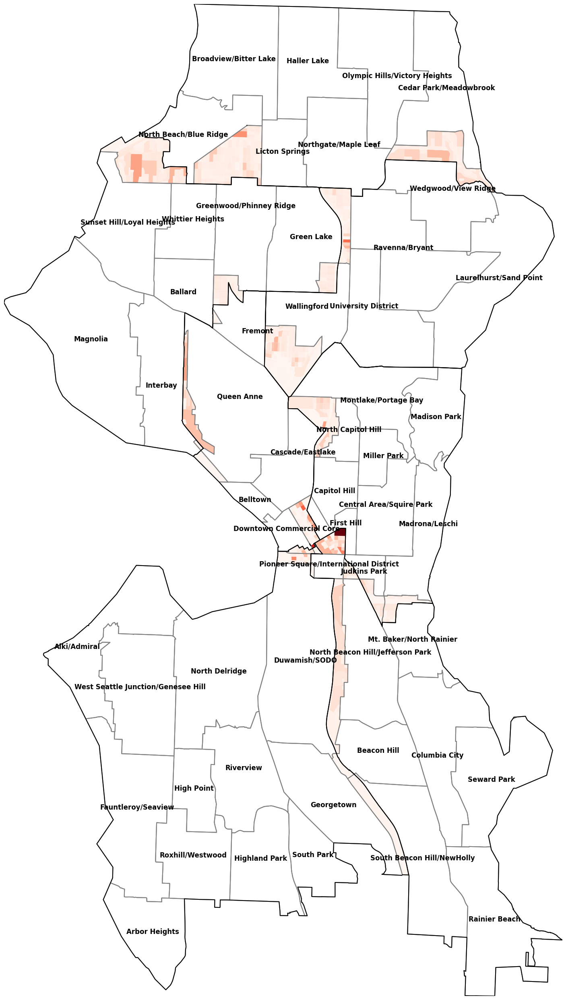

# Summary
## Population
* [current](./current.md) FAIL +24.38%
* [commr_nickels](./commr_nickels.md) PASS +0.61%
* [rjs](./rjs.md) PASS +0.87%
* [commission_draft_0802](./commission_draft_0802.md) PASS +0.81%
* [commission_draft_0927](./commission_draft_0927.md) PASS +0.80%
* [shawcroft_0927_tweaks](./shawcroft_0927_tweaks.md) PASS +0.98%

## Driving Connectivity
* [current](./current.md) FAIL Districts 4, 5 disconnected
* [commr_nickels](./commr_nickels.md) FAIL District 4 disconnected
* [rjs](./rjs.md) PASS
* [commission_draft_0802](./commission_draft_0802.md) PASS
* [commission_draft_0927](./commission_draft_0927.md) PASS
* [shawcroft_0927_tweaks](./shawcroft_0927_tweaks.md) FAIL District 6 disconnected

## City Clerk Neighborhoods
1. [rjs](./rjs.md) 25329
2. [shawcroft_0927_tweaks](./shawcroft_0927_tweaks.md) 26043
3. [commission_draft_0802](./commission_draft_0802.md) 26551
4. [commission_draft_0927](./commission_draft_0927.md) 26950
5. [current](./current.md) 31044
6. [commr_nickels](./commr_nickels.md) 32577

## Atlas Neighborhoods
1. [commission_draft_0802](./commission_draft_0802.md) 68340
2. [commission_draft_0927](./commission_draft_0927.md) 70700
3. [shawcroft_0927_tweaks](./shawcroft_0927_tweaks.md) 71359
4. [current](./current.md) 79416
5. [rjs](./rjs.md) 98547
6. [commr_nickels](./commr_nickels.md) 106299

## Community Reporting Areas
1. [current](./current.md) 46847
2. [rjs](./rjs.md) 47689
3. [commission_draft_0802](./commission_draft_0802.md) 55409
4. [shawcroft_0927_tweaks](./shawcroft_0927_tweaks.md) 57346
5. [commission_draft_0927](./commission_draft_0927.md) 57979
6. [commr_nickels](./commr_nickels.md) 67819

## Elementary Schools 2021-22
1. [commr_nickels](./commr_nickels.md) 82623
2. [current](./current.md) 87967
3. [rjs](./rjs.md) 95379
4. [commission_draft_0927](./commission_draft_0927.md) 96149
5. [shawcroft_0927_tweaks](./shawcroft_0927_tweaks.md) 96477
6. [commission_draft_0802](./commission_draft_0802.md) 102573

## Middle Schools 2021-22
1. [commr_nickels](./commr_nickels.md) 106565
2. [current](./current.md) 130704
3. [commission_draft_0802](./commission_draft_0802.md) 131932
4. [rjs](./rjs.md) 135568
5. [commission_draft_0927](./commission_draft_0927.md) 150450
6. [shawcroft_0927_tweaks](./shawcroft_0927_tweaks.md) 151083

## Police Beats 2018 - Present
1. [commission_draft_0802](./commission_draft_0802.md) 30394
2. [commission_draft_0927](./commission_draft_0927.md) 35478
3. [shawcroft_0927_tweaks](./shawcroft_0927_tweaks.md) 36137
4. [current](./current.md) 37501
5. [rjs](./rjs.md) 40961
6. [commr_nickels](./commr_nickels.md) 49472

## 2022 Voting Precincts
1. [current](./current.md) 0
2. [rjs](./rjs.md) 3358
3. [commission_draft_0802](./commission_draft_0802.md) 4688
4. [commission_draft_0927](./commission_draft_0927.md) 5268
5. [shawcroft_0927_tweaks](./shawcroft_0927_tweaks.md) 5483
6. [commr_nickels](./commr_nickels.md) 5989

# current
## Population
FAIL - The maximum population (123396) is 24.38% greater than the minimum (99207).

### Census Groups
| Stat       | 1     | 2     | 3      | 4      | 5     | 6      | 7      |
|------------|-------|-------|--------|--------|-------|--------|--------|
| TAPERSONS  | 99824 | 99483 | 107219 | 106155 | 99207 | 102811 | 123396 |
| TA1RACE    | 88.3% | 90.2% | 89.1%  | 89.7%  | 88.9% | 89.5%  | 90.6%  |
| TAWHITEALN | 66.6% | 33.7% | 63.2%  | 64.5%  | 61.3% | 76.2%  | 62.2%  |
| TABLACKALN | 6.8%  | 18.7% | 8.8%   | 2.7%   | 7.3%  | 1.8%   | 4.2%   |
| TAAMINDALN | 0.9%  | 0.9%  | 0.6%   | 0.5%   | 0.9%  | 0.5%   | 0.7%   |
| TAASIANALN | 9.7%  | 31.5% | 13.5%  | 19.3%  | 15.0% | 9.0%   | 20.7%  |
| TANHPOALN  | 0.5%  | 0.5%  | 0.3%   | 0.2%   | 0.3%  | 0.1%   | 0.2%   |
| TAOTHERALN | 3.9%  | 5.0%  | 2.8%   | 2.5%   | 4.1%  | 1.9%   | 2.5%   |
| TA2RACE    | 11.7% | 9.8%  | 10.9%  | 10.3%  | 11.1% | 10.5%  | 9.4%   |
| THISPNHISP | 99.9% | 99.7% | 99.7%  | 100.0% | 99.9% | 99.9%  | 100.0% |
| TAHISPANIC | 10.1% | 9.7%  | 8.1%   | 6.9%   | 9.4%  | 6.3%   | 7.5%   |
| TNHISPANIC | 89.9% | 90.3% | 91.9%  | 93.1%  | 90.6% | 93.7%  | 92.5%  |
| TN1RACE    | 82.3% | 83.5% | 84.3%  | 85.5%  | 83.0% | 86.1%  | 86.2%  |
| TNWHALN    | 64.5% | 32.4% | 61.2%  | 62.6%  | 59.5% | 74.4%  | 60.2%  |
| TNBLKALN   | 6.6%  | 18.4% | 8.6%   | 2.5%   | 7.2%  | 1.7%   | 4.1%   |
| TNAIANALN  | 0.6%  | 0.4%  | 0.4%   | 0.3%   | 0.5%  | 0.4%   | 0.5%   |
| TNASIANALN | 9.6%  | 31.3% | 13.3%  | 19.2%  | 14.9% | 8.9%   | 20.6%  |
| TNNHPOALN  | 0.4%  | 0.4%  | 0.2%   | 0.2%   | 0.2%  | 0.1%   | 0.2%   |
| TNOTHRALN  | 0.6%  | 0.6%  | 0.6%   | 0.6%   | 0.7%  | 0.6%   | 0.6%   |
| TN2MRACES  | 7.6%  | 6.8%  | 7.6%   | 7.6%   | 7.7%  | 7.6%   | 6.3%   |
| TAHOUSING  | 46851 | 40589 | 61125  | 47007  | 47049 | 50961  | 74726  |
| TAHOCCUPID | 44536 | 38404 | 56801  | 43955  | 44697 | 48575  | 68659  |
| TAHVACANT  | 2315  | 2185  | 4324   | 3052   | 2352  | 2386   | 6067   |
| TAGRPQRTR  | 1063  | 2056  | 4900   | 12825  | 1364  | 1124   | 6586   |

## Zoning
This map simplifies city zoning into three categories:

* Residential (Green)
* Commercial (Blue) and Residential is also allowed
* Industrial (Yellow)

Denser areas are darker than lighter ones. There are three gradations of density.

\

## Rental Units
Count of rental housing units (not renters themselves) per district. Sourced from [Rental Property Registration](https://data.seattle.gov/Permitting/Rental-Property-Registration/j2xh-c7vt) on September 29th, 2022.

\

| District | Rental Housing Units |
|----------|----------------------|
| 1        | 12240                |
| 2        | 12466                |
| 3        | 29779                |
| 4        | 22086                |
| 5        | 17639                |
| 6        | 18723                |
| 7        | 43464                |

## Driving Connectivity
This map *fails* because some districts (4, 5) have disconnected road networks. This means some folks would have to drive through another district to get to another place in their district.District 5
\

District 6
\

## City Clerk Neighborhoods
This districting splits 19 out of 91 areas. A person was split from an area 31044 times.

\

| Area                      | District | Population | Percent |
|---------------------------|----------|------------|---------|
| Greenwood                 | 6        | 12210      | 66.96%  |
|                           | 5        | 6025       | 33.04%  |
| Wallingford               | 4        | 13644      | 73.45%  |
|                           | 6        | 4932       | 26.55%  |
| Fremont                   | 6        | 10115      | 68.36%  |
|                           | 4        | 4681       | 31.64%  |
| First Hill                | 3        | 9091       | 66.82%  |
|                           | 7        | 4515       | 33.18%  |
| Wedgwood                  | 5        | 5466       | 58.98%  |
|                           | 4        | 3801       | 41.02%  |
| Mount Baker               | 2        | 6025       | 72.09%  |
|                           | 3        | 2333       | 27.91%  |
| Pioneer Square            | 7        | 2578       | 56.30%  |
|                           | 3        | 1007       | 21.99%  |
|                           | 2        | 994        | 21.71%  |
| South Lake Union          | 7        | 11814      | 94.34%  |
|                           | 4        | 660        | 5.27%   |
|                           | 3        | 49         | 0.39%   |
| North Beach/Blue Ridge    | 6        | 5323       | 92.27%  |
|                           | 5        | 446        | 7.73%   |
| North Beacon Hill         | 2        | 12337      | 96.84%  |
|                           | 3        | 402        | 3.16%   |
| Yesler Terrace            | 3        | 5085       | 93.96%  |
|                           | 2        | 327        | 6.04%   |
| Broadway                  | 3        | 27884      | 99.07%  |
|                           | 7        | 221        | 0.79%   |
|                           | 4        | 42         | 0.15%   |
| International District    | 2        | 4381       | 96.18%  |
|                           | 3        | 174        | 3.82%   |
| Roosevelt                 | 4        | 8983       | 98.28%  |
|                           | 5        | 157        | 1.72%   |
| Adams                     | 6        | 15809      | 99.17%  |
|                           | 7        | 133        | 0.83%   |
| Eastlake                  | 4        | 5305       | 98.13%  |
|                           | 3        | 101        | 1.87%   |
| Industrial District       | 2        | 1073       | 97.63%  |
|                           | 1        | 26         | 2.37%   |
| Central Business District | 7        | 5239       | 99.68%  |
|                           | 3        | 17         | 0.32%   |
| Atlantic                  | 3        | 8709       | 99.99%  |
|                           | 2        | 1          | 0.01%   |

## Atlas Neighborhoods
This districting splits 11 out of 20 areas. A person was split from an area 79416 times.

\

| Area             | District | Population | Percent |
|------------------|----------|------------|---------|
| Northwest        | 5        | 25276      | 52.74%  |
|                  | 6        | 22653      | 47.26%  |
| Downtown         | 7        | 39949      | 65.46%  |
|                  | 3        | 15374      | 25.19%  |
|                  | 2        | 5702       | 9.34%   |
| North Central    | 6        | 35731      | 66.10%  |
|                  | 4        | 18325      | 33.90%  |
| Cascade          | 7        | 15889      | 72.07%  |
|                  | 4        | 6007       | 27.25%  |
|                  | 3        | 150        | 0.68%   |
| Northeast        | 4        | 47415      | 89.40%  |
|                  | 5        | 5623       | 10.60%  |
| Greater Duwamish | 1        | 3774       | 60.23%  |
|                  | 2        | 2492       | 39.77%  |
| Rainier Valley   | 2        | 47753      | 95.34%  |
|                  | 3        | 2333       | 4.66%   |
| Beacon Hill      | 2        | 36497      | 98.91%  |
|                  | 3        | 402        | 1.09%   |
| Capitol Hill     | 3        | 51015      | 99.57%  |
|                  | 7        | 221        | 0.43%   |
| Ballard          | 6        | 44427      | 99.70%  |
|                  | 7        | 133        | 0.30%   |
| Central Area     | 3        | 37945      | 100.00% |
|                  | 2        | 1          | 0.00%   |

9 kept whole

| Area                | District | Population | Percent |
|---------------------|----------|------------|---------|
| Delridge            | 1        | 35082      | 100.00% |
| West Seattle        | 1        | 60968      | 100.00% |
| Seward Park         | 2        | 7038       | 100.00% |
| University District | 4        | 34408      | 100.00% |
| Lake City           | 5        | 32292      | 100.00% |
| Northgate           | 5        | 36016      | 100.00% |
| Interbay            | 7        | 2192       | 100.00% |
| Magnolia            | 7        | 21304      | 100.00% |
| Queen Anne          | 7        | 43708      | 100.00% |

## Community Reporting Areas
This districting splits 12 out of 53 areas. A person was split from an area 46847 times.

\

| Area                                  | District | Population | Percent |
|---------------------------------------|----------|------------|---------|
| Wedgwood/View Ridge                   | 5        | 9078       | 54.58%  |
|                                       | 4        | 7555       | 45.42%  |
| Fremont                               | 6        | 12109      | 62.99%  |
|                                       | 4        | 7116       | 37.01%  |
| First Hill                            | 3        | 13852      | 67.42%  |
|                                       | 7        | 6695       | 32.58%  |
| Green Lake                            | 6        | 13446      | 75.29%  |
|                                       | 4        | 4412       | 24.71%  |
| Cascade/Eastlake                      | 7        | 25143      | 86.09%  |
|                                       | 4        | 2875       | 9.84%   |
|                                       | 3        | 1189       | 4.07%   |
| Mt. Baker/North Rainier               | 3        | 3568       | 52.78%  |
|                                       | 2        | 3192       | 47.22%  |
| Montlake/Portage Bay                  | 3        | 6616       | 67.87%  |
|                                       | 4        | 3132       | 32.13%  |
| North Beach/Blue Ridge                | 6        | 9406       | 75.29%  |
|                                       | 5        | 3087       | 24.71%  |
| Greenwood/Phinney Ridge               | 6        | 24504      | 90.72%  |
|                                       | 5        | 2507       | 9.28%   |
| Wallingford                           | 4        | 17237      | 90.71%  |
|                                       | 6        | 1766       | 9.29%   |
| North Beacon Hill/Jefferson Park      | 2        | 14265      | 89.49%  |
|                                       | 3        | 1676       | 10.51%  |
| Pioneer Square/International District | 2        | 4708       | 74.11%  |
|                                       | 7        | 1645       | 25.89%  |

## Elementary Schools 2021-22
This districting splits 16 out of 58 areas. A person was split from an area 87967 times.

\

| Area              | District | Population | Percent |
|-------------------|----------|------------|---------|
| Lowell            | 7        | 50920      | 55.71%  |
|                   | 3        | 35209      | 38.52%  |
|                   | 2        | 4244       | 4.64%   |
|                   | 4        | 1023       | 1.12%   |
| Green Lake        | 4        | 32972      | 74.44%  |
|                   | 6        | 11324      | 25.56%  |
| B.F. Day          | 4        | 12640      | 54.26%  |
|                   | 6        | 10654      | 45.74%  |
| Montlake          | 3        | 6777       | 57.62%  |
|                   | 4        | 4984       | 42.38%  |
| Bagley            | 6        | 6490       | 57.60%  |
|                   | 5        | 4778       | 42.40%  |
| Wedgwood          | 5        | 4966       | 52.09%  |
|                   | 4        | 4567       | 47.91%  |
| View Ridge        | 4        | 9209       | 74.11%  |
|                   | 5        | 3217       | 25.89%  |
| Viewlands         | 5        | 11934      | 80.60%  |
|                   | 6        | 2872       | 19.40%  |
| Olympic View      | 5        | 15338      | 94.62%  |
|                   | 4        | 872        | 5.38%   |
| Greenwood         | 6        | 8157       | 90.58%  |
|                   | 5        | 848        | 9.42%   |
| Gatzert           | 3        | 12989      | 94.31%  |
|                   | 2        | 784        | 5.69%   |
| John Muir         | 2        | 7996       | 92.08%  |
|                   | 3        | 688        | 7.92%   |
| North Beach       | 6        | 7706       | 93.15%  |
|                   | 5        | 567        | 6.85%   |
| Thurgood Marshall | 3        | 6023       | 91.63%  |
|                   | 2        | 550        | 8.37%   |
| Beacon Hill Int'l | 2        | 7975       | 95.20%  |
|                   | 3        | 402        | 4.80%   |
| Sacajawea         | 5        | 8523       | 95.69%  |
|                   | 4        | 384        | 4.31%   |

## Middle Schools 2021-22
This districting splits 10 out of 14 areas. A person was split from an area 130704 times.

\

| Area                    | District | Population | Percent |
|-------------------------|----------|------------|---------|
| Meany                   | 3        | 87117      | 58.75%  |
|                         | 7        | 50920      | 34.34%  |
|                         | 4        | 6007       | 4.05%   |
|                         | 2        | 4244       | 2.86%   |
| Washington              | 3        | 19700      | 52.19%  |
|                         | 2        | 18050      | 47.81%  |
| Eagle Staff             | 5        | 29286      | 66.66%  |
|                         | 6        | 14647      | 33.34%  |
| Hamilton Int'l          | 6        | 24407      | 66.40%  |
|                         | 4        | 12352      | 33.60%  |
| Eckstein/Hamilton Int'l | 4        | 33251      | 74.60%  |
|                         | 6        | 11324      | 25.40%  |
| Eckstein                | 4        | 53289      | 86.86%  |
|                         | 5        | 8063       | 13.14%  |
| Whitman/Eagle Staff     | 5        | 11672      | 80.25%  |
|                         | 6        | 2872       | 19.75%  |
| Jane Addams             | 5        | 49619      | 97.53%  |
|                         | 4        | 1256       | 2.47%   |
| Whitman                 | 6        | 49561      | 98.87%  |
|                         | 5        | 567        | 1.13%   |
| Mercer Int'l            | 2        | 28062      | 98.59%  |
|                         | 3        | 402        | 1.41%   |

4 kept whole

| Area        | District | Population | Percent |
|-------------|----------|------------|---------|
| Denny Int'l | 1        | 42225      | 100.00% |
| Madison     | 1        | 57599      | 100.00% |
| Aki Kurose  | 2        | 49127      | 100.00% |
| McClure     | 7        | 72476      | 100.00% |

## Police Beats 2018 - Present
This districting splits 13 out of 51 areas. A person was split from an area 37501 times.

\

| Area | District | Population | Percent |
|------|----------|------------|---------|
| D3   | 7        | 9037       | 59.88%  |
|      | 4        | 6007       | 39.80%  |
|      | 3        | 49         | 0.32%   |
| E3   | 3        | 7026       | 59.73%  |
|      | 7        | 4736       | 40.27%  |
| B3   | 4        | 18325      | 79.67%  |
|      | 6        | 4676       | 20.33%  |
| U3   | 4        | 33050      | 87.64%  |
|      | 5        | 4663       | 12.36%  |
| N1   | 5        | 15698      | 81.00%  |
|      | 6        | 3682       | 19.00%  |
| R2   | 2        | 11108      | 76.56%  |
|      | 3        | 3401       | 23.44%  |
| L2   | 5        | 15518      | 85.19%  |
|      | 4        | 2698       | 14.81%  |
| J1   | 6        | 12805      | 83.63%  |
|      | 5        | 2507       | 16.37%  |
| U1   | 4        | 25482      | 94.36%  |
|      | 5        | 1524       | 5.64%   |
| K2   | 7        | 1379       | 53.51%  |
|      | 2        | 1198       | 46.49%  |
| K1   | 7        | 1460       | 58.78%  |
|      | 3        | 1024       | 41.22%  |
| K3   | 2        | 4708       | 82.97%  |
|      | 7        | 792        | 13.96%  |
|      | 3        | 174        | 3.07%   |
| R1   | 2        | 18231      | 98.01%  |
|      | 3        | 370        | 1.99%   |

## 2022 Voting Precincts
This districting splits 0 out of 1027 areas. A person was split from an area 0.0 times.

\

| Area | District | Population | Percent |
|------|----------|------------|---------|

# commr_nickels
## Population
PASS - The maximum population (105765) is 0.61% greater than the minimum (105121).

### Census Groups
| Stat       | 1      | 2      | 3      | 4      | 5      | 6      | 7      |
|------------|--------|--------|--------|--------|--------|--------|--------|
| TAPERSONS  | 105765 | 105712 | 105182 | 105121 | 105344 | 105436 | 105535 |
| TA1RACE    | 88.4%  | 90.3%  | 89.2%  | 89.9%  | 88.8%  | 89.4%  | 90.5%  |
| TAWHITEALN | 66.2%  | 34.0%  | 61.9%  | 67.8%  | 64.5%  | 70.9%  | 63.5%  |
| TABLACKALN | 7.2%   | 18.8%  | 8.1%   | 2.3%   | 5.1%   | 4.0%   | 3.6%   |
| TAAMINDALN | 1.1%   | 0.9%   | 0.6%   | 0.5%   | 0.6%   | 0.7%   | 0.6%   |
| TAASIANALN | 9.7%   | 31.3%  | 15.4%  | 16.9%  | 15.3%  | 10.6%  | 20.2%  |
| TANHPOALN  | 0.5%   | 0.5%   | 0.3%   | 0.2%   | 0.2%   | 0.2%   | 0.2%   |
| TAOTHERALN | 3.9%   | 4.9%   | 2.8%   | 2.3%   | 3.0%   | 3.0%   | 2.4%   |
| TA2RACE    | 11.6%  | 9.7%   | 10.8%  | 10.1%  | 11.2%  | 10.6%  | 9.5%   |
| THISPNHISP | 99.9%  | 99.5%  | 99.9%  | 100.0% | 99.9%  | 99.9%  | 100.0% |
| TAHISPANIC | 10.2%  | 9.6%   | 8.2%   | 6.7%   | 7.8%   | 7.7%   | 7.4%   |
| TNHISPANIC | 89.8%  | 90.4%  | 91.8%  | 93.3%  | 92.2%  | 92.3%  | 92.6%  |
| TN1RACE    | 82.2%  | 83.7%  | 84.4%  | 85.8%  | 84.3%  | 84.8%  | 86.3%  |
| TNWHALN    | 64.0%  | 32.6%  | 59.9%  | 65.8%  | 63.0%  | 69.1%  | 61.5%  |
| TNBLKALN   | 7.0%   | 18.5%  | 7.9%   | 2.2%   | 5.0%   | 3.9%   | 3.5%   |
| TNAIANALN  | 0.7%   | 0.4%   | 0.4%   | 0.3%   | 0.4%   | 0.5%   | 0.4%   |
| TNASIANALN | 9.5%   | 31.1%  | 15.2%  | 16.8%  | 15.2%  | 10.5%  | 20.1%  |
| TNNHPOALN  | 0.4%   | 0.4%   | 0.2%   | 0.2%   | 0.2%   | 0.2%   | 0.2%   |
| TNOTHRALN  | 0.6%   | 0.6%   | 0.6%   | 0.6%   | 0.7%   | 0.7%   | 0.6%   |
| TN2MRACES  | 7.6%   | 6.7%   | 7.4%   | 7.5%   | 7.9%   | 7.5%   | 6.4%   |
| TAHOUSING  | 49691  | 43338  | 64948  | 48204  | 47997  | 51946  | 62184  |
| TAHOCCUPID | 47009  | 41031  | 59738  | 45074  | 45544  | 49485  | 57746  |
| TAHVACANT  | 2682   | 2307   | 5210   | 3130   | 2453   | 2461   | 4438   |
| TAGRPQRTR  | 2980   | 3802   | 3458   | 13057  | 1178   | 1120   | 4323   |

## Zoning
This map simplifies city zoning into three categories:

* Residential (Green)
* Commercial (Blue) and Residential is also allowed
* Industrial (Yellow)

Denser areas are darker than lighter ones. There are three gradations of density.

\

## Rental Units
Count of rental housing units (not renters themselves) per district. Sourced from [Rental Property Registration](https://data.seattle.gov/Permitting/Rental-Property-Registration/j2xh-c7vt) on September 29th, 2022.

\

| District | Rental Housing Units |
|----------|----------------------|
| 1        | 14261                |
| 2        | 14511                |
| 3        | 35110                |
| 4        | 21471                |
| 5        | 18560                |
| 6        | 18484                |
| 7        | 34000                |

## Driving Connectivity
This map *fails* because some districts (4) have disconnected road networks. This means some folks would have to drive through another district to get to another place in their district.District 5
\

## City Clerk Neighborhoods
This districting splits 20 out of 91 areas. A person was split from an area 32577 times.

\

| Area                | District | Population | Percent |
|---------------------|----------|------------|---------|
| University District | 4        | 25214      | 73.28%  |
|                     | 5        | 9194       | 26.72%  |
| Phinney Ridge       | 6        | 5662       | 54.42%  |
|                     | 4        | 4742       | 45.58%  |
| South Lake Union    | 7        | 8062       | 64.38%  |
|                     | 3        | 4461       | 35.62%  |
| Eastlake            | 4        | 3233       | 59.80%  |
|                     | 3        | 2173       | 40.20%  |
| Bryant              | 5        | 3596       | 63.50%  |
|                     | 4        | 2067       | 36.50%  |
| Ravenna             | 5        | 10997      | 85.98%  |
|                     | 4        | 1793       | 14.02%  |
| Pike-Market         | 7        | 1773       | 53.26%  |
|                     | 3        | 1556       | 46.74%  |
| First Hill          | 3        | 12240      | 89.96%  |
|                     | 2        | 1366       | 10.04%  |
| Mount Baker         | 2        | 7106       | 85.02%  |
|                     | 3        | 1252       | 14.98%  |
| Pioneer Square      | 1        | 3572       | 78.01%  |
|                     | 2        | 1004       | 21.93%  |
|                     | 3        | 3          | 0.07%   |
| Madison Park        | 4        | 3723       | 80.19%  |
|                     | 3        | 920        | 19.81%  |
| Greenwood           | 6        | 17523      | 96.10%  |
|                     | 4        | 712        | 3.90%   |
| Atlantic            | 3        | 8229       | 94.48%  |
|                     | 2        | 481        | 5.52%   |
| Windermere          | 5        | 4646       | 93.11%  |
|                     | 4        | 344        | 6.89%   |
| Broadway            | 3        | 27974      | 99.39%  |
|                     | 4        | 173        | 0.61%   |
| Industrial District | 1        | 950        | 86.44%  |
|                     | 2        | 149        | 13.56%  |
| Adams               | 6        | 15809      | 99.17%  |
|                     | 7        | 133        | 0.83%   |
| Stevens             | 3        | 11882      | 99.76%  |
|                     | 4        | 28         | 0.24%   |
| South Beacon Hill   | 2        | 5442       | 99.62%  |
|                     | 1        | 21         | 0.38%   |
| Mid-Beacon Hill     | 2        | 13797      | 99.96%  |
|                     | 1        | 5          | 0.04%   |

## Atlas Neighborhoods
This districting splits 13 out of 20 areas. A person was split from an area 106299 times.

\

| Area                | District | Population | Percent |
|---------------------|----------|------------|---------|
| Downtown            | 7        | 26061      | 42.71%  |
|                     | 3        | 19055      | 31.22%  |
|                     | 2        | 12337      | 20.22%  |
|                     | 1        | 3572       | 5.85%   |
| Northgate           | 5        | 19767      | 54.88%  |
|                     | 6        | 16249      | 45.12%  |
| Capitol Hill        | 3        | 40734      | 79.50%  |
|                     | 4        | 10502      | 20.50%  |
| Cascade             | 7        | 12137      | 55.05%  |
|                     | 3        | 6676       | 30.28%  |
|                     | 4        | 3233       | 14.66%  |
| University District | 4        | 25214      | 73.28%  |
|                     | 5        | 9194       | 26.72%  |
| Northeast           | 5        | 44091      | 83.13%  |
|                     | 4        | 8947       | 16.87%  |
| Ballard             | 6        | 36308      | 81.48%  |
|                     | 4        | 8119       | 18.22%  |
|                     | 7        | 133        | 0.30%   |
| North Central       | 4        | 48394      | 89.53%  |
|                     | 6        | 5662       | 10.47%  |
| Rainier Valley      | 2        | 48834      | 97.50%  |
|                     | 3        | 1252       | 2.50%   |
| Northwest           | 6        | 47217      | 98.51%  |
|                     | 4        | 712        | 1.49%   |
| Central Area        | 3        | 37465      | 98.73%  |
|                     | 2        | 481        | 1.27%   |
| Greater Duwamish    | 1        | 6117       | 97.62%  |
|                     | 2        | 149        | 2.38%   |
| Beacon Hill         | 2        | 36873      | 99.93%  |
|                     | 1        | 26         | 0.07%   |

7 kept whole

| Area         | District | Population | Percent |
|--------------|----------|------------|---------|
| Delridge     | 1        | 35082      | 100.00% |
| West Seattle | 1        | 60968      | 100.00% |
| Seward Park  | 2        | 7038       | 100.00% |
| Lake City    | 5        | 32292      | 100.00% |
| Interbay     | 7        | 2192       | 100.00% |
| Magnolia     | 7        | 21304      | 100.00% |
| Queen Anne   | 7        | 43708      | 100.00% |

## Community Reporting Areas
This districting splits 23 out of 53 areas. A person was split from an area 67819 times.

\

| Area                                  | District | Population | Percent |
|---------------------------------------|----------|------------|---------|
| Cascade/Eastlake                      | 7        | 21391      | 73.24%  |
|                                       | 3        | 7643       | 26.17%  |
|                                       | 4        | 173        | 0.59%   |
| First Hill                            | 3        | 13092      | 63.72%  |
|                                       | 2        | 7455       | 36.28%  |
| University District                   | 4        | 17759      | 70.63%  |
|                                       | 5        | 7384       | 29.37%  |
| Greenwood/Phinney Ridge               | 6        | 20752      | 76.83%  |
|                                       | 4        | 6259       | 23.17%  |
| Ravenna/Bryant                        | 5        | 21048      | 77.23%  |
|                                       | 4        | 6206       | 22.77%  |
| Laurelhurst/Sand Point                | 5        | 6057       | 52.99%  |
|                                       | 4        | 5374       | 47.01%  |
| Green Lake                            | 4        | 13446      | 75.29%  |
|                                       | 5        | 4412       | 24.71%  |
| Ballard                               | 6        | 8021       | 71.57%  |
|                                       | 4        | 3186       | 28.43%  |
| Haller Lake                           | 6        | 7840       | 71.87%  |
|                                       | 5        | 3069       | 28.13%  |
| Northgate/Maple Leaf                  | 5        | 14206      | 86.83%  |
|                                       | 6        | 2155       | 13.17%  |
| Whittier Heights                      | 6        | 12184      | 85.10%  |
|                                       | 4        | 2134       | 14.90%  |
| Mt. Baker/North Rainier               | 2        | 4753       | 70.31%  |
|                                       | 3        | 2007       | 29.69%  |
| Madison Park                          | 4        | 3723       | 67.32%  |
|                                       | 3        | 1807       | 32.68%  |
| Duwamish/SODO                         | 1        | 1868       | 51.25%  |
|                                       | 2        | 1777       | 48.75%  |
| Pioneer Square/International District | 2        | 4708       | 74.11%  |
|                                       | 1        | 1645       | 25.89%  |
| North Beacon Hill/Jefferson Park      | 2        | 14667      | 92.01%  |
|                                       | 3        | 1274       | 7.99%   |
| Wallingford                           | 4        | 17797      | 93.65%  |
|                                       | 5        | 1206       | 6.35%   |
| Downtown Commercial Core              | 3        | 4836       | 83.83%  |
|                                       | 1        | 933        | 16.17%  |
| North Capitol Hill                    | 3        | 3869       | 82.78%  |
|                                       | 4        | 805        | 17.22%  |
| Montlake/Portage Bay                  | 4        | 9034       | 92.68%  |
|                                       | 3        | 714        | 7.32%   |
| Judkins Park                          | 3        | 4119       | 95.95%  |
|                                       | 2        | 174        | 4.05%   |
| South Beacon Hill/NewHolly            | 2        | 15066      | 99.85%  |
|                                       | 1        | 22         | 0.15%   |
| Beacon Hill                           | 2        | 9631       | 99.95%  |
|                                       | 1        | 5          | 0.05%   |

## Elementary Schools 2021-22
This districting splits 14 out of 58 areas. A person was split from an area 82623 times.

\

| Area              | District | Population | Percent |
|-------------------|----------|------------|---------|
| Lowell            | 3        | 50511      | 55.27%  |
|                   | 7        | 33059      | 36.17%  |
|                   | 2        | 4928       | 5.39%   |
|                   | 1        | 2898       | 3.17%   |
| Green Lake        | 4        | 32487      | 73.34%  |
|                   | 5        | 11809      | 26.66%  |
| Gatzert           | 2        | 7409       | 53.79%  |
|                   | 3        | 6364       | 46.21%  |
| Bagley            | 6        | 6240       | 55.38%  |
|                   | 4        | 5028       | 44.62%  |
| McGilvra          | 3        | 7032       | 65.19%  |
|                   | 4        | 3755       | 34.81%  |
| Laurelhurst       | 4        | 15736      | 81.55%  |
|                   | 5        | 3559       | 18.45%  |
| Bryant            | 5        | 10919      | 81.83%  |
|                   | 4        | 2425       | 18.17%  |
| Montlake          | 4        | 9895       | 84.13%  |
|                   | 3        | 1866       | 15.87%  |
| West Woodland     | 4        | 11894      | 86.48%  |
|                   | 6        | 1859       | 13.52%  |
| Rising Star       | 2        | 6085       | 78.90%  |
|                   | 1        | 1627       | 21.10%  |
| Thurgood Marshall | 3        | 5150       | 78.35%  |
|                   | 2        | 1423       | 21.65%  |
| Beacon Hill Int'l | 2        | 6961       | 83.10%  |
|                   | 1        | 1416       | 16.90%  |
| Sand Point        | 5        | 6343       | 92.40%  |
|                   | 4        | 522        | 7.60%   |
| Stevens           | 3        | 11590      | 99.27%  |
|                   | 4        | 85         | 0.73%   |

## Middle Schools 2021-22
This districting splits 7 out of 14 areas. A person was split from an area 106565 times.

\

| Area                    | District | Population | Percent |
|-------------------------|----------|------------|---------|
| Meany                   | 3        | 93668      | 63.17%  |
|                         | 7        | 33059      | 22.29%  |
|                         | 4        | 13735      | 9.26%   |
|                         | 2        | 4928       | 3.32%   |
|                         | 1        | 2898       | 1.95%   |
| Eckstein                | 5        | 42660      | 69.53%  |
|                         | 4        | 18692      | 30.47%  |
| Eckstein/Hamilton Int'l | 4        | 32766      | 73.51%  |
|                         | 5        | 11809      | 26.49%  |
| Washington              | 2        | 26236      | 69.50%  |
|                         | 3        | 11514      | 30.50%  |
| Eagle Staff             | 6        | 38905      | 88.56%  |
|                         | 4        | 5028       | 11.44%  |
| Mercer Int'l            | 2        | 25421      | 89.31%  |
|                         | 1        | 3043       | 10.69%  |
| Hamilton Int'l          | 4        | 34900      | 94.94%  |
|                         | 6        | 1859       | 5.06%   |

7 kept whole

| Area                | District | Population | Percent |
|---------------------|----------|------------|---------|
| Denny Int'l         | 1        | 42225      | 100.00% |
| Madison             | 1        | 57599      | 100.00% |
| Aki Kurose          | 2        | 49127      | 100.00% |
| Jane Addams         | 5        | 50875      | 100.00% |
| Whitman             | 6        | 50128      | 100.00% |
| Whitman/Eagle Staff | 6        | 14544      | 100.00% |
| McClure             | 7        | 72476      | 100.00% |

## Police Beats 2018 - Present
This districting splits 17 out of 51 areas. A person was split from an area 49472 times.

\

| Area | District | Population | Percent |
|------|----------|------------|---------|
| U3   | 5        | 28479      | 75.52%  |
|      | 4        | 9234       | 24.48%  |
| D3   | 3        | 6676       | 44.23%  |
|      | 7        | 5285       | 35.02%  |
|      | 4        | 3132       | 20.75%  |
| C2   | 3        | 9283       | 55.70%  |
|      | 4        | 7382       | 44.30%  |
| J3   | 4        | 11856      | 71.31%  |
|      | 6        | 4769       | 28.69%  |
| U1   | 5        | 22672      | 83.95%  |
|      | 4        | 4334       | 16.05%  |
| C1   | 3        | 10821      | 77.06%  |
|      | 4        | 3221       | 22.94%  |
| M1   | 3        | 3166       | 57.83%  |
|      | 7        | 2309       | 42.17%  |
| R2   | 2        | 12669      | 87.32%  |
|      | 3        | 1840       | 12.68%  |
| B1   | 6        | 17520      | 91.20%  |
|      | 4        | 1691       | 8.80%   |
| M2   | 7        | 1791       | 51.72%  |
|      | 3        | 1672       | 48.28%  |
| K1   | 3        | 1073       | 43.20%  |
|      | 2        | 1004       | 40.42%  |
|      | 1        | 407        | 16.38%  |
| O3   | 1        | 1330       | 50.34%  |
|      | 2        | 1312       | 49.66%  |
| G1   | 2        | 6451       | 88.32%  |
|      | 3        | 853        | 11.68%  |
| K3   | 2        | 4882       | 86.04%  |
|      | 1        | 792        | 13.96%  |
| K2   | 1        | 2428       | 94.22%  |
|      | 2        | 149        | 5.78%   |
| R1   | 2        | 18547      | 99.71%  |
|      | 1        | 54         | 0.29%   |
| G3   | 3        | 8448       | 99.62%  |
|      | 2        | 32         | 0.38%   |

## 2022 Voting Precincts
This districting splits 22 out of 1027 areas. A person was split from an area 5989 times.

\

| Area        | District | Population | Percent |
|-------------|----------|------------|---------|
| SEA 37-3573 | 2        | 1366       | 68.16%  |
|             | 3        | 638        | 31.84%  |
| SEA 34-3497 | 1        | 733        | 55.03%  |
|             | 3        | 599        | 44.97%  |
| SEA 46-2088 | 5        | 1032       | 71.22%  |
|             | 4        | 417        | 28.78%  |
| SEA 37-1854 | 2        | 480        | 54.18%  |
|             | 3        | 406        | 45.82%  |
| SEA 36-3699 | 6        | 675        | 63.32%  |
|             | 4        | 391        | 36.68%  |
| SEA 36-1398 | 6        | 508        | 57.01%  |
|             | 4        | 383        | 42.99%  |
| SEA 37-1853 | 3        | 392        | 51.44%  |
|             | 2        | 370        | 48.56%  |
| SEA 46-1309 | 6        | 460        | 58.15%  |
|             | 4        | 331        | 41.85%  |
| SEA 36-1294 | 4        | 674        | 68.08%  |
|             | 6        | 316        | 31.92%  |
| SEA 43-3701 | 3        | 1576       | 85.79%  |
|             | 7        | 261        | 14.21%  |
| SEA 43-2009 | 3        | 362        | 58.29%  |
|             | 4        | 259        | 41.71%  |
| SEA 43-3628 | 3        | 640        | 71.75%  |
|             | 7        | 252        | 28.25%  |
| SEA 43-2029 | 3        | 646        | 72.67%  |
|             | 4        | 243        | 27.33%  |
| SEA 43-1774 | 3        | 403        | 64.79%  |
|             | 7        | 219        | 35.21%  |
| SEA 43-2020 | 3        | 355        | 62.61%  |
|             | 4        | 212        | 37.39%  |
| SEA 37-3708 | 2        | 1164       | 88.65%  |
|             | 3        | 149        | 11.35%  |
| SEA 43-2006 | 4        | 282        | 65.89%  |
|             | 3        | 146        | 34.11%  |
| SEA 37-1897 | 2        | 1230       | 89.45%  |
|             | 3        | 145        | 10.55%  |
| SEA 43-2008 | 3        | 221        | 69.94%  |
|             | 4        | 95         | 30.06%  |
| SEA 43-2014 | 4        | 410        | 84.54%  |
|             | 3        | 75         | 15.46%  |
| SEA 37-3956 | 2        | 174        | 77.68%  |
|             | 3        | 50         | 22.32%  |
| SEA 37-1839 | 3        | 736        | 95.83%  |
|             | 2        | 32         | 4.17%   |

# rjs
## Population
PASS - The maximum population (105892) is 0.87% greater than the minimum (104977).

### Census Groups
| Stat       | 1      | 2      | 3      | 4      | 5      | 6      | 7      |
|------------|--------|--------|--------|--------|--------|--------|--------|
| TAPERSONS  | 105848 | 105357 | 105174 | 105763 | 105892 | 104977 | 105084 |
| TA1RACE    | 88.4%  | 90.3%  | 89.1%  | 89.5%  | 88.9%  | 89.6%  | 90.8%  |
| TAWHITEALN | 66.2%  | 33.9%  | 65.0%  | 64.8%  | 62.5%  | 76.0%  | 60.4%  |
| TABLACKALN | 7.2%   | 18.5%  | 7.6%   | 2.6%   | 6.9%   | 1.8%   | 4.5%   |
| TAAMINDALN | 1.0%   | 0.9%   | 0.6%   | 0.5%   | 0.8%   | 0.6%   | 0.6%   |
| TAASIANALN | 9.6%   | 31.6%  | 12.9%  | 19.0%  | 14.6%  | 9.0%   | 22.5%  |
| TANHPOALN  | 0.5%   | 0.5%   | 0.2%   | 0.2%   | 0.3%   | 0.2%   | 0.2%   |
| TAOTHERALN | 3.9%   | 4.9%   | 2.7%   | 2.5%   | 3.9%   | 2.0%   | 2.5%   |
| TA2RACE    | 11.6%  | 9.7%   | 10.9%  | 10.5%  | 11.1%  | 10.4%  | 9.2%   |
| THISPNHISP | 99.9%  | 99.7%  | 99.9%  | 100.0% | 99.9%  | 99.9%  | 99.7%  |
| TAHISPANIC | 10.2%  | 9.6%   | 7.9%   | 7.0%   | 8.9%   | 6.4%   | 7.6%   |
| TNHISPANIC | 89.8%  | 90.4%  | 92.1%  | 93.0%  | 91.1%  | 93.6%  | 92.4%  |
| TN1RACE    | 82.2%  | 83.7%  | 84.5%  | 85.3%  | 83.4%  | 86.2%  | 86.3%  |
| TNWHALN    | 64.0%  | 32.6%  | 63.1%  | 62.8%  | 60.8%  | 74.3%  | 58.3%  |
| TNBLKALN   | 7.0%   | 18.3%  | 7.4%   | 2.5%   | 6.7%   | 1.8%   | 4.4%   |
| TNAIANALN  | 0.7%   | 0.4%   | 0.4%   | 0.3%   | 0.5%   | 0.4%   | 0.4%   |
| TNASIANALN | 9.5%   | 31.4%  | 12.8%  | 18.9%  | 14.5%  | 8.9%   | 22.4%  |
| TNNHPOALN  | 0.4%   | 0.4%   | 0.2%   | 0.2%   | 0.2%   | 0.2%   | 0.2%   |
| TNOTHRALN  | 0.6%   | 0.6%   | 0.6%   | 0.6%   | 0.7%   | 0.6%   | 0.6%   |
| TN2MRACES  | 7.6%   | 6.8%   | 7.6%   | 7.7%   | 7.7%   | 7.4%   | 6.1%   |
| TAHOUSING  | 49717  | 43694  | 61873  | 46252  | 49301  | 51619  | 65852  |
| TAHOCCUPID | 47027  | 41384  | 57319  | 43251  | 46911  | 49197  | 60538  |
| TAHVACANT  | 2690   | 2310   | 4554   | 3001   | 2390   | 2422   | 5314   |
| TAGRPQRTR  | 2987   | 2923   | 3308   | 12980  | 1287   | 1103   | 5330   |

## Zoning
This map simplifies city zoning into three categories:

* Residential (Green)
* Commercial (Blue) and Residential is also allowed
* Industrial (Yellow)

Denser areas are darker than lighter ones. There are three gradations of density.

\

## Rental Units
Count of rental housing units (not renters themselves) per district. Sourced from [Rental Property Registration](https://data.seattle.gov/Permitting/Rental-Property-Registration/j2xh-c7vt) on September 29th, 2022.

\

| District | Rental Housing Units |
|----------|----------------------|
| 1        | 14262                |
| 2        | 14633                |
| 3        | 29810                |
| 4        | 21736                |
| 5        | 17452                |
| 6        | 18053                |
| 7        | 40451                |

## Driving Connectivity
This map *passes* because all districts are connected. Meaning you can drive to anywhere in each district without leaving it.

## City Clerk Neighborhoods
This districting splits 19 out of 91 areas. A person was split from an area 25329 times.

\

| Area                      | District | Population | Percent |
|---------------------------|----------|------------|---------|
| Fremont                   | 6        | 10115      | 68.36%  |
|                           | 4        | 4681       | 31.64%  |
| Roosevelt                 | 5        | 4630       | 50.66%  |
|                           | 4        | 4510       | 49.34%  |
| Lawton Park               | 6        | 6897       | 69.27%  |
|                           | 7        | 3059       | 30.73%  |
| Eastlake                  | 3        | 3779       | 69.90%  |
|                           | 7        | 1627       | 30.10%  |
| North Beach/Blue Ridge    | 6        | 4250       | 73.67%  |
|                           | 5        | 1519       | 26.33%  |
| Southeast Magnolia        | 7        | 4038       | 72.94%  |
|                           | 6        | 1498       | 27.06%  |
| Greenwood                 | 6        | 16864      | 92.48%  |
|                           | 5        | 1371       | 7.52%   |
| First Hill                | 3        | 12240      | 89.96%  |
|                           | 2        | 1366       | 10.04%  |
| Atlantic                  | 3        | 7528       | 86.43%  |
|                           | 2        | 1182       | 13.57%  |
| Mount Baker               | 2        | 7203       | 86.18%  |
|                           | 3        | 1155       | 13.82%  |
| Pioneer Square            | 1        | 3455       | 75.45%  |
|                           | 7        | 1124       | 24.55%  |
| Ravenna                   | 4        | 11764      | 91.98%  |
|                           | 5        | 1026       | 8.02%   |
| Crown Hill                | 6        | 4451       | 86.93%  |
|                           | 5        | 669        | 13.07%  |
| View Ridge                | 4        | 5441       | 94.82%  |
|                           | 5        | 297        | 5.18%   |
| Interbay                  | 7        | 2066       | 94.25%  |
|                           | 6        | 126        | 5.75%   |
| Central Business District | 7        | 5205       | 99.03%  |
|                           | 1        | 51         | 0.97%   |
| Broadway                  | 3        | 28105      | 99.85%  |
|                           | 7        | 42         | 0.15%   |
| South Beacon Hill         | 2        | 5442       | 99.62%  |
|                           | 1        | 21         | 0.38%   |
| Mid-Beacon Hill           | 2        | 13797      | 99.96%  |
|                           | 1        | 5          | 0.04%   |

## Atlas Neighborhoods
This districting splits 10 out of 20 areas. A person was split from an area 98547 times.

\

| Area           | District | Population | Percent |
|----------------|----------|------------|---------|
| Downtown       | 7        | 33946      | 55.63%  |
|                | 3        | 12240      | 20.06%  |
|                | 2        | 11333      | 18.57%  |
|                | 1        | 3506       | 5.75%   |
| Northwest      | 6        | 25565      | 53.34%  |
|                | 5        | 22364      | 46.66%  |
| North Central  | 4        | 33537      | 62.04%  |
|                | 6        | 20519      | 37.96%  |
| Northeast      | 4        | 37818      | 71.30%  |
|                | 5        | 15220      | 28.70%  |
| Magnolia       | 6        | 14207      | 66.69%  |
|                | 7        | 7097       | 33.31%  |
| Cascade        | 7        | 18267      | 82.86%  |
|                | 3        | 3779       | 17.14%  |
| Central Area   | 3        | 36764      | 96.89%  |
|                | 2        | 1182       | 3.11%   |
| Rainier Valley | 2        | 48931      | 97.69%  |
|                | 3        | 1155       | 2.31%   |
| Interbay       | 7        | 2066       | 94.25%  |
|                | 6        | 126        | 5.75%   |
| Beacon Hill    | 2        | 36873      | 99.93%  |
|                | 1        | 26         | 0.07%   |

10 kept whole

| Area                | District | Population | Percent |
|---------------------|----------|------------|---------|
| Delridge            | 1        | 35082      | 100.00% |
| Greater Duwamish    | 1        | 6266       | 100.00% |
| West Seattle        | 1        | 60968      | 100.00% |
| Seward Park         | 2        | 7038       | 100.00% |
| Capitol Hill        | 3        | 51236      | 100.00% |
| University District | 4        | 34408      | 100.00% |
| Lake City           | 5        | 32292      | 100.00% |
| Northgate           | 5        | 36016      | 100.00% |
| Ballard             | 6        | 44560      | 100.00% |
| Queen Anne          | 7        | 43708      | 100.00% |

## Community Reporting Areas
This districting splits 19 out of 53 areas. A person was split from an area 47689 times.

\

| Area                                  | District | Population | Percent |
|---------------------------------------|----------|------------|---------|
| First Hill                            | 3        | 11113      | 54.09%  |
|                                       | 2        | 6451       | 31.40%  |
|                                       | 7        | 2983       | 14.52%  |
| Fremont                               | 6        | 12109      | 62.99%  |
|                                       | 4        | 7116       | 37.01%  |
| North Beach/Blue Ridge                | 6        | 6865       | 54.95%  |
|                                       | 5        | 5628       | 45.05%  |
| Ravenna/Bryant                        | 4        | 23076      | 84.67%  |
|                                       | 5        | 4178       | 15.33%  |
| Wedgwood/View Ridge                   | 5        | 12613      | 75.83%  |
|                                       | 4        | 4020       | 24.17%  |
| Licton Springs                        | 5        | 7046       | 69.02%  |
|                                       | 6        | 3162       | 30.98%  |
| Interbay                              | 7        | 10318      | 82.79%  |
|                                       | 6        | 2145       | 17.21%  |
| Green Lake                            | 4        | 15974      | 89.45%  |
|                                       | 5        | 1884       | 10.55%  |
| Cascade/Eastlake                      | 7        | 27521      | 94.23%  |
|                                       | 3        | 1686       | 5.77%   |
| Pioneer Square/International District | 2        | 4708       | 74.11%  |
|                                       | 1        | 1645       | 25.89%  |
| Duwamish/SODO                         | 1        | 2017       | 55.34%  |
|                                       | 2        | 1628       | 44.66%  |
| Mt. Baker/North Rainier               | 2        | 5159       | 76.32%  |
|                                       | 3        | 1601       | 23.68%  |
| Magnolia                              | 6        | 12321      | 89.82%  |
|                                       | 7        | 1396       | 10.18%  |
| North Beacon Hill/Jefferson Park      | 2        | 15059      | 94.47%  |
|                                       | 3        | 882        | 5.53%   |
| Downtown Commercial Core              | 7        | 4902       | 84.97%  |
|                                       | 1        | 867        | 15.03%  |
| Greenwood/Phinney Ridge               | 6        | 26795      | 99.20%  |
|                                       | 5        | 216        | 0.80%   |
| Judkins Park                          | 3        | 4119       | 95.95%  |
|                                       | 2        | 174        | 4.05%   |
| South Beacon Hill/NewHolly            | 2        | 15066      | 99.85%  |
|                                       | 1        | 22         | 0.15%   |
| Beacon Hill                           | 2        | 9631       | 99.95%  |
|                                       | 1        | 5          | 0.05%   |

## Elementary Schools 2021-22
This districting splits 16 out of 58 areas. A person was split from an area 95379 times.

\

| Area                 | District | Population | Percent |
|----------------------|----------|------------|---------|
| Lowell               | 7        | 45768      | 50.08%  |
|                      | 3        | 38872      | 42.53%  |
|                      | 2        | 3924       | 4.29%   |
|                      | 1        | 2832       | 3.10%   |
| B.F. Day             | 4        | 12640      | 54.26%  |
|                      | 6        | 10654      | 45.74%  |
| Bagley               | 6        | 3939       | 34.96%  |
|                      | 4        | 3888       | 34.50%  |
|                      | 5        | 3441       | 30.54%  |
| Gatzert              | 2        | 7409       | 53.79%  |
|                      | 3        | 6364       | 46.21%  |
| View Ridge           | 4        | 6683       | 53.78%  |
|                      | 5        | 5743       | 46.22%  |
| Viewlands            | 5        | 9402       | 63.50%  |
|                      | 6        | 5404       | 36.50%  |
| North Beach          | 6        | 5901       | 71.33%  |
|                      | 5        | 2372       | 28.67%  |
| Green Lake           | 4        | 42021      | 94.86%  |
|                      | 5        | 2275       | 5.14%   |
| Thurgood Marshall    | 3        | 4352       | 66.21%  |
|                      | 2        | 2221       | 33.79%  |
| Rising Star          | 2        | 6085       | 78.90%  |
|                      | 1        | 1627       | 21.10%  |
| Beacon Hill Int'l    | 2        | 6812       | 81.32%  |
|                      | 1        | 1565       | 18.68%  |
| Montlake             | 3        | 10455      | 88.90%  |
|                      | 7        | 1306       | 11.10%  |
| Magnolia             | 7        | 8385       | 88.53%  |
|                      | 6        | 1086       | 11.47%  |
| Wedgwood             | 5        | 8506       | 89.23%  |
|                      | 4        | 1027       | 10.77%  |
| Lawton               | 6        | 8301       | 93.06%  |
|                      | 7        | 619        | 6.94%   |
| Catharine Blaine K-8 | 6        | 5079       | 96.96%  |
|                      | 7        | 159        | 3.04%   |

## Middle Schools 2021-22
This districting splits 10 out of 14 areas. A person was split from an area 135568 times.

\

| Area                    | District | Population | Percent |
|-------------------------|----------|------------|---------|
| Meany                   | 3        | 94458      | 63.70%  |
|                         | 7        | 47074      | 31.74%  |
|                         | 2        | 3924       | 2.65%   |
|                         | 1        | 2832       | 1.91%   |
| Eagle Staff             | 5        | 27101      | 61.69%  |
|                         | 6        | 12944      | 29.46%  |
|                         | 4        | 3888       | 8.85%   |
| McClure                 | 7        | 58010      | 80.04%  |
|                         | 6        | 14466      | 19.96%  |
| Eckstein                | 4        | 47223      | 76.97%  |
|                         | 5        | 14129      | 23.03%  |
| Hamilton Int'l          | 6        | 24407      | 66.40%  |
|                         | 4        | 12352      | 33.60%  |
| Washington              | 2        | 27034      | 71.61%  |
|                         | 3        | 10716      | 28.39%  |
| Whitman/Eagle Staff     | 5        | 9140       | 62.84%  |
|                         | 6        | 5404       | 37.16%  |
| Mercer Int'l            | 2        | 25272      | 88.79%  |
|                         | 1        | 3192       | 11.21%  |
| Whitman                 | 6        | 47756      | 95.27%  |
|                         | 5        | 2372       | 4.73%   |
| Eckstein/Hamilton Int'l | 4        | 42300      | 94.90%  |
|                         | 5        | 2275       | 5.10%   |

4 kept whole

| Area        | District | Population | Percent |
|-------------|----------|------------|---------|
| Denny Int'l | 1        | 42225      | 100.00% |
| Madison     | 1        | 57599      | 100.00% |
| Aki Kurose  | 2        | 49127      | 100.00% |
| Jane Addams | 5        | 50875      | 100.00% |

## Police Beats 2018 - Present
This districting splits 15 out of 51 areas. A person was split from an area 40961 times.

\

| Area | District | Population | Percent |
|------|----------|------------|---------|
| Q1   | 6        | 14466      | 61.22%  |
|      | 7        | 9163       | 38.78%  |
| U3   | 4        | 28952      | 76.77%  |
|      | 5        | 8761       | 23.23%  |
| J3   | 4        | 10536      | 63.37%  |
|      | 6        | 6089       | 36.63%  |
| U1   | 4        | 22681      | 83.99%  |
|      | 5        | 4325       | 16.01%  |
| D3   | 7        | 11415      | 75.63%  |
|      | 3        | 3678       | 24.37%  |
| N3   | 5        | 10098      | 76.15%  |
|      | 6        | 3162       | 23.85%  |
| O3   | 1        | 1330       | 50.34%  |
|      | 2        | 1312       | 49.66%  |
| N1   | 5        | 18239      | 94.11%  |
|      | 6        | 1141       | 5.89%   |
| R2   | 2        | 13467      | 92.82%  |
|      | 3        | 1042       | 7.18%   |
| G1   | 2        | 6451       | 88.32%  |
|      | 3        | 853        | 11.68%  |
| K3   | 2        | 4882       | 86.04%  |
|      | 1        | 792        | 13.96%  |
| K1   | 7        | 2143       | 86.27%  |
|      | 1        | 341        | 13.73%  |
| J1   | 6        | 15096      | 98.59%  |
|      | 5        | 216        | 1.41%   |
| R1   | 2        | 18547      | 99.71%  |
|      | 1        | 54         | 0.29%   |
| G3   | 3        | 8448       | 99.62%  |
|      | 2        | 32         | 0.38%   |

## 2022 Voting Precincts
This districting splits 17 out of 1027 areas. A person was split from an area 3358 times.

\

| Area        | District | Population | Percent |
|-------------|----------|------------|---------|
| SEA 37-3573 | 2        | 1366       | 68.16%  |
|             | 3        | 638        | 31.84%  |
| SEA 34-3497 | 1        | 717        | 53.83%  |
|             | 7        | 615        | 46.17%  |
| SEA 46-2129 | 6        | 843        | 70.31%  |
|             | 5        | 356        | 29.69%  |
| SEA 36-1815 | 7        | 356        | 54.85%  |
|             | 6        | 293        | 45.15%  |
| SEA 36-2134 | 6        | 577        | 72.76%  |
|             | 5        | 216        | 27.24%  |
| SEA 36-2529 | 5        | 435        | 71.55%  |
|             | 6        | 173        | 28.45%  |
| SEA 43-2061 | 3        | 546        | 77.01%  |
|             | 7        | 163        | 22.99%  |
| SEA 37-3708 | 2        | 1164       | 88.65%  |
|             | 3        | 149        | 11.35%  |
| SEA 37-1897 | 2        | 1230       | 89.45%  |
|             | 3        | 145        | 10.55%  |
| SEA 36-1683 | 7        | 315        | 68.63%  |
|             | 6        | 144        | 31.37%  |
| SEA 36-1682 | 7        | 330        | 75.00%  |
|             | 6        | 110        | 25.00%  |
| SEA 37-1854 | 2        | 789        | 89.05%  |
|             | 3        | 97         | 10.95%  |
| SEA 37-1871 | 3        | 814        | 89.35%  |
|             | 2        | 97         | 10.65%  |
| SEA 37-3956 | 2        | 174        | 77.68%  |
|             | 3        | 50         | 22.32%  |
| SEA 34-1823 | 1        | 150        | 75.00%  |
|             | 7        | 50         | 25.00%  |
| SEA 37-1839 | 3        | 736        | 95.83%  |
|             | 2        | 32         | 4.17%   |
| SEA 36-1665 | 6        | 698        | 95.88%  |
|             | 7        | 30         | 4.12%   |

# commission_draft_0802
## Population
PASS - The maximum population (105861) is 0.81% greater than the minimum (105011).

### Census Groups
| Stat       | 1      | 2      | 3      | 4      | 5      | 6      | 7      |
|------------|--------|--------|--------|--------|--------|--------|--------|
| TAPERSONS  | 105848 | 105520 | 105011 | 105614 | 105150 | 105861 | 105091 |
| TA1RACE    | 88.4%  | 90.2%  | 89.1%  | 89.6%  | 88.9%  | 89.5%  | 90.8%  |
| TAWHITEALN | 66.2%  | 34.1%  | 64.8%  | 64.2%  | 62.0%  | 76.8%  | 60.6%  |
| TABLACKALN | 7.2%   | 18.5%  | 7.7%   | 2.7%   | 7.2%   | 1.5%   | 4.5%   |
| TAAMINDALN | 1.0%   | 0.9%   | 0.6%   | 0.5%   | 0.9%   | 0.5%   | 0.6%   |
| TAASIANALN | 9.6%   | 31.3%  | 13.1%  | 19.5%  | 14.5%  | 8.8%   | 22.4%  |
| TANHPOALN  | 0.5%   | 0.4%   | 0.3%   | 0.2%   | 0.3%   | 0.1%   | 0.2%   |
| TAOTHERALN | 3.9%   | 4.9%   | 2.7%   | 2.5%   | 4.1%   | 1.8%   | 2.5%   |
| TA2RACE    | 11.6%  | 9.8%   | 10.9%  | 10.4%  | 11.1%  | 10.5%  | 9.2%   |
| THISPNHISP | 99.9%  | 99.7%  | 99.9%  | 100.0% | 99.9%  | 100.0% | 99.7%  |
| TAHISPANIC | 10.2%  | 9.6%   | 7.9%   | 6.9%   | 9.3%   | 6.2%   | 7.5%   |
| TNHISPANIC | 89.8%  | 90.4%  | 92.1%  | 93.1%  | 90.7%  | 93.8%  | 92.5%  |
| TN1RACE    | 82.2%  | 83.6%  | 84.6%  | 85.4%  | 83.1%  | 86.2%  | 86.4%  |
| TNWHALN    | 64.0%  | 32.8%  | 62.9%  | 62.4%  | 60.2%  | 75.1%  | 58.5%  |
| TNBLKALN   | 7.0%   | 18.2%  | 7.5%   | 2.6%   | 7.1%   | 1.4%   | 4.3%   |
| TNAIANALN  | 0.7%   | 0.4%   | 0.4%   | 0.3%   | 0.5%   | 0.3%   | 0.4%   |
| TNASIANALN | 9.5%   | 31.1%  | 13.0%  | 19.4%  | 14.3%  | 8.7%   | 22.3%  |
| TNNHPOALN  | 0.4%   | 0.4%   | 0.2%   | 0.2%   | 0.2%   | 0.1%   | 0.2%   |
| TNOTHRALN  | 0.6%   | 0.6%   | 0.6%   | 0.6%   | 0.7%   | 0.6%   | 0.6%   |
| TN2MRACES  | 7.6%   | 6.8%   | 7.5%   | 7.7%   | 7.7%   | 7.6%   | 6.1%   |
| TAHOUSING  | 49717  | 43741  | 61826  | 45445  | 49865  | 52071  | 65643  |
| TAHOCCUPID | 47027  | 41417  | 57286  | 42568  | 47417  | 49609  | 60303  |
| TAHVACANT  | 2690   | 2324   | 4540   | 2877   | 2448   | 2462   | 5340   |
| TAGRPQRTR  | 2987   | 2909   | 3322   | 12827  | 1526   | 1017   | 5330   |

## Zoning
This map simplifies city zoning into three categories:

* Residential (Green)
* Commercial (Blue) and Residential is also allowed
* Industrial (Yellow)

Denser areas are darker than lighter ones. There are three gradations of density.

\

## Rental Units
Count of rental housing units (not renters themselves) per district. Sourced from [Rental Property Registration](https://data.seattle.gov/Permitting/Rental-Property-Registration/j2xh-c7vt) on September 29th, 2022.

\

| District | Rental Housing Units |
|----------|----------------------|
| 1        | 14262                |
| 2        | 14558                |
| 3        | 29885                |
| 4        | 20705                |
| 5        | 18419                |
| 6        | 18593                |
| 7        | 39975                |

## Driving Connectivity
This map *passes* because all districts are connected. Meaning you can drive to anywhere in each district without leaving it.

## City Clerk Neighborhoods
This districting splits 18 out of 91 areas. A person was split from an area 26551 times.

\

| Area                      | District | Population | Percent |
|---------------------------|----------|------------|---------|
| Greenwood                 | 5        | 11266      | 61.78%  |
|                           | 6        | 6969       | 38.22%  |
| Wallingford               | 4        | 13644      | 73.45%  |
|                           | 6        | 4932       | 26.55%  |
| Fremont                   | 6        | 10115      | 68.36%  |
|                           | 4        | 4681       | 31.64%  |
| North Beach/Blue Ridge    | 6        | 3331       | 57.74%  |
|                           | 5        | 2438       | 42.26%  |
| Eastlake                  | 3        | 3779       | 69.90%  |
|                           | 7        | 1627       | 30.10%  |
| First Hill                | 3        | 12240      | 89.96%  |
|                           | 2        | 1366       | 10.04%  |
| Pioneer Square            | 1        | 3455       | 75.45%  |
|                           | 7        | 1124       | 24.55%  |
| Lawton Park               | 6        | 8906       | 89.45%  |
|                           | 7        | 1050       | 10.55%  |
| Crown Hill                | 5        | 4176       | 81.56%  |
|                           | 6        | 944        | 18.44%  |
| Briarcliff                | 6        | 5294       | 91.09%  |
|                           | 7        | 518        | 8.91%   |
| Atlantic                  | 3        | 8365       | 96.04%  |
|                           | 2        | 345        | 3.96%   |
| Roosevelt                 | 4        | 8983       | 98.28%  |
|                           | 5        | 157        | 1.72%   |
| Mount Baker               | 2        | 8203       | 98.15%  |
|                           | 3        | 155        | 1.85%   |
| Interbay                  | 7        | 2066       | 94.25%  |
|                           | 6        | 126        | 5.75%   |
| Central Business District | 7        | 5205       | 99.03%  |
|                           | 1        | 51         | 0.97%   |
| Broadway                  | 3        | 28105      | 99.85%  |
|                           | 7        | 42         | 0.15%   |
| South Beacon Hill         | 2        | 5442       | 99.62%  |
|                           | 1        | 21         | 0.38%   |
| Mid-Beacon Hill           | 2        | 13797      | 99.96%  |
|                           | 1        | 5          | 0.04%   |

## Atlas Neighborhoods
This districting splits 10 out of 20 areas. A person was split from an area 68340 times.

\

| Area           | District | Population | Percent |
|----------------|----------|------------|---------|
| Downtown       | 7        | 33946      | 55.63%  |
|                | 3        | 12240      | 20.06%  |
|                | 2        | 11333      | 18.57%  |
|                | 1        | 3506       | 5.75%   |
| North Central  | 6        | 35731      | 66.10%  |
|                | 4        | 18325      | 33.90%  |
| Northwest      | 5        | 36685      | 76.54%  |
|                | 6        | 11244      | 23.46%  |
| Magnolia       | 6        | 14200      | 66.65%  |
|                | 7        | 7104       | 33.35%  |
| Cascade        | 7        | 18267      | 82.86%  |
|                | 3        | 3779       | 17.14%  |
| Central Area   | 3        | 37601      | 99.09%  |
|                | 2        | 345        | 0.91%   |
| Northeast      | 4        | 52881      | 99.70%  |
|                | 5        | 157        | 0.30%   |
| Rainier Valley | 2        | 49931      | 99.69%  |
|                | 3        | 155        | 0.31%   |
| Interbay       | 7        | 2066       | 94.25%  |
|                | 6        | 126        | 5.75%   |
| Beacon Hill    | 2        | 36873      | 99.93%  |
|                | 1        | 26         | 0.07%   |

10 kept whole

| Area                | District | Population | Percent |
|---------------------|----------|------------|---------|
| Delridge            | 1        | 35082      | 100.00% |
| Greater Duwamish    | 1        | 6266       | 100.00% |
| West Seattle        | 1        | 60968      | 100.00% |
| Seward Park         | 2        | 7038       | 100.00% |
| Capitol Hill        | 3        | 51236      | 100.00% |
| University District | 4        | 34408      | 100.00% |
| Lake City           | 5        | 32292      | 100.00% |
| Northgate           | 5        | 36016      | 100.00% |
| Ballard             | 6        | 44560      | 100.00% |
| Queen Anne          | 7        | 43708      | 100.00% |

## Community Reporting Areas
This districting splits 18 out of 53 areas. A person was split from an area 55409 times.

\

| Area                                  | District | Population | Percent |
|---------------------------------------|----------|------------|---------|
| First Hill                            | 3        | 11113      | 54.09%  |
|                                       | 2        | 6451       | 31.40%  |
|                                       | 7        | 2983       | 14.52%  |
| Greenwood/Phinney Ridge               | 6        | 18178      | 67.30%  |
|                                       | 5        | 8833       | 32.70%  |
| Fremont                               | 6        | 12109      | 62.99%  |
|                                       | 4        | 7116       | 37.01%  |
| Green Lake                            | 6        | 13446      | 75.29%  |
|                                       | 4        | 4412       | 24.71%  |
| North Beach/Blue Ridge                | 5        | 8170       | 65.40%  |
|                                       | 6        | 4323       | 34.60%  |
| Interbay                              | 7        | 8309       | 66.67%  |
|                                       | 6        | 4154       | 33.33%  |
| Wedgwood/View Ridge                   | 4        | 13021      | 78.28%  |
|                                       | 5        | 3612       | 21.72%  |
| Magnolia                              | 6        | 10305      | 75.13%  |
|                                       | 7        | 3412       | 24.87%  |
| Wallingford                           | 4        | 17237      | 90.71%  |
|                                       | 6        | 1766       | 9.29%   |
| Cascade/Eastlake                      | 7        | 27521      | 94.23%  |
|                                       | 3        | 1686       | 5.77%   |
| Pioneer Square/International District | 2        | 4708       | 74.11%  |
|                                       | 1        | 1645       | 25.89%  |
| Duwamish/SODO                         | 1        | 2017       | 55.34%  |
|                                       | 2        | 1628       | 44.66%  |
| North Beacon Hill/Jefferson Park      | 2        | 14666      | 92.00%  |
|                                       | 3        | 1275       | 8.00%   |
| Mt. Baker/North Rainier               | 2        | 5715       | 84.54%  |
|                                       | 3        | 1045       | 15.46%  |
| Downtown Commercial Core              | 7        | 4902       | 84.97%  |
|                                       | 1        | 867        | 15.03%  |
| Judkins Park                          | 3        | 4119       | 95.95%  |
|                                       | 2        | 174        | 4.05%   |
| South Beacon Hill/NewHolly            | 2        | 15066      | 99.85%  |
|                                       | 1        | 22         | 0.15%   |
| Beacon Hill                           | 2        | 9631       | 99.95%  |
|                                       | 1        | 5          | 0.05%   |

## Elementary Schools 2021-22
This districting splits 20 out of 58 areas. A person was split from an area 102573 times.

\

| Area                 | District | Population | Percent |
|----------------------|----------|------------|---------|
| Lowell               | 7        | 45768      | 50.08%  |
|                      | 3        | 38872      | 42.53%  |
|                      | 2        | 3924       | 4.29%   |
|                      | 1        | 2832       | 3.10%   |
| Green Lake           | 4        | 32972      | 74.44%  |
|                      | 6        | 11324      | 25.56%  |
| B.F. Day             | 4        | 12640      | 54.26%  |
|                      | 6        | 10654      | 45.74%  |
| Gatzert              | 2        | 7409       | 53.79%  |
|                      | 3        | 6364       | 46.21%  |
| Bagley               | 6        | 6490       | 57.60%  |
|                      | 5        | 4778       | 42.40%  |
| North Beach          | 5        | 4594       | 55.53%  |
|                      | 6        | 3679       | 44.47%  |
| Loyal Heights        | 6        | 8976       | 75.33%  |
|                      | 5        | 2939       | 24.67%  |
| Greenwood            | 6        | 6586       | 73.14%  |
|                      | 5        | 2419       | 26.86%  |
| Magnolia             | 7        | 7354       | 77.65%  |
|                      | 6        | 2117       | 22.35%  |
| Rising Star          | 2        | 6085       | 78.90%  |
|                      | 1        | 1627       | 21.10%  |
| Beacon Hill Int'l    | 2        | 6812       | 81.32%  |
|                      | 1        | 1565       | 18.68%  |
| Catharine Blaine K-8 | 6        | 3685       | 70.35%  |
|                      | 7        | 1553       | 29.65%  |
| Thurgood Marshall    | 3        | 5069       | 77.12%  |
|                      | 2        | 1504       | 22.88%  |
| Wedgwood             | 4        | 8111       | 85.08%  |
|                      | 5        | 1422       | 14.92%  |
| Montlake             | 3        | 10455      | 88.90%  |
|                      | 7        | 1306       | 11.10%  |
| View Ridge           | 4        | 11131      | 89.58%  |
|                      | 5        | 1295       | 10.42%  |
| Leschi               | 3        | 8520       | 90.64%  |
|                      | 2        | 880        | 9.36%   |
| Olympic View         | 5        | 15338      | 94.62%  |
|                      | 4        | 872        | 5.38%   |
| Sacajawea            | 5        | 8523       | 95.69%  |
|                      | 4        | 384        | 4.31%   |
| Lawton               | 6        | 8657       | 97.05%  |
|                      | 7        | 263        | 2.95%   |

## Middle Schools 2021-22
This districting splits 10 out of 14 areas. A person was split from an area 131932 times.

\

| Area                    | District | Population | Percent |
|-------------------------|----------|------------|---------|
| Meany                   | 3        | 93578      | 63.11%  |
|                         | 7        | 47074      | 31.74%  |
|                         | 2        | 4804       | 3.24%   |
|                         | 1        | 2832       | 1.91%   |
| McClure                 | 7        | 58017      | 80.05%  |
|                         | 6        | 14459      | 19.95%  |
| Eagle Staff             | 5        | 30857      | 70.24%  |
|                         | 6        | 13076      | 29.76%  |
| Hamilton Int'l          | 6        | 24407      | 66.40%  |
|                         | 4        | 12352      | 33.60%  |
| Washington              | 2        | 26317      | 69.71%  |
|                         | 3        | 11433      | 30.29%  |
| Eckstein/Hamilton Int'l | 4        | 33251      | 74.60%  |
|                         | 6        | 11324      | 25.40%  |
| Whitman                 | 6        | 42595      | 84.97%  |
|                         | 5        | 7533       | 15.03%  |
| Mercer Int'l            | 2        | 25272      | 88.79%  |
|                         | 1        | 3192       | 11.21%  |
| Eckstein                | 4        | 58755      | 95.77%  |
|                         | 5        | 2597       | 4.23%   |
| Jane Addams             | 5        | 49619      | 97.53%  |
|                         | 4        | 1256       | 2.47%   |

4 kept whole

| Area                | District | Population | Percent |
|---------------------|----------|------------|---------|
| Denny Int'l         | 1        | 42225      | 100.00% |
| Madison             | 1        | 57599      | 100.00% |
| Aki Kurose          | 2        | 49127      | 100.00% |
| Whitman/Eagle Staff | 5        | 14544      | 100.00% |

## Police Beats 2018 - Present
This districting splits 13 out of 51 areas. A person was split from an area 30394 times.

\

| Area | District | Population | Percent |
|------|----------|------------|---------|
| Q1   | 6        | 14459      | 61.19%  |
|      | 7        | 9170       | 38.81%  |
| J1   | 5        | 10234      | 66.84%  |
|      | 6        | 5078       | 33.16%  |
| B3   | 4        | 18325      | 79.67%  |
|      | 6        | 4676       | 20.33%  |
| D3   | 7        | 11415      | 75.63%  |
|      | 3        | 3678       | 24.37%  |
| L2   | 5        | 15518      | 85.19%  |
|      | 4        | 2698       | 14.81%  |
| O3   | 1        | 1330       | 50.34%  |
|      | 2        | 1312       | 49.66%  |
| R2   | 2        | 13575      | 93.56%  |
|      | 3        | 934        | 6.44%   |
| G1   | 2        | 6451       | 88.32%  |
|      | 3        | 853        | 11.68%  |
| K3   | 2        | 4882       | 86.04%  |
|      | 1        | 792        | 13.96%  |
| U3   | 4        | 36992      | 98.09%  |
|      | 5        | 721        | 1.91%   |
| K1   | 7        | 2143       | 86.27%  |
|      | 1        | 341        | 13.73%  |
| G3   | 3        | 8393       | 98.97%  |
|      | 2        | 87         | 1.03%   |
| R1   | 2        | 18547      | 99.71%  |
|      | 1        | 54         | 0.29%   |

## 2022 Voting Precincts
This districting splits 20 out of 1027 areas. A person was split from an area 4688 times.

\

| Area        | District | Population | Percent |
|-------------|----------|------------|---------|
| SEA 37-3573 | 2        | 1366       | 68.16%  |
|             | 3        | 638        | 31.84%  |
| SEA 34-3497 | 1        | 717        | 53.83%  |
|             | 7        | 615        | 46.17%  |
| SEA 37-1853 | 3        | 392        | 51.44%  |
|             | 2        | 370        | 48.56%  |
| SEA 37-1854 | 3        | 541        | 61.06%  |
|             | 2        | 345        | 38.94%  |
| SEA 37-1871 | 2        | 574        | 63.01%  |
|             | 3        | 337        | 36.99%  |
| SEA 37-1872 | 2        | 523        | 61.38%  |
|             | 3        | 329        | 38.62%  |
| SEA 36-3153 | 5        | 320        | 51.36%  |
|             | 6        | 303        | 48.64%  |
| SEA 36-3744 | 5        | 468        | 65.92%  |
|             | 6        | 242        | 34.08%  |
| SEA 36-2121 | 6        | 513        | 68.86%  |
|             | 5        | 232        | 31.14%  |
| SEA 46-2500 | 4        | 353        | 63.72%  |
|             | 5        | 201        | 36.28%  |
| SEA 46-2378 | 5        | 227        | 54.31%  |
|             | 4        | 191        | 45.69%  |
| SEA 43-2061 | 3        | 546        | 77.01%  |
|             | 7        | 163        | 22.99%  |
| SEA 36-2527 | 5        | 231        | 60.79%  |
|             | 6        | 149        | 39.21%  |
| SEA 37-3708 | 2        | 1164       | 88.65%  |
|             | 3        | 149        | 11.35%  |
| SEA 36-2523 | 5        | 515        | 77.91%  |
|             | 6        | 146        | 22.09%  |
| SEA 37-1897 | 2        | 1230       | 89.45%  |
|             | 3        | 145        | 10.55%  |
| SEA 37-3956 | 2        | 174        | 77.68%  |
|             | 3        | 50         | 22.32%  |
| SEA 34-1823 | 1        | 150        | 75.00%  |
|             | 7        | 50         | 25.00%  |
| SEA 37-1839 | 3        | 736        | 95.83%  |
|             | 2        | 32         | 4.17%   |
| SEA 37-3696 | 2        | 294        | 99.66%  |
|             | 3        | 1          | 0.34%   |

# commission_draft_0927
## Population
PASS - The maximum population (105848) is 0.80% greater than the minimum (105008).

### Census Groups
| Stat       | 1      | 2      | 3      | 4      | 5      | 6      | 7      |
|------------|--------|--------|--------|--------|--------|--------|--------|
| TAPERSONS  | 105848 | 105520 | 105008 | 105614 | 105150 | 105438 | 105517 |
| TA1RACE    | 88.4%  | 90.2%  | 89.2%  | 89.6%  | 88.9%  | 89.4%  | 90.8%  |
| TAWHITEALN | 66.2%  | 34.1%  | 65.2%  | 64.2%  | 62.0%  | 76.5%  | 60.5%  |
| TABLACKALN | 7.2%   | 18.5%  | 7.5%   | 2.7%   | 7.2%   | 1.5%   | 4.6%   |
| TAAMINDALN | 1.0%   | 0.9%   | 0.6%   | 0.5%   | 0.9%   | 0.5%   | 0.7%   |
| TAASIANALN | 9.6%   | 31.3%  | 13.0%  | 19.5%  | 14.5%  | 8.8%   | 22.5%  |
| TANHPOALN  | 0.5%   | 0.4%   | 0.2%   | 0.2%   | 0.3%   | 0.2%   | 0.2%   |
| TAOTHERALN | 3.9%   | 4.9%   | 2.7%   | 2.5%   | 4.1%   | 1.9%   | 2.4%   |
| TA2RACE    | 11.6%  | 9.8%   | 10.8%  | 10.4%  | 11.1%  | 10.6%  | 9.2%   |
| THISPNHISP | 99.9%  | 99.7%  | 99.8%  | 100.0% | 99.9%  | 100.0% | 99.7%  |
| TAHISPANIC | 10.2%  | 9.6%   | 7.9%   | 6.9%   | 9.3%   | 6.4%   | 7.4%   |
| TNHISPANIC | 89.8%  | 90.4%  | 92.1%  | 93.1%  | 90.7%  | 93.6%  | 92.6%  |
| TN1RACE    | 82.2%  | 83.6%  | 84.7%  | 85.4%  | 83.1%  | 86.0%  | 86.5%  |
| TNWHALN    | 64.0%  | 32.8%  | 63.3%  | 62.4%  | 60.2%  | 74.8%  | 58.4%  |
| TNBLKALN   | 7.0%   | 18.2%  | 7.3%   | 2.6%   | 7.1%   | 1.4%   | 4.5%   |
| TNAIANALN  | 0.7%   | 0.4%   | 0.4%   | 0.3%   | 0.5%   | 0.3%   | 0.5%   |
| TNASIANALN | 9.5%   | 31.1%  | 12.8%  | 19.4%  | 14.3%  | 8.7%   | 22.4%  |
| TNNHPOALN  | 0.4%   | 0.4%   | 0.2%   | 0.2%   | 0.2%   | 0.2%   | 0.2%   |
| TNOTHRALN  | 0.6%   | 0.6%   | 0.6%   | 0.6%   | 0.7%   | 0.6%   | 0.6%   |
| TN2MRACES  | 7.6%   | 6.8%   | 7.5%   | 7.7%   | 7.7%   | 7.6%   | 6.1%   |
| TAHOUSING  | 49717  | 43741  | 61692  | 45445  | 49865  | 51245  | 66603  |
| TAHOCCUPID | 47027  | 41417  | 57229  | 42568  | 47417  | 48768  | 61201  |
| TAHVACANT  | 2690   | 2324   | 4463   | 2877   | 2448   | 2477   | 5402   |
| TAGRPQRTR  | 2987   | 2909   | 3195   | 12827  | 1526   | 898    | 5576   |

## Zoning
This map simplifies city zoning into three categories:

* Residential (Green)
* Commercial (Blue) and Residential is also allowed
* Industrial (Yellow)

Denser areas are darker than lighter ones. There are three gradations of density.

\

## Rental Units
Count of rental housing units (not renters themselves) per district. Sourced from [Rental Property Registration](https://data.seattle.gov/Permitting/Rental-Property-Registration/j2xh-c7vt) on September 29th, 2022.

\

| District | Rental Housing Units |
|----------|----------------------|
| 1        | 14262                |
| 2        | 14558                |
| 3        | 29653                |
| 4        | 20705                |
| 5        | 18419                |
| 6        | 17616                |
| 7        | 41184                |

## Driving Connectivity
This map *passes* because all districts are connected. Meaning you can drive to anywhere in each district without leaving it.

## City Clerk Neighborhoods
This districting splits 15 out of 91 areas. A person was split from an area 26950 times.

\

| Area                      | District | Population | Percent |
|---------------------------|----------|------------|---------|
| Greenwood                 | 5        | 11266      | 61.78%  |
|                           | 6        | 6969       | 38.22%  |
| Fremont                   | 7        | 9469       | 64.00%  |
|                           | 4        | 4681       | 31.64%  |
|                           | 6        | 646        | 4.37%   |
| Wallingford               | 4        | 13644      | 73.45%  |
|                           | 6        | 4932       | 26.55%  |
| First Hill                | 3        | 9908       | 72.82%  |
|                           | 7        | 2332       | 17.14%  |
|                           | 2        | 1366       | 10.04%  |
| North Beach/Blue Ridge    | 6        | 3331       | 57.74%  |
|                           | 5        | 2438       | 42.26%  |
| Pioneer Square            | 1        | 3455       | 75.45%  |
|                           | 7        | 1124       | 24.55%  |
| Crown Hill                | 5        | 4176       | 81.56%  |
|                           | 6        | 944        | 18.44%  |
| South Lake Union          | 7        | 11863      | 94.73%  |
|                           | 3        | 660        | 5.27%   |
| Atlantic                  | 3        | 8365       | 96.04%  |
|                           | 2        | 345        | 3.96%   |
| Roosevelt                 | 4        | 8983       | 98.28%  |
|                           | 5        | 157        | 1.72%   |
| Mount Baker               | 2        | 8203       | 98.15%  |
|                           | 3        | 155        | 1.85%   |
| Interbay                  | 6        | 2068       | 94.34%  |
|                           | 7        | 124        | 5.66%   |
| Central Business District | 7        | 5205       | 99.03%  |
|                           | 1        | 51         | 0.97%   |
| South Beacon Hill         | 2        | 5442       | 99.62%  |
|                           | 1        | 21         | 0.38%   |
| Mid-Beacon Hill           | 2        | 13797      | 99.96%  |
|                           | 1        | 5          | 0.04%   |

## Atlas Neighborhoods
This districting splits 9 out of 20 areas. A person was split from an area 70700 times.

\

| Area           | District | Population | Percent |
|----------------|----------|------------|---------|
| North Central  | 6        | 26262      | 48.58%  |
|                | 4        | 18325      | 33.90%  |
|                | 7        | 9469       | 17.52%  |
| Downtown       | 7        | 36278      | 59.45%  |
|                | 2        | 11333      | 18.57%  |
|                | 3        | 9908       | 16.24%  |
|                | 1        | 3506       | 5.75%   |
| Northwest      | 5        | 36685      | 76.54%  |
|                | 6        | 11244      | 23.46%  |
| Cascade        | 7        | 15938      | 72.29%  |
|                | 3        | 6108       | 27.71%  |
| Central Area   | 3        | 37601      | 99.09%  |
|                | 2        | 345        | 0.91%   |
| Northeast      | 4        | 52881      | 99.70%  |
|                | 5        | 157        | 0.30%   |
| Rainier Valley | 2        | 49931      | 99.69%  |
|                | 3        | 155        | 0.31%   |
| Interbay       | 6        | 2068       | 94.34%  |
|                | 7        | 124        | 5.66%   |
| Beacon Hill    | 2        | 36873      | 99.93%  |
|                | 1        | 26         | 0.07%   |

11 kept whole

| Area                | District | Population | Percent |
|---------------------|----------|------------|---------|
| Delridge            | 1        | 35082      | 100.00% |
| Greater Duwamish    | 1        | 6266       | 100.00% |
| West Seattle        | 1        | 60968      | 100.00% |
| Seward Park         | 2        | 7038       | 100.00% |
| Capitol Hill        | 3        | 51236      | 100.00% |
| University District | 4        | 34408      | 100.00% |
| Lake City           | 5        | 32292      | 100.00% |
| Northgate           | 5        | 36016      | 100.00% |
| Ballard             | 6        | 44560      | 100.00% |
| Magnolia            | 6        | 21304      | 100.00% |
| Queen Anne          | 7        | 43708      | 100.00% |

## Community Reporting Areas
This districting splits 18 out of 53 areas. A person was split from an area 57979 times.

\

| Area                                  | District | Population | Percent |
|---------------------------------------|----------|------------|---------|
| First Hill                            | 3        | 8781       | 42.74%  |
|                                       | 2        | 6451       | 31.40%  |
|                                       | 7        | 5315       | 25.87%  |
| Fremont                               | 7        | 9389       | 48.84%  |
|                                       | 4        | 7116       | 37.01%  |
|                                       | 6        | 2720       | 14.15%  |
| Greenwood/Phinney Ridge               | 6        | 18178      | 67.30%  |
|                                       | 5        | 8833       | 32.70%  |
| Green Lake                            | 6        | 13446      | 75.29%  |
|                                       | 4        | 4412       | 24.71%  |
| North Beach/Blue Ridge                | 5        | 8170       | 65.40%  |
|                                       | 6        | 4323       | 34.60%  |
| Cascade/Eastlake                      | 7        | 25192      | 86.25%  |
|                                       | 3        | 4015       | 13.75%  |
| Wedgwood/View Ridge                   | 4        | 13021      | 78.28%  |
|                                       | 5        | 3612       | 21.72%  |
| Interbay                              | 6        | 9788       | 78.54%  |
|                                       | 7        | 2675       | 21.46%  |
| Wallingford                           | 4        | 17237      | 90.71%  |
|                                       | 6        | 1766       | 9.29%   |
| Pioneer Square/International District | 2        | 4708       | 74.11%  |
|                                       | 1        | 1645       | 25.89%  |
| Duwamish/SODO                         | 1        | 2017       | 55.34%  |
|                                       | 2        | 1628       | 44.66%  |
| North Beacon Hill/Jefferson Park      | 2        | 14666      | 92.00%  |
|                                       | 3        | 1275       | 8.00%   |
| Mt. Baker/North Rainier               | 2        | 5715       | 84.54%  |
|                                       | 3        | 1045       | 15.46%  |
| Downtown Commercial Core              | 7        | 4902       | 84.97%  |
|                                       | 1        | 867        | 15.03%  |
| Judkins Park                          | 3        | 4119       | 95.95%  |
|                                       | 2        | 174        | 4.05%   |
| Ballard                               | 6        | 11127      | 99.29%  |
|                                       | 7        | 80         | 0.71%   |
| South Beacon Hill/NewHolly            | 2        | 15066      | 99.85%  |
|                                       | 1        | 22         | 0.15%   |
| Beacon Hill                           | 2        | 9631       | 99.95%  |
|                                       | 1        | 5          | 0.05%   |

## Elementary Schools 2021-22
This districting splits 17 out of 58 areas. A person was split from an area 96149 times.

\

| Area              | District | Population | Percent |
|-------------------|----------|------------|---------|
| Lowell            | 7        | 47077      | 51.51%  |
|                   | 3        | 37563      | 41.10%  |
|                   | 2        | 3924       | 4.29%   |
|                   | 1        | 2832       | 3.10%   |
| Green Lake        | 4        | 32972      | 74.44%  |
|                   | 6        | 11324      | 25.56%  |
| B.F. Day          | 4        | 12640      | 54.26%  |
|                   | 7        | 9469       | 40.65%  |
|                   | 6        | 1185       | 5.09%   |
| Gatzert           | 2        | 7409       | 53.79%  |
|                   | 3        | 6364       | 46.21%  |
| Bagley            | 6        | 6490       | 57.60%  |
|                   | 5        | 4778       | 42.40%  |
| North Beach       | 5        | 4594       | 55.53%  |
|                   | 6        | 3679       | 44.47%  |
| Loyal Heights     | 6        | 8976       | 75.33%  |
|                   | 5        | 2939       | 24.67%  |
| Greenwood         | 6        | 6586       | 73.14%  |
|                   | 5        | 2419       | 26.86%  |
| Rising Star       | 2        | 6085       | 78.90%  |
|                   | 1        | 1627       | 21.10%  |
| Beacon Hill Int'l | 2        | 6812       | 81.32%  |
|                   | 1        | 1565       | 18.68%  |
| Thurgood Marshall | 3        | 5069       | 77.12%  |
|                   | 2        | 1504       | 22.88%  |
| Wedgwood          | 4        | 8111       | 85.08%  |
|                   | 5        | 1422       | 14.92%  |
| View Ridge        | 4        | 11131      | 89.58%  |
|                   | 5        | 1295       | 10.42%  |
| Leschi            | 3        | 8520       | 90.64%  |
|                   | 2        | 880        | 9.36%   |
| Olympic View      | 5        | 15338      | 94.62%  |
|                   | 4        | 872        | 5.38%   |
| Sacajawea         | 5        | 8523       | 95.69%  |
|                   | 4        | 384        | 4.31%   |
| Magnolia          | 6        | 9347       | 98.69%  |
|                   | 7        | 124        | 1.31%   |

## Middle Schools 2021-22
This districting splits 10 out of 14 areas. A person was split from an area 150450 times.

\

| Area                    | District | Population | Percent |
|-------------------------|----------|------------|---------|
| Meany                   | 3        | 93575      | 63.10%  |
|                         | 7        | 47077      | 31.75%  |
|                         | 2        | 4804       | 3.24%   |
|                         | 1        | 2832       | 1.91%   |
| McClure                 | 7        | 48971      | 67.57%  |
|                         | 6        | 23505      | 32.43%  |
| Hamilton Int'l          | 6        | 14938      | 40.64%  |
|                         | 4        | 12352      | 33.60%  |
|                         | 7        | 9469       | 25.76%  |
| Eagle Staff             | 5        | 30857      | 70.24%  |
|                         | 6        | 13076      | 29.76%  |
| Washington              | 2        | 26317      | 69.71%  |
|                         | 3        | 11433      | 30.29%  |
| Eckstein/Hamilton Int'l | 4        | 33251      | 74.60%  |
|                         | 6        | 11324      | 25.40%  |
| Whitman                 | 6        | 42595      | 84.97%  |
|                         | 5        | 7533       | 15.03%  |
| Mercer Int'l            | 2        | 25272      | 88.79%  |
|                         | 1        | 3192       | 11.21%  |
| Eckstein                | 4        | 58755      | 95.77%  |
|                         | 5        | 2597       | 4.23%   |
| Jane Addams             | 5        | 49619      | 97.53%  |
|                         | 4        | 1256       | 2.47%   |

4 kept whole

| Area                | District | Population | Percent |
|---------------------|----------|------------|---------|
| Denny Int'l         | 1        | 42225      | 100.00% |
| Madison             | 1        | 57599      | 100.00% |
| Aki Kurose          | 2        | 49127      | 100.00% |
| Whitman/Eagle Staff | 5        | 14544      | 100.00% |

## Police Beats 2018 - Present
This districting splits 15 out of 51 areas. A person was split from an area 35478 times.

\

| Area | District | Population | Percent |
|------|----------|------------|---------|
| B2   | 6        | 11208      | 54.21%  |
|      | 7        | 9469       | 45.79%  |
| D3   | 7        | 9086       | 60.20%  |
|      | 3        | 6007       | 39.80%  |
| J1   | 5        | 10234      | 66.84%  |
|      | 6        | 5078       | 33.16%  |
| B3   | 4        | 18325      | 79.67%  |
|      | 6        | 4676       | 20.33%  |
| L2   | 5        | 15518      | 85.19%  |
|      | 4        | 2698       | 14.81%  |
| E3   | 3        | 9430       | 80.17%  |
|      | 7        | 2332       | 19.83%  |
| O3   | 1        | 1330       | 50.34%  |
|      | 2        | 1312       | 49.66%  |
| R2   | 2        | 13575      | 93.56%  |
|      | 3        | 934        | 6.44%   |
| G1   | 2        | 6451       | 88.32%  |
|      | 3        | 853        | 11.68%  |
| K3   | 2        | 4882       | 86.04%  |
|      | 1        | 792        | 13.96%  |
| U3   | 4        | 36992      | 98.09%  |
|      | 5        | 721        | 1.91%   |
| K1   | 7        | 2143       | 86.27%  |
|      | 1        | 341        | 13.73%  |
| Q1   | 6        | 23505      | 99.48%  |
|      | 7        | 124        | 0.52%   |
| G3   | 3        | 8393       | 98.97%  |
|      | 2        | 87         | 1.03%   |
| R1   | 2        | 18547      | 99.71%  |
|      | 1        | 54         | 0.29%   |

## 2022 Voting Precincts
This districting splits 21 out of 1027 areas. A person was split from an area 5268 times.

\

| Area        | District | Population | Percent |
|-------------|----------|------------|---------|
| SEA 37-3573 | 2        | 1366       | 68.16%  |
|             | 3        | 638        | 31.84%  |
| SEA 34-3497 | 1        | 717        | 53.83%  |
|             | 7        | 615        | 46.17%  |
| SEA 36-1347 | 6        | 662        | 63.72%  |
|             | 7        | 377        | 36.28%  |
| SEA 37-1853 | 3        | 392        | 51.44%  |
|             | 2        | 370        | 48.56%  |
| SEA 43-1835 | 3        | 894        | 70.95%  |
|             | 7        | 366        | 29.05%  |
| SEA 37-1854 | 3        | 541        | 61.06%  |
|             | 2        | 345        | 38.94%  |
| SEA 37-1871 | 2        | 574        | 63.01%  |
|             | 3        | 337        | 36.99%  |
| SEA 37-1872 | 2        | 523        | 61.38%  |
|             | 3        | 329        | 38.62%  |
| SEA 36-3153 | 5        | 320        | 51.36%  |
|             | 6        | 303        | 48.64%  |
| SEA 36-3744 | 5        | 468        | 65.92%  |
|             | 6        | 242        | 34.08%  |
| SEA 36-2121 | 6        | 513        | 68.86%  |
|             | 5        | 232        | 31.14%  |
| SEA 46-2500 | 4        | 353        | 63.72%  |
|             | 5        | 201        | 36.28%  |
| SEA 46-2378 | 5        | 227        | 54.31%  |
|             | 4        | 191        | 45.69%  |
| SEA 36-2527 | 5        | 231        | 60.79%  |
|             | 6        | 149        | 39.21%  |
| SEA 37-3708 | 2        | 1164       | 88.65%  |
|             | 3        | 149        | 11.35%  |
| SEA 36-2523 | 5        | 515        | 77.91%  |
|             | 6        | 146        | 22.09%  |
| SEA 37-1897 | 2        | 1230       | 89.45%  |
|             | 3        | 145        | 10.55%  |
| SEA 37-3956 | 2        | 174        | 77.68%  |
|             | 3        | 50         | 22.32%  |
| SEA 34-1823 | 1        | 150        | 75.00%  |
|             | 7        | 50         | 25.00%  |
| SEA 37-1839 | 3        | 736        | 95.83%  |
|             | 2        | 32         | 4.17%   |
| SEA 37-3696 | 2        | 294        | 99.66%  |
|             | 3        | 1          | 0.34%   |

# shawcroft_0927_tweaks
## Population
PASS - The maximum population (106039) is 0.98% greater than the minimum (105008).

### Census Groups
| Stat       | 1      | 2      | 3      | 4      | 5      | 6      | 7      |
|------------|--------|--------|--------|--------|--------|--------|--------|
| TAPERSONS  | 105848 | 105520 | 105008 | 105614 | 105013 | 105053 | 106039 |
| TA1RACE    | 88.4%  | 90.2%  | 89.2%  | 89.6%  | 88.9%  | 89.4%  | 90.8%  |
| TAWHITEALN | 66.2%  | 34.1%  | 65.2%  | 64.2%  | 62.0%  | 76.5%  | 60.6%  |
| TABLACKALN | 7.2%   | 18.5%  | 7.5%   | 2.7%   | 7.2%   | 1.5%   | 4.6%   |
| TAAMINDALN | 1.0%   | 0.9%   | 0.6%   | 0.5%   | 0.9%   | 0.5%   | 0.7%   |
| TAASIANALN | 9.6%   | 31.3%  | 13.0%  | 19.5%  | 14.5%  | 8.9%   | 22.4%  |
| TANHPOALN  | 0.5%   | 0.4%   | 0.2%   | 0.2%   | 0.3%   | 0.2%   | 0.2%   |
| TAOTHERALN | 3.9%   | 4.9%   | 2.7%   | 2.5%   | 4.1%   | 2.0%   | 2.3%   |
| TA2RACE    | 11.6%  | 9.8%   | 10.8%  | 10.4%  | 11.1%  | 10.6%  | 9.2%   |
| THISPNHISP | 99.9%  | 99.7%  | 99.8%  | 100.0% | 99.9%  | 100.0% | 99.8%  |
| TAHISPANIC | 10.2%  | 9.6%   | 7.9%   | 6.9%   | 9.3%   | 6.4%   | 7.4%   |
| TNHISPANIC | 89.8%  | 90.4%  | 92.1%  | 93.1%  | 90.7%  | 93.6%  | 92.6%  |
| TN1RACE    | 82.2%  | 83.6%  | 84.7%  | 85.4%  | 83.1%  | 86.0%  | 86.5%  |
| TNWHALN    | 64.0%  | 32.8%  | 63.3%  | 62.4%  | 60.2%  | 74.7%  | 58.6%  |
| TNBLKALN   | 7.0%   | 18.2%  | 7.3%   | 2.6%   | 7.1%   | 1.4%   | 4.4%   |
| TNAIANALN  | 0.7%   | 0.4%   | 0.4%   | 0.3%   | 0.5%   | 0.3%   | 0.5%   |
| TNASIANALN | 9.5%   | 31.1%  | 12.8%  | 19.4%  | 14.3%  | 8.8%   | 22.3%  |
| TNNHPOALN  | 0.4%   | 0.4%   | 0.2%   | 0.2%   | 0.2%   | 0.2%   | 0.2%   |
| TNOTHRALN  | 0.6%   | 0.6%   | 0.6%   | 0.6%   | 0.7%   | 0.6%   | 0.6%   |
| TN2MRACES  | 7.6%   | 6.8%   | 7.5%   | 7.7%   | 7.7%   | 7.6%   | 6.1%   |
| TAHOUSING  | 49717  | 43741  | 61692  | 45445  | 49803  | 51002  | 66908  |
| TAHOCCUPID | 47027  | 41417  | 57229  | 42568  | 47355  | 48535  | 61496  |
| TAHVACANT  | 2690   | 2324   | 4463   | 2877   | 2448   | 2467   | 5412   |
| TAGRPQRTR  | 2987   | 2909   | 3195   | 12827  | 1518   | 1030   | 5452   |

## Zoning
This map simplifies city zoning into three categories:

* Residential (Green)
* Commercial (Blue) and Residential is also allowed
* Industrial (Yellow)

Denser areas are darker than lighter ones. There are three gradations of density.

\

## Rental Units
Count of rental housing units (not renters themselves) per district. Sourced from [Rental Property Registration](https://data.seattle.gov/Permitting/Rental-Property-Registration/j2xh-c7vt) on September 29th, 2022.

\

| District | Rental Housing Units |
|----------|----------------------|
| 1        | 14262                |
| 2        | 14558                |
| 3        | 29653                |
| 4        | 20705                |
| 5        | 18418                |
| 6        | 17496                |
| 7        | 41305                |

## Driving Connectivity
This map *fails* because some districts (6) have disconnected road networks. This means some folks would have to drive through another district to get to another place in their district.District 7
\

## City Clerk Neighborhoods
This districting splits 14 out of 91 areas. A person was split from an area 26043 times.

\

| Area                      | District | Population | Percent |
|---------------------------|----------|------------|---------|
| Greenwood                 | 5        | 11266      | 61.78%  |
|                           | 6        | 6969       | 38.22%  |
| Wallingford               | 4        | 13644      | 73.45%  |
|                           | 6        | 4932       | 26.55%  |
| Fremont                   | 7        | 10115      | 68.36%  |
|                           | 4        | 4681       | 31.64%  |
| First Hill                | 3        | 9908       | 72.82%  |
|                           | 7        | 2332       | 17.14%  |
|                           | 2        | 1366       | 10.04%  |
| North Beach/Blue Ridge    | 6        | 3468       | 60.11%  |
|                           | 5        | 2301       | 39.89%  |
| Pioneer Square            | 1        | 3455       | 75.45%  |
|                           | 7        | 1124       | 24.55%  |
| Crown Hill                | 5        | 4176       | 81.56%  |
|                           | 6        | 944        | 18.44%  |
| South Lake Union          | 7        | 11863      | 94.73%  |
|                           | 3        | 660        | 5.27%   |
| Atlantic                  | 3        | 8365       | 96.04%  |
|                           | 2        | 345        | 3.96%   |
| Roosevelt                 | 4        | 8983       | 98.28%  |
|                           | 5        | 157        | 1.72%   |
| Mount Baker               | 2        | 8203       | 98.15%  |
|                           | 3        | 155        | 1.85%   |
| Central Business District | 7        | 5205       | 99.03%  |
|                           | 1        | 51         | 0.97%   |
| South Beacon Hill         | 2        | 5442       | 99.62%  |
|                           | 1        | 21         | 0.38%   |
| Mid-Beacon Hill           | 2        | 13797      | 99.96%  |
|                           | 1        | 5          | 0.04%   |

## Atlas Neighborhoods
This districting splits 8 out of 20 areas. A person was split from an area 71359 times.

\

| Area           | District | Population | Percent |
|----------------|----------|------------|---------|
| North Central  | 6        | 25616      | 47.39%  |
|                | 4        | 18325      | 33.90%  |
|                | 7        | 10115      | 18.71%  |
| Downtown       | 7        | 36278      | 59.45%  |
|                | 2        | 11333      | 18.57%  |
|                | 3        | 9908       | 16.24%  |
|                | 1        | 3506       | 5.75%   |
| Northwest      | 5        | 36548      | 76.25%  |
|                | 6        | 11381      | 23.75%  |
| Cascade        | 7        | 15938      | 72.29%  |
|                | 3        | 6108       | 27.71%  |
| Central Area   | 3        | 37601      | 99.09%  |
|                | 2        | 345        | 0.91%   |
| Northeast      | 4        | 52881      | 99.70%  |
|                | 5        | 157        | 0.30%   |
| Rainier Valley | 2        | 49931      | 99.69%  |
|                | 3        | 155        | 0.31%   |
| Beacon Hill    | 2        | 36873      | 99.93%  |
|                | 1        | 26         | 0.07%   |

12 kept whole

| Area                | District | Population | Percent |
|---------------------|----------|------------|---------|
| Delridge            | 1        | 35082      | 100.00% |
| Greater Duwamish    | 1        | 6266       | 100.00% |
| West Seattle        | 1        | 60968      | 100.00% |
| Seward Park         | 2        | 7038       | 100.00% |
| Capitol Hill        | 3        | 51236      | 100.00% |
| University District | 4        | 34408      | 100.00% |
| Lake City           | 5        | 32292      | 100.00% |
| Northgate           | 5        | 36016      | 100.00% |
| Ballard             | 6        | 44560      | 100.00% |
| Interbay            | 6        | 2192       | 100.00% |
| Magnolia            | 6        | 21304      | 100.00% |
| Queen Anne          | 7        | 43708      | 100.00% |

## Community Reporting Areas
This districting splits 18 out of 53 areas. A person was split from an area 57346 times.

\

| Area                                  | District | Population | Percent |
|---------------------------------------|----------|------------|---------|
| First Hill                            | 3        | 8781       | 42.74%  |
|                                       | 2        | 6451       | 31.40%  |
|                                       | 7        | 5315       | 25.87%  |
| Fremont                               | 7        | 10035      | 52.20%  |
|                                       | 4        | 7116       | 37.01%  |
|                                       | 6        | 2074       | 10.79%  |
| Greenwood/Phinney Ridge               | 6        | 18178      | 67.30%  |
|                                       | 5        | 8833       | 32.70%  |
| North Beach/Blue Ridge                | 5        | 8033       | 64.30%  |
|                                       | 6        | 4460       | 35.70%  |
| Green Lake                            | 6        | 13446      | 75.29%  |
|                                       | 4        | 4412       | 24.71%  |
| Cascade/Eastlake                      | 7        | 25192      | 86.25%  |
|                                       | 3        | 4015       | 13.75%  |
| Wedgwood/View Ridge                   | 4        | 13021      | 78.28%  |
|                                       | 5        | 3612       | 21.72%  |
| Interbay                              | 6        | 9912       | 79.53%  |
|                                       | 7        | 2551       | 20.47%  |
| Wallingford                           | 4        | 17237      | 90.71%  |
|                                       | 6        | 1766       | 9.29%   |
| Pioneer Square/International District | 2        | 4708       | 74.11%  |
|                                       | 1        | 1645       | 25.89%  |
| Duwamish/SODO                         | 1        | 2017       | 55.34%  |
|                                       | 2        | 1628       | 44.66%  |
| North Beacon Hill/Jefferson Park      | 2        | 14666      | 92.00%  |
|                                       | 3        | 1275       | 8.00%   |
| Mt. Baker/North Rainier               | 2        | 5715       | 84.54%  |
|                                       | 3        | 1045       | 15.46%  |
| Downtown Commercial Core              | 7        | 4902       | 84.97%  |
|                                       | 1        | 867        | 15.03%  |
| Judkins Park                          | 3        | 4119       | 95.95%  |
|                                       | 2        | 174        | 4.05%   |
| Ballard                               | 6        | 11127      | 99.29%  |
|                                       | 7        | 80         | 0.71%   |
| South Beacon Hill/NewHolly            | 2        | 15066      | 99.85%  |
|                                       | 1        | 22         | 0.15%   |
| Beacon Hill                           | 2        | 9631       | 99.95%  |
|                                       | 1        | 5          | 0.05%   |

## Elementary Schools 2021-22
This districting splits 17 out of 58 areas. A person was split from an area 96477 times.

\

| Area              | District | Population | Percent |
|-------------------|----------|------------|---------|
| Lowell            | 7        | 47077      | 51.51%  |
|                   | 3        | 37563      | 41.10%  |
|                   | 2        | 3924       | 4.29%   |
|                   | 1        | 2832       | 3.10%   |
| Green Lake        | 4        | 32972      | 74.44%  |
|                   | 6        | 11324      | 25.56%  |
| B.F. Day          | 4        | 12640      | 54.26%  |
|                   | 7        | 9800       | 42.07%  |
|                   | 6        | 854        | 3.67%   |
| Gatzert           | 2        | 7409       | 53.79%  |
|                   | 3        | 6364       | 46.21%  |
| Bagley            | 6        | 6490       | 57.60%  |
|                   | 5        | 4778       | 42.40%  |
| North Beach       | 5        | 4457       | 53.87%  |
|                   | 6        | 3816       | 46.13%  |
| Loyal Heights     | 6        | 8976       | 75.33%  |
|                   | 5        | 2939       | 24.67%  |
| Greenwood         | 6        | 6586       | 73.14%  |
|                   | 5        | 2419       | 26.86%  |
| Rising Star       | 2        | 6085       | 78.90%  |
|                   | 1        | 1627       | 21.10%  |
| Beacon Hill Int'l | 2        | 6812       | 81.32%  |
|                   | 1        | 1565       | 18.68%  |
| Thurgood Marshall | 3        | 5069       | 77.12%  |
|                   | 2        | 1504       | 22.88%  |
| Wedgwood          | 4        | 8111       | 85.08%  |
|                   | 5        | 1422       | 14.92%  |
| View Ridge        | 4        | 11131      | 89.58%  |
|                   | 5        | 1295       | 10.42%  |
| Leschi            | 3        | 8520       | 90.64%  |
|                   | 2        | 880        | 9.36%   |
| Olympic View      | 5        | 15338      | 94.62%  |
|                   | 4        | 872        | 5.38%   |
| Sacajawea         | 5        | 8523       | 95.69%  |
|                   | 4        | 384        | 4.31%   |
| West Woodland     | 6        | 13438      | 97.71%  |
|                   | 7        | 315        | 2.29%   |

## Middle Schools 2021-22
This districting splits 10 out of 14 areas. A person was split from an area 151083 times.

\

| Area                    | District | Population | Percent |
|-------------------------|----------|------------|---------|
| Meany                   | 3        | 93575      | 63.10%  |
|                         | 7        | 47077      | 31.75%  |
|                         | 2        | 4804       | 3.24%   |
|                         | 1        | 2832       | 1.91%   |
| McClure                 | 7        | 48847      | 67.40%  |
|                         | 6        | 23629      | 32.60%  |
| Hamilton Int'l          | 6        | 14292      | 38.88%  |
|                         | 4        | 12352      | 33.60%  |
|                         | 7        | 10115      | 27.52%  |
| Eagle Staff             | 5        | 30857      | 70.24%  |
|                         | 6        | 13076      | 29.76%  |
| Washington              | 2        | 26317      | 69.71%  |
|                         | 3        | 11433      | 30.29%  |
| Eckstein/Hamilton Int'l | 4        | 33251      | 74.60%  |
|                         | 6        | 11324      | 25.40%  |
| Whitman                 | 6        | 42732      | 85.25%  |
|                         | 5        | 7396       | 14.75%  |
| Mercer Int'l            | 2        | 25272      | 88.79%  |
|                         | 1        | 3192       | 11.21%  |
| Eckstein                | 4        | 58755      | 95.77%  |
|                         | 5        | 2597       | 4.23%   |
| Jane Addams             | 5        | 49619      | 97.53%  |
|                         | 4        | 1256       | 2.47%   |

4 kept whole

| Area                | District | Population | Percent |
|---------------------|----------|------------|---------|
| Denny Int'l         | 1        | 42225      | 100.00% |
| Madison             | 1        | 57599      | 100.00% |
| Aki Kurose          | 2        | 49127      | 100.00% |
| Whitman/Eagle Staff | 5        | 14544      | 100.00% |

## Police Beats 2018 - Present
This districting splits 14 out of 51 areas. A person was split from an area 36137 times.

\

| Area | District | Population | Percent |
|------|----------|------------|---------|
| B2   | 6        | 10562      | 51.08%  |
|      | 7        | 10115      | 48.92%  |
| D3   | 7        | 9086       | 60.20%  |
|      | 3        | 6007       | 39.80%  |
| J1   | 5        | 10097      | 65.94%  |
|      | 6        | 5215       | 34.06%  |
| B3   | 4        | 18325      | 79.67%  |
|      | 6        | 4676       | 20.33%  |
| L2   | 5        | 15518      | 85.19%  |
|      | 4        | 2698       | 14.81%  |
| E3   | 3        | 9430       | 80.17%  |
|      | 7        | 2332       | 19.83%  |
| O3   | 1        | 1330       | 50.34%  |
|      | 2        | 1312       | 49.66%  |
| R2   | 2        | 13575      | 93.56%  |
|      | 3        | 934        | 6.44%   |
| G1   | 2        | 6451       | 88.32%  |
|      | 3        | 853        | 11.68%  |
| K3   | 2        | 4882       | 86.04%  |
|      | 1        | 792        | 13.96%  |
| U3   | 4        | 36992      | 98.09%  |
|      | 5        | 721        | 1.91%   |
| K1   | 7        | 2143       | 86.27%  |
|      | 1        | 341        | 13.73%  |
| G3   | 3        | 8393       | 98.97%  |
|      | 2        | 87         | 1.03%   |
| R1   | 2        | 18547      | 99.71%  |
|      | 1        | 54         | 0.29%   |

## 2022 Voting Precincts
This districting splits 23 out of 1027 areas. A person was split from an area 5483 times.

\

| Area        | District | Population | Percent |
|-------------|----------|------------|---------|
| SEA 37-3573 | 2        | 1366       | 68.16%  |
|             | 3        | 638        | 31.84%  |
| SEA 34-3497 | 1        | 717        | 53.83%  |
|             | 7        | 615        | 46.17%  |
| SEA 36-1347 | 7        | 658        | 63.33%  |
|             | 6        | 381        | 36.67%  |
| SEA 37-1853 | 3        | 392        | 51.44%  |
|             | 2        | 370        | 48.56%  |
| SEA 43-1835 | 3        | 894        | 70.95%  |
|             | 7        | 366        | 29.05%  |
| SEA 37-1854 | 3        | 541        | 61.06%  |
|             | 2        | 345        | 38.94%  |
| SEA 37-1871 | 2        | 574        | 63.01%  |
|             | 3        | 337        | 36.99%  |
| SEA 37-1872 | 2        | 523        | 61.38%  |
|             | 3        | 329        | 38.62%  |
| SEA 36-3153 | 5        | 320        | 51.36%  |
|             | 6        | 303        | 48.64%  |
| SEA 36-3744 | 5        | 468        | 65.92%  |
|             | 6        | 242        | 34.08%  |
| SEA 36-2121 | 6        | 513        | 68.86%  |
|             | 5        | 232        | 31.14%  |
| SEA 46-2500 | 4        | 353        | 63.72%  |
|             | 5        | 201        | 36.28%  |
| SEA 46-2378 | 5        | 227        | 54.31%  |
|             | 4        | 191        | 45.69%  |
| SEA 37-3708 | 2        | 1164       | 88.65%  |
|             | 3        | 149        | 11.35%  |
| SEA 36-2523 | 5        | 515        | 77.91%  |
|             | 6        | 146        | 22.09%  |
| SEA 37-1897 | 2        | 1230       | 89.45%  |
|             | 3        | 145        | 10.55%  |
| SEA 36-1339 | 7        | 365        | 71.99%  |
|             | 6        | 142        | 28.01%  |
| SEA 36-1729 | 7        | 357        | 74.22%  |
|             | 6        | 124        | 25.78%  |
| SEA 36-2527 | 6        | 286        | 75.26%  |
|             | 5        | 94         | 24.74%  |
| SEA 37-3956 | 2        | 174        | 77.68%  |
|             | 3        | 50         | 22.32%  |
| SEA 34-1823 | 1        | 150        | 75.00%  |
|             | 7        | 50         | 25.00%  |
| SEA 37-1839 | 3        | 736        | 95.83%  |
|             | 2        | 32         | 4.17%   |
| SEA 37-3696 | 2        | 294        | 99.66%  |
|             | 3        | 1          | 0.34%   |

# Version
Generated 2022-10-01 09:00:24.380477 from code version 03cada0-dirty.
