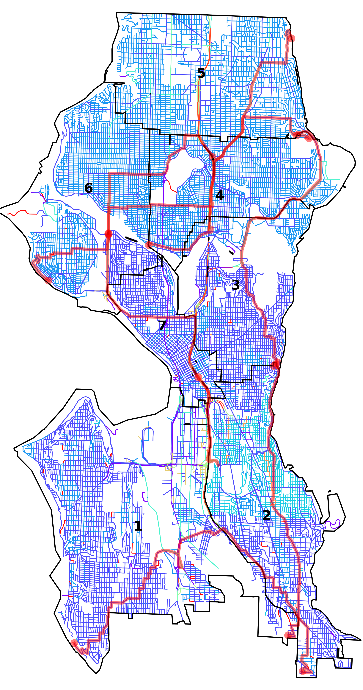

## Districts
```geojson
{"type": "FeatureCollection", "features": [{"id": "1", "type": "Feature", "properties": {"GEOID20": 530330121001013}, "geometry": {"type": "Polygon", "coordinates": [[[-122.39987259523312, 47.51762819384606], [-122.3981840211832, 47.520466423181425], [-122.398049094024, 47.520693194120206], [-122.39794693212653, 47.520864896760884], [-122.39770555079286, 47.521270579541415], [-122.39722975917707, 47.52207022477779], [-122.39723093441371, 47.523017033997604], [-122.39723142713382, 47.523413975366786], [-122.39723147461461, 47.52345222616809], [-122.3972318219119, 47.523735795309086], [-122.39723217670794, 47.524020543753664], [-122.39723246181427, 47.52424586564457], [-122.39723253584765, 47.524304374522885], [-122.39723256924417, 47.52433412551203], [-122.39723298827141, 47.52467439513704], [-122.39751139159786, 47.52493374873595], [-122.39751141486896, 47.52493377180574], [-122.39811735971811, 47.52549824060785], [-122.39888282774776, 47.526211291193825], [-122.40009028168174, 47.52733601213531], [-122.40318639378143, 47.53021970685695], [-122.40123733938422, 47.53225395173684], [-122.4012207051104, 47.53227131225644], [-122.398022477855, 47.53560891239441], [-122.39797529827914, 47.53565814626825], [-122.39797495437197, 47.53565850545575], [-122.39778730777653, 47.53585430865375], [-122.39774051668519, 47.53590313404371], [-122.39773695644963, 47.53590684911104], [-122.39749107832125, 47.5361634187548], [-122.39796012576015, 47.53669180512357], [-122.39796056741136, 47.53669231182751], [-122.39799105355002, 47.53672714917978], [-122.40048345310355, 47.53957532645905], [-122.40054774476135, 47.53976758730258], [-122.40055635949527, 47.539793353378045], [-122.4006022962726, 47.54004596005912], [-122.4007027058313, 47.54059810448505], [-122.40148640787955, 47.54490726927115], [-122.40149751563578, 47.544968339494346], [-122.40178677870821, 47.54655865195452], [-122.40179322588585, 47.54659409994695], [-122.40183707190357, 47.54683514387816], [-122.40184455603537, 47.54687630096889], [-122.4024933919806, 47.55044313489031], [-122.40308335731756, 47.553683909632596], [-122.40313881100863, 47.55399051500746], [-122.40318419778377, 47.554051211989865], [-122.40319100094143, 47.554059857244276], [-122.40821780103964, 47.56044688491888], [-122.40821819270859, 47.56044738250281], [-122.40836103460325, 47.560628848932566], [-122.4083797092587, 47.5606525751206], [-122.40859775315735, 47.56092957775892], [-122.40872857802249, 47.56109577269947], [-122.40891906713685, 47.56133776893351], [-122.40894662018137, 47.56137277024522], [-122.41166232541917, 47.56482244086041], [-122.41341862957965, 47.56705313449147], [-122.41363528476263, 47.567328285270804], [-122.41379924134436, 47.567536518801504], [-122.41396025874698, 47.567741017593576], [-122.4141769184606, 47.56801617185393], [-122.41418001127055, 47.568020099805544], [-122.41532409193162, 47.56876650642632], [-122.41899505248037, 47.57116124768929], [-122.41901014082389, 47.57117108982808], [-122.42072747300834, 47.572291270231986], [-122.42214343742468, 47.57321481752059], [-122.42214497912215, 47.57409820498226], [-122.42218914992448, 47.574744682154154], [-122.42255979370735, 47.574881215710036], [-122.42287702958444, 47.57498306458555], [-122.42314193006906, 47.57508564792833], [-122.42344424879438, 47.57527036898313], [-122.42367679078609, 47.575456063386845], [-122.42383739728201, 47.57557191051544], [-122.42386448310995, 47.57563138311643], [-122.42391221930562, 47.57573619427573], [-122.42389910062147, 47.57587808835327], [-122.4238503742736, 47.5759968634141], [-122.42375830080621, 47.57609463923086], [-122.4237489533516, 47.57610456603718], [-122.42348980922687, 47.57619085183175], [-122.42309146750436, 47.57629089442197], [-122.42214933331843, 47.576594003714675], [-122.4221495062785, 47.576692255210695], [-122.42126235998553, 47.57702624031083], [-122.41936575795496, 47.577740743543586], [-122.41886820295566, 47.57792817816329], [-122.41634552089536, 47.57887658677144], [-122.41634403823512, 47.578877148087365], [-122.41452339130868, 47.579562408749545], [-122.41341489986478, 47.57997930189336], [-122.41333307220624, 47.58002936324636], [-122.41329059925388, 47.58005534695547], [-122.41201247036224, 47.58083724957485], [-122.41194294832127, 47.58087977876926], [-122.4084574184039, 47.58301186472433], [-122.40840252032949, 47.58304536784277], [-122.40797960763784, 47.58303677356546], [-122.40797128029466, 47.5833085479714], [-122.40717683248897, 47.5837933687769], [-122.40659778384472, 47.584252697720025], [-122.40614792841646, 47.58460953694287], [-122.40487244983753, 47.585612006334905], [-122.40485328662474, 47.585627067369956], [-122.40392475299703, 47.586359221494135], [-122.40373800100043, 47.58650647317016], [-122.40346836256218, 47.586719192252254], [-122.40246463051614, 47.58751101646317], [-122.40205049083842, 47.58783771884734], [-122.40183917341861, 47.58800441255163], [-122.39919692497718, 47.59008861628869], [-122.39898563619154, 47.59025527255359], [-122.39837226419142, 47.59073906054498], [-122.39835235288312, 47.59075492193923], [-122.39828360066984, 47.59080969001175], [-122.39701834275282, 47.592117482629746], [-122.39666112633941, 47.592487134118045], [-122.39648708933409, 47.59266723025153], [-122.3946233604443, 47.59459574710233], [-122.39445025481682, 47.59478177813877], [-122.39155008773147, 47.597783376183635], [-122.39144074437688, 47.59789653850789], [-122.39141623404254, 47.59789624897558], [-122.39126809210326, 47.597894512966676], [-122.38854731117804, 47.59786258649525], [-122.38784350830937, 47.597854317517594], [-122.38690961452575, 47.59784333700291], [-122.38689379235774, 47.597843150051006], [-122.38686500599368, 47.59784281267928], [-122.38591831336808, 47.5978316740551], [-122.3831690816024, 47.59780033969074], [-122.38316210194236, 47.5978002593546], [-122.38292737881049, 47.59765693857787], [-122.38261824565433, 47.597468178897905], [-122.38191693377316, 47.597039947970266], [-122.38044004082415, 47.59388530734417], [-122.38031663334881, 47.59362168445506], [-122.37994419940473, 47.59282608976285], [-122.37957671137734, 47.59204103866729], [-122.37945421167014, 47.59177934129229], [-122.37921566658568, 47.59126972250053], [-122.37909332118846, 47.59100835194625], [-122.37905961742163, 47.590936332175694], [-122.37881903568191, 47.5907598907612], [-122.37852684061296, 47.590545586078306], [-122.37847894555597, 47.59051046607987], [-122.37843066139062, 47.59047504817625], [-122.37838801230642, 47.590443770220546], [-122.37829157361818, 47.59037536512782], [-122.37824816650111, 47.59034457331643], [-122.37810833069382, 47.59024538150943], [-122.37615044824432, 47.588856530227275], [-122.37599423878312, 47.58874571714801], [-122.37587077562955, 47.58865813342056], [-122.37579896599402, 47.588607192122694], [-122.37559323604431, 47.588458319820305], [-122.37531141629663, 47.588261319128506], [-122.37422636614971, 47.58749154586613], [-122.37409590124852, 47.587398989244626], [-122.3740001219698, 47.587331039585344], [-122.37394670819938, 47.58729314432504], [-122.37366688513863, 47.587094707476346], [-122.37307832465072, 47.5866773152353], [-122.37092790441406, 47.58515221458828], [-122.3705657084371, 47.5852206866535], [-122.3691560741116, 47.585487155220534], [-122.36571280377643, 47.58654711839824], [-122.36529369361871, 47.58667612151923], [-122.36425563172487, 47.58699528456664], [-122.36391073928284, 47.58710131846699], [-122.36194514970637, 47.587415735010325], [-122.36143846539123, 47.587496776293825], [-122.36141830936073, 47.58750000143222], [-122.36037207331279, 47.58766736538994], [-122.36007205264691, 47.587715357473755], [-122.35841848567942, 47.58797985091198], [-122.35839874613976, 47.58798300695269], [-122.35800377632242, 47.58804524572211], [-122.35797198203666, 47.58805025575484], [-122.35789163113446, 47.588062916245036], [-122.35667037436127, 47.58825870138749], [-122.35640767777436, 47.58830081359182], [-122.35620689489613, 47.58833300020255], [-122.3555810865757, 47.58843331828201], [-122.35542025536078, 47.5884590985014], [-122.35507449173356, 47.58851452137199], [-122.3546460668002, 47.58858319309295], [-122.3545708879785, 47.58859524496759], [-122.35354615073425, 47.58875905538719], [-122.35237914845442, 47.58894559161517], [-122.35183192635648, 47.58903305684624], [-122.3512487569501, 47.58912626278994], [-122.35092020745414, 47.589178772606054], [-122.3505092116275, 47.589244459430354], [-122.35001807852218, 47.58932295151717], [-122.34991198456682, 47.58933990518177], [-122.3498673281817, 47.58934704618112], [-122.34957565876017, 47.58939365547237], [-122.34894046514597, 47.58949516358892], [-122.34885360946826, 47.5895317863075], [-122.34779828851363, 47.58997676482216], [-122.34654201404356, 47.5905058478165], [-122.34603584085237, 47.59071902252664], [-122.34475778232046, 47.59125724250357], [-122.34447274565193, 47.59137727466426], [-122.34438095179414, 47.59141584106639], [-122.34268411883329, 47.592128727698146], [-122.34251131024355, 47.59220132876881], [-122.34251092239373, 47.59220221643249], [-122.34250844945996, 47.59220792488458], [-122.3425080578827, 47.59220882159378], [-122.34247375816228, 47.59228789991445], [-122.34233275432456, 47.59305971376294], [-122.34174707016989, 47.59626525594532], [-122.34120901222794, 47.59921101658611], [-122.34120634080894, 47.599225641414165], [-122.33953089310326, 47.59922561540974], [-122.33725189273785, 47.59922561565966], [-122.33592589252183, 47.59921161580427], [-122.33592389230195, 47.598295615756406], [-122.33566789226114, 47.59829661578455], [-122.33557589224641, 47.5982966157946], [-122.33542189222199, 47.59829761581152], [-122.33539489211027, 47.59784961579096], [-122.3353348920534, 47.59765261578721], [-122.33455689170626, 47.59672461582377], [-122.33434489161186, 47.596472615833775], [-122.33420989155354, 47.59631961584054], [-122.33420989152266, 47.59619061583377], [-122.33420989111626, 47.594494615744665], [-122.33421089063033, 47.592465615637956], [-122.33421689061811, 47.592410615634414], [-122.33361989052288, 47.592412615699956], [-122.33327389046762, 47.592413615737925], [-122.3304738900188, 47.592414616044934], [-122.33000788994386, 47.592413616095975], [-122.32906588979154, 47.59240861619896], [-122.32906588980116, 47.592448616201054], [-122.32897888977735, 47.59240761620844], [-122.32783788959269, 47.59240061633316], [-122.32747188953351, 47.59239861637318], [-122.32739388952079, 47.59239761638168], [-122.32607688930928, 47.59239661652599], [-122.32598488929884, 47.59241461653702], [-122.32598488933331, 47.59255861654458], [-122.325984889346, 47.59261161654739], [-122.32598388978306, 47.59443661664341], [-122.32598788986876, 47.59479161666166], [-122.32595088989159, 47.594911616672], [-122.32585088989686, 47.59500061668762], [-122.32508788977425, 47.594999616771275], [-122.3237828895644, 47.594997616914206], [-122.32249488935656, 47.59499261705516], [-122.32248488915279, 47.594148617011875], [-122.32248788907685, 47.59382961699477], [-122.32248888905136, 47.59372261698902], [-122.32248288901711, 47.59358361698239], [-122.32180688897334, 47.59385361707069], [-122.32152888895196, 47.593950617106245], [-122.3213078889316, 47.5940136171338], [-122.32122288892323, 47.59403561714423], [-122.3211368889145, 47.59405661715481], [-122.3209998888992, 47.5940846171713], [-122.32077288887479, 47.59413461719878], [-122.32084988880541, 47.593793617172416], [-122.32087088879011, 47.593715617166026], [-122.32088488877821, 47.5936566171614], [-122.32092688874229, 47.59347861714741], [-122.32094388873381, 47.59343161714309], [-122.32094688872444, 47.5933906171406], [-122.32112388855285, 47.592555617077274], [-122.32123688840399, 47.59185861702825], [-122.32126288834442, 47.59159261701141], [-122.32124588826171, 47.5912586169957], [-122.32120988817549, 47.590922616981956], [-122.32113188805208, 47.59045961696618], [-122.32102188792061, 47.58998461695323], [-122.32067688753429, 47.58860261691836], [-122.32060888745372, 47.58831161691054], [-122.32053688733683, 47.58787161689527], [-122.32048188723124, 47.58746761688001], [-122.32041588704277, 47.58672461684819], [-122.32038988696532, 47.586418616834926], [-122.32036288688725, 47.58611061682168], [-122.32007488683675, 47.5860926168523], [-122.31996388646718, 47.58462361678714], [-122.31988388630162, 47.58398561676238], [-122.31975788613154, 47.583359616743266], [-122.31968888604624, 47.58304961673446], [-122.31957188590303, 47.58252961671995], [-122.31908288536023, 47.58058961667142], [-122.31900888524474, 47.58015661665676], [-122.31897688511681, 47.579643616633255], [-122.31898088501454, 47.579213616610176], [-122.31906388486871, 47.57854861656605], [-122.31922288472602, 47.57784561651161], [-122.31924988470136, 47.57772461650232], [-122.3194928845176, 47.57679361642668], [-122.31957088446646, 47.576527616404114], [-122.31963988440836, 47.57623861638135], [-122.31968588434802, 47.575955616361405], [-122.31984388364563, 47.572913616183946], [-122.31986288356734, 47.57257361616397], [-122.3198688835408, 47.57245861615725], [-122.31989688344676, 47.572046616132475], [-122.31991288340363, 47.57185561612065], [-122.32000188307585, 47.57042561603562], [-122.32005288297162, 47.569955616005274], [-122.32015388276587, 47.56902761594535], [-122.3206128821597, 47.56618461574533], [-122.32068588208148, 47.56580861571751], [-122.32102588171401, 47.564043615587316], [-122.32121088151567, 47.56308961551676], [-122.32147788108877, 47.561124615383996], [-122.32148588100235, 47.560757615363826], [-122.32136388075571, 47.559807615327124], [-122.3212598806394, 47.55939061531653], [-122.32108388048496, 47.558862615307994], [-122.32091688036569, 47.55847561530585], [-122.32062188018386, 47.55791261530851], [-122.32029988000028, 47.55736061531467], [-122.32017587993643, 47.55717661531853], [-122.31999187984147, 47.55690261532423], [-122.31948787958834, 47.556181615341416], [-122.31897287932966, 47.555444615359], [-122.31891087929746, 47.55535161536088], [-122.31866187916798, 47.554976615368325], [-122.31858087912558, 47.55485361537073], [-122.3182118789252, 47.55426261537996], [-122.31772687865632, 47.55346261539086], [-122.31821787873575, 47.55346561533732], [-122.3177118784473, 47.55259761534691], [-122.31759487841633, 47.55254661535706], [-122.31747387837784, 47.55246661536608], [-122.31740287834972, 47.55239661537014], [-122.3172258782633, 47.552153615376746], [-122.31701987817027, 47.55190261538607], [-122.31675887806273, 47.55162761540013], [-122.3162288778638, 47.551150615432995], [-122.31595487777042, 47.55094361545209], [-122.3155508776385, 47.55066261548147], [-122.31350887702007, 47.54944461564074], [-122.31354587701118, 47.54938261563345], [-122.31359187700475, 47.549324615625345], [-122.31203687654038, 47.54842461574806], [-122.31083787618233, 47.547730615842674], [-122.31010087594808, 47.54724461589772], [-122.31003287592638, 47.54719961590278], [-122.30966287580262, 47.546929615929045], [-122.30916887563359, 47.546553615963255], [-122.30889287553293, 47.54631761598101], [-122.3086748754507, 47.546119615994414], [-122.30823087527587, 47.5456856160201], [-122.30771687506761, 47.54515861604853], [-122.30766887505322, 47.545130616052326], [-122.30557187438971, 47.54376061620948], [-122.30479387408947, 47.543025616255846], [-122.30392287376237, 47.54224061630968], [-122.3027458733222, 47.54118761638288], [-122.30020887240133, 47.53903461654679], [-122.2985948718126, 47.53765261665033], [-122.29759187143549, 47.536746616712186], [-122.29650187124889, 47.536697616828846], [-122.29640187123925, 47.5367246168412], [-122.29572687112525, 47.536700616913826], [-122.29515287102858, 47.53668161697559], [-122.29481287097138, 47.536670617012206], [-122.29340287073987, 47.53664861716532], [-122.2933438707335, 47.53666161717248], [-122.29330087073257, 47.53668661717851], [-122.29323587074144, 47.53676761718987], [-122.29163987023172, 47.535704617308305], [-122.29122087009769, 47.535424617339295], [-122.29093687000464, 47.53522561735987], [-122.29072286993448, 47.53507561737536], [-122.29042686983331, 47.53485061739581], [-122.29002086967014, 47.53443961741849], [-122.2897068695195, 47.53401961743067], [-122.28968786950763, 47.533982617430745], [-122.28956486943282, 47.53375161743204], [-122.28919786920983, 47.533063617435765], [-122.28884586898926, 47.532375617437886], [-122.28848586876761, 47.53168861744094], [-122.28835986868442, 47.531424617440756], [-122.28826986861156, 47.53117961743762], [-122.28819186855684, 47.53100261743679], [-122.28816186850575, 47.530808617429834], [-122.28810886823086, 47.529691617376564], [-122.28804386785161, 47.528144617301805], [-122.28803286778906, 47.52788961728951], [-122.28795786735623, 47.52612461720435], [-122.28793486728723, 47.52585061719232], [-122.28786386720505, 47.52555361718443], [-122.28778786714518, 47.525353617182134], [-122.28767086707325, 47.52513061718314], [-122.28751286699112, 47.5248926171878], [-122.28733786691349, 47.52468461719593], [-122.28724386687767, 47.524597617201636], [-122.28696486677187, 47.52434161721855], [-122.28626386651585, 47.523739617263374], [-122.28591086638532, 47.523429617285586], [-122.28473386595712, 47.52242561736115], [-122.28403186571214, 47.5218706174085], [-122.28386186570343, 47.52194861743125], [-122.28375186565411, 47.52181561743621], [-122.28368786561592, 47.52169861743702], [-122.28331686548397, 47.5213946174615], [-122.28314586543742, 47.52131461747594], [-122.28276086534727, 47.52119561751175], [-122.2816278651082, 47.52095561762293], [-122.28056686489381, 47.52077061772915], [-122.28048986488406, 47.52078161773816], [-122.280041864795, 47.52070961778334], [-122.27998786478415, 47.520700617788734], [-122.27990886476981, 47.52069361779702], [-122.27973086472646, 47.5206316178132], [-122.27935286463459, 47.520500617847574], [-122.27863186446449, 47.520272617914316], [-122.2784428643908, 47.52009061792537], [-122.27799986425936, 47.51983761796042], [-122.27765786416803, 47.51968461798972], [-122.27748486410214, 47.519524618000126], [-122.27685286389674, 47.51908861804614], [-122.27670286385913, 47.51903161805954], [-122.27655586384381, 47.51906661807747], [-122.27636086380969, 47.51905461809811], [-122.2755868636868, 47.519060618183055], [-122.27493686358365, 47.51906561825441], [-122.27424786347447, 47.51907161833006], [-122.27312586329408, 47.51907061845267], [-122.27274886323208, 47.51906461849358], [-122.27226186315222, 47.5190576185464], [-122.2716828630583, 47.51905361860949], [-122.27168686304535, 47.51899661860605], [-122.27167886303336, 47.51895161860454], [-122.27135886281974, 47.51827061860346], [-122.27126086275942, 47.518083618604244], [-122.27116486272286, 47.517994618610004], [-122.271102862705, 47.51796161861505], [-122.27089686269457, 47.51805661864259], [-122.27073086261998, 47.517855618650096], [-122.270518862525, 47.5175996186597], [-122.27026786242587, 47.51735261867405], [-122.27003786234172, 47.5171546186887], [-122.27004186227119, 47.516855618672444], [-122.2700488619848, 47.51564861860771], [-122.27005686165244, 47.51424761853254], [-122.27004986141863, 47.513270618481506], [-122.27005386136045, 47.513023618467976], [-122.27006686122486, 47.51244561843594], [-122.27006786115909, 47.51216861842115], [-122.27007586087463, 47.51096861835663], [-122.27007686083766, 47.51081261834825], [-122.27008386056642, 47.50966861828684], [-122.27156386081191, 47.509701618126826], [-122.27409086123123, 47.50975861785365], [-122.2754258614529, 47.509789617709366], [-122.27542686141713, 47.509638617701256], [-122.2754328612507, 47.508935617663354], [-122.27543916470714, 47.507996384539844], [-122.27544151279729, 47.50784415547089], [-122.2754464812698, 47.50752169980582], [-122.27545145849867, 47.50719922693723], [-122.27545187779668, 47.507171810035246], [-122.27545224518202, 47.507147904343825], [-122.27565086086199, 47.50715561754517], [-122.27598986093332, 47.50722661751189], [-122.2762558609784, 47.507236617483315], [-122.2770928612418, 47.50777861742057], [-122.27723986128107, 47.50784461740803], [-122.27740186131973, 47.50789761739312], [-122.27755686135508, 47.50794161737851], [-122.27771786138831, 47.50797261736256], [-122.27790386142414, 47.507997617343555], [-122.27824386147846, 47.50799661730633], [-122.27825286169985, 47.50892061735434], [-122.27824386190773, 47.509799617401896], [-122.27824986192248, 47.5098576174043], [-122.27856186197329, 47.50986061737037], [-122.27865986198927, 47.50986161735972], [-122.27873586200194, 47.50986361735155], [-122.27986486218911, 47.509888617229436], [-122.28077586234036, 47.50990961713095], [-122.2812928624262, 47.50992161707511], [-122.282478862623, 47.509948616946915], [-122.2825718626384, 47.509950616936834], [-122.28298186270611, 47.509958616892455], [-122.28337986277212, 47.509967616849394], [-122.28370086282652, 47.509979616814995], [-122.28388486285631, 47.509980616794884], [-122.28443886294832, 47.50999361673505], [-122.28468786298946, 47.509998616708074], [-122.28481286301023, 47.51000161669456], [-122.28489986302465, 47.51000361668518], [-122.28526286308482, 47.51001161664594], [-122.2856598631507, 47.51002061660303], [-122.28577186316942, 47.51002361659094], [-122.28594286319777, 47.51002761657245], [-122.28616186323435, 47.51003361654883], [-122.28624986324895, 47.510035616539305], [-122.28653286329603, 47.51004261650876], [-122.28751886345951, 47.51006461640214], [-122.28766086348323, 47.51006861638682], [-122.28783986351291, 47.51007261636746], [-122.2898618638481, 47.51011761614882], [-122.29006686388219, 47.5101226161267], [-122.29018286390131, 47.51012461611413], [-122.29027186391606, 47.51012661610449], [-122.29080986400525, 47.51013861604631], [-122.29133809553997, 47.51015121604354], [-122.29133724166432, 47.51022983896528], [-122.29133218832484, 47.510695879091166], [-122.29133217525695, 47.510696978569065], [-122.29132655393828, 47.51121497333814], [-122.29132654741169, 47.511216116812435], [-122.29132134388448, 47.51169545224338], [-122.29132130301124, 47.51169883346157], [-122.29132074955466, 47.51175030753216], [-122.29132071096961, 47.51175334327495], [-122.29131666437303, 47.512124353018976], [-122.29131664241346, 47.512126511439185], [-122.29131578811533, 47.51220748992596], [-122.29131290424188, 47.51248106175677], [-122.29131288537518, 47.512482903478386], [-122.29130819658953, 47.51293251044668], [-122.29130816472907, 47.51293545434403], [-122.29130472249375, 47.51326574137333], [-122.2913043407412, 47.513301943444176], [-122.29130429731181, 47.513306182912764], [-122.29130314954209, 47.51341645611475], [-122.29130308909774, 47.51342231867857], [-122.29130303142901, 47.513427844244546], [-122.2913019657566, 47.51352995214313], [-122.29130185209979, 47.51354269552425], [-122.29130122983364, 47.51361336072692], [-122.29130120111668, 47.5136181262722], [-122.29130094886355, 47.51365857908575], [-122.29130019617176, 47.51369970222761], [-122.29130018708437, 47.51370037434483], [-122.29129863255014, 47.51384116087379], [-122.29129572015835, 47.514105458204114], [-122.29128712055892, 47.51488533967247], [-122.29128565394974, 47.51501834139505], [-122.2912856365315, 47.5150199501019], [-122.29128128495671, 47.51541492278565], [-122.29127534291563, 47.51595367722536], [-122.29127533212004, 47.515954525685906], [-122.2912689701733, 47.51653130527411], [-122.29126503318554, 47.51688897795459], [-122.29126501538657, 47.516889053749445], [-122.29126395666752, 47.516985803933814], [-122.29126588304256, 47.518309562746666], [-122.29126588594254, 47.51831208788428], [-122.29126613734525, 47.518485307872204], [-122.29126616663625, 47.518505314350584], [-122.29126629791578, 47.51859498134185], [-122.29126638360616, 47.518654165770016], [-122.29126661551854, 47.518812539923594], [-122.29126661675916, 47.51881329647054], [-122.29126673328922, 47.51888303190152], [-122.29126674762936, 47.51889000181172], [-122.29126674854041, 47.51889008186435], [-122.29126695479958, 47.51904753875629], [-122.29126718495284, 47.519144553973035], [-122.29126718596729, 47.51914487511689], [-122.29126718374545, 47.519144938117364], [-122.2912672042155, 47.51919106030353], [-122.29126729102096, 47.51923105536796], [-122.2912672978484, 47.519239694102566], [-122.29126737153469, 47.51933292854173], [-122.2912674336369, 47.51937522149951], [-122.29126760968055, 47.519497650187645], [-122.2912676090963, 47.5194980091352], [-122.29126784613477, 47.519660744480575], [-122.29126794411268, 47.519725590828564], [-122.2912679444814, 47.519726173764106], [-122.29126825177704, 47.51993751830246], [-122.29126853622473, 47.52013314752896], [-122.2912686080381, 47.52018414398422], [-122.29126860927049, 47.52018461535843], [-122.2912687904515, 47.5205445768435], [-122.29126883840387, 47.52064063272815], [-122.2912688378137, 47.52064222592585], [-122.29126919728677, 47.520915834398636], [-122.29126919853844, 47.520917113612605], [-122.29126931404119, 47.52100134070061], [-122.29126944817085, 47.52109876826776], [-122.29126945066896, 47.52110042439779], [-122.29126973989055, 47.52131729965171], [-122.29126976478504, 47.52133461751576], [-122.29126976572648, 47.521336028075204], [-122.29126984251405, 47.52139954688746], [-122.2912699570356, 47.52148179217127], [-122.29127005493791, 47.52155879030653], [-122.29127038469294, 47.52180735881918], [-122.2912704330572, 47.521842655771145], [-122.29127043768449, 47.521846667024455], [-122.29127043978869, 47.52184773931967], [-122.2912709689804, 47.52224573319373], [-122.29127102634355, 47.52228685943294], [-122.29127107972408, 47.522327985723216], [-122.29127164554485, 47.52275914734976], [-122.2912717767507, 47.52285655783617], [-122.29127188976965, 47.52294046562608], [-122.29127223658446, 47.52319467620762], [-122.29127228981598, 47.52323579710249], [-122.29127234718128, 47.5232769233418], [-122.29127291513511, 47.523486812332145], [-122.29127292096494, 47.52348910983359], [-122.2912734491232, 47.52368404439813], [-122.29127357089104, 47.52372965701175], [-122.29127449733873, 47.52391001025932], [-122.29127550235587, 47.524104989758285], [-122.29127640903359, 47.524280889567635], [-122.29130486745407, 47.52428140105078], [-122.29130486745508, 47.52428561674099], [-122.29130786747963, 47.524386616745986], [-122.29131086749966, 47.52446861675002], [-122.29138686751159, 47.52446761674168], [-122.29181586758044, 47.524467616694785], [-122.29295386776285, 47.52446661657024], [-122.29337186782992, 47.52446661652449], [-122.29366486787671, 47.52446561649243], [-122.29384186787291, 47.524330616465924], [-122.294071867911, 47.52433561644105], [-122.29549886814642, 47.52436261628639], [-122.29774486851635, 47.5244026160429], [-122.29978157479462, 47.524433504894766], [-122.30001392296944, 47.52443766559883], [-122.30049486897089, 47.52445861574511], [-122.30051586897429, 47.5244586157428], [-122.30100286905241, 47.52445861568954], [-122.30057486901497, 47.52458961574326], [-122.3003168689924, 47.52466861577566], [-122.30024986899288, 47.52471561578547], [-122.30022686899848, 47.52475461579005], [-122.30022286900524, 47.524785615792155], [-122.30015386902446, 47.5249126158064], [-122.30011394570202, 47.524986200028394], [-122.30008921465208, 47.52500189434396], [-122.30002551169962, 47.525044353959096], [-122.29996336014342, 47.52508786043525], [-122.29989294623498, 47.52514080960054], [-122.29982933207098, 47.52519757611061], [-122.29977296837365, 47.52525775203695], [-122.29972425912577, 47.525320920158755], [-122.29968354104778, 47.52538663263643], [-122.29965644807892, 47.52544237707576], [-122.29963805541011, 47.52548895202748], [-122.29961844289139, 47.52555896923129], [-122.29960757399084, 47.52562985324299], [-122.29960551832033, 47.525701102988805], [-122.29961228717615, 47.52577222174428], [-122.29962019114129, 47.525821843375795], [-122.29963008939554, 47.52587130162741], [-122.29964196494979, 47.5259205589348], [-122.29965581679747, 47.525969579326265], [-122.29967162807581, 47.52601832973363], [-122.29968938963476, 47.52606676799301], [-122.29970909385442, 47.52611485911739], [-122.29973071590526, 47.52616257014123], [-122.29976257712157, 47.52622196929357], [-122.29976086928319, 47.526262615920764], [-122.29979086937313, 47.52661961593635], [-122.29986186945438, 47.526912615944084], [-122.29987686947105, 47.5269726159456], [-122.2999048695049, 47.52709561594907], [-122.30028686977842, 47.5279856159543], [-122.30093087013303, 47.5290396159396], [-122.30106157372204, 47.52910163526787], [-122.30106983820909, 47.52911154330085], [-122.30112995063313, 47.52918050738937], [-122.30117458000522, 47.5292260362613], [-122.30122089825416, 47.529270784931946], [-122.30126887536086, 47.52931472499985], [-122.30131848128082, 47.529357827164375], [-122.30136968601958, 47.52940006392321], [-122.30142245289298, 47.52944140606155], [-122.30147674807462, 47.52948183152419], [-122.30153253893879, 47.52952131374263], [-122.3015897914304, 47.52955982256828], [-122.30164846510839, 47.52959733693112], [-122.3017085247412, 47.52963383209549], [-122.30176993116407, 47.52966928517578], [-122.30183264388421, 47.529703673303466], [-122.3018966197529, 47.52973697364459], [-122.30196182764703, 47.52976916590843], [-122.30202821246719, 47.52980022741541], [-122.30209574053531, 47.529830141506466], [-122.30216437000372, 47.52985888443127], [-122.30223404868086, 47.52988644246903], [-122.3022340930296, 47.529886460787296], [-122.30231517702349, 47.52991904312542], [-122.30239713910215, 47.52995077742344], [-122.30247991964329, 47.52998152771087], [-122.30256348256567, 47.53001128635604], [-122.30264780506535, 47.53004004555578], [-122.3027328722036, 47.53006779380664], [-122.30282578985233, 47.530092917971615], [-122.30284926927214, 47.5300996446687], [-122.30291793858599, 47.53011931594817], [-122.30300927296148, 47.53014697753094], [-122.30309975940912, 47.53017588966226], [-122.30318935644323, 47.53020604118597], [-122.30327803455292, 47.53023742169097], [-122.30336575340213, 47.53027001370928], [-122.30345247155492, 47.53030380788374], [-122.30353816202829, 47.53033878927258], [-122.30357031270417, 47.53035252623115], [-122.30389093086916, 47.53050099057222], [-122.3039498961005, 47.53053097982234], [-122.30402866225639, 47.53057275971072], [-122.30410615725177, 47.53061561753222], [-122.3041823539741, 47.53065953384919], [-122.30423294884407, 47.53068991690596], [-122.30425721463718, 47.53070448756308], [-122.30426649142639, 47.53070957345633], [-122.30431138442924, 47.530734180187544], [-122.30436416994974, 47.53076499272258], [-122.30441551602404, 47.5307968997961], [-122.30446538187955, 47.530829868652674], [-122.30451371484382, 47.53086386849028], [-122.3045604688578, 47.5308988675216], [-122.30460559770934, 47.5309348285638], [-122.30464906070061, 47.53097172155926], [-122.30469081159328, 47.531009508425846], [-122.30473081880545, 47.53104815269072], [-122.30476903216541, 47.53108761812178], [-122.30480543071279, 47.5311278681086], [-122.30483996412286, 47.53116886102338], [-122.30487260206367, 47.53121055767819], [-122.3049033209182, 47.531252921496744], [-122.3049320876219, 47.531295910627534], [-122.30495887299207, 47.5313394795703], [-122.30498365343598, 47.53138359264787], [-122.30500639974478, 47.53142820346055], [-122.30502709741668, 47.53147326901644], [-122.30504572268052, 47.53151874734316], [-122.3050622571015, 47.53156459729882], [-122.30507668602496, 47.53161077049557], [-122.30508899497363, 47.531657224840295], [-122.30509917197347, 47.5317039128099], [-122.30552748389246, 47.531706513212455], [-122.30553557993252, 47.531706561239176], [-122.30778605580751, 47.53172676706714], [-122.3078305841268, 47.5317271397667], [-122.3084448719821, 47.53173861526024], [-122.30893887206324, 47.53174661520665], [-122.30919187210476, 47.53175061517916], [-122.31329987277059, 47.53177961473127], [-122.31368654704603, 47.53177918111946], [-122.31375246151319, 47.531779802032645], [-122.31375396424488, 47.531779816637], [-122.31385370564098, 47.53178075337656], [-122.31395494982367, 47.531781706428795], [-122.31398559551668, 47.531781997052825], [-122.31405619278436, 47.53178266300526], [-122.3141425850807, 47.53178347299737], [-122.31415743957892, 47.53178361404392], [-122.31423973431028, 47.53178438650804], [-122.31425867973815, 47.531784565078944], [-122.31426624250152, 47.53178463652734], [-122.31435992794455, 47.531785518617724], [-122.31446117214574, 47.53178647121889], [-122.3144783757082, 47.531786633777614], [-122.3145624163761, 47.531787424629215], [-122.31466366053354, 47.531788375251445], [-122.31472550318416, 47.53178895611832], [-122.3147649060992, 47.531789328464015], [-122.31484695027466, 47.531790117249614], [-122.31488633077191, 47.5317904952432], [-122.31496839611941, 47.53179128096629], [-122.31500775935677, 47.531791659142854], [-122.31510893846573, 47.531792563437484], [-122.31521011758007, 47.53179351442141], [-122.31531129534471, 47.53179446443325], [-122.31541247719879, 47.53179541790016], [-122.31551365632421, 47.531796368613776], [-122.31561483279778, 47.53179731927199], [-122.31571601195611, 47.531798270704684], [-122.31581719104145, 47.531799219349516], [-122.31591837158618, 47.531800172383264], [-122.31601955073008, 47.531801122646414], [-122.31612072857547, 47.531802073736095], [-122.31622191033112, 47.5318030219859], [-122.31632308550266, 47.53180397203079], [-122.31642426598916, 47.53180492191628], [-122.31652544525382, 47.53180587532609], [-122.31664686121846, 47.53180701155133], [-122.3168824919987, 47.53180922523438], [-122.31690883418271, 47.531809472681964], [-122.31690912911158, 47.53180947422844], [-122.31692149365793, 47.53180958985242], [-122.31702671872816, 47.53181058084642], [-122.31804961051515, 47.53182017729454], [-122.31846564230959, 47.531824075102996], [-122.31847558469022, 47.531824167343316], [-122.31847583428107, 47.531776028801794], [-122.31847891219131, 47.53118238559172], [-122.31847987344382, 47.53111961412972], [-122.31848187339642, 47.530919614118936], [-122.31848287337988, 47.53084961411513], [-122.31848787331532, 47.53057561410011], [-122.31848816481273, 47.530546463708156], [-122.31848884440562, 47.530507939855475], [-122.31848910566686, 47.53049310374836], [-122.31848941359017, 47.53047563154578], [-122.31849055522427, 47.53041085278032], [-122.31849539095208, 47.530136726616554], [-122.31849772023875, 47.53000468033916], [-122.31850187312867, 47.52978361405678], [-122.31850238292228, 47.52974028076454], [-122.31850312625849, 47.52969811919975], [-122.31850522934938, 47.52957891588679], [-122.3185078730488, 47.52944461403821], [-122.3185075988301, 47.529444612937276], [-122.31850766978866, 47.52944059097301], [-122.31842199127907, 47.529440321079484], [-122.3183750507466, 47.52944017539583], [-122.31831999245526, 47.52944000085795], [-122.31824147656334, 47.52943975505519], [-122.31821799636504, 47.52943968320788], [-122.3181159975437, 47.52943936280322], [-122.31801399872361, 47.52943904230697], [-122.31791199857706, 47.5294387217365], [-122.3178100038196, 47.52943840370291], [-122.31770800234776, 47.52943808296666], [-122.31759070333388, 47.529437714116696], [-122.31758987289538, 47.52941861413725], [-122.31758287283608, 47.529174614125154], [-122.31758987280311, 47.529031614116825], [-122.31760487275758, 47.528830614104585], [-122.31761387269319, 47.52855461408899], [-122.31756887260515, 47.528215614076046], [-122.31749787258447, 47.528176614081744], [-122.31510487202378, 47.527434614304354], [-122.31500587200028, 47.527402614313495], [-122.31491287197872, 47.52737461432218], [-122.3128478715164, 47.52682461451899], [-122.31265987147624, 47.526782614537346], [-122.31190187130844, 47.52658861461003], [-122.31185087129404, 47.52656261461422], [-122.31173887125888, 47.5264906146227], [-122.31162387121138, 47.52636861462883], [-122.31144287113919, 47.52618761463906], [-122.3110988709829, 47.52576361465427], [-122.31083702749527, 47.525522884889405], [-122.31081697822883, 47.52549672600179], [-122.3107924614884, 47.52546470950779], [-122.3107345094622, 47.52538909854516], [-122.31073213042029, 47.52538599436635], [-122.30995548023549, 47.52471361179728], [-122.3098708705061, 47.52458961472655], [-122.3097231868897, 47.52431451801689], [-122.30986431609105, 47.523963064592465], [-122.30986597712507, 47.52389024260371], [-122.30981284146888, 47.52374168904627], [-122.3096767525148, 47.523361210026536], [-122.30963638503401, 47.52324834504962], [-122.30964420045628, 47.52319698858444], [-122.30977403767756, 47.52234348207665], [-122.30973662895602, 47.52217634430379], [-122.30979807048271, 47.522176486713626], [-122.3102702319541, 47.52217791893266], [-122.31140667046682, 47.52218126547048], [-122.311875756143, 47.52218264107918], [-122.3128529772781, 47.52218550311509], [-122.31289884575774, 47.522185637070365], [-122.31290224583785, 47.5222253192973], [-122.31291311243591, 47.52222575350683], [-122.31291409366595, 47.52222579290336], [-122.31291496412027, 47.5222258130518], [-122.3129741905783, 47.522226985654584], [-122.31347061620129, 47.522228446565904], [-122.31352272980642, 47.52222859875226], [-122.31498173249422, 47.52223288227839], [-122.31499836724348, 47.522232933793745], [-122.31755562697822, 47.52224082498661], [-122.31755560358877, 47.522227332166906], [-122.31767087119387, 47.52222761374868], [-122.3176558710975, 47.52183361372947], [-122.317625870898, 47.521016613689596], [-122.31760787078501, 47.52055461366714], [-122.31760287074702, 47.52039861365946], [-122.31759287067725, 47.52011261364546], [-122.3175858706387, 47.519955613637904], [-122.31758187060993, 47.51983761363211], [-122.3175588704568, 47.519210613601494], [-122.31754703846242, 47.518895377845915], [-122.31754648714184, 47.51873063215991], [-122.31814587043702, 47.51873261351206], [-122.3184278704815, 47.51872961348108], [-122.31861587051122, 47.51872761346043], [-122.32015087075534, 47.51871961329213], [-122.32035787078856, 47.51871961326949], [-122.32130687094119, 47.51872161316578], [-122.32162187099115, 47.518719613131246], [-122.32169484621866, 47.51871829276737], [-122.3222565438368, 47.518719407467245], [-122.32225628506191, 47.518708132945186], [-122.32316887123251, 47.518691612960545], [-122.3232448712442, 47.51868961295217], [-122.32345287127778, 47.518690612929454], [-122.32387287134539, 47.518691612883586], [-122.32408787137983, 47.518691612860046], [-122.32414987138974, 47.51869161285328], [-122.3245248714501, 47.51869261281234], [-122.32467464245806, 47.518689313040866], [-122.32479008428852, 47.5186895570556], [-122.32491467614922, 47.51868982100568], [-122.32496886097204, 47.5186899361992], [-122.32497538300429, 47.51868994770883], [-122.32497707878782, 47.5186899461306], [-122.32503608877882, 47.518690036610245], [-122.32563135416945, 47.51869088439562], [-122.32587962277847, 47.51869630175987], [-122.32587977446562, 47.51877308401925], [-122.3258799436345, 47.51885533105729], [-122.32588020394292, 47.518981898731305], [-122.32588039501641, 47.519074650191556], [-122.32588046250198, 47.519108822672685], [-122.32588072062397, 47.51923489649149], [-122.32588075712907, 47.51925184730493], [-122.32588075882019, 47.5192521846353], [-122.3258809732673, 47.51935975861175], [-122.32588097850731, 47.51936165761308], [-122.32588141238557, 47.51957359390418], [-122.32588215023918, 47.51993393615402], [-122.32588223482728, 47.519975059673335], [-122.32588228806001, 47.52000024706801], [-122.32588238486386, 47.52004703795042], [-122.32588287424171, 47.52028804341122], [-122.32588293021777, 47.52031545999585], [-122.32588319998486, 47.520448572187114], [-122.32588332079796, 47.52050621921051], [-122.32588347428073, 47.520579848221274], [-122.32588374074165, 47.5207111288565], [-122.3258840058248, 47.52084240771068], [-122.32588414690474, 47.520910223624604], [-122.32589098411196, 47.52091021355893], [-122.32589087220126, 47.52092561278083], [-122.32791387252578, 47.520926612559634], [-122.32960687279518, 47.52091861237401], [-122.33008787287062, 47.52091161232103], [-122.33061387295398, 47.5209076122633], [-122.33079387298257, 47.52090661224358], [-122.33092087300312, 47.52090761222971], [-122.3309173062311, 47.52090258519216], [-122.33091941606227, 47.52090258181787], [-122.3309645751983, 47.52090250910791], [-122.32974447163166, 47.51865545757926], [-122.32970487222552, 47.51846261223365], [-122.32962587217594, 47.51830761223412], [-122.3295708721416, 47.51820061223448], [-122.3295328721181, 47.51812761223477], [-122.32953087209802, 47.5180446122306], [-122.32952887208414, 47.51798761222783], [-122.32951987200238, 47.517650612210986], [-122.32951687197924, 47.51755561220634], [-122.3295118719408, 47.51739761219854], [-122.32950187192348, 47.51733161219612], [-122.32950087192116, 47.517322612195755], [-122.32949011978721, 47.51731432777666], [-122.32949030367523, 47.51725038660528], [-122.32944862712074, 47.5172272857837], [-122.32942160919471, 47.517227207146604], [-122.32940623303656, 47.51722716408179], [-122.32937033578797, 47.51722706114773], [-122.32936897979971, 47.51722705561789], [-122.32925451904762, 47.51722501778849], [-122.32922904144772, 47.51722635638775], [-122.32922187184474, 47.51718961221926], [-122.32921487184026, 47.51717561221928], [-122.3291918718261, 47.51713161221947], [-122.32886387168516, 47.51676061223577], [-122.32872787162475, 47.51659861224207], [-122.3286538715919, 47.51651061224553], [-122.32734478798497, 47.51401009498969], [-122.32818531364833, 47.51400541591077], [-122.3282017270283, 47.51400532437577], [-122.32847922039815, 47.51400377648627], [-122.32850516815375, 47.514003631875816], [-122.32857987098295, 47.514004612121276], [-122.3300938712251, 47.514002611955625], [-122.33027342910968, 47.51400446305915], [-122.33043660124001, 47.51431573665663], [-122.3304394508661, 47.51432045352266], [-122.33044096068024, 47.51432299750384], [-122.33044247049443, 47.514325541485086], [-122.33044397242207, 47.514328088269004], [-122.33044547434983, 47.514330635052914], [-122.3304469656588, 47.51433318197683], [-122.33044846102752, 47.514335731546026], [-122.33044995506904, 47.51433828113266], [-122.33045144512857, 47.514340830771765], [-122.33045293120618, 47.514343380463394], [-122.33045441470664, 47.514345932887764], [-122.33045590226686, 47.514348487957434], [-122.33045738826746, 47.514351034951176], [-122.33045887044098, 47.51435358739298], [-122.330460353942, 47.514356139817274], [-122.33046183736576, 47.51435868954377], [-122.33046332352187, 47.51436124193303], [-122.33046480960057, 47.51436379162448], [-122.33046629442958, 47.51436634403118], [-122.33046778449072, 47.51436889367008], [-122.33046927455202, 47.51437144330899], [-122.33047076859559, 47.51437399289539], [-122.33047226654385, 47.51437653973144], [-122.33047376449234, 47.514379086567516], [-122.33047527040517, 47.51438163329857], [-122.33047677225852, 47.5143841773843], [-122.330478281973, 47.51438671776792], [-122.33047979983255, 47.51438926434147], [-122.3304813175373, 47.51439180551933], [-122.3304828431289, 47.51439434389446], [-122.33048437137549, 47.51439688223447], [-122.3304859075347, 47.51439941867103], [-122.33048744892605, 47.5144019523398], [-122.33048899958335, 47.5144044849867], [-122.33049054883595, 47.514407014953335], [-122.33049211524117, 47.51440954109541], [-122.33049368573198, 47.51441207078204], [-122.33049526392884, 47.51441459137106], [-122.33049684746122, 47.51441711278923], [-122.33049844814617, 47.514419630382896], [-122.33050005010706, 47.51442214616054], [-122.33050166391112, 47.51442465818355], [-122.33050328435212, 47.51442717011905], [-122.33050492059257, 47.514429677348275], [-122.3305066686164, 47.514432192999635], [-122.33050832325956, 47.51443469368891], [-122.33050998313497, 47.514437191610405], [-122.3305116536036, 47.5144396884927], [-122.3305133385443, 47.51444218068609], [-122.33051503277682, 47.514444672756944], [-122.3305167268544, 47.51444715943226], [-122.33051843142212, 47.51444964147114], [-122.33052014392837, 47.51445212250581], [-122.33052186447641, 47.51445460613324], [-122.33052359283396, 47.51445708426002], [-122.33052532790596, 47.514459564997196], [-122.33052706670195, 47.51446203668907], [-122.33052881075595, 47.514464506512454], [-122.33053056550655, 47.514466978893594], [-122.33053232023154, 47.51446945037547], [-122.33053408279171, 47.51447191725596], [-122.33053585201478, 47.514474384948265], [-122.33053762241042, 47.51447684722738], [-122.33053939691742, 47.51447931395032], [-122.33054117132131, 47.514481777076185], [-122.33054295238807, 47.5144842410138], [-122.33054473733378, 47.51448670130183], [-122.33054652363283, 47.51448916247157], [-122.33054830857887, 47.51449162275954], [-122.33055009753306, 47.51449408389426], [-122.3305518916936, 47.51449654136189], [-122.33055368330284, 47.51449900246153], [-122.33055547746365, 47.51450145992911], [-122.33055727305536, 47.514503920976196], [-122.33055906323446, 47.51450637849621], [-122.33056085612009, 47.514508837779694], [-122.33056264900588, 47.51451129706315], [-122.33056443918544, 47.5145137545831], [-122.33056623079585, 47.51451621568253], [-122.33056801707116, 47.51451867595269], [-122.33056980337243, 47.5145211371221], [-122.33057159097542, 47.514523597374705], [-122.33057336939025, 47.51452606134686], [-122.33057514783117, 47.514528526218214], [-122.33057692096267, 47.51453099115951], [-122.33057869805069, 47.51453345514907], [-122.3305804605894, 47.5145359211296], [-122.33058222315411, 47.514538388009385], [-122.33058383913988, 47.51454083703003], [-122.33058606117675, 47.51454321238997], [-122.33058805638817, 47.51454559613766], [-122.33059005045321, 47.514547986197705], [-122.33059204168288, 47.51455036999781], [-122.33059402908557, 47.514552759246], [-122.33059601263552, 47.51455515304297], [-122.33059799079862, 47.514557544212124], [-122.33059996633297, 47.51455993631556], [-122.33060194199668, 47.51456233291519], [-122.33060391227357, 47.514564726886995], [-122.33060588390389, 47.514567121740555], [-122.33060785032818, 47.514569520261134], [-122.33060981414957, 47.51457192061525], [-122.33061178049671, 47.51457431643799], [-122.33061374424098, 47.51457671409418], [-122.33061570280512, 47.51457911631669], [-122.33061766386913, 47.51458151310862], [-122.3306196250883, 47.514583915296036], [-122.33062158755762, 47.514586314768145], [-122.33062355130279, 47.51458871242421], [-122.33062550984192, 47.5145911137473], [-122.33062747358748, 47.514593511403284], [-122.3306294361091, 47.5145959126738], [-122.33063139985495, 47.514598310329724], [-122.33063336628167, 47.514600708849876], [-122.3306353339325, 47.51460310375542], [-122.3306373043675, 47.514605503122304], [-122.33063927597497, 47.51460789707597], [-122.33064124893589, 47.514610291911445], [-122.33064322582747, 47.514612684895845], [-122.33064520933024, 47.514615076893435], [-122.330647190101, 47.514617466228195], [-122.33064917888785, 47.514619857256434], [-122.33065117017462, 47.51462224285404], [-122.33065316148738, 47.51462462935089], [-122.33065516068714, 47.51462701304492], [-122.33065716777372, 47.514629393936104], [-122.33065917491227, 47.51463177662584], [-122.33066118580064, 47.514634151169574], [-122.33066320467923, 47.51463652650756], [-122.3306652276176, 47.51463890449082], [-122.33066726094275, 47.51464127424062], [-122.33066929809522, 47.5146436385423], [-122.33067134066067, 47.514646006371024], [-122.33067338830338, 47.51464836603635], [-122.33067544661687, 47.51465072736012], [-122.33067751008512, 47.51465308321824], [-122.33067958146607, 47.51465543717281], [-122.33068166065654, 47.51465778562676], [-122.33068374513088, 47.514660133111406], [-122.33068584277578, 47.514662476823915], [-122.33068794560128, 47.514664815970114], [-122.33069005636534, 47.51466715411192], [-122.33069217884349, 47.514669484002845], [-122.33069430665722, 47.51467181472299], [-122.33069647879105, 47.51467416285097], [-122.33069862360279, 47.51467648435087], [-122.33070078423982, 47.51467880204368], [-122.33070295133314, 47.51468111335411], [-122.33070512628757, 47.514683420962314], [-122.33070730920647, 47.51468572846556], [-122.33070950258953, 47.51468803043317], [-122.33071170385959, 47.51469032959788], [-122.33071391038764, 47.5146926268941], [-122.3307161260526, 47.5146949186721], [-122.33071834825128, 47.5146972067655], [-122.3307205797159, 47.514699493837114], [-122.33072281511126, 47.51470177905766], [-122.33072505173092, 47.5147040606636], [-122.33072730282265, 47.51470633758061], [-122.33072955521621, 47.51470861358082], [-122.3307318141693, 47.51471088679572], [-122.3307340797853, 47.514713160822296], [-122.3307363492803, 47.51471543119929], [-122.33073862400752, 47.51471769880843], [-122.3307409026396, 47.5147199636672], [-122.33074318530566, 47.51472223027202], [-122.33074547312646, 47.514724491411165], [-122.330747763628, 47.51472675341449], [-122.33075005272485, 47.51472901273749], [-122.33075235369088, 47.51473126920514], [-122.3307546506749, 47.514733525725205], [-122.33075695562344, 47.514735782140335], [-122.33075925924477, 47.514738038572844], [-122.33076156544355, 47.51474029227251], [-122.33076387687458, 47.514742543204314], [-122.33076618572846, 47.51474479686886], [-122.3307684984873, 47.51474704778306], [-122.3307708099189, 47.51474929871479], [-122.3307731227556, 47.514751552326715], [-122.3307754394971, 47.51475380318828], [-122.33077775491141, 47.51475605406733], [-122.33078007024845, 47.514758302248495], [-122.3307823803537, 47.51476055319742], [-122.33078469587196, 47.51476280767341], [-122.33078701128711, 47.51476505855222], [-122.33078931735915, 47.514767307754994], [-122.33079163285214, 47.51476956133155], [-122.33079393764889, 47.514771812350205], [-122.33079625048755, 47.51477406596168], [-122.33079855411229, 47.51477632239343], [-122.33080085633232, 47.5147785761448], [-122.33080315995747, 47.51478083257642], [-122.33080545442033, 47.51478309362682], [-122.33080775013322, 47.51478535196186], [-122.33081004056265, 47.51478761126619], [-122.33081232974243, 47.51478987328573], [-122.33081461494021, 47.514792135357744], [-122.33081689365632, 47.51479440291281], [-122.33082022514532, 47.51479795652109], [-122.33117852782404, 47.51515091067201], [-122.33119190563585, 47.51514981710288], [-122.33119687167635, 47.51515461189583], [-122.33139987170483, 47.51513761187272], [-122.33141987169995, 47.515103611868746], [-122.33263087184253, 47.51488761172491], [-122.33350939338861, 47.514731053326486], [-122.33354996497387, 47.51474317822481], [-122.33354967892778, 47.51474169297534], [-122.33356987195964, 47.51474761161482], [-122.33352687190242, 47.51453661160838], [-122.33405087198429, 47.51452761155064], [-122.33437187203596, 47.51452861151558], [-122.33436787202959, 47.51450461151474], [-122.33427306091004, 47.51393950096416], [-122.33431557712754, 47.51393905833536], [-122.3347900402913, 47.51393412206461], [-122.33557384674192, 47.51392596705792], [-122.33572187210929, 47.51392861133625], [-122.33652187223535, 47.513919611248305], [-122.3366091085693, 47.51391518622698], [-122.33704019799083, 47.513910692797985], [-122.33704418368995, 47.51401954494703], [-122.33704418498695, 47.514019589910326], [-122.33708311804232, 47.51450855554013], [-122.33708698138228, 47.514557093195684], [-122.3371098467007, 47.514844216578624], [-122.33711147912766, 47.51486476273619], [-122.33712411657893, 47.5150234790399], [-122.3371487891335, 47.51516195311523], [-122.33719611683966, 47.51542759918499], [-122.33720236659931, 47.51546269656254], [-122.3372096830596, 47.51550374512653], [-122.33722018055988, 47.515562677189365], [-122.33723893993174, 47.5156679466949], [-122.33724490370312, 47.51570141416688], [-122.33736398681651, 47.516369795430926], [-122.33736399966719, 47.516369872627166], [-122.33750753562683, 47.517175476688024], [-122.33752514909978, 47.5172578383866], [-122.33753512978998, 47.51725789456493], [-122.33753587319438, 47.51726261131384], [-122.33755187319672, 47.51726161131202], [-122.33794487326016, 47.51726361126918], [-122.33992987358079, 47.51727461105261], [-122.34014887361776, 47.517282611029145], [-122.3402300494355, 47.51727304580378], [-122.34139283723067, 47.517279917776314], [-122.34143409301898, 47.517280161559604], [-122.34145187382629, 47.517281610886535], [-122.3416248738552, 47.51728661086787], [-122.34289287405974, 47.517292610729505], [-122.34388787422054, 47.51729861062102], [-122.3441658742653, 47.517299610590676], [-122.34465387434466, 47.51730461053756], [-122.34544087447144, 47.517307610451596], [-122.34671387467702, 47.51731461031275], [-122.34798687488284, 47.51732261017394], [-122.34803187489004, 47.51732261016901], [-122.34926087508853, 47.51732961003493], [-122.35066987531607, 47.51733760988123], [-122.35174987549067, 47.51734460976351], [-122.35179287549761, 47.51734460975879], [-122.35292387568396, 47.51736660963623], [-122.35341887576536, 47.51737560958258], [-122.35405187586767, 47.517379609513554], [-122.35518187605005, 47.51738560939023], [-122.3561268762028, 47.51739160928723], [-122.35652787626606, 47.517387609243116], [-122.3578738764763, 47.51736560909473], [-122.35804970314906, 47.51736227375658], [-122.35853162225294, 47.517362596282396], [-122.35853151438654, 47.51735334516087], [-122.35857187658496, 47.51735260901771], [-122.35857487637256, 47.51645960897032], [-122.3585788761525, 47.515533608921075], [-122.35919587625133, 47.5155336088536], [-122.36050987646166, 47.515533608709866], [-122.36052351055048, 47.515963252522205], [-122.36053362380297, 47.51682152277698], [-122.36053999011715, 47.51736176924915], [-122.36055683477112, 47.51736181679535], [-122.36055687690585, 47.51736560880124], [-122.36114187699997, 47.517367608737345], [-122.36186587711563, 47.51736660865811], [-122.36263487723872, 47.51736660857396], [-122.36324087733597, 47.51736760850774], [-122.3645848775511, 47.51736760836073], [-122.36592987776615, 47.51736660821356], [-122.36729487798844, 47.5173826080651], [-122.3677098780558, 47.51738660801986], [-122.36867687821344, 47.51739860791472], [-122.37141487865904, 47.51742960761682], [-122.37136506868568, 47.51697242699863], [-122.37129980019567, 47.51607586450938], [-122.37129743371713, 47.51604335673595], [-122.37128034736305, 47.51581323343184], [-122.37127787823692, 47.515750607543396], [-122.37126228089069, 47.51556990746361], [-122.37113458990125, 47.51385005369409], [-122.37112423764276, 47.51371062882424], [-122.37112393310676, 47.513706527303015], [-122.37101887391758, 47.5122913781957], [-122.37100100100145, 47.51205058481911], [-122.37099476732274, 47.51196660088632], [-122.37090287681694, 47.510043607283826], [-122.37087487667426, 47.50946360725636], [-122.37089187637707, 47.50820460718817], [-122.37087687633128, 47.508022607180216], [-122.37072887612705, 47.50726460715647], [-122.37070912985828, 47.50720075444752], [-122.37070874655302, 47.50719357778099], [-122.37069670253919, 47.50712687858465], [-122.37067859752572, 47.507068551410995], [-122.37062014564216, 47.50691300783666], [-122.37054487595586, 47.50666960714523], [-122.37047987588471, 47.5064146071389], [-122.37047887588197, 47.506403607138466], [-122.37040887573335, 47.505826607115715], [-122.3704188757028, 47.5056916071075], [-122.37046387566642, 47.50550860709293], [-122.37048887564632, 47.50540760708487], [-122.3705548755933, 47.505140607063574], [-122.37056487544842, 47.50452560703011], [-122.37057587529445, 47.503871606994416], [-122.3706108752565, 47.503688606980944], [-122.37070887523119, 47.503516606961135], [-122.37093387520287, 47.50324660692234], [-122.37142787517169, 47.50278360684392], [-122.37206587513182, 47.50218760674274], [-122.37227187512475, 47.502019606711336], [-122.37313587511159, 47.50138360658336], [-122.3738148750907, 47.500839606480454], [-122.37393787507773, 47.5007026064598], [-122.37398687505795, 47.50058660644832], [-122.37407387491379, 47.499922606403814], [-122.37414787485419, 47.49962260637991], [-122.37429287478317, 47.499226606343186], [-122.37486487450276, 47.497664606198335], [-122.37493487447541, 47.49750260618216], [-122.37503887444991, 47.49732560616144], [-122.37508287443984, 47.49725360615282], [-122.3752228744108, 47.49703760612613], [-122.37532687438866, 47.496874606106154], [-122.3756668743395, 47.49643960604611], [-122.37727146592898, 47.495281396820715], [-122.37731289437366, 47.495307902163546], [-122.37748940845917, 47.49542083450135], [-122.3775101598372, 47.495434111539275], [-122.3776659234422, 47.49553377106119], [-122.37780730865464, 47.49562423147449], [-122.3779306958767, 47.495703170458974], [-122.37797022001718, 47.49572846170218], [-122.37797399748163, 47.49573086986819], [-122.37797758556113, 47.49573315826251], [-122.37819798385772, 47.49587367934985], [-122.37819854134847, 47.4958740370094], [-122.37849839865872, 47.49606521970473], [-122.37861637871582, 47.49614043966708], [-122.3811957587962, 47.49778489997972], [-122.38121699794816, 47.497806803145735], [-122.38253661313338, 47.499167051402395], [-122.38345665093898, 47.500115368342506], [-122.38345798096243, 47.50011478252484], [-122.38350985707453, 47.50016820264313], [-122.3835705324054, 47.50023069582225], [-122.38360804094505, 47.50026947192398], [-122.3836887709683, 47.50030234382181], [-122.38369131483405, 47.500303381435124], [-122.38383281340059, 47.50036118860521], [-122.38383541096677, 47.50036224617334], [-122.38398599558464, 47.500423761466664], [-122.38398869003781, 47.50042486268924], [-122.38410817801842, 47.500473673436495], [-122.3841109342407, 47.50047479810234], [-122.38428134928681, 47.50054458227006], [-122.38428405718292, 47.50054568869994], [-122.38445474077393, 47.50061524673953], [-122.38445739495549, 47.500616332308226], [-122.3844914096362, 47.50063022738022], [-122.38460581219859, 47.50071659156958], [-122.38463262265799, 47.50073683108814], [-122.38474812173096, 47.50082402580317], [-122.38489043721125, 47.50093146158448], [-122.38503275189731, 47.50103889540722], [-122.385175064489, 47.50114632818876], [-122.3853173764203, 47.50125376350797], [-122.38545969424607, 47.50136119857644], [-122.38560195839948, 47.501468594625095], [-122.38560200726984, 47.50146863084142], [-122.385744295131, 47.50157604528789], [-122.38574432228725, 47.50157606560788], [-122.3859329528142, 47.501718458617425], [-122.38611688269818, 47.50185730453144], [-122.38611692071201, 47.50185733279949], [-122.3862959747269, 47.50199250089238], [-122.38638392173034, 47.502058885662535], [-122.38647026107589, 47.502124060776346], [-122.38652624545277, 47.502166322277816], [-122.3865538966512, 47.50218719558708], [-122.38664000822821, 47.50225219736758], [-122.38667416437643, 47.502278004451945], [-122.38667786259059, 47.50228079756285], [-122.38672010097537, 47.50231266097159], [-122.3867586026201, 47.502341722407785], [-122.38679428172337, 47.502368653320815], [-122.38679428260748, 47.50236868299622], [-122.38679403625515, 47.50238027416749], [-122.38679393714165, 47.50238493757457], [-122.3868050720307, 47.5023922810666], [-122.3869677467827, 47.50249956518947], [-122.38712005755467, 47.50261448313413], [-122.38716130373513, 47.50264559888382], [-122.38726430550388, 47.50272330833561], [-122.38733584392128, 47.50277728717041], [-122.38740738219204, 47.50283125606844], [-122.38752275739601, 47.50291830134816], [-122.38830870423925, 47.5029183655756], [-122.3898633673499, 47.50431869788054], [-122.3914800501876, 47.50588477539801], [-122.39149357261833, 47.505897874039135], [-122.39360724280704, 47.50794520311451], [-122.39529412018992, 47.510136468317214], [-122.39763938670626, 47.51318263381967], [-122.39766003005487, 47.513209444804176], [-122.39802055987047, 47.51367769035513], [-122.40039122858872, 47.516756377569706], [-122.39987259523312, 47.51762819384606]], [[-122.332502888859, 47.58621361549657], [-122.33328188895837, 47.586106615405576], [-122.33204988876126, 47.586108615540724], [-122.33019588846442, 47.58611061574403], [-122.32999588844766, 47.586174615769295], [-122.33019688849093, 47.58622061574968], [-122.33201388878322, 47.58622461555076], [-122.33204888878863, 47.58622361554686], [-122.332502888859, 47.58621361549657]], [[-122.32446088754986, 47.586132616373725], [-122.32351688739176, 47.5861046164757], [-122.32140988705568, 47.58611261670703], [-122.32140988707866, 47.58620861671209], [-122.32284888730783, 47.58620161655403], [-122.32351688741429, 47.586198616480644], [-122.32599188780647, 47.586178616208365], [-122.32446088754986, 47.586132616373725]]]}, "bbox": [-122.42391221930562, 47.495281396820715, -122.27003786234172, 47.599225641414165]}, {"id": "2", "type": "Feature", "properties": {"GEOID20": 530330104021006}, "geometry": {"type": "MultiPolygon", "coordinates": [[[[-122.3155508776385, 47.55066261548147], [-122.31595487777042, 47.55094361545209], [-122.3162288778638, 47.551150615432995], [-122.31675887806273, 47.55162761540013], [-122.31701987817027, 47.55190261538607], [-122.3172258782633, 47.552153615376746], [-122.31740287834972, 47.55239661537014], [-122.31747387837784, 47.55246661536608], [-122.31759487841633, 47.55254661535706], [-122.3177118784473, 47.55259761534691], [-122.31821787873575, 47.55346561533732], [-122.31772687865632, 47.55346261539086], [-122.3182118789252, 47.55426261537996], [-122.31858087912558, 47.55485361537073], [-122.31866187916798, 47.554976615368325], [-122.31891087929746, 47.55535161536088], [-122.31897287932966, 47.555444615359], [-122.31948787958834, 47.556181615341416], [-122.31999187984147, 47.55690261532423], [-122.32017587993643, 47.55717661531853], [-122.32029988000028, 47.55736061531467], [-122.32062188018386, 47.55791261530851], [-122.32091688036569, 47.55847561530585], [-122.32108388048496, 47.558862615307994], [-122.3212598806394, 47.55939061531653], [-122.32136388075571, 47.559807615327124], [-122.32148588100235, 47.560757615363826], [-122.32147788108877, 47.561124615383996], [-122.32121088151567, 47.56308961551676], [-122.32102588171401, 47.564043615587316], [-122.32068588208148, 47.56580861571751], [-122.3206128821597, 47.56618461574533], [-122.32015388276587, 47.56902761594535], [-122.32005288297162, 47.569955616005274], [-122.32000188307585, 47.57042561603562], [-122.31991288340363, 47.57185561612065], [-122.31989688344676, 47.572046616132475], [-122.3198688835408, 47.57245861615725], [-122.31986288356734, 47.57257361616397], [-122.31984388364563, 47.572913616183946], [-122.31968588434802, 47.575955616361405], [-122.31963988440836, 47.57623861638135], [-122.31957088446646, 47.576527616404114], [-122.3194928845176, 47.57679361642668], [-122.31924988470136, 47.57772461650232], [-122.31922288472602, 47.57784561651161], [-122.31906388486871, 47.57854861656605], [-122.31898088501454, 47.579213616610176], [-122.31897688511681, 47.579643616633255], [-122.31900888524474, 47.58015661665676], [-122.31908288536023, 47.58058961667142], [-122.31957188590303, 47.58252961671995], [-122.31968888604624, 47.58304961673446], [-122.31975788613154, 47.583359616743266], [-122.31988388630162, 47.58398561676238], [-122.31996388646718, 47.58462361678714], [-122.32007488683675, 47.5860926168523], [-122.32036288688725, 47.58611061682168], [-122.32038988696532, 47.586418616834926], [-122.32041588704277, 47.58672461684819], [-122.32048188723124, 47.58746761688001], [-122.32053688733683, 47.58787161689527], [-122.32060888745372, 47.58831161691054], [-122.32067688753429, 47.58860261691836], [-122.32102188792061, 47.58998461695323], [-122.32113188805208, 47.59045961696618], [-122.32120988817549, 47.590922616981956], [-122.32124588826171, 47.5912586169957], [-122.32126288834442, 47.59159261701141], [-122.32123688840399, 47.59185861702825], [-122.32112388855285, 47.592555617077274], [-122.32094688872444, 47.5933906171406], [-122.32094388873381, 47.59343161714309], [-122.32092688874229, 47.59347861714741], [-122.32088488877821, 47.5936566171614], [-122.32087088879011, 47.593715617166026], [-122.32084988880541, 47.593793617172416], [-122.32077288887479, 47.59413461719878], [-122.3206468889856, 47.594681617241385], [-122.3205928890392, 47.59494161726099], [-122.32053888911659, 47.59530061728577], [-122.32050088920082, 47.59567761730974], [-122.32049688923749, 47.59583361731836], [-122.32026588919999, 47.59583161734361], [-122.31995688914992, 47.595829617377355], [-122.3197458891161, 47.59582961740051], [-122.3195478890841, 47.595828617422185], [-122.31926788903912, 47.59582861745286], [-122.31878488896119, 47.5958266175057], [-122.31727188871794, 47.59582461767148], [-122.31593888850377, 47.59582361781755], [-122.31405088819962, 47.59581861802423], [-122.31283788800499, 47.59581861815718], [-122.31221988790534, 47.59581661822483], [-122.31172488782828, 47.59582661827962], [-122.31152788780454, 47.59585961830297], [-122.31213788809318, 47.59665561827797], [-122.31277688839697, 47.59749561825213], [-122.31342388870186, 47.59833461822532], [-122.31377788887127, 47.59880461821125], [-122.3139568889551, 47.59903461820372], [-122.31415388902967, 47.599213618191534], [-122.31431288908007, 47.59931761817955], [-122.31447488912552, 47.59939861816602], [-122.315315889335, 47.599709618090216], [-122.31564488942395, 47.59986061806206], [-122.31592488950511, 47.60001161803934], [-122.31622388959863, 47.60020161801651], [-122.31647288968313, 47.60038761799902], [-122.31698188987724, 47.60085661796785], [-122.31776789018812, 47.601627617922226], [-122.3178398902167, 47.60169861791803], [-122.31679789004926, 47.60169761803225], [-122.31494488975095, 47.60169361823521], [-122.31413888962135, 47.601692618323526], [-122.31289388942109, 47.60169061845995], [-122.31158588921018, 47.60168661860317], [-122.31028188900042, 47.601684618745985], [-122.30897588879004, 47.60168161888901], [-122.30767388858062, 47.60167961903168], [-122.30636888837064, 47.601677619174644], [-122.30506088816018, 47.601675619317945], [-122.30375588794996, 47.60167261946088], [-122.30234988772375, 47.60167061961489], [-122.30239188776501, 47.60181461961787], [-122.30244488782769, 47.60204061962393], [-122.3024508879799, 47.60267161965651], [-122.30110688776388, 47.60267061980378], [-122.29998088758235, 47.60266761992709], [-122.29892888741273, 47.60266462004226], [-122.297874887243, 47.6026626201577], [-122.2978648876273, 47.604272620243556], [-122.29785888808273, 47.60617662034442], [-122.29785488852012, 47.60800362044099], [-122.29757888847553, 47.60800262047118], [-122.29680088835036, 47.608001620556436], [-122.29627088826504, 47.608000620614526], [-122.29586188819907, 47.60799962065932], [-122.29492388804796, 47.60799762076206], [-122.29364888784275, 47.60799562090174], [-122.29259688766993, 47.60797962101627], [-122.29154688749743, 47.607963621130565], [-122.29049388732643, 47.60795562124557], [-122.28944088715464, 47.60794462136046], [-122.28835088697664, 47.60793262147935], [-122.28722688679325, 47.60792062160196], [-122.2861508866177, 47.60790962171936], [-122.28611188692672, 47.60922462179288], [-122.2859098868823, 47.60917462181238], [-122.28541988680216, 47.60916862186579], [-122.28473088668977, 47.60916162194098], [-122.28474288657371, 47.608669621913755], [-122.28473988651406, 47.60842262190108], [-122.2847158864754, 47.60827762189606], [-122.28467488643432, 47.60813362189298], [-122.28454088634615, 47.607855621893044], [-122.28440588627865, 47.60766462189777], [-122.28427888622736, 47.607535621904916], [-122.28423788621305, 47.60750362190771], [-122.28411788617007, 47.60740462191568], [-122.2838128860443, 47.60708462193225], [-122.2835688859462, 47.606838621946025], [-122.28348088591862, 47.60678262195273], [-122.28290988582351, 47.60676862201461], [-122.28308888581509, 47.606613621986796], [-122.28317488570978, 47.606116621951195], [-122.28319288561754, 47.60571962192833], [-122.28311688556742, 47.605561621928324], [-122.28328288550591, 47.60519362189074], [-122.28325788542182, 47.60485962187591], [-122.28325188540289, 47.60478462187257], [-122.28320688533265, 47.604521621863675], [-122.28370988522815, 47.6037486217678], [-122.28393988519059, 47.60343762172624], [-122.28410288513886, 47.603112621691224], [-122.28409288512098, 47.60304462168875], [-122.28394988509706, 47.60304062170421], [-122.28393688505473, 47.60287262169677], [-122.28396588505146, 47.602839621691864], [-122.2839568850119, 47.60268062168446], [-122.28396288500589, 47.60265162168228], [-122.28403788498052, 47.602495621665845], [-122.28414788495226, 47.60230362164367], [-122.28429088498144, 47.60232962162938], [-122.28434988497942, 47.60228162162035], [-122.28441388496623, 47.60218362160816], [-122.28443388495481, 47.60212262160278], [-122.28444388495328, 47.602109621600995], [-122.28432988492779, 47.602079621611914], [-122.28407988488547, 47.602070621638845], [-122.28404088487922, 47.602070621643115], [-122.2839888848584, 47.60201862164608], [-122.2840110076183, 47.60189646539755], [-122.2840139202096, 47.6018915410674], [-122.28459288491943, 47.60186862157197], [-122.28459988489735, 47.60177162156609], [-122.28445988486024, 47.60171062157824], [-122.28450288479766, 47.601420621558205], [-122.28458888479899, 47.601368621546044], [-122.28495488485781, 47.60136862150593], [-122.28522188466587, 47.60038862142504], [-122.28514988461527, 47.60022562142431], [-122.28634888420434, 47.59770662116021], [-122.28713688386256, 47.595751620970795], [-122.28699788361031, 47.594791620935446], [-122.28708788340704, 47.59388262087768], [-122.28727988333513, 47.593453620834005], [-122.28730788327206, 47.59317162081609], [-122.28726888318053, 47.59281562080161], [-122.28672588297886, 47.59233762083592], [-122.2859498825161, 47.59092562084655], [-122.28572188236618, 47.59045262084658], [-122.28568488234228, 47.59037762084669], [-122.2850018822283, 47.5903596209206], [-122.28498139172093, 47.59035910025534], [-122.28496056436363, 47.59032598972675], [-122.28495574827096, 47.59031832724691], [-122.2848937333632, 47.59021973972913], [-122.28491488218106, 47.59022062092279], [-122.28562688230379, 47.59025562084661], [-122.28546288219648, 47.58991762084675], [-122.28552888193725, 47.58879062078011], [-122.28577588169824, 47.58762662069171], [-122.28613388150919, 47.58659662059812], [-122.2861888814797, 47.586436620583676], [-122.28665288123683, 47.585110620462956], [-122.28727488091023, 47.58332862030081], [-122.28622788054463, 47.58250362037202], [-122.28390387973344, 47.58067362053007], [-122.28118787800796, 47.57528462054322], [-122.28039087750132, 47.57370162054694], [-122.28014987734896, 47.573226620548276], [-122.27901087667102, 47.57115662056373], [-122.27848187658965, 47.57117162062247], [-122.2775098766968, 47.57227262078705], [-122.27663187655287, 47.572260620882545], [-122.27661029784498, 47.57226062098622], [-122.27659731803637, 47.572251106499934], [-122.27644067026507, 47.5722516445805], [-122.27595062479053, 47.57225383192864], [-122.2758088338168, 47.57225380191449], [-122.27566704026295, 47.572254446452924], [-122.27564623348519, 47.57225453765972], [-122.27550842562735, 47.5722551417752], [-122.27448787602769, 47.571504621077416], [-122.27664987619877, 47.57076762080172], [-122.27644987610901, 47.57052662081091], [-122.27494287577845, 47.57015662095639], [-122.27297187517158, 47.5689426211081], [-122.27121287462529, 47.567839621242406], [-122.26971187441468, 47.56796762141355], [-122.26752987352177, 47.56569862153254], [-122.26735087340266, 47.56532062153215], [-122.26717787328764, 47.564955621531766], [-122.26684887315614, 47.56462662155041], [-122.26794887311779, 47.56372662138241], [-122.26746087286017, 47.56297662139619], [-122.26379387229673, 47.56308462180333], [-122.26377593535584, 47.56308539901843], [-122.26377505819323, 47.5630780838063], [-122.26368785839232, 47.56235082453236], [-122.26255931491445, 47.56083677272408], [-122.26239204675514, 47.5606123526832], [-122.26237096687107, 47.56058420939823], [-122.26132981580746, 47.55919414960471], [-122.26065418025506, 47.55829205204938], [-122.26064784968182, 47.558283599449545], [-122.26037859505946, 47.557924087066006], [-122.26034869363374, 47.55788416194042], [-122.25995826448097, 47.557136190487405], [-122.25995474962916, 47.557129456746424], [-122.2593492758017, 47.55596946883439], [-122.2583042902125, 47.553967308373224], [-122.2583118692369, 47.553963621920836], [-122.25886686917875, 47.55334662182743], [-122.25935386925704, 47.55334662177413], [-122.25944886881389, 47.55142662166212], [-122.25745386853478, 47.55160062188966], [-122.25696886850984, 47.551822621954514], [-122.25695486856202, 47.552050621968085], [-122.25463786863612, 47.553920622320625], [-122.25573587065398, 47.56162962260845], [-122.25150587010421, 47.562174623100326], [-122.25077786999246, 47.56219662318119], [-122.25034586976554, 47.56153762319357], [-122.24640086747007, 47.554582623257076], [-122.2460848672858, 47.554023623262076], [-122.24745486684395, 47.55125062296524], [-122.25169586692655, 47.5487406223683], [-122.25741586784353, 47.54873062174187], [-122.25790386763074, 47.54751062162388], [-122.25804986756735, 47.54714662158865], [-122.2580078674656, 47.54674862157216], [-122.25795686739819, 47.54650062156462], [-122.25775186731227, 47.54627862157526], [-122.25760686723785, 47.54606462157982], [-122.25740186713358, 47.54576562158641], [-122.25723086702256, 47.5454156215866], [-122.25720186696947, 47.545212621578976], [-122.25731586695865, 47.54509062156005], [-122.25743586693808, 47.54492362153809], [-122.25763186687486, 47.54452662149566], [-122.25795686678009, 47.54391062142744], [-122.25822986673403, 47.543533621377605], [-122.25828986670831, 47.54338562136324], [-122.2584098666928, 47.54323962134238], [-122.25846686667661, 47.54313362133048], [-122.26009286656902, 47.54158762107077], [-122.26023986657214, 47.5415016210501], [-122.26174886660586, 47.540626620838715], [-122.26184286656509, 47.54039262081603], [-122.26194886651867, 47.54012662079035], [-122.26206286624665, 47.53890962071344], [-122.26225286580251, 47.536919620587256], [-122.26323586561314, 47.535463620402574], [-122.26404886544876, 47.53422662024817], [-122.26314886470804, 47.53172662021416], [-122.26303986449075, 47.5308886201817], [-122.26244686402069, 47.52931662016326], [-122.26074786356274, 47.52854062030789], [-122.2607138631575, 47.526863620222755], [-122.26064886239946, 47.52372662006355], [-122.26186586261312, 47.52380261993452], [-122.26224886268035, 47.5238266198939], [-122.26299986270327, 47.52341661979006], [-122.26299386267753, 47.52331261978523], [-122.26297286257717, 47.52290561976593], [-122.26321686250057, 47.522419619713496], [-122.26244886195, 47.520626619702455], [-122.2621408618912, 47.520587619734016], [-122.2615778617922, 47.52055161979367], [-122.26040686158696, 47.520479619917886], [-122.26018386154085, 47.52043661993997], [-122.25952186140475, 47.520311620005714], [-122.25885686123716, 47.52005662006488], [-122.25779086096391, 47.519628620158734], [-122.2554858602575, 47.51821762033586], [-122.25447985989719, 47.51738362040157], [-122.25362885955656, 47.516527620449175], [-122.25208885893446, 47.51495462053405], [-122.25198285889152, 47.51484562053984], [-122.2521478588897, 47.51472662051549], [-122.25114796382688, 47.51439905185604], [-122.25106825189705, 47.51432966499721], [-122.2509437529023, 47.51422129712656], [-122.2508192676744, 47.51411292805461], [-122.250694769788, 47.5140045626091], [-122.250570272248, 47.51389619073223], [-122.25044578601573, 47.513787824881526], [-122.25032129629435, 47.513679458044855], [-122.25019686288152, 47.513571140752894], [-122.25014789468082, 47.51352851101352], [-122.25012926008905, 47.51352340659579], [-122.24995332119121, 47.513475212930494], [-122.24973967559515, 47.513416696352564], [-122.24953713790603, 47.5133612182258], [-122.24943252417253, 47.51333256446955], [-122.2493285846766, 47.51330409112641], [-122.24919869003473, 47.513268512439005], [-122.24908061744786, 47.51323617319884], [-122.24902755497077, 47.51322163874269], [-122.24885961599853, 47.513175635344], [-122.2486790055195, 47.51312623892743], [-122.24867867106634, 47.51312614683915], [-122.24852548079022, 47.51308410806905], [-122.24835976743559, 47.51303871491936], [-122.24819616664725, 47.51299389883921], [-122.24803084981463, 47.512948612725985], [-122.24786125113957, 47.51290215356301], [-122.2477779521725, 47.512879333857285], [-122.24769551888485, 47.51285675429658], [-122.24752951266414, 47.51281127903935], [-122.24742546432009, 47.512782777448855], [-122.24733474936829, 47.51275792852422], [-122.24725336783749, 47.51273563331738], [-122.24737057378981, 47.512641921237496], [-122.24737038477952, 47.512641855221915], [-122.24734734028858, 47.51262788363338], [-122.24733020475045, 47.51262204722958], [-122.24730853380241, 47.51261465702223], [-122.24728750306626, 47.512605022461], [-122.24728231194699, 47.512602644701936], [-122.24725760221787, 47.512587049377345], [-122.24724106237143, 47.51257409518893], [-122.24723235259354, 47.51255893938224], [-122.2472321462193, 47.51255857581848], [-122.24723103652289, 47.51254762183769], [-122.24723175580819, 47.512544670326015], [-122.24723358525168, 47.51253717016326], [-122.24724191389542, 47.51252593585861], [-122.24724568876293, 47.512520842167746], [-122.2472503138141, 47.512512287067295], [-122.24724885736049, 47.51250352880357], [-122.24724391057545, 47.51250002531345], [-122.24723241813219, 47.51249413663571], [-122.2472276435682, 47.51248885611079], [-122.24720859469164, 47.51246779186791], [-122.24718626873059, 47.512443100790776], [-122.24718485463343, 47.512441534217174], [-122.24714396464184, 47.51239637107402], [-122.24708912793328, 47.512335797035306], [-122.24707095455636, 47.51231572581458], [-122.24704988210237, 47.512312234127634], [-122.24699965856952, 47.512303915552216], [-122.24699859287755, 47.512303739003514], [-122.2469523825307, 47.51230102437498], [-122.24692681181219, 47.5122983263166], [-122.24690005115765, 47.51229013487649], [-122.24687171867927, 47.51228146372077], [-122.24683222789231, 47.51227290624115], [-122.2468057782818, 47.51226604859754], [-122.24676491537551, 47.51225546340452], [-122.24674338269536, 47.51224988314464], [-122.24671814104433, 47.512244530754224], [-122.24670796480291, 47.51224237333482], [-122.24668728534279, 47.51224098442863], [-122.24667031766053, 47.512242017802286], [-122.24665308236298, 47.51224826492536], [-122.24663694400823, 47.51225011109812], [-122.2466109695114, 47.51224912091646], [-122.24658265842928, 47.51224804465631], [-122.24651140867664, 47.51224758183443], [-122.2464217400111, 47.512253885451706], [-122.24639103969058, 47.51225660994902], [-122.24634923399279, 47.51226032361508], [-122.24631186138204, 47.51227053832088], [-122.2462698717131, 47.51229842711059], [-122.24624187893542, 47.51232007043103], [-122.24624102441913, 47.51232072876579], [-122.24621686372774, 47.512323562573144], [-122.24620669906298, 47.51229831520649], [-122.24620281434993, 47.51227334325538], [-122.24620549073062, 47.512253729500706], [-122.24620488253159, 47.512250689258174], [-122.24619674977137, 47.51221007141994], [-122.24618098517746, 47.51218092832455], [-122.24615836138892, 47.512162079092356], [-122.2461540714126, 47.51215850621355], [-122.24613031060754, 47.5121330258541], [-122.2461042227583, 47.512111142207424], [-122.24607876728494, 47.51209774730962], [-122.24604272880853, 47.51208075434762], [-122.24602494559726, 47.51207236827487], [-122.24601778438868, 47.5120576510096], [-122.24600606059792, 47.512043264869604], [-122.24598374817646, 47.51203541190855], [-122.24596316114894, 47.51202816899455], [-122.24592096636371, 47.51200717742736], [-122.24590777631282, 47.512000616149685], [-122.24586107610072, 47.511979809238035], [-122.24582496190689, 47.51196133912548], [-122.24579663495147, 47.511948447664466], [-122.2457950485723, 47.51194772433273], [-122.2457806510464, 47.511939133291136], [-122.24577474964039, 47.51193043119031], [-122.2457750394779, 47.511911233950684], [-122.24578176043349, 47.511905392096175], [-122.24578169360203, 47.511902925354164], [-122.24575031699267, 47.5118950897172], [-122.24566897342392, 47.51188019744687], [-122.2456682803247, 47.5118801484921], [-122.24562518378184, 47.5118771778069], [-122.24559665765746, 47.51187364450103], [-122.24552549559107, 47.51186483089003], [-122.2454944288314, 47.51186098100822], [-122.2454058617304, 47.511848372464996], [-122.24538444246062, 47.511840692699565], [-122.24537112428474, 47.511835916839075], [-122.24535536725863, 47.51183693586542], [-122.24531527439943, 47.51182098083318], [-122.24525528582731, 47.51181761369052], [-122.24524628611128, 47.511818298610656], [-122.24522499504421, 47.51181991087655], [-122.24520478536108, 47.51182071086035], [-122.2451598778682, 47.511806465472425], [-122.2451309195045, 47.511783241820844], [-122.24512058655458, 47.5117603371876], [-122.2451105590852, 47.51175283152002], [-122.24508960548238, 47.51173714226776], [-122.24506276256416, 47.5117322655106], [-122.2450375459736, 47.511729587818294], [-122.24503272818711, 47.51172907466435], [-122.24498488772672, 47.51172610602994], [-122.24496217302152, 47.511723735469516], [-122.24494024798088, 47.5117214495467], [-122.24491711408812, 47.51171899512807], [-122.24490040776432, 47.51171481726989], [-122.24489247970075, 47.511706140313926], [-122.24488633694189, 47.511703474712284], [-122.24487827178751, 47.51170439717433], [-122.24486591540102, 47.511711405612644], [-122.24484286925411, 47.51171224078502], [-122.2448146567489, 47.51171086959718], [-122.24478897296231, 47.51170961990643], [-122.24466733008235, 47.511694067275485], [-122.24463261738681, 47.511689627356766], [-122.24461871521524, 47.51168431621418], [-122.24461333368413, 47.51167999758978], [-122.24461313330778, 47.51167259556304], [-122.24461378105309, 47.51166655487064], [-122.24460760254019, 47.51166251872485], [-122.24459868056253, 47.51166180736539], [-122.24459753041893, 47.51166356236171], [-122.24459595934661, 47.51166595409987], [-122.24459088597594, 47.51167287200904], [-122.24458202201899, 47.51167435312518], [-122.24452617712902, 47.51167449828257], [-122.24452270024663, 47.51167388118574], [-122.24441883908767, 47.51165543466687], [-122.24437874542774, 47.5116483132823], [-122.24422688036583, 47.51162134025234], [-122.24412073392895, 47.51160248645193], [-122.24410735535058, 47.51160155603844], [-122.24406938204228, 47.51160021775204], [-122.24404983187284, 47.511599528615896], [-122.24394442720941, 47.51160769268434], [-122.24392833080604, 47.51161118330041], [-122.2439215651772, 47.511615380250056], [-122.24391884390991, 47.51161952696829], [-122.2438991334618, 47.511640248210924], [-122.243897200738, 47.51164227919764], [-122.243888014843, 47.51164678057902], [-122.24386943356842, 47.51164897335539], [-122.24386461577278, 47.511649538759166], [-122.24381809773118, 47.511650390856936], [-122.24376818891871, 47.51165292499491], [-122.24374656134374, 47.51165402389944], [-122.24366970715619, 47.51165220665424], [-122.24363467935119, 47.51165137859531], [-122.24361096873864, 47.51165081751086], [-122.24355508822636, 47.511649497203365], [-122.24343198605585, 47.51164658710282], [-122.24318884158102, 47.51164083916753], [-122.24316193571705, 47.51164020520531], [-122.24315329036246, 47.51164000036563], [-122.24314840122918, 47.511639548290134], [-122.24304861422868, 47.51163033190697], [-122.24302675684841, 47.511628579132115], [-122.24295979150413, 47.51162320853364], [-122.24291532595663, 47.51162513138553], [-122.24290495010464, 47.511625402296694], [-122.24287569219194, 47.5116261711301], [-122.24284643804076, 47.51162187342648], [-122.24282413098364, 47.51161993997869], [-122.24279938176834, 47.51161779574439], [-122.2427439330504, 47.51161766163476], [-122.24266205262975, 47.51160732040975], [-122.24262169130617, 47.51160222220567], [-122.24241941330507, 47.511576676547605], [-122.2423567290341, 47.51156875882133], [-122.24221713282316, 47.51155112966294], [-122.24214494785943, 47.51154201177972], [-122.24208511282161, 47.51152931863018], [-122.24200849158962, 47.511509430041194], [-122.2419990760699, 47.51150710893918], [-122.24190785912565, 47.51148462968322], [-122.2418495324626, 47.51146780478574], [-122.24181359247011, 47.51145424121272], [-122.2417841128825, 47.51144311545926], [-122.24174242045518, 47.511428006641225], [-122.24169517582594, 47.511416798904634], [-122.24157968848762, 47.51139577722165], [-122.24156543788025, 47.5113931831889], [-122.24151014987534, 47.51138399662913], [-122.24142940165676, 47.51137622320301], [-122.24129387498321, 47.51133968079889], [-122.24120822129025, 47.51131658597089], [-122.24117604769053, 47.511307911550865], [-122.24112120343892, 47.511293123864434], [-122.24111758827217, 47.51129426707325], [-122.2410752159402, 47.51129320631471], [-122.24104429139462, 47.51129243365129], [-122.24103551670161, 47.51129182079133], [-122.23850485569945, 47.51053662178398], [-122.23630458209715, 47.509552008119265], [-122.23630777891549, 47.50955205298566], [-122.23637288018938, 47.509552965151684], [-122.23637388829364, 47.509552978785536], [-122.23640971426869, 47.50955347895071], [-122.23651164706975, 47.50955490845425], [-122.23660529172044, 47.50955621897745], [-122.23660692280127, 47.50955624290339], [-122.23665702448426, 47.509556943524444], [-122.2366575159152, 47.50955695004623], [-122.23665829698277, 47.509556963784235], [-122.23679324921248, 47.509558852225595], [-122.23680281766212, 47.50955898496541], [-122.2368031736626, 47.509558991361104], [-122.23681708407581, 47.50955918558948], [-122.23691720781788, 47.509560587608284], [-122.23698408095818, 47.50956152430458], [-122.23698514217791, 47.509561538176094], [-122.23700160145086, 47.509561768348426], [-122.23707178849625, 47.50956275129447], [-122.2370819878876, 47.509562894204], [-122.23713045727115, 47.50956357314299], [-122.23717952694888, 47.50956426047009], [-122.23720198716634, 47.50956457656119], [-122.23733591540348, 47.50956645092815], [-122.23734520498267, 47.509566581672345], [-122.23748290535781, 47.509568508187165], [-122.23769957899191, 47.509571540544904], [-122.23786049932939, 47.509573792086975], [-122.23790095157845, 47.50957435871133], [-122.23802365115188, 47.50957607697292], [-122.23879637150647, 47.509587461980175], [-122.23879648584617, 47.509587467761946], [-122.23881879639225, 47.5095877961808], [-122.2389292660828, 47.50958942419099], [-122.23913694865175, 47.509592484559455], [-122.24111366373077, 47.50962158995818], [-122.24267891600572, 47.509643438045664], [-122.24332109064902, 47.50965239546639], [-122.24337485628011, 47.509687621206716], [-122.24374085634014, 47.509692621166984], [-122.24410385639969, 47.50969762112759], [-122.24414585640642, 47.50969762112296], [-122.24501585654886, 47.5097086210285], [-122.24540185661212, 47.5097136209866], [-122.24566685665776, 47.50972662095832], [-122.24580185668114, 47.50973362094392], [-122.2471138568934, 47.50973962080089], [-122.24716085690095, 47.509739620795756], [-122.24713285687834, 47.50966362079477], [-122.24705453066085, 47.50947448179634], [-122.24698334855226, 47.50929175783469], [-122.24700307584484, 47.5092535199153], [-122.24701495410427, 47.50920712056538], [-122.24701496640417, 47.509160028704144], [-122.24700311564854, 47.50911362336639], [-122.24697974828108, 47.509069271210684], [-122.24694554881113, 47.50902827171304], [-122.24690151916981, 47.50899183043699], [-122.24684895627668, 47.50896101523436], [-122.2467894062048, 47.50893673072927], [-122.24682908443594, 47.50873589940393], [-122.24698685651045, 47.50821662073389], [-122.24612485614772, 47.507274620778055], [-122.24609385613489, 47.507241620779695], [-122.24609385613276, 47.5072326207792], [-122.24609285612878, 47.50721662077847], [-122.24609185612294, 47.50719262077728], [-122.24608985611307, 47.50715262077538], [-122.24608185606968, 47.50697562076686], [-122.24607385602576, 47.50679662075825], [-122.24606485598173, 47.50661762074969], [-122.2460628559683, 47.50656262074701], [-122.24605985595474, 47.50650762074441], [-122.24605385592331, 47.50637962073827], [-122.24605185591015, 47.50632562073561], [-122.24604685588199, 47.50621062073007], [-122.24604485587308, 47.506174620728366], [-122.24606185586083, 47.506111620723125], [-122.24607785584837, 47.50604862071807], [-122.24608385584415, 47.50602662071623], [-122.24612285581611, 47.505882620704334], [-122.2461648557848, 47.50572262069125], [-122.24621785574573, 47.505522620674846], [-122.2462738557045, 47.505311620657515], [-122.24628085569898, 47.50528362065524], [-122.24629285568994, 47.5052376206515], [-122.24625285566708, 47.505168620652185], [-122.24621785564743, 47.50510962065289], [-122.24620285563908, 47.5050846206532], [-122.24612085559282, 47.50494562065476], [-122.24600585552794, 47.504750620656985], [-122.24591085547416, 47.504588620658744], [-122.24581685542142, 47.504430620660614], [-122.24572885537184, 47.504281620662326], [-122.24562385531237, 47.50410262066426], [-122.24551485525107, 47.5039186206664], [-122.24549985524224, 47.50389162066667], [-122.24551085522691, 47.50381962066161], [-122.24556285516786, 47.50353662064088], [-122.24564985506888, 47.50306162060615], [-122.24722085532535, 47.50307862043539], [-122.24802031398916, 47.50308647748477], [-122.24801882424039, 47.50319399199344], [-122.24801517636628, 47.50345759200568], [-122.24801243903502, 47.50365498347351], [-122.24800970551804, 47.503852369496286], [-122.24800697222437, 47.504049764512345], [-122.24798979815708, 47.505289432134056], [-122.24798558677875, 47.505593194148986], [-122.24798285588369, 47.505790586436824], [-122.24798012221595, 47.505987975160984], [-122.24797680607409, 47.506227312708184], [-122.24797642544966, 47.506254729744676], [-122.24797554995932, 47.50631778209247], [-122.24797509102639, 47.5063506804045], [-122.2479901787706, 47.50635089277276], [-122.24799196843111, 47.50635091782213], [-122.24799185622881, 47.50635462052517], [-122.24801585623268, 47.506354620522565], [-122.24809585624575, 47.50635562051387], [-122.24811685624937, 47.50635662051161], [-122.24834185628625, 47.506359620487196], [-122.24855885632181, 47.50636262046363], [-122.24866585633923, 47.506363620452], [-122.24870185634528, 47.50636462044814], [-122.24877185635674, 47.50636562044055], [-122.24879885636136, 47.50636662043762], [-122.24880185634203, 47.50628362043291], [-122.24880185633752, 47.50626462043192], [-122.248804856304, 47.506121620424004], [-122.24882585599231, 47.50479762035134], [-122.24883685583748, 47.504139620315165], [-122.24883885581092, 47.504026620309], [-122.24884185576785, 47.50384362029893], [-122.24885385558846, 47.50308162025715], [-122.24885785556981, 47.50300062025241], [-122.2488389887205, 47.50300037280763], [-122.24883906616591, 47.502995702996195], [-122.24804223197714, 47.50298457997383], [-122.24624495241738, 47.50295946945638], [-122.24621676846853, 47.50295907707314], [-122.24563739374776, 47.502950976056965], [-122.24509753149988, 47.5029434252792], [-122.24508314066766, 47.50294322276618], [-122.24496643470337, 47.502941590592876], [-122.24495237644635, 47.50294139397539], [-122.24481975031865, 47.50293953959988], [-122.2448177064192, 47.50293951013069], [-122.24444843162347, 47.502934342678515], [-122.2442435925431, 47.502931475153545], [-122.2441462820214, 47.50293011226624], [-122.24410616419958, 47.502929551870906], [-122.24391315950294, 47.50292685157849], [-122.2438308161737, 47.50292569831608], [-122.24370240397266, 47.50292389914429], [-122.24357399182914, 47.50292210162596], [-122.24353039980834, 47.502921491515956], [-122.24352756304513, 47.502921450279764], [-122.24348995391311, 47.50292092418231], [-122.24333003237659, 47.50291868465854], [-122.24332563256563, 47.50291862414317], [-122.24313783424098, 47.5029159937288], [-122.24313579132614, 47.502915965112884], [-122.24312451746097, 47.50291580641622], [-122.2430085226126, 47.50291418064695], [-122.24294595010603, 47.50291330576527], [-122.24294153429774, 47.50291324273487], [-122.24276097624464, 47.5029107152282], [-122.24251182820606, 47.5029072241671], [-122.24239725525297, 47.50290561971375], [-122.24238356357479, 47.502905427971115], [-122.24225530956923, 47.50290363149854], [-122.24186495103197, 47.50289815680217], [-122.24179707957774, 47.502897204881094], [-122.2413824258891, 47.502891392959114], [-122.24136305887866, 47.50289112033854], [-122.24126496890366, 47.50288974627452], [-122.24123929776826, 47.502889386654466], [-122.24111660165964, 47.50288766392123], [-122.24109627317264, 47.502887378886136], [-122.24109615764169, 47.50288737761963], [-122.2409709356899, 47.50288562307142], [-122.24083869231896, 47.502883769201084], [-122.24083392174197, 47.50288370195237], [-122.24084285409909, 47.50223262108724], [-122.2408508539193, 47.501471621045944], [-122.24087685348745, 47.49963862094566], [-122.24087585347183, 47.49957362094232], [-122.24088485339647, 47.49925062092416], [-122.24110870167775, 47.49925219113355], [-122.24135793270423, 47.49925570616244], [-122.24145876756654, 47.49925712930002], [-122.24157445700618, 47.499258761237975], [-122.2415959424744, 47.49925906388964], [-122.24160019954743, 47.49925912385576], [-122.24173479524651, 47.499261024013045], [-122.24187753540015, 47.4992630406797], [-122.24209229750576, 47.49926606805088], [-122.24231627578364, 47.499269228041264], [-122.24253263024306, 47.4992722798005], [-122.24276432943846, 47.499275550890104], [-122.2429920126904, 47.499278757116805], [-122.24313951768941, 47.49928083988568], [-122.24320911617441, 47.49928181718051], [-122.24344087642427, 47.49928508343392], [-122.24354514418337, 47.499286552946415], [-122.24365027916839, 47.499288036780285], [-122.24384926130517, 47.49929083941764], [-122.24407123983117, 47.49929396591598], [-122.24429202722636, 47.49929707619604], [-122.24451763918825, 47.49930025562717], [-122.24469769169406, 47.49930279119227], [-122.2481758545931, 47.49935562013327], [-122.24842485463383, 47.49935862010625], [-122.2484748546421, 47.49935962010083], [-122.24868885467718, 47.49936262007762], [-122.24880885469672, 47.49936362006454], [-122.24883085470047, 47.499364620062224], [-122.24884985470352, 47.49936462006015], [-122.24891685471455, 47.49936562005284], [-122.24903785473327, 47.4993626200395], [-122.24952485480837, 47.4993496199856], [-122.2496329742126, 47.49934875502647], [-122.24994922411044, 47.500393054842796], [-122.25007395413667, 47.50080491425665], [-122.25015517834393, 47.50107311746909], [-122.25016364210255, 47.501101064731806], [-122.25017364470709, 47.5011339881632], [-122.25023938488313, 47.501350388278325], [-122.25050376118448, 47.502220639637045], [-122.25050381161634, 47.502220785640866], [-122.25055650315745, 47.50237196804548], [-122.25062240828363, 47.50252091285287], [-122.25073190116362, 47.50271737776975], [-122.25086275325965, 47.50290507933144], [-122.2508640668208, 47.50290695747088], [-122.25086425114134, 47.50290694977243], [-122.25087823837778, 47.502906336508715], [-122.25099714799853, 47.50290112290471], [-122.25101938457342, 47.50290014900828], [-122.25104963793464, 47.50289882223407], [-122.2513902230335, 47.5028838923105], [-122.25152240249633, 47.50287809897395], [-122.25155496570987, 47.50287667214916], [-122.25165465084108, 47.50287230102447], [-122.2517093245953, 47.50286990440286], [-122.25198895310064, 47.502857642986164], [-122.25233191782384, 47.50284260763571], [-122.25258509562106, 47.50283150470093], [-122.25260999602776, 47.502830414436175], [-122.25282672023368, 47.502820910856315], [-122.25305833757966, 47.50281075197269], [-122.25307099531724, 47.502810198796695], [-122.25308310798427, 47.50280966592811], [-122.25311003311167, 47.502808486367734], [-122.25332106339843, 47.502799230253004], [-122.25356748105713, 47.502788423760414], [-122.25371930949731, 47.502781764987844], [-122.25380966882167, 47.5027778036839], [-122.25382437772642, 47.5027771572958], [-122.2540299634013, 47.50276814069067], [-122.25404207609778, 47.5027676095184], [-122.25417253777677, 47.502761885858426], [-122.25428114321105, 47.50275715701841], [-122.2546764577589, 47.50273994367308], [-122.25494742210263, 47.50272814323902], [-122.25533746669761, 47.502711153690456], [-122.25557711126567, 47.50270071641319], [-122.25582239907042, 47.50269003251595], [-122.25605910107494, 47.50267972103974], [-122.25629692349717, 47.50266936264356], [-122.25653475371384, 47.50265900095169], [-122.2568311175155, 47.50264608962901], [-122.25684845595906, 47.50264533611821], [-122.25701733286648, 47.502637977922724], [-122.25709432136432, 47.502634624234645], [-122.25721898771751, 47.50262919192869], [-122.25733990289173, 47.50262392347374], [-122.25742329975945, 47.502620290388826], [-122.25758455879375, 47.50261326257725], [-122.25762670608891, 47.502611427728105], [-122.25783127783146, 47.50260251229958], [-122.25803387125212, 47.50259368609328], [-122.25818688389336, 47.50258701547205], [-122.25823639554628, 47.50258485859299], [-122.25824418816762, 47.50258451897993], [-122.25952985717534, 47.50254261906209], [-122.25953085714481, 47.50241361905513], [-122.25954385688472, 47.50131161899523], [-122.25956685661433, 47.500159618931534], [-122.25962285595534, 47.497351618776314], [-122.25965285563692, 47.495992618700875], [-122.2596576692344, 47.49562100229097], [-122.26036157581065, 47.49561380867398], [-122.26188160984829, 47.49559825784312], [-122.26340163894882, 47.49558268491613], [-122.26405508010727, 47.49557598553694], [-122.26420421598843, 47.4955744569837], [-122.26425910629223, 47.495573893328284], [-122.26428485628188, 47.49557661817279], [-122.26486785637408, 47.49557061810878], [-122.26536285645331, 47.495569618054674], [-122.26643185662473, 47.495568617937806], [-122.26687285669149, 47.495551617888715], [-122.26791557685728, 47.495536325129265], [-122.26806194491343, 47.495534819598575], [-122.2683643536961, 47.49553170667316], [-122.26842894782094, 47.49553104226736], [-122.2684436840706, 47.49553089051286], [-122.26857618369344, 47.49552952594256], [-122.26858985696195, 47.495529617699994], [-122.26929085707617, 47.49553661762378], [-122.2696998571428, 47.4955406175793], [-122.27027585723673, 47.495546617516716], [-122.27029682275904, 47.49554764022454], [-122.2702961823482, 47.49559577193335], [-122.27029577139994, 47.49562695887393], [-122.27029477458116, 47.4957023017219], [-122.27029420774451, 47.495745028832616], [-122.27029420621696, 47.495745117911795], [-122.2702932431053, 47.49581778224087], [-122.27029237969514, 47.495882599945716], [-122.27029172184099, 47.495932284771555], [-122.2702908804896, 47.49599559087874], [-122.27029052250693, 47.49602056986403], [-122.27029010523135, 47.49604968610242], [-122.27028770647813, 47.49621736846418], [-122.27028676486044, 47.49628334673607], [-122.27028607449456, 47.496341205343086], [-122.27028526593102, 47.49640896976979], [-122.27028193516826, 47.49670001720577], [-122.27028094991532, 47.49677004870263], [-122.27027786357002, 47.496991713374506], [-122.27027733980589, 47.49702933049942], [-122.270276407422, 47.497096367477226], [-122.27027548867838, 47.497096361112675], [-122.27027193383857, 47.49735480828626], [-122.2702713650719, 47.497395925147806], [-122.27026930249825, 47.497545800283184], [-122.27026910134423, 47.49756037086018], [-122.27026879531219, 47.497582620418754], [-122.27026830799063, 47.49761805029714], [-122.27026731205426, 47.4976902967308], [-122.27026711454046, 47.497704565897536], [-122.27025938196338, 47.498266449647005], [-122.27025884609144, 47.498305147982684], [-122.27025856311286, 47.49832566141599], [-122.27025048456916, 47.49891262034067], [-122.27025045435127, 47.49891479954065], [-122.27024828572318, 47.49907219932685], [-122.27024653030817, 47.49919984159888], [-122.27024525030376, 47.49929266085335], [-122.27023345205114, 47.50014930677531], [-122.27023335708826, 47.50015636259622], [-122.27023268135477, 47.50020593250105], [-122.27024320713201, 47.500208394857424], [-122.27024185835909, 47.50028761777198], [-122.2703418583801, 47.50030861776218], [-122.27046385839309, 47.500280617747364], [-122.27058465844438, 47.50028827408571], [-122.27065166671682, 47.50030394988737], [-122.27065499758326, 47.50030472725514], [-122.27065591003155, 47.5003102823958], [-122.27066490271675, 47.50036504922508], [-122.27066967750794, 47.50039413024803], [-122.27067086136331, 47.500401344403684], [-122.27069325099632, 47.500537685999696], [-122.27074582372542, 47.500756264270436], [-122.27075436090337, 47.50079175585212], [-122.27075226729845, 47.500791269586195], [-122.27073419812167, 47.50078706152185], [-122.2706951338485, 47.5007779672447], [-122.27069903372029, 47.500795340324885], [-122.27075044381932, 47.50102441628961], [-122.27079343336717, 47.50121571780959], [-122.2707973343339, 47.501233080078265], [-122.27083266328052, 47.501390294872444], [-122.27083267848484, 47.50139036484835], [-122.27086651850361, 47.50154094688198], [-122.27088022349889, 47.50160194310901], [-122.2708519879129, 47.50159537818526], [-122.27027948261305, 47.50146229728467], [-122.27021735210542, 47.50144785461664], [-122.27021557647507, 47.50144744258156], [-122.2702155609519, 47.50144866172841], [-122.27021542558714, 47.501458486284015], [-122.27021477328552, 47.50150582922492], [-122.27021476619989, 47.501506439239556], [-122.27020955167556, 47.501885239864166], [-122.27020907431962, 47.50191975344623], [-122.27020886031214, 47.50193554493559], [-122.27020607769887, 47.50213744373274], [-122.27020305928019, 47.50235675266557], [-122.27020041908864, 47.50254864617094], [-122.27020028253357, 47.50255881781364], [-122.27019928427991, 47.502630890655944], [-122.27019921600086, 47.502634499909696], [-122.27019758096449, 47.50272092832414], [-122.27017892613179, 47.503707092856295], [-122.27017664886282, 47.50382958795633], [-122.27016604126408, 47.50439901389221], [-122.27016459103018, 47.50447686286667], [-122.2701645668482, 47.504478056934495], [-122.27015635165976, 47.504901483960865], [-122.27015567423518, 47.50493639945743], [-122.27015564842559, 47.504937679007256], [-122.27015393670789, 47.505028284425414], [-122.27013979466933, 47.50577589138177], [-122.27013821212482, 47.505859575485125], [-122.27013381599946, 47.506091828121335], [-122.27013374509544, 47.506095578967916], [-122.27013277183458, 47.50614706473524], [-122.2701073322662, 47.50702644507938], [-122.27010726771039, 47.50703056701219], [-122.27007979892876, 47.5087844093172], [-122.2700797293117, 47.508788854903855], [-122.27006798835387, 47.509538595189426], [-122.2700660335478, 47.50966341525796], [-122.27008389863825, 47.509663821104176], [-122.27008386056642, 47.50966861828684], [-122.27007686083766, 47.51081261834825], [-122.27007586087463, 47.51096861835663], [-122.27006786115909, 47.51216861842115], [-122.27006686122486, 47.51244561843594], [-122.27005386136045, 47.513023618467976], [-122.27004986141863, 47.513270618481506], [-122.27005686165244, 47.51424761853254], [-122.2700488619848, 47.51564861860771], [-122.27004186227119, 47.516855618672444], [-122.27003786234172, 47.5171546186887], [-122.27026786242587, 47.51735261867405], [-122.270518862525, 47.5175996186597], [-122.27073086261998, 47.517855618650096], [-122.27089686269457, 47.51805661864259], [-122.271102862705, 47.51796161861505], [-122.27116486272286, 47.517994618610004], [-122.27126086275942, 47.518083618604244], [-122.27135886281974, 47.51827061860346], [-122.27167886303336, 47.51895161860454], [-122.27168686304535, 47.51899661860605], [-122.2716828630583, 47.51905361860949], [-122.27226186315222, 47.5190576185464], [-122.27274886323208, 47.51906461849358], [-122.27312586329408, 47.51907061845267], [-122.27424786347447, 47.51907161833006], [-122.27493686358365, 47.51906561825441], [-122.2755868636868, 47.519060618183055], [-122.27636086380969, 47.51905461809811], [-122.27655586384381, 47.51906661807747], [-122.27670286385913, 47.51903161805954], [-122.27685286389674, 47.51908861804614], [-122.27748486410214, 47.519524618000126], [-122.27765786416803, 47.51968461798972], [-122.27799986425936, 47.51983761796042], [-122.2784428643908, 47.52009061792537], [-122.27863186446449, 47.520272617914316], [-122.27935286463459, 47.520500617847574], [-122.27973086472646, 47.5206316178132], [-122.27990886476981, 47.52069361779702], [-122.27998786478415, 47.520700617788734], [-122.280041864795, 47.52070961778334], [-122.28048986488406, 47.52078161773816], [-122.28056686489381, 47.52077061772915], [-122.2816278651082, 47.52095561762293], [-122.28276086534727, 47.52119561751175], [-122.28314586543742, 47.52131461747594], [-122.28331686548397, 47.5213946174615], [-122.28368786561592, 47.52169861743702], [-122.28375186565411, 47.52181561743621], [-122.28386186570343, 47.52194861743125], [-122.28403186571214, 47.5218706174085], [-122.28473386595712, 47.52242561736115], [-122.28591086638532, 47.523429617285586], [-122.28626386651585, 47.523739617263374], [-122.28696486677187, 47.52434161721855], [-122.28724386687767, 47.524597617201636], [-122.28733786691349, 47.52468461719593], [-122.28751286699112, 47.5248926171878], [-122.28767086707325, 47.52513061718314], [-122.28778786714518, 47.525353617182134], [-122.28786386720505, 47.52555361718443], [-122.28793486728723, 47.52585061719232], [-122.28795786735623, 47.52612461720435], [-122.28803286778906, 47.52788961728951], [-122.28804386785161, 47.528144617301805], [-122.28810886823086, 47.529691617376564], [-122.28816186850575, 47.530808617429834], [-122.28819186855684, 47.53100261743679], [-122.28826986861156, 47.53117961743762], [-122.28835986868442, 47.531424617440756], [-122.28848586876761, 47.53168861744094], [-122.28884586898926, 47.532375617437886], [-122.28919786920983, 47.533063617435765], [-122.28956486943282, 47.53375161743204], [-122.28968786950763, 47.533982617430745], [-122.2897068695195, 47.53401961743067], [-122.29002086967014, 47.53443961741849], [-122.29042686983331, 47.53485061739581], [-122.29072286993448, 47.53507561737536], [-122.29093687000464, 47.53522561735987], [-122.29122087009769, 47.535424617339295], [-122.29163987023172, 47.535704617308305], [-122.29323587074144, 47.53676761718987], [-122.29330087073257, 47.53668661717851], [-122.2933438707335, 47.53666161717248], [-122.29340287073987, 47.53664861716532], [-122.29481287097138, 47.536670617012206], [-122.29515287102858, 47.53668161697559], [-122.29572687112525, 47.536700616913826], [-122.29640187123925, 47.5367246168412], [-122.29650187124889, 47.536697616828846], [-122.29759187143549, 47.536746616712186], [-122.2985948718126, 47.53765261665033], [-122.30020887240133, 47.53903461654679], [-122.3027458733222, 47.54118761638288], [-122.30392287376237, 47.54224061630968], [-122.30479387408947, 47.543025616255846], [-122.30557187438971, 47.54376061620948], [-122.30766887505322, 47.545130616052326], [-122.30771687506761, 47.54515861604853], [-122.30823087527587, 47.5456856160201], [-122.3086748754507, 47.546119615994414], [-122.30889287553293, 47.54631761598101], [-122.30916887563359, 47.546553615963255], [-122.30966287580262, 47.546929615929045], [-122.31003287592638, 47.54719961590278], [-122.31010087594808, 47.54724461589772], [-122.31083787618233, 47.547730615842674], [-122.31203687654038, 47.54842461574806], [-122.31359187700475, 47.549324615625345], [-122.31354587701118, 47.54938261563345], [-122.31350887702007, 47.54944461564074], [-122.3155508776385, 47.55066261548147]]], [[[-122.32140988705568, 47.58611261670703], [-122.32351688739176, 47.5861046164757], [-122.32446088754986, 47.586132616373725], [-122.32599188780647, 47.586178616208365], [-122.32351688741429, 47.586198616480644], [-122.32284888730783, 47.58620161655403], [-122.32140988707866, 47.58620861671209], [-122.32140988705568, 47.58611261670703]]], [[[-122.32999588844766, 47.586174615769295], [-122.33019588846442, 47.58611061574403], [-122.33204988876126, 47.586108615540724], [-122.33328188895837, 47.586106615405576], [-122.332502888859, 47.58621361549657], [-122.33204888878863, 47.58622361554686], [-122.33201388878322, 47.58622461555076], [-122.33019688849093, 47.58622061574968], [-122.32999588844766, 47.586174615769295]]], [[[-122.32389689107016, 47.601204617227964], [-122.32393489108317, 47.60123361722533], [-122.32453089129312, 47.601710617185056], [-122.32425889124947, 47.601710617214835], [-122.32367089104541, 47.6012526172553], [-122.32210589049832, 47.60001761736194], [-122.3217668903799, 47.5997506173851], [-122.32157289030827, 47.59958161739747], [-122.32142189024718, 47.59942761740595], [-122.32117689015132, 47.59919161742039], [-122.32152689020747, 47.59919161738202], [-122.32163189025259, 47.599309617376704], [-122.32196489038654, 47.599645617357844], [-122.32213389045029, 47.59979861734736], [-122.32240089054609, 47.60001961732969], [-122.32282489069874, 47.60037261730176], [-122.32389689107016, 47.601204617227964]]], [[[-122.25393131359506, 47.56331634796648], [-122.25543655109419, 47.562828735138424], [-122.25533311403709, 47.56293478229812], [-122.25503864041754, 47.56323668603728], [-122.2540708002263, 47.56330631414526], [-122.25404742879437, 47.56330799518484], [-122.25393131359506, 47.56331634796648]]]]}, "bbox": [-122.33328188895837, 47.49552952594256, -122.23630458209715, 47.60922462179288]}, {"id": "3", "type": "Feature", "properties": {"GEOID20": 530330085001013}, "geometry": {"type": "MultiPolygon", "coordinates": [[[[-122.32745289241464, 47.60443361700769], [-122.3275978924233, 47.604372616988584], [-122.3277208924308, 47.60432161697239], [-122.32834589270557, 47.60504961694212], [-122.3288758929419, 47.605680616917134], [-122.3296188932546, 47.60648761687803], [-122.3294858932469, 47.60654461689563], [-122.3291478931023, 47.606167616912884], [-122.3288678929809, 47.60584861692685], [-122.32820589269701, 47.60510761696048], [-122.32806389268839, 47.605166616979204], [-122.32745289241464, 47.60443361700769]]], [[[-122.32901789540432, 47.615851617435595], [-122.32886289547876, 47.61626561747431], [-122.32905089548973, 47.61618561744949], [-122.32925789550183, 47.616097617422184], [-122.32910889560436, 47.61662461746616], [-122.32891289573898, 47.617316617524004], [-122.32881389584308, 47.61781661756108], [-122.32872189598574, 47.61847261760564], [-122.32860389596752, 47.61847561761874], [-122.32848689594972, 47.61847961763176], [-122.32847189621131, 47.61957961769116], [-122.328457896487, 47.62073761775345], [-122.32845689650676, 47.62082061775792], [-122.32845689660758, 47.62124061777997], [-122.3284728967866, 47.62197561781679], [-122.3284998968968, 47.62241661783696], [-122.32856089714805, 47.62342261788304], [-122.3285718973549, 47.624276617926654], [-122.32857989749371, 47.62484961795582], [-122.32858089751213, 47.6249256179597], [-122.32858389755943, 47.62512061796962], [-122.32868989757641, 47.62512061795798], [-122.32868989754957, 47.62500861795205], [-122.32874989756853, 47.62504761794757], [-122.32894689761741, 47.62511961792973], [-122.32904989764332, 47.62515861792045], [-122.32916789767422, 47.62520861791011], [-122.3292418976914, 47.625230617903156], [-122.32955089776283, 47.625321617874036], [-122.32980289781861, 47.625385617849744], [-122.33003589786681, 47.62543061782651], [-122.33020489789922, 47.62545261780912], [-122.33046789794213, 47.62545561778042], [-122.33067089797109, 47.62544061775736], [-122.33114689803138, 47.625373617701605], [-122.33191789812169, 47.62523461760974], [-122.3323468981634, 47.62512161755672], [-122.33295789822296, 47.62496161748129], [-122.33314389824106, 47.624912617458314], [-122.33350489827109, 47.62479661741259], [-122.33396289831886, 47.62468961735672], [-122.33407789833227, 47.624668617343026], [-122.33419989834056, 47.624621617327186], [-122.3343508983463, 47.624544617306555], [-122.33435089836433, 47.62461961731047], [-122.33435489846748, 47.62504661733242], [-122.33435289848612, 47.62512561733681], [-122.33435089858763, 47.625549617359276], [-122.33436689861612, 47.62565761736317], [-122.33440289863867, 47.62572761736291], [-122.3345538986963, 47.62586661735364], [-122.334670898704, 47.62582061733834], [-122.33480289871558, 47.62578061732178], [-122.33494589873182, 47.62575261730459], [-122.33515689876181, 47.62573661728061], [-122.33582789886968, 47.62573761720703], [-122.33674489901675, 47.625737617106395], [-122.33713889908141, 47.62574361706348], [-122.33831289927308, 47.62575761693536], [-122.33848489929922, 47.625751616916205], [-122.33860489931484, 47.62573661690224], [-122.3385018993346, 47.62588761692144], [-122.33835389939321, 47.62623061695567], [-122.33815189940765, 47.62642561698803], [-122.33805289975199, 47.627925617077565], [-122.33822490082855, 47.632292617287554], [-122.33840090192308, 47.6367306175008], [-122.33845290224266, 47.63802561756294], [-122.33835290258709, 47.639525617652474], [-122.33840890260716, 47.639571617648734], [-122.3404439033379, 47.64125361751343], [-122.33667890359752, 47.64484561811494], [-122.3363729036186, 47.64513761816383], [-122.33621290362879, 47.64528661818923], [-122.33640090378348, 47.64580461819566], [-122.33637890402883, 47.64683961825231], [-122.3363339040216, 47.64683961825723], [-122.33518390383638, 47.64683661838337], [-122.33421890368183, 47.64683761848935], [-122.33414390367095, 47.64684261849786], [-122.33394290364546, 47.64687061852144], [-122.33394390365906, 47.64692661852424], [-122.33404390367154, 47.64691161851249], [-122.33413590368484, 47.64690561850206], [-122.33424090371082, 47.6469436184925], [-122.33436690373252, 47.646949618478985], [-122.33489690381606, 47.64694361842047], [-122.33501090382356, 47.6468986184056], [-122.33518490385099, 47.64689661838642], [-122.33538890388489, 47.646901618364254], [-122.33551690391529, 47.64694261835232], [-122.33614890401647, 47.646941618282895], [-122.33626290402873, 47.64691661826907], [-122.33638190404928, 47.64692261825631], [-122.3363779040905, 47.64709661826586], [-122.33637590414405, 47.647320618277824], [-122.33636690431767, 47.64804861831692], [-122.33635490459253, 47.64919961837852], [-122.33515790439905, 47.649193618509635], [-122.33514290471076, 47.65049961857969], [-122.33512890506408, 47.651977618658606], [-122.33388490486276, 47.65197061879487], [-122.3338709051415, 47.65313861885755], [-122.33385590542349, 47.65432061892109], [-122.3326639052303, 47.654312619051574], [-122.33264590553412, 47.65558761912029], [-122.33145290534056, 47.655578619250896], [-122.33143790560884, 47.65670361931145], [-122.331419905907, 47.65795461937891], [-122.33022690571408, 47.65794861950961], [-122.33020990599249, 47.659116619572636], [-122.32901690579979, 47.659111619703424], [-122.3284109057018, 47.659108619769825], [-122.32831290567044, 47.65904361977721], [-122.32819990563544, 47.65897361978595], [-122.32730090548971, 47.65896761988442], [-122.32622990531611, 47.65896062000166], [-122.32515890514232, 47.65895262011889], [-122.32514090544312, 47.66021462018698], [-122.32406890526912, 47.660206620304294], [-122.32404290554344, 47.66136362036775], [-122.32289590535397, 47.661341620492585], [-122.32256190529968, 47.66133862052911], [-122.32241590527597, 47.66133762054513], [-122.32217590523697, 47.661335620571364], [-122.32229190493307, 47.65999562048845], [-122.32233790481, 47.65945362045502], [-122.32209990477229, 47.65945562048126], [-122.32209890478101, 47.6594926204833], [-122.3220829048728, 47.65988462050563], [-122.32194890520005, 47.6613336205962], [-122.32176990517057, 47.66133062061571], [-122.32084190501942, 47.66132162071718], [-122.31978890484916, 47.66131662083259], [-122.319583904816, 47.66131562085505], [-122.31879390468775, 47.66130962094154], [-122.31843590462977, 47.66130762098072], [-122.3176549045032, 47.661302621066284], [-122.31659490433132, 47.66129562118236], [-122.31595890422818, 47.66129162125198], [-122.31545890414719, 47.66128862130678], [-122.31493690406239, 47.661284621363905], [-122.31430190395947, 47.66128062143342], [-122.31367890385846, 47.661276621501685], [-122.31314590377214, 47.66127362156005], [-122.31199790358639, 47.66126762168583], [-122.31145590349911, 47.66126662174535], [-122.3108739034051, 47.66126462180916], [-122.30973890322261, 47.661263621933756], [-122.30952890318865, 47.66126262195679], [-122.30839790300695, 47.66126262208103], [-122.3072619028243, 47.66126162220574], [-122.30654490270886, 47.66126062228445], [-122.30548990253915, 47.66125962240028], [-122.30482790242176, 47.66121362247058], [-122.30464190238878, 47.66120062249032], [-122.30252290206182, 47.661256622726015], [-122.30218190200684, 47.6612556227634], [-122.30204890198544, 47.661255622778], [-122.30192590196498, 47.661252622791366], [-122.30122790185287, 47.66125262286803], [-122.3009269018045, 47.66125262290108], [-122.30062890175658, 47.661252622933816], [-122.29929790154084, 47.66124462307957], [-122.29899090149681, 47.66126662311446], [-122.29778190130523, 47.661277623247855], [-122.29745090125228, 47.66127862328424], [-122.29720890120808, 47.661256623309676], [-122.29699390117426, 47.66125962333347], [-122.29684390114899, 47.66125462334966], [-122.29668190111285, 47.66121262336526], [-122.29632090105481, 47.6612126234049], [-122.29594490099441, 47.661212623446175], [-122.29286390050291, 47.66122762378536], [-122.29021590005956, 47.661153624072284], [-122.28923789989588, 47.6611266241783], [-122.28899589985632, 47.661123624204706], [-122.2885008997818, 47.6611446242602], [-122.28822089974496, 47.66117862429273], [-122.287978899715, 47.66121562432125], [-122.28762389967358, 47.66128062436364], [-122.28719689962827, 47.6613776244156], [-122.2866878995924, 47.66156862448156], [-122.28640489957988, 47.66170562451984], [-122.28614989957116, 47.66183962455484], [-122.28595089957116, 47.661972624583704], [-122.28583889957122, 47.66204762459995], [-122.28562189958087, 47.66223262463344], [-122.28539689959449, 47.662439624669084], [-122.28478989963914, 47.663030624766755], [-122.28451489963874, 47.663212624806505], [-122.28401789967076, 47.66367762488549], [-122.28363289969626, 47.664040624946864], [-122.28341989971396, 47.66425662498158], [-122.28323289972964, 47.66444662501209], [-122.28296389974705, 47.66469862505484], [-122.28276689976161, 47.66489062508654], [-122.28293789978936, 47.664891625067845], [-122.28242789982887, 47.66539662515038], [-122.28151189989177, 47.666269625296806], [-122.2809248999358, 47.66684462539145], [-122.28047589996613, 47.66727062546316], [-122.28025789998237, 47.667483625498264], [-122.28001289999692, 47.66770762553695], [-122.27975789999732, 47.66787962557396], [-122.27950889999175, 47.668022625608856], [-122.27952889995883, 47.66787262559879], [-122.27924389994864, 47.6680206256378], [-122.2788258999163, 47.668165625691344], [-122.27843889987577, 47.668255625738595], [-122.27797589981648, 47.66831862579278], [-122.2773838997302, 47.66835562585973], [-122.27697789966398, 47.66835162590413], [-122.27663989960404, 47.66832862594005], [-122.27580089945158, 47.66825562602836], [-122.27526489935454, 47.66821062608488], [-122.27494589930086, 47.668200626119415], [-122.27460989925045, 47.66821562615709], [-122.27426289920547, 47.66826062619755], [-122.27413089918927, 47.66828162621315], [-122.27322989888093, 47.66760262627647], [-122.27193589845497, 47.666697626371075], [-122.2695278976617, 47.665010626546945], [-122.26952689765116, 47.664967626544765], [-122.26956189765127, 47.664944626539715], [-122.26873589751408, 47.66492662662947], [-122.26876789789131, 47.666472626707204], [-122.26710489751576, 47.66602362686624], [-122.26708589751368, 47.66602762686853], [-122.26703489748571, 47.66594562686981], [-122.26699289746163, 47.66587362687065], [-122.26694989745666, 47.6658816268758], [-122.26617689711689, 47.66498662691368], [-122.26604289707562, 47.66490462692407], [-122.26617089708853, 47.66487262690835], [-122.26675089714641, 47.66472562683691], [-122.26790889648494, 47.66120262652463], [-122.26899789586257, 47.65788762623082], [-122.26905089583217, 47.6577256262165], [-122.27178589583326, 47.655901625820306], [-122.27195989583333, 47.65578562579508], [-122.27205089583352, 47.655725625781955], [-122.27394289573444, 47.654048625486055], [-122.27230489547102, 47.654048625665894], [-122.27178789547372, 47.65440562574144], [-122.27178319450553, 47.65438189989471], [-122.27227214441523, 47.6540406970083], [-122.2754967138941, 47.6517694661553], [-122.27448005340717, 47.64951391188273], [-122.2753593126978, 47.64781912502037], [-122.27576922441392, 47.64774754009942], [-122.27644974089422, 47.647628694514225], [-122.27646446002836, 47.647407917786175], [-122.27671051913356, 47.64371692837623], [-122.27683289358923, 47.64319262459816], [-122.276847893576, 47.643127624593085], [-122.27685289357152, 47.643105624591406], [-122.27707189339236, 47.64221362452045], [-122.27713689334033, 47.64195362449963], [-122.2770738933276, 47.64194262450601], [-122.27677589326717, 47.64189062453598], [-122.27625089302302, 47.6412256245586], [-122.27624089294619, 47.64091262454325], [-122.27619489258055, 47.639421624469875], [-122.27618489249751, 47.639082624453124], [-122.27617689236601, 47.63854062442548], [-122.27560889218319, 47.638159624467825], [-122.27628689199068, 47.63690462432739], [-122.2765478914382, 47.63442962416855], [-122.2765098911597, 47.633295624113025], [-122.27650689114628, 47.63324162411055], [-122.27645089084528, 47.63202562405268], [-122.27672189062781, 47.63093862396575], [-122.27675089060534, 47.630825623956646], [-122.27680289060119, 47.630773623948215], [-122.27785989051827, 47.6297206237768], [-122.27920289044387, 47.62851162356586], [-122.28102389021367, 47.6263336232515], [-122.28166489014556, 47.62562062314366], [-122.28175089013658, 47.6255256231292], [-122.28178889010567, 47.62537162311697], [-122.28245088957705, 47.62272562290511], [-122.28168088935153, 47.62230162296725], [-122.28045088899168, 47.62162562306656], [-122.28015388773713, 47.616595622834325], [-122.28014988769571, 47.616425622825844], [-122.2801658876806, 47.61635162282019], [-122.28090088699204, 47.61298862256246], [-122.28089188694697, 47.61280662255387], [-122.28088914716218, 47.612748569837706], [-122.2809100824892, 47.612686062976394], [-122.28093291498968, 47.61261790338663], [-122.28095574610043, 47.61254974380904], [-122.28097857725142, 47.612481587823915], [-122.2810014055328, 47.61241342647223], [-122.281024237794, 47.61234526686373], [-122.28104707265518, 47.612277107216656], [-122.28106989957733, 47.61220895126355], [-122.28111679530765, 47.61206894059346], [-122.28113962568654, 47.61200077198537], [-122.2811624534459, 47.611932607003595], [-122.28118528513512, 47.61186444196633], [-122.2812081233888, 47.611796275940534], [-122.2812309496389, 47.611728110961586], [-122.28125377715901, 47.61165994596105], [-122.28127660858395, 47.61159178000578], [-122.28129310265803, 47.61154253266494], [-122.28130488670712, 47.611529622441346], [-122.28194988664193, 47.610825622333536], [-122.28290988582351, 47.60676862201461], [-122.28348088591862, 47.60678262195273], [-122.2835688859462, 47.606838621946025], [-122.2838128860443, 47.60708462193225], [-122.28411788617007, 47.60740462191568], [-122.28423788621305, 47.60750362190771], [-122.28427888622736, 47.607535621904916], [-122.28440588627865, 47.60766462189777], [-122.28454088634615, 47.607855621893044], [-122.28467488643432, 47.60813362189298], [-122.2847158864754, 47.60827762189606], [-122.28473988651406, 47.60842262190108], [-122.28474288657371, 47.608669621913755], [-122.28473088668977, 47.60916162194098], [-122.28541988680216, 47.60916862186579], [-122.2859098868823, 47.60917462181238], [-122.28611188692672, 47.60922462179288], [-122.2861508866177, 47.60790962171936], [-122.28722688679325, 47.60792062160196], [-122.28835088697664, 47.60793262147935], [-122.28944088715464, 47.60794462136046], [-122.29049388732643, 47.60795562124557], [-122.29154688749743, 47.607963621130565], [-122.29259688766993, 47.60797962101627], [-122.29364888784275, 47.60799562090174], [-122.29492388804796, 47.60799762076206], [-122.29586188819907, 47.60799962065932], [-122.29627088826504, 47.608000620614526], [-122.29680088835036, 47.608001620556436], [-122.29757888847553, 47.60800262047118], [-122.29785488852012, 47.60800362044099], [-122.29785888808273, 47.60617662034442], [-122.2978648876273, 47.604272620243556], [-122.297874887243, 47.6026626201577], [-122.29892888741273, 47.60266462004226], [-122.29998088758235, 47.60266761992709], [-122.30110688776388, 47.60267061980378], [-122.3024508879799, 47.60267161965651], [-122.30244488782769, 47.60204061962393], [-122.30239188776501, 47.60181461961787], [-122.30234988772375, 47.60167061961489], [-122.30375588794996, 47.60167261946088], [-122.30506088816018, 47.601675619317945], [-122.30636888837064, 47.601677619174644], [-122.30767388858062, 47.60167961903168], [-122.30897588879004, 47.60168161888901], [-122.31028188900042, 47.601684618745985], [-122.31158588921018, 47.60168661860317], [-122.31289388942109, 47.60169061845995], [-122.31413888962135, 47.601692618323526], [-122.31421388987118, 47.60268461836747], [-122.31420689006875, 47.60351361841184], [-122.31419489026818, 47.60435361845732], [-122.31419389030115, 47.604491618464664], [-122.31418589055588, 47.605559618521696], [-122.31418189070772, 47.606195618555574], [-122.31548689091859, 47.60620161841278], [-122.31679689113005, 47.6062066182694], [-122.31679689128227, 47.60684161830277], [-122.31679689142351, 47.60743061833374], [-122.31679689157505, 47.608062618366944], [-122.31679689185515, 47.60923061842833], [-122.31679589202956, 47.609958618466656], [-122.3167958921351, 47.61039861848981], [-122.31679489241509, 47.611566618551294], [-122.31679689251568, 47.61198461857304], [-122.31679789257362, 47.6122256185856], [-122.3168008927351, 47.61289661862052], [-122.31773589277574, 47.61244061849401], [-122.31792689278744, 47.6123616184689], [-122.31811689279873, 47.61228161844387], [-122.31834489281255, 47.61218661841387], [-122.31936489287428, 47.611761618279644], [-122.31988289290562, 47.61154561821148], [-122.3207768929596, 47.61117261809387], [-122.32077689298143, 47.611263618098654], [-122.32077989339112, 47.61296961818791], [-122.32094589342229, 47.612988618170725], [-122.32162189353173, 47.61299261809677], [-122.3217708935537, 47.61298461808002], [-122.32210989360958, 47.612990618043156], [-122.32339889381566, 47.61298761790158], [-122.3236148938501, 47.61298661787785], [-122.3244598939828, 47.61297461778456], [-122.32537889413025, 47.612974617683754], [-122.32552089415279, 47.61297361766812], [-122.32620489426178, 47.612970617592936], [-122.32690089437152, 47.61296261751615], [-122.32703189441777, 47.6130676175073], [-122.32705789442723, 47.61308961750561], [-122.32782089475207, 47.61393361746623], [-122.32793789480156, 47.6140616174601], [-122.32872789513534, 47.614924617418765], [-122.3290488952706, 47.615273617401854], [-122.32918689532896, 47.61542461739464], [-122.32901789540432, 47.615851617435595]], [[-122.30971690011532, 47.64836162125971], [-122.31008790020327, 47.64847962122517], [-122.31050590030235, 47.64861262118624], [-122.31111590045417, 47.64883662113101], [-122.31138890054662, 47.64903862111164], [-122.31112390044416, 47.64878962112766], [-122.3108869003674, 47.648628621145235], [-122.31013090020342, 47.648451621218975], [-122.31031690019796, 47.64830462119087], [-122.31030590017167, 47.64820262118671], [-122.3101299001208, 47.6481086212011], [-122.30936889994376, 47.64788062127267], [-122.30921389994751, 47.64799962129599], [-122.30971690011532, 47.64836162125971]], [[-122.32238790343548, 47.6537076201485], [-122.32247590344552, 47.653690620137965], [-122.3225649034557, 47.6536736201273], [-122.32255790325179, 47.652830620083904], [-122.32249090325087, 47.652871620093386], [-122.32239090324998, 47.652934620107686], [-122.32238790343548, 47.6537076201485]], [[-122.32255690074548, 47.642408619537775], [-122.32254590080093, 47.64264661955148], [-122.32251990092828, 47.64319361958301], [-122.32279790097263, 47.64319261955243], [-122.32280690090097, 47.64288861953552], [-122.32283590066238, 47.641876619479255], [-122.32288590015271, 47.63972261936082], [-122.32288990011055, 47.63954461935107], [-122.32257190005808, 47.63953861938565], [-122.32256790007689, 47.639619619390324], [-122.3225439004362, 47.64113061947221], [-122.32256890060319, 47.641808619505014], [-122.32256290067627, 47.64211661952182], [-122.32255690074548, 47.642408619537775]]], [[[-122.27537090513886, 47.6921476273292], [-122.27510590505858, 47.69199162735014], [-122.27492090498787, 47.691821627361556], [-122.27482090493824, 47.69168262736527], [-122.27476690490305, 47.69157262736544], [-122.27472490485985, 47.69142162736212], [-122.27471590483043, 47.69130562735705], [-122.27674790515896, 47.691312627134046], [-122.27661090521961, 47.69165562716709], [-122.27558190515948, 47.69209262730311], [-122.27537090513886, 47.6921476273292]]]]}, "bbox": [-122.3404439033379, 47.60167061961489, -122.26604289707562, 47.6921476273292]}, {"id": "4", "type": "Feature", "properties": {"GEOID20": 530330053031018}, "geometry": {"type": "MultiPolygon", "coordinates": [[[[-122.35449290880808, 47.65462961667039], [-122.35448690899818, 47.65542361671256], [-122.35447890930931, 47.65672161678127], [-122.35447190955945, 47.657765616836635], [-122.35441190954985, 47.6577656168432], [-122.35441390961373, 47.65802961685677], [-122.35440390983736, 47.65896561690682], [-122.35439691013954, 47.660225616973435], [-122.35438791042219, 47.66140561703611], [-122.35400491036053, 47.66140461707813], [-122.35401291041188, 47.66161261708812], [-122.35399691053739, 47.662144617117676], [-122.35398991071419, 47.66288361715703], [-122.35398591088521, 47.66359661719476], [-122.35398091105613, 47.664309617232576], [-122.35397591123234, 47.665044617271505], [-122.35408491125821, 47.66507961726137], [-122.35414191127389, 47.66510661725651], [-122.3542419113041, 47.665165617248576], [-122.35427791131494, 47.66518661724573], [-122.35435091134255, 47.665252617241165], [-122.3544069113715, 47.66533561723935], [-122.35443291139275, 47.6654066172402], [-122.35444491141058, 47.66547261724236], [-122.35444791147005, 47.665717617254806], [-122.3544419116331, 47.66639861729102], [-122.35443691179583, 47.667077617327074], [-122.35443191195832, 47.667755617363056], [-122.35442691212107, 47.668434617399036], [-122.3544209122834, 47.66911261743512], [-122.35441591244786, 47.669798617471514], [-122.35441091261038, 47.67047661750747], [-122.3544059127732, 47.67115561754348], [-122.3544029129165, 47.67175261757501], [-122.35440191293638, 47.67183561757944], [-122.35439591309297, 47.67248961761426], [-122.35439091325911, 47.673182617650994], [-122.35449991327852, 47.673190617639435], [-122.3553649134175, 47.67319161754439], [-122.35536091358021, 47.67386961758023], [-122.3553549137431, 47.67454961761639], [-122.3553499139057, 47.67522761765237], [-122.35436691375021, 47.67523661776089], [-122.35436691377573, 47.67534261776643], [-122.35436891392477, 47.67595961779841], [-122.35534391408257, 47.67596561769155], [-122.35534391409223, 47.67600561769365], [-122.35533891452042, 47.67778561778713], [-122.35513491450313, 47.67784961781288], [-122.3552099145284, 47.67790461780752], [-122.35526191455021, 47.67796061780473], [-122.35529691456863, 47.678013617803636], [-122.35532191458684, 47.67807261780397], [-122.35533591460597, 47.678142617806074], [-122.35533291474914, 47.67873861783752], [-122.35533891494877, 47.679562617879895], [-122.35533791497292, 47.679663617885275], [-122.35532591512867, 47.680317617920736], [-122.35532491523144, 47.68074461794311], [-122.35532291530656, 47.681057617959695], [-122.35531991548716, 47.68180861799917], [-122.35531691566823, 47.682561618038825], [-122.355313915844, 47.68329261807729], [-122.35531391601977, 47.684021618115324], [-122.35531391619581, 47.684751618153456], [-122.35531491637393, 47.68548961819182], [-122.35531491654974, 47.68621861822987], [-122.35531591672522, 47.68694561826769], [-122.35531691690002, 47.687669618305364], [-122.3553169170746, 47.68839361834315], [-122.35531691724925, 47.68911761838092], [-122.35531791742406, 47.68984161841857], [-122.35531791760667, 47.69059861845806], [-122.35533691804979, 47.69242261855109], [-122.35396691782903, 47.69241861870157], [-122.35263691761475, 47.69241461884765], [-122.35130691740038, 47.692410618993726], [-122.34994991718152, 47.6924056191427], [-122.34994591709061, 47.69203161912361], [-122.3499369169145, 47.69130761908683], [-122.34992791673818, 47.69058261904998], [-122.34722391630243, 47.690574619346926], [-122.34460791588074, 47.69056661963418], [-122.34458991570246, 47.68983961959823], [-122.34459391552873, 47.689116619560046], [-122.34458291535233, 47.68839261952345], [-122.34457891517734, 47.68766961948615], [-122.3445719150016, 47.68694561944911], [-122.34451991499324, 47.68694561945483], [-122.3444329149793, 47.6869456194644], [-122.34444691515588, 47.6876686195006], [-122.3444649153334, 47.68839261953643], [-122.34447691549545, 47.68905661956978], [-122.34447891551032, 47.68911661957269], [-122.3444769156841, 47.68983861961061], [-122.34447591585959, 47.69056661964871], [-122.34346591569555, 47.69055861975939], [-122.34238991552068, 47.69054961987721], [-122.34184391543212, 47.69054561993704], [-122.3413119153458, 47.690541619995344], [-122.34049591521335, 47.69053562008474], [-122.34023791517147, 47.69053362011304], [-122.33915091499512, 47.69052562023212], [-122.33808391482192, 47.69051762034908], [-122.3378049147767, 47.69051562037963], [-122.337177914677, 47.690519620448796], [-122.33645691456054, 47.690516620527916], [-122.3353389143785, 47.69050562065027], [-122.33510491434113, 47.69050662067607], [-122.33323591404546, 47.69052462088253], [-122.33261091394924, 47.69054162095211], [-122.33216591387927, 47.690547621001386], [-122.3314119137609, 47.690558621084875], [-122.33107691370395, 47.690545621121004], [-122.3307409136471, 47.690533621157314], [-122.33034891358321, 47.69052962120021], [-122.32999191352496, 47.69052562123929], [-122.32972091347735, 47.69050862126817], [-122.32944391342375, 47.690470621296676], [-122.32939991341325, 47.690456621300754], [-122.32919391336473, 47.69039262132007], [-122.32915091335329, 47.69037362132377], [-122.32897591330706, 47.69029862133913], [-122.32890391328421, 47.69025162134459], [-122.32892291329762, 47.69029462134477], [-122.3289709133432, 47.69045162134767], [-122.32863991329486, 47.69047162138511], [-122.32833391324571, 47.69047162141878], [-122.32828391323218, 47.69044862142308], [-122.32820191321609, 47.69043662143146], [-122.32769091313357, 47.69043462148754], [-122.32703591302771, 47.6904316215594], [-122.3256959128101, 47.69042162170621], [-122.32435591259255, 47.69041162185302], [-122.3230169123749, 47.69040062199968], [-122.32032391193906, 47.690386622295044], [-122.3176319115033, 47.69037262259032], [-122.31761991132703, 47.6896496225538], [-122.31760691115032, 47.68892562251739], [-122.31760091105988, 47.68855462249864], [-122.31627991084534, 47.68854462264335], [-122.31494791062875, 47.688533622789194], [-122.31435291053221, 47.68852962285441], [-122.31345991038684, 47.68852162295217], [-122.31349891083296, 47.69034562304329], [-122.31224791063177, 47.690344623180785], [-122.31117191045723, 47.69033762329872], [-122.31009691028261, 47.6903296234165], [-122.30948991018411, 47.690325623483], [-122.30818590997244, 47.69031662362585], [-122.30794590993338, 47.690314623652185], [-122.30686990975884, 47.690307623770096], [-122.3057329095742, 47.690299623894674], [-122.30418190932235, 47.69028862406466], [-122.30168590891716, 47.69027162433815], [-122.30157490883082, 47.68998762433547], [-122.30146890874292, 47.68969362433174], [-122.30149390868931, 47.689454624316454], [-122.29739690802488, 47.689429624765545], [-122.29738890822031, 47.69024562480917], [-122.29610090801164, 47.690238624950375], [-122.29603890800165, 47.69023862495719], [-122.29505590784197, 47.69023162506491], [-122.29341190757533, 47.69022162524509], [-122.29072990714056, 47.69020662553915], [-122.29057590711581, 47.690206625556044], [-122.28929590690879, 47.69020162569649], [-122.28803890670576, 47.69019762583446], [-122.2875129066207, 47.69019562589219], [-122.2864519064494, 47.690192626008674], [-122.28535290627175, 47.69018862612926], [-122.28436990611296, 47.69018562623716], [-122.28338790595431, 47.69018262634493], [-122.28273790584932, 47.69018062641624], [-122.28240490579527, 47.69017862645276], [-122.2823789058929, 47.69060062647776], [-122.28216990588625, 47.690712626506595], [-122.28208890589082, 47.69078562651937], [-122.28201590590248, 47.69088262653245], [-122.28197390592108, 47.69098762654256], [-122.28196290594629, 47.69109962654963], [-122.28198490597516, 47.69120462655272], [-122.28166890598533, 47.69145762660072], [-122.28148990599198, 47.69160462662811], [-122.28140390599528, 47.691675626641285], [-122.2809249059595, 47.6918466267029], [-122.28105290588049, 47.69143362666717], [-122.28120590586506, 47.691267626641626], [-122.2814629058162, 47.69089362659381], [-122.28146090568666, 47.690357626565905], [-122.28085190558896, 47.69035862663293], [-122.28085390555408, 47.690212626625055], [-122.2814649056533, 47.6902166265581], [-122.28144890564037, 47.690173626557616], [-122.27997490540118, 47.69016462671916], [-122.27748390498823, 47.69011362699028], [-122.27747190501472, 47.69023162699781], [-122.27744090506114, 47.69044462701236], [-122.27740390507832, 47.69054062702145], [-122.27728690506868, 47.69057862703632], [-122.27716490505364, 47.69059762705074], [-122.27702690503217, 47.690600627066054], [-122.27674790515896, 47.691312627134046], [-122.27471590483043, 47.69130562735705], [-122.27472490485985, 47.69142162736212], [-122.27476690490305, 47.69157262736544], [-122.27482090493824, 47.69168262736527], [-122.27492090498787, 47.691821627361556], [-122.27510590505858, 47.69199162735014], [-122.27537090513886, 47.6921476273292], [-122.274471905048, 47.69237062743971], [-122.27392290497367, 47.6924286275031], [-122.27372190494812, 47.69245662752665], [-122.27362690493935, 47.692483627538536], [-122.2734989049351, 47.69255162755616], [-122.27327690493776, 47.692710627588895], [-122.27317490493199, 47.6927546276024], [-122.27302690491781, 47.69279462762077], [-122.27282790488988, 47.69281162764353], [-122.27264790485779, 47.692798627662626], [-122.27245090481767, 47.69276362768247], [-122.27219390475724, 47.69268462770656], [-122.27208590473774, 47.69267562771799], [-122.27198690472638, 47.69269462772986], [-122.27192690472566, 47.6927316277384], [-122.27186590473703, 47.6928196277497], [-122.27146690464372, 47.69269862778721], [-122.27112590455869, 47.6925736278181], [-122.27078790446528, 47.69241162784679], [-122.27055190440002, 47.692298627866826], [-122.2703029043248, 47.692152627886514], [-122.26936990402447, 47.69152962795639], [-122.2686279037761, 47.690994628009896], [-122.268099903568, 47.690483628041115], [-122.26800890352028, 47.69034662804393], [-122.26795290349101, 47.69026262804569], [-122.26786290344424, 47.69012862804856], [-122.26784190344061, 47.69012762805079], [-122.2673279033577, 47.69012662810723], [-122.26730790335469, 47.69012762810949], [-122.26613690316147, 47.69010762823714], [-122.26515090283844, 47.68942562830972], [-122.26535090299114, 47.68992562831399], [-122.26455090286241, 47.68992562840192], [-122.2642509026695, 47.68932562840339], [-122.26255090205849, 47.687925628516744], [-122.25965090164001, 47.68812562884595], [-122.25864190167336, 47.68893762899945], [-122.25763490134501, 47.68824762907392], [-122.25304890043935, 47.68755262954136], [-122.24960489954327, 47.686134629845355], [-122.24750500567629, 47.68555832384341], [-122.24618899541514, 47.68427183418756], [-122.24524497074829, 47.683019945505535], [-122.24522659961286, 47.68295058796385], [-122.24499393639171, 47.682072183603744], [-122.24510089751372, 47.680720630055674], [-122.24799789728493, 47.6778346295857], [-122.25125889681138, 47.67368862900949], [-122.24995589645023, 47.673059629119564], [-122.25025089644326, 47.67283362907529], [-122.25148689678136, 47.67341162896993], [-122.2532228965549, 47.67131062866878], [-122.25387389654438, 47.670831628572095], [-122.254279896538, 47.67053362851184], [-122.25506689652332, 47.669946628394534], [-122.25573589651084, 47.669447628294826], [-122.25804989646556, 47.66771262794948], [-122.25899489644719, 47.667004627808495], [-122.2596498964373, 47.66652562771138], [-122.26604289707562, 47.66490462692407], [-122.26617689711689, 47.66498662691368], [-122.26694989745666, 47.6658816268758], [-122.26699289746163, 47.66587362687065], [-122.26703489748571, 47.66594562686981], [-122.26708589751368, 47.66602762686853], [-122.26710489751576, 47.66602362686624], [-122.26876789789131, 47.666472626707204], [-122.26873589751408, 47.66492662662947], [-122.26956189765127, 47.664944626539715], [-122.26952689765116, 47.664967626544765], [-122.2695278976617, 47.665010626546945], [-122.27193589845497, 47.666697626371075], [-122.27322989888093, 47.66760262627647], [-122.27413089918927, 47.66828162621315], [-122.27426289920547, 47.66826062619755], [-122.27460989925045, 47.66821562615709], [-122.27494589930086, 47.668200626119415], [-122.27526489935454, 47.66821062608488], [-122.27580089945158, 47.66825562602836], [-122.27663989960404, 47.66832862594005], [-122.27697789966398, 47.66835162590413], [-122.2773838997302, 47.66835562585973], [-122.27797589981648, 47.66831862579278], [-122.27843889987577, 47.668255625738595], [-122.2788258999163, 47.668165625691344], [-122.27924389994864, 47.6680206256378], [-122.27952889995883, 47.66787262559879], [-122.27950889999175, 47.668022625608856], [-122.27975789999732, 47.66787962557396], [-122.28001289999692, 47.66770762553695], [-122.28025789998237, 47.667483625498264], [-122.28047589996613, 47.66727062546316], [-122.2809248999358, 47.66684462539145], [-122.28151189989177, 47.666269625296806], [-122.28242789982887, 47.66539662515038], [-122.28293789978936, 47.664891625067845], [-122.28276689976161, 47.66489062508654], [-122.28296389974705, 47.66469862505484], [-122.28323289972964, 47.66444662501209], [-122.28341989971396, 47.66425662498158], [-122.28363289969626, 47.664040624946864], [-122.28401789967076, 47.66367762488549], [-122.28451489963874, 47.663212624806505], [-122.28478989963914, 47.663030624766755], [-122.28539689959449, 47.662439624669084], [-122.28562189958087, 47.66223262463344], [-122.28583889957122, 47.66204762459995], [-122.28595089957116, 47.661972624583704], [-122.28614989957116, 47.66183962455484], [-122.28640489957988, 47.66170562451984], [-122.2866878995924, 47.66156862448156], [-122.28719689962827, 47.6613776244156], [-122.28762389967358, 47.66128062436364], [-122.287978899715, 47.66121562432125], [-122.28822089974496, 47.66117862429273], [-122.2885008997818, 47.6611446242602], [-122.28899589985632, 47.661123624204706], [-122.28923789989588, 47.6611266241783], [-122.29021590005956, 47.661153624072284], [-122.29286390050291, 47.66122762378536], [-122.29594490099441, 47.661212623446175], [-122.29632090105481, 47.6612126234049], [-122.29668190111285, 47.66121262336526], [-122.29684390114899, 47.66125462334966], [-122.29699390117426, 47.66125962333347], [-122.29720890120808, 47.661256623309676], [-122.29745090125228, 47.66127862328424], [-122.29778190130523, 47.661277623247855], [-122.29899090149681, 47.66126662311446], [-122.29929790154084, 47.66124462307957], [-122.30062890175658, 47.661252622933816], [-122.3009269018045, 47.66125262290108], [-122.30122790185287, 47.66125262286803], [-122.30192590196498, 47.661252622791366], [-122.30204890198544, 47.661255622778], [-122.30218190200684, 47.6612556227634], [-122.30252290206182, 47.661256622726015], [-122.30464190238878, 47.66120062249032], [-122.30482790242176, 47.66121362247058], [-122.30548990253915, 47.66125962240028], [-122.30654490270886, 47.66126062228445], [-122.3072619028243, 47.66126162220574], [-122.30839790300695, 47.66126262208103], [-122.30952890318865, 47.66126262195679], [-122.30973890322261, 47.661263621933756], [-122.3108739034051, 47.66126462180916], [-122.31145590349911, 47.66126662174535], [-122.31199790358639, 47.66126762168583], [-122.31314590377214, 47.66127362156005], [-122.31367890385846, 47.661276621501685], [-122.31430190395947, 47.66128062143342], [-122.31493690406239, 47.661284621363905], [-122.31545890414719, 47.66128862130678], [-122.31595890422818, 47.66129162125198], [-122.31659490433132, 47.66129562118236], [-122.3176549045032, 47.661302621066284], [-122.31843590462977, 47.66130762098072], [-122.31879390468775, 47.66130962094154], [-122.319583904816, 47.66131562085505], [-122.31978890484916, 47.66131662083259], [-122.32084190501942, 47.66132162071718], [-122.32176990517057, 47.66133062061571], [-122.32194890520005, 47.6613336205962], [-122.3220829048728, 47.65988462050563], [-122.32209890478101, 47.6594926204833], [-122.32209990477229, 47.65945562048126], [-122.32233790481, 47.65945362045502], [-122.32229190493307, 47.65999562048845], [-122.32217590523697, 47.661335620571364], [-122.32241590527597, 47.66133762054513], [-122.32256190529968, 47.66133862052911], [-122.32289590535397, 47.661341620492585], [-122.32404290554344, 47.66136362036775], [-122.32406890526912, 47.660206620304294], [-122.32514090544312, 47.66021462018698], [-122.32515890514232, 47.65895262011889], [-122.32622990531611, 47.65896062000166], [-122.32730090548971, 47.65896761988442], [-122.32819990563544, 47.65897361978595], [-122.32831290567044, 47.65904361977721], [-122.3284109057018, 47.659108619769825], [-122.32901690579979, 47.659111619703424], [-122.33020990599249, 47.659116619572636], [-122.33022690571408, 47.65794861950961], [-122.331419905907, 47.65795461937891], [-122.33143790560884, 47.65670361931145], [-122.33145290534056, 47.655578619250896], [-122.33264590553412, 47.65558761912029], [-122.3326639052303, 47.654312619051574], [-122.33385590542349, 47.65432061892109], [-122.3338709051415, 47.65313861885755], [-122.33388490486276, 47.65197061879487], [-122.33512890506408, 47.651977618658606], [-122.33514290471076, 47.65049961857969], [-122.33515790439905, 47.649193618509635], [-122.33635490459253, 47.64919961837852], [-122.33636690431767, 47.64804861831692], [-122.33637590414405, 47.647320618277824], [-122.3363779040905, 47.64709661826586], [-122.33638190404928, 47.64692261825631], [-122.33626290402873, 47.64691661826907], [-122.33614890401647, 47.646941618282895], [-122.33551690391529, 47.64694261835232], [-122.33538890388489, 47.646901618364254], [-122.33518490385099, 47.64689661838642], [-122.33501090382356, 47.6468986184056], [-122.33489690381606, 47.64694361842047], [-122.33436690373252, 47.646949618478985], [-122.33424090371082, 47.6469436184925], [-122.33413590368484, 47.64690561850206], [-122.33404390367154, 47.64691161851249], [-122.33394390365906, 47.64692661852424], [-122.33394290364546, 47.64687061852144], [-122.33414390367095, 47.64684261849786], [-122.33421890368183, 47.64683761848935], [-122.33518390383638, 47.64683661838337], [-122.3363339040216, 47.64683961825723], [-122.33637890402883, 47.64683961825231], [-122.33640090378348, 47.64580461819566], [-122.33621290362879, 47.64528661818923], [-122.3363729036186, 47.64513761816383], [-122.33667890359752, 47.64484561811494], [-122.3404439033379, 47.64125361751343], [-122.34307190428137, 47.64342461733853], [-122.34705490571129, 47.646714617073364], [-122.34724790576313, 47.646801617056724], [-122.34737990579706, 47.646854617044966], [-122.34841990606436, 47.647272616952655], [-122.34976290641131, 47.64781961683377], [-122.35140290685155, 47.6485566166922], [-122.35447790767678, 47.6499376164267], [-122.35453190774753, 47.65019561643423], [-122.35449990780903, 47.65047261645226], [-122.35449590803502, 47.65141461650197], [-122.35449190823527, 47.652249616546044], [-122.35449090825438, 47.652329616550354], [-122.35448190869226, 47.65415561664679], [-122.35449290880808, 47.65462961667039]], [[-122.32370991118208, 47.684992621640724], [-122.3240929113142, 47.68528562161399], [-122.32601691198772, 47.68679762148147], [-122.32630591203578, 47.68680462145007], [-122.32399591122899, 47.68499662160949], [-122.32352791106534, 47.68462962164178], [-122.32314391093257, 47.68433462166856], [-122.3229319108556, 47.68415662168257], [-122.32275291079073, 47.684006621694394], [-122.32250691069792, 47.683785621709895], [-122.32231891062291, 47.6835996217208], [-122.32207791051985, 47.68333262173334], [-122.32189691044039, 47.68312362174231], [-122.32173691036502, 47.682917621749084], [-122.32155691027273, 47.682654621755134], [-122.32137291016942, 47.682348621759346], [-122.32126791010411, 47.682147621760414], [-122.3211419100164, 47.68186762175961], [-122.32097590988079, 47.6814156217542], [-122.32091790982354, 47.681216621750174], [-122.32087090976032, 47.68098562174326], [-122.3208339096934, 47.6807326217341], [-122.32077690955721, 47.68020562171278], [-122.3207509094046, 47.67958962168345], [-122.32074690938366, 47.67950562167946], [-122.3206579088267, 47.67725362157143], [-122.32066690865275, 47.67652562153234], [-122.32072090850122, 47.67586062149163], [-122.3204739084608, 47.67585762151859], [-122.32040590872047, 47.676980621584825], [-122.32040790882297, 47.67740462160678], [-122.32046990904351, 47.67827862164572], [-122.32052390936113, 47.679560621706834], [-122.32057990953523, 47.680245621736525], [-122.32059890961877, 47.68057962175192], [-122.32064390972383, 47.6809856217682], [-122.32068290978094, 47.68119662177495], [-122.32078590988215, 47.681547621781995], [-122.32094491000503, 47.681951621785664], [-122.32111591011176, 47.68228062178406], [-122.32140491027607, 47.682769621777865], [-122.32162691039153, 47.68310062177078], [-122.32181191048122, 47.683349621763476], [-122.32199991056183, 47.68355862175375], [-122.32216891062797, 47.68372062174362], [-122.32238491071594, 47.683941621731414], [-122.32293591091506, 47.68440062169488], [-122.32370991118208, 47.684992621640724]], [[-122.33641003698479, 47.66503497121508], [-122.33641003698546, 47.66503497121508], [-122.33642592806895, 47.66503497338663], [-122.33734125977615, 47.665035094819345], [-122.33642592807024, 47.66503497314239], [-122.33641005562244, 47.665034970969145], [-122.33641003698479, 47.66503497121508]], [[-122.32030824995401, 47.69038308049958], [-122.32030790881568, 47.69038307865343], [-122.32030789150161, 47.69038307887932], [-122.32030824995401, 47.69038308049958]], [[-122.31009683305818, 47.69032608719801], [-122.31012278624065, 47.69032626648873], [-122.31009683304116, 47.69032608641935], [-122.31008046613144, 47.69032597285894], [-122.31008044798753, 47.690325974003116], [-122.31009683305818, 47.69032608719801]]], [[[-122.32257190005808, 47.63953861938565], [-122.32288990011055, 47.63954461935107], [-122.32288590015271, 47.63972261936082], [-122.32283590066238, 47.641876619479255], [-122.32280690090097, 47.64288861953552], [-122.32279790097263, 47.64319261955243], [-122.32251990092828, 47.64319361958301], [-122.32254590080093, 47.64264661955148], [-122.32255690074548, 47.642408619537775], [-122.32256290067627, 47.64211661952182], [-122.32256890060319, 47.641808619505014], [-122.3225439004362, 47.64113061947221], [-122.32256790007689, 47.639619619390324], [-122.32257190005808, 47.63953861938565]]], [[[-122.3225649034557, 47.6536736201273], [-122.32247590344552, 47.653690620137965], [-122.32238790343548, 47.6537076201485], [-122.32239090324998, 47.652934620107686], [-122.32249090325087, 47.652871620093386], [-122.32255790325179, 47.652830620083904], [-122.3225649034557, 47.6536736201273]]], [[[-122.3108869003674, 47.648628621145235], [-122.31112390044416, 47.64878962112766], [-122.31138890054662, 47.64903862111164], [-122.31111590045417, 47.64883662113101], [-122.31050590030235, 47.64861262118624], [-122.31008790020327, 47.64847962122517], [-122.30971690011532, 47.64836162125971], [-122.30921389994751, 47.64799962129599], [-122.30936889994376, 47.64788062127267], [-122.3101299001208, 47.6481086212011], [-122.31030590017167, 47.64820262118671], [-122.31031690019796, 47.64830462119087], [-122.31013090020342, 47.648451621218975], [-122.3108869003674, 47.648628621145235]]], [[[-122.27710891049367, 47.713179628240056], [-122.27695991035357, 47.71269862823126], [-122.27676790999404, 47.71133762818112], [-122.27672290987236, 47.71086362816124], [-122.27655090971042, 47.71030762815103], [-122.2764299096161, 47.70999762814811], [-122.27632190953743, 47.70974362814669], [-122.27645190955107, 47.709713628130814], [-122.27668590972392, 47.710273628134416], [-122.27685190989406, 47.71086762814728], [-122.27690990996155, 47.71110862815353], [-122.27705391031458, 47.712474628209215], [-122.27713491041595, 47.71284062821946], [-122.27752091075315, 47.71397962823664], [-122.27820391132333, 47.71588562826128], [-122.27809991130812, 47.71589162827304], [-122.27710891049367, 47.713179628240056]]]]}, "bbox": [-122.3553649134175, 47.63953861938565, -122.24499393639171, 47.71589162827304]}, {"id": "5", "type": "Feature", "properties": {"GEOID20": 530330059013000}, "geometry": {"type": "MultiPolygon", "coordinates": [[[[-122.36638291029215, 47.65287561527253], [-122.3669109104242, 47.65307261522481], [-122.36679991044565, 47.65323561524552], [-122.36676491043663, 47.65322161524865], [-122.366360910337, 47.653076615285464], [-122.36589591022948, 47.652939615329366], [-122.36402290982242, 47.65249561551191], [-122.36197990937922, 47.65201461571121], [-122.36103990917515, 47.65179261580287], [-122.36086690914642, 47.65178861582168], [-122.3608609091303, 47.651725615819025], [-122.36087490912197, 47.651681615815214], [-122.36088890909751, 47.65157061580788], [-122.36208490935395, 47.65183961569052], [-122.3641539097975, 47.65230461548756], [-122.3654219100698, 47.65259161536326], [-122.36564991012101, 47.65265261534142], [-122.3658249101606, 47.65270061532469], [-122.36638291029215, 47.65287561527253]]], [[[-122.37666691221, 47.65399661420126], [-122.37665991231083, 47.65442061422417], [-122.37663391233197, 47.6545256142325], [-122.37660391234544, 47.654601614239766], [-122.37655491235326, 47.65466661424854], [-122.37649791235711, 47.65472061425763], [-122.37642291235952, 47.65478061426901], [-122.37627191235458, 47.654860614289795], [-122.37623491235347, 47.65488061429485], [-122.37623491232223, 47.65475061428807], [-122.37623191216262, 47.65408961425391], [-122.37623191214047, 47.65399761424911], [-122.37666691221, 47.65399661420126]]], [[[-122.36873792151057, 47.69785761736037], [-122.3687399216306, 47.69835361738596], [-122.36968192166626, 47.697875617257424], [-122.37008092168122, 47.69767261720298], [-122.37010892174193, 47.69790561721202], [-122.37041592179145, 47.697906617178305], [-122.37142992195571, 47.69791361706713], [-122.37270992216042, 47.697911616926184], [-122.37412392238156, 47.69788861676942], [-122.37410792326042, 47.70153961696126], [-122.37410292370029, 47.70336461705684], [-122.37409692414275, 47.70520061715309], [-122.37410892470234, 47.70750961727195], [-122.37476592482872, 47.70759661720417], [-122.37491892486362, 47.7076396171896], [-122.37502592489288, 47.70768961718041], [-122.37512292493038, 47.707780617174464], [-122.37516592495757, 47.707864617174096], [-122.37517492498048, 47.70795361717775], [-122.37514892499883, 47.70804661718547], [-122.37507092501362, 47.708159617199925], [-122.37497992501788, 47.708237617213996], [-122.37476792500779, 47.708336617242495], [-122.37451792497738, 47.708376617272116], [-122.37377992485857, 47.70837461735317], [-122.3734579248028, 47.70835761738774], [-122.37314092474307, 47.70832061742071], [-122.37240792459582, 47.70819761749497], [-122.37211192454231, 47.70817261752621], [-122.37193192451369, 47.70817361754611], [-122.37169592448117, 47.70819561757323], [-122.37144792445396, 47.70824761760322], [-122.37110392441693, 47.708322617644995], [-122.37104192440653, 47.7083206176517], [-122.37101292439847, 47.70830661765412], [-122.3708479243909, 47.708384617676344], [-122.37081292441181, 47.70849461768595], [-122.36956492428344, 47.708791617838756], [-122.37145892458935, 47.708800617630786], [-122.37673692543697, 47.70880661705025], [-122.37673692544884, 47.70885561705278], [-122.38002092596582, 47.708816616689326], [-122.38023492601612, 47.708882616669214], [-122.38011192605266, 47.709115616694866], [-122.3798759263096, 47.710335616784334], [-122.37979692652672, 47.711286616842465], [-122.37956192665725, 47.71198261690453], [-122.37916792673326, 47.71255861697787], [-122.37877692676528, 47.71295061704131], [-122.37961592695778, 47.713190616961406], [-122.37645492725682, 47.71652461748278], [-122.37658292805354, 47.71973561763565], [-122.37663292836451, 47.72098861769531], [-122.37629892869954, 47.72259561781568], [-122.37453546381381, 47.725997661317884], [-122.37453216886837, 47.726002281116116], [-122.37442210707009, 47.726209325645854], [-122.37441128264717, 47.72623721168095], [-122.37405492938665, 47.72692461828779], [-122.37315592979837, 47.729222618506235], [-122.37403693047241, 47.73142461852367], [-122.3745999309339, 47.73295861854136], [-122.37469564451779, 47.73416500476703], [-122.3746603861773, 47.734164945649766], [-122.37466030478592, 47.734164944050804], [-122.37465585825511, 47.7341649681543], [-122.374617722448, 47.73416487265666], [-122.3746170103471, 47.73416487238364], [-122.37461632349246, 47.73416486907052], [-122.37458766366063, 47.734164820937195], [-122.37452185050486, 47.73416471167055], [-122.37448877147449, 47.73416467553942], [-122.37447491219854, 47.73416466039857], [-122.37446889257146, 47.73416465447228], [-122.37446094882252, 47.734164607972545], [-122.37446079011869, 47.73416460741807], [-122.3744134322714, 47.73416452850385], [-122.3743190206017, 47.734164370107365], [-122.37423994095076, 47.734164234802314], [-122.37420976486258, 47.73416418456811], [-122.37419488754827, 47.73416416064937], [-122.37249810961555, 47.73416128307417], [-122.37244662566273, 47.73416119515075], [-122.37215891523473, 47.73416070775355], [-122.37208418553928, 47.734160572540574], [-122.37175253523512, 47.73416001028524], [-122.37166825873558, 47.734159866825436], [-122.37047436899493, 47.73415781857536], [-122.37033558668061, 47.73415758013774], [-122.3703352492519, 47.73415757838749], [-122.3686906470525, 47.73415470844471], [-122.36845063208627, 47.73415429923595], [-122.36785120297361, 47.734153259678884], [-122.36716893003023, 47.73414961942169], [-122.36706993001438, 47.73414961943259], [-122.36631492989231, 47.73414561951555], [-122.36393192950906, 47.73414161977778], [-122.36386792949881, 47.734141619784836], [-122.36319978227388, 47.73414479829506], [-122.36215647588828, 47.73414283945972], [-122.36209526074288, 47.73414272436613], [-122.36203404562417, 47.7341426101389], [-122.36203398830617, 47.734142610907135], [-122.36197718727198, 47.73414250315998], [-122.3611620921773, 47.73414096476246], [-122.36113383362391, 47.7341409087738], [-122.36113374034204, 47.734140910922896], [-122.36105186005626, 47.734140754511955], [-122.36104963297991, 47.73414075015653], [-122.36103731605198, 47.73414072621224], [-122.3610372680648, 47.73414072685502], [-122.36094593783397, 47.734140561414186], [-122.36094088808119, 47.734140552264705], [-122.36093032473192, 47.73414052911232], [-122.36092994208832, 47.734140531538266], [-122.36021765632955, 47.73413917743389], [-122.35918049043067, 47.73413719696563], [-122.35916813584696, 47.73413717331912], [-122.35819391605665, 47.73413531246961], [-122.35617018019092, 47.73413141514655], [-122.35569331216267, 47.73413048964541], [-122.35558691878461, 47.73413028126385], [-122.35557140728187, 47.73413025087499], [-122.35556950318274, 47.73413025559631], [-122.35537363805118, 47.7341302318048], [-122.35427492795678, 47.7341300758946], [-122.35425865584179, 47.73413007350794], [-122.35354765897641, 47.73412996680388], [-122.35305489898194, 47.7341298901161], [-122.3530443328437, 47.73412988844896], [-122.35304234863399, 47.73412988969737], [-122.35303871473957, 47.734129885937726], [-122.35239711094584, 47.73412978754744], [-122.35178888642736, 47.734129692218296], [-122.35177236802642, 47.73412968958517], [-122.35152391722781, 47.734129642244966], [-122.35050603020727, 47.73412946376329], [-122.34950017145447, 47.734129280038225], [-122.34797341364839, 47.73412898265641], [-122.34796528459758, 47.73412898085342], [-122.34795715293316, 47.734128980883796], [-122.34781766946215, 47.73412895590296], [-122.34780160102174, 47.73412895301449], [-122.34764407263623, 47.73412891698882], [-122.34763594491842, 47.734128915144645], [-122.34762781453456, 47.734128913335326], [-122.3474122827696, 47.73412886799263], [-122.3464204591974, 47.73412866061793], [-122.34630025035439, 47.73412863323446], [-122.34629975966011, 47.73412863434582], [-122.34629938098861, 47.73412863577034], [-122.3462988716325, 47.73412863712925], [-122.34539173485875, 47.7341284354304], [-122.34528818688808, 47.734128412809966], [-122.34528004712115, 47.734128409158515], [-122.34527192878673, 47.73412840882073], [-122.34522586923394, 47.734128398197875], [-122.34509715960786, 47.73412836841696], [-122.34509497142567, 47.734128371331], [-122.34509333789474, 47.73412837139159], [-122.34500923638404, 47.734128438040244], [-122.34491661240418, 47.73412851137276], [-122.34491430014988, 47.73412851232923], [-122.34401992631054, 47.734129215659664], [-122.34400403268623, 47.73412922809645], [-122.34400232320148, 47.734129230047], [-122.34391915363585, 47.73412929522044], [-122.34343992621753, 47.73412967100628], [-122.3434321481361, 47.73412967708924], [-122.34342384841123, 47.73412967542302], [-122.34341589988856, 47.73412969069705], [-122.34307342330818, 47.73412995666607], [-122.34240788212048, 47.73413047461557], [-122.34239196526973, 47.73413048695629], [-122.34238148570009, 47.734130499661], [-122.34180391093273, 47.73413093480984], [-122.34135182923335, 47.734131273047026], [-122.34133518563927, 47.734131285466006], [-122.34114124928364, 47.73413143933679], [-122.34103900854471, 47.734131518824164], [-122.34103241867027, 47.73413152766749], [-122.34075888513011, 47.7341317279028], [-122.34075061988264, 47.73413173394327], [-122.3407426177523, 47.734131739843846], [-122.34073436886341, 47.73413174360743], [-122.34019487678343, 47.73413215129079], [-122.33970288512022, 47.73413252553911], [-122.33968749201478, 47.73413253721496], [-122.33968673161397, 47.734132526566476], [-122.33968663046375, 47.7341325333], [-122.33968550111362, 47.734132537419825], [-122.33966183839455, 47.73413258814034], [-122.33864592544903, 47.73413461331815], [-122.33863009757715, 47.73413464480047], [-122.33859740886297, 47.734134710066414], [-122.33814839261535, 47.73413560166317], [-122.33813484247746, 47.73413563019927], [-122.33813465578145, 47.734135629963546], [-122.33809084907551, 47.73413563922491], [-122.33807609842232, 47.73413564233972], [-122.33803777009628, 47.734135652303465], [-122.337937034652, 47.734135675866824], [-122.33699789774569, 47.73413599157376], [-122.33698136903426, 47.73413599706262], [-122.33594085004789, 47.734136174373326], [-122.33534792491986, 47.73413627126958], [-122.334291878767, 47.734136436402466], [-122.33428412798885, 47.73413643757918], [-122.3342760176512, 47.73413643635361], [-122.3342747973195, 47.7341364299223], [-122.33415127551392, 47.73413549414639], [-122.33414319283814, 47.73413543497279], [-122.33360067174479, 47.73413131642374], [-122.33304485257, 47.73412709626925], [-122.33302852210247, 47.734126972237355], [-122.33292588731439, 47.73412619051304], [-122.33159385714187, 47.73411606331721], [-122.3315784650034, 47.7341159462047], [-122.33157790342705, 47.73411594008738], [-122.33157763134224, 47.73411593826371], [-122.33024238562685, 47.73410577001859], [-122.33022981474062, 47.73410567421551], [-122.3302288210696, 47.73410566656544], [-122.33022747525696, 47.734105655440395], [-122.32901229456617, 47.734096387229954], [-122.32889591873074, 47.73409549845463], [-122.32888131971602, 47.73409538695214], [-122.32887990330747, 47.73409537853603], [-122.32887977526302, 47.73409537751615], [-122.32887846680043, 47.73409536678508], [-122.32876133266932, 47.73409447366153], [-122.3263572549442, 47.734076094189994], [-122.32623039416238, 47.734075123872934], [-122.32618343383598, 47.7340747646537], [-122.32618168248669, 47.73407474799353], [-122.32617788517223, 47.73407471762948], [-122.32606145039746, 47.73407374691056], [-122.32606111291918, 47.734073743230816], [-122.32596163477628, 47.73407291123255], [-122.3259455730999, 47.73407277867316], [-122.32591511027235, 47.7340725251032], [-122.32578561483567, 47.734071444338454], [-122.32573959177, 47.73407105967271], [-122.32573926495557, 47.73407105585243], [-122.32572687790777, 47.734070953446974], [-122.32569863720836, 47.734070718422956], [-122.32554769411972, 47.73406945741388], [-122.32533942148382, 47.73406771802199], [-122.32533492329505, 47.73406762402413], [-122.32533376921134, 47.73406767081179], [-122.32510786958143, 47.73406578377732], [-122.32499530620946, 47.73406484341106], [-122.3249358617163, 47.734064346761784], [-122.32489871380903, 47.734064035508155], [-122.32486889787788, 47.734063786693454], [-122.32486856847511, 47.73406378560338], [-122.32474741584628, 47.734062771977285], [-122.32468787481386, 47.73406227377993], [-122.32465994753065, 47.734062039798445], [-122.32452996934683, 47.7340609549249], [-122.32414423885571, 47.73405772992917], [-122.32360386186564, 47.73405380252788], [-122.3234946204266, 47.734053008269434], [-122.32348359963098, 47.734052931851124], [-122.32348355033626, 47.73405293339475], [-122.32348156386665, 47.7340529017729], [-122.32348154601007, 47.73405218682323], [-122.32299593511586, 47.73404799221541], [-122.3225323896805, 47.734043987835776], [-122.32223183269697, 47.73404138951434], [-122.32223179134859, 47.734041389154456], [-122.32221758441803, 47.73404125075065], [-122.32171748208468, 47.73403633037131], [-122.32110465907809, 47.73403029451454], [-122.32079939808978, 47.73402728688637], [-122.31972601308158, 47.734017594452126], [-122.31811613020659, 47.73400303209009], [-122.31811253023571, 47.73400300068799], [-122.31811248355541, 47.734003000396065], [-122.31675895437571, 47.7339899564218], [-122.31544198545939, 47.73397725256041], [-122.31543307263314, 47.733977165065674], [-122.31276487315425, 47.73395211280072], [-122.31274890768621, 47.73395196271438], [-122.31274867159358, 47.73395196037903], [-122.31007447076783, 47.73392145977124], [-122.31006288282671, 47.733921328873684], [-122.31004727105731, 47.73392115252108], [-122.31004700689545, 47.733921147844775], [-122.31004669602783, 47.73392114197399], [-122.3087109205847, 47.73390603346381], [-122.3086955023617, 47.73390585898429], [-122.30841387754118, 47.733902673567066], [-122.30755236844782, 47.73389292494958], [-122.30754694481496, 47.73389286460846], [-122.30735255735787, 47.733890664805905], [-122.30734445768297, 47.73389056617092], [-122.30734074855391, 47.73389052412329], [-122.30618461865639, 47.73387741220104], [-122.3061634530396, 47.73387717205049], [-122.30613705903613, 47.733876872356156], [-122.3061218938837, 47.73387670114143], [-122.30607757222202, 47.73387619931679], [-122.30600420879183, 47.73387536896532], [-122.3059932587403, 47.733875244065146], [-122.30497220487483, 47.733863658584724], [-122.30489871205272, 47.7338628246942], [-122.30485843913216, 47.73386236736169], [-122.30452262819277, 47.73385855340879], [-122.30361397638684, 47.73384822828184], [-122.30359787342421, 47.733848045238105], [-122.3027993464664, 47.73383896923142], [-122.30266586806935, 47.733837452055944], [-122.30197041940593, 47.73382954388492], [-122.30194839344807, 47.73382929335303], [-122.30194071816666, 47.733829205962536], [-122.30194019128012, 47.7338292001523], [-122.3019396443987, 47.733829194599515], [-122.30183872161216, 47.73382838806434], [-122.30181484569387, 47.73382819708662], [-122.3017862361764, 47.73382796719141], [-122.30059308722738, 47.733818411409466], [-122.3005848685481, 47.73381834711079], [-122.30057682323364, 47.73381828328014], [-122.30055949216282, 47.73381814458608], [-122.30025916878331, 47.733815741782806], [-122.29991660244825, 47.73381301145163], [-122.29924488138673, 47.73380764115932], [-122.29922919807976, 47.733807515727904], [-122.2978968857644, 47.733796780330636], [-122.29789298712913, 47.73379674852735], [-122.2978925350176, 47.733796746236244], [-122.297876563038, 47.733796616671356], [-122.297205019883, 47.73379121995154], [-122.29653496818004, 47.73378583070399], [-122.29652691068459, 47.733785765873925], [-122.2965188373113, 47.7337856994184], [-122.29651876799589, 47.733785700307564], [-122.29651095868124, 47.733785634962096], [-122.29651062523119, 47.733785632042895], [-122.29628948693384, 47.733783852818796], [-122.29628934022904, 47.73378385200171], [-122.29516371828579, 47.73377478478067], [-122.29516208848665, 47.73377477418306], [-122.29382496440489, 47.733763990116415], [-122.29380862395075, 47.73376385823406], [-122.29331783305537, 47.733759895148545], [-122.29331775433316, 47.7337598934574], [-122.2926238113988, 47.733754287811955], [-122.29244979163987, 47.73375288036205], [-122.29243352079759, 47.733752748752266], [-122.29242600369575, 47.733752689284636], [-122.29111282483835, 47.73374206694192], [-122.29109693232094, 47.733741938296525], [-122.29109674026942, 47.73374193715272], [-122.29050372133345, 47.73374200628656], [-122.28976791749824, 47.733737627922416], [-122.2884299172823, 47.73373462806956], [-122.28706491706083, 47.73372662821935], [-122.28672591700702, 47.73372962825684], [-122.2863379169458, 47.7337346282998], [-122.28597191688763, 47.73373762834026], [-122.28470562677879, 47.73374252155848], [-122.28467784834018, 47.73374252417396], [-122.28466535307666, 47.733742525348276], [-122.2846627515045, 47.73374252606626], [-122.28455694800883, 47.73374253910088], [-122.28455284956766, 47.73374253937342], [-122.28453996101717, 47.733742540229535], [-122.28453986896535, 47.73374253870191], [-122.28453850340344, 47.733742535385694], [-122.28453264684178, 47.73374253613351], [-122.28452679835345, 47.73374253947702], [-122.28451862746266, 47.73374254068882], [-122.28377291653464, 47.73374062858249], [-122.28370991649312, 47.733610628582625], [-122.28376191645575, 47.733421628566994], [-122.28361517109906, 47.73329749860135], [-122.28360066337451, 47.733249238452345], [-122.28357621448934, 47.73316790411859], [-122.28357048694895, 47.73314884621298], [-122.28355676064402, 47.733138926415144], [-122.28351516771833, 47.733108856519095], [-122.28347356671733, 47.733078782213134], [-122.28343197265556, 47.733048715900665], [-122.28339037185147, 47.73301864516135], [-122.28337651217056, 47.73300862628393], [-122.28330717707782, 47.732958504451624], [-122.28329330797263, 47.73294848118632], [-122.28322398659623, 47.732898367227236], [-122.28314078820911, 47.732838226446596], [-122.28309919181658, 47.73280815824768], [-122.28305759278115, 47.732778089168185], [-122.2829744055688, 47.73271795262655], [-122.28289121180902, 47.732657813410924], [-122.28280802221578, 47.732597673184294], [-122.2827248288666, 47.73253753474615], [-122.28266940952302, 47.732497472825465], [-122.28251591600043, 47.732367628649044], [-122.281371915502, 47.73106762870699], [-122.28132387673793, 47.73010778344292], [-122.28133176697077, 47.73008837670907], [-122.28133526203662, 47.73007978261308], [-122.28134570210223, 47.73005410345065], [-122.28137515786128, 47.72998164336329], [-122.28141973769962, 47.72987198562144], [-122.28147493313422, 47.72973621285065], [-122.28152844787468, 47.729604585119766], [-122.28153068748371, 47.729599072768146], [-122.2815329270923, 47.72959356041642], [-122.28155854948156, 47.72953053619244], [-122.28158012788602, 47.7294774588269], [-122.28157250781297, 47.72946202233225], [-122.28151527906837, 47.729346116910264], [-122.28145825845222, 47.7292306370252], [-122.28140342536537, 47.72911957602299], [-122.28136125624029, 47.72903417250143], [-122.28135632424622, 47.72902418307869], [-122.2812885260396, 47.72888687101518], [-122.28128040903651, 47.72887043163504], [-122.28127891494519, 47.72882662860002], [-122.28125191474723, 47.72802562856111], [-122.28056191423302, 47.72635762854983], [-122.28005191385319, 47.725125628541505], [-122.27990491354049, 47.72392962849507], [-122.27989891022847, 47.72388054534342], [-122.27989947176721, 47.72387834576051], [-122.27990087559901, 47.72387284134114], [-122.27996917929862, 47.72360528722886], [-122.28000508317544, 47.72346463663313], [-122.28001600719264, 47.72342185198884], [-122.28003896543724, 47.72333191818425], [-122.28007417190587, 47.723194003071065], [-122.2801094657786, 47.72305573869251], [-122.28013035655013, 47.72297391302929], [-122.28014460385155, 47.72291810958913], [-122.2800260753867, 47.72037349585438], [-122.27988285712078, 47.72028258550377], [-122.2796711756887, 47.72014821327674], [-122.27929971279198, 47.71991240753141], [-122.27924193023559, 47.71987572620557], [-122.27896293921069, 47.7196986245493], [-122.27895554568168, 47.71969392705558], [-122.27886341042813, 47.719635440440065], [-122.27879465921994, 47.719591796564174], [-122.27878782216322, 47.71958745364191], [-122.27867154487465, 47.719513641594865], [-122.27864365417402, 47.71949593490586], [-122.27847438212014, 47.719388475829774], [-122.2784733725322, 47.71938783491884], [-122.27840624359119, 47.71934521978299], [-122.27833965224451, 47.7193029462357], [-122.27828289571728, 47.719266918035174], [-122.2782638085776, 47.71925480041163], [-122.27824240105082, 47.71918732071709], [-122.27823791940666, 47.71917319544049], [-122.27822961373354, 47.719147019109094], [-122.27822790998394, 47.71914165124315], [-122.27820513470975, 47.71906985643922], [-122.27819586416474, 47.71904062292432], [-122.27816865899354, 47.71895488119885], [-122.2781630744163, 47.71893727778697], [-122.27815692810213, 47.71891790368349], [-122.27813135614268, 47.71883729051979], [-122.27812629145285, 47.718821324865154], [-122.27810584422907, 47.718756868203236], [-122.27810216931914, 47.718745287541104], [-122.27808107209778, 47.71867878804154], [-122.27808032972926, 47.71867644591445], [-122.27806258884871, 47.71862052086927], [-122.27805481666613, 47.71859602450193], [-122.27803812818901, 47.71854342540436], [-122.27802930232434, 47.718515602201], [-122.27802531168446, 47.71850302159239], [-122.27801654710697, 47.71847538832509], [-122.27801249658248, 47.71846261956054], [-122.27800379072686, 47.71843517986019], [-122.27798701167578, 47.718382292235006], [-122.27797827918323, 47.71835475661411], [-122.277962371069, 47.718304614300834], [-122.27795276646121, 47.71827433607666], [-122.27793661883537, 47.71822344113748], [-122.27792725241049, 47.718193912852215], [-122.27791093690116, 47.718142491976316], [-122.27790174112906, 47.71811349048716], [-122.2778855791015, 47.71806255344324], [-122.27787622856901, 47.71803306723373], [-122.27786000388657, 47.71798193666853], [-122.27785071478036, 47.71795264489037], [-122.27783298339051, 47.717896755677], [-122.27782520245336, 47.71787222432265], [-122.27780848094018, 47.717819523060335], [-122.27779968879781, 47.7177918010679], [-122.27778338070429, 47.71774039807372], [-122.27777417655376, 47.7177113777902], [-122.2777701453732, 47.71769867714197], [-122.27776142049892, 47.71767116749797], [-122.27770396742899, 47.71749006258346], [-122.27769764042095, 47.717470112417175], [-122.27767674455762, 47.71740424901086], [-122.27767212711042, 47.71738968733357], [-122.27765937257118, 47.717349477911654], [-122.2776590879818, 47.71734859182024], [-122.27765026104063, 47.71732076320688], [-122.2776466166691, 47.71730926670655], [-122.27762609084142, 47.717244577070204], [-122.27762110489915, 47.71722884339252], [-122.27760009576028, 47.717162638664135], [-122.27759559195077, 47.717148422787155], [-122.27757430495323, 47.71708133187772], [-122.2775700817465, 47.71706800214198], [-122.27756229572745, 47.71704347083607], [-122.27755732726521, 47.71702778911084], [-122.27755028244644, 47.71700560714586], [-122.2775445701636, 47.716987577011224], [-122.27752405037063, 47.716922903474845], [-122.27751906011733, 47.71690715635394], [-122.27751151673522, 47.71688339112279], [-122.27750630309993, 47.71686694514904], [-122.27749898168622, 47.71684387518904], [-122.2774935474099, 47.71682673302648], [-122.27747350698873, 47.71676357012233], [-122.27746803616412, 47.71674631147471], [-122.27744762165904, 47.71668196584321], [-122.27744252627978, 47.71666588810142], [-122.27742149244206, 47.71659959369751], [-122.27741701654959, 47.71658546741988], [-122.27739637785194, 47.71652043733152], [-122.27739150285068, 47.71650504498436], [-122.27737214596223, 47.716444033216334], [-122.27725891120635, 47.71603062837285], [-122.27532890942425, 47.709936628265986], [-122.27445190861592, 47.707172628217684], [-122.2744489082447, 47.70563662813754], [-122.27443004640158, 47.705561945087595], [-122.27442992261778, 47.70553001272642], [-122.2744299073775, 47.70552542859976], [-122.27442982325654, 47.70550409584609], [-122.27442980495886, 47.70549800854035], [-122.27442963246666, 47.705453652753796], [-122.27442959509214, 47.705443179280095], [-122.27442939561799, 47.705391702666574], [-122.27442938643351, 47.70538834550642], [-122.27442931858067, 47.705371489814816], [-122.27442928147553, 47.70536092997688], [-122.27442900484483, 47.70528909208024], [-122.2744289679348, 47.70527868337116], [-122.27442868026665, 47.70520443021003], [-122.27442865434512, 47.705196434966574], [-122.2744285458723, 47.70516985340272], [-122.27442849753061, 47.70515528602565], [-122.27442841321647, 47.705134042333576], [-122.27442833939921, 47.705114185679186], [-122.2744281088552, 47.705054095866934], [-122.2744280255121, 47.70503192648258], [-122.27442798370048, 47.70502066862076], [-122.27442797298372, 47.7050191295548], [-122.27441581658088, 47.70499816441535], [-122.27439942759837, 47.704969903116044], [-122.2743874015056, 47.704949166621994], [-122.27435161562316, 47.70488745450917], [-122.2743403382765, 47.704868004857296], [-122.27429649171474, 47.7047923915778], [-122.27428261120586, 47.704768459775174], [-122.27428224866392, 47.70476783374404], [-122.27427091535986, 47.7047482867377], [-122.27425974456371, 47.70472902464595], [-122.2742567856343, 47.704723921780364], [-122.27423299672255, 47.704682898829816], [-122.27422372806195, 47.704666915092886], [-122.2742233724821, 47.704666299768746], [-122.27418878464121, 47.70460665548832], [-122.27417690794096, 47.70455962811103], [-122.27374490745858, 47.70284862806886], [-122.27340290733548, 47.70256662809169], [-122.27290590689317, 47.70106462806763], [-122.27260490662492, 47.70015362805295], [-122.27237890630386, 47.69897362801595], [-122.27264690595185, 47.69733562790065], [-122.27235090590185, 47.69732562793267], [-122.27143290576021, 47.69735062803488], [-122.2711829053729, 47.69591162798692], [-122.27197590548889, 47.69586362789721], [-122.27161590529805, 47.695312627907924], [-122.27167690526491, 47.695134627891875], [-122.27185090517018, 47.69462562784603], [-122.27134990496876, 47.694124627874864], [-122.27085090476814, 47.693625627903565], [-122.26775090385948, 47.691925628155126], [-122.26645090326457, 47.690325628214076], [-122.26582190316239, 47.690321628282994], [-122.26546790305359, 47.69010662831062], [-122.26613690316147, 47.69010762823714], [-122.26730790335469, 47.69012762810949], [-122.2673279033577, 47.69012662810723], [-122.26784190344061, 47.69012762805079], [-122.26786290344424, 47.69012862804856], [-122.26795290349101, 47.69026262804569], [-122.26800890352028, 47.69034662804393], [-122.268099903568, 47.690483628041115], [-122.2686279037761, 47.690994628009896], [-122.26936990402447, 47.69152962795639], [-122.2703029043248, 47.692152627886514], [-122.27055190440002, 47.692298627866826], [-122.27078790446528, 47.69241162784679], [-122.27112590455869, 47.6925736278181], [-122.27146690464372, 47.69269862778721], [-122.27186590473703, 47.6928196277497], [-122.27192690472566, 47.6927316277384], [-122.27198690472638, 47.69269462772986], [-122.27208590473774, 47.69267562771799], [-122.27219390475724, 47.69268462770656], [-122.27245090481767, 47.69276362768247], [-122.27264790485779, 47.692798627662626], [-122.27282790488988, 47.69281162764353], [-122.27302690491781, 47.69279462762077], [-122.27317490493199, 47.6927546276024], [-122.27327690493776, 47.692710627588895], [-122.2734989049351, 47.69255162755616], [-122.27362690493935, 47.692483627538536], [-122.27372190494812, 47.69245662752665], [-122.27392290497367, 47.6924286275031], [-122.274471905048, 47.69237062743971], [-122.27537090513886, 47.6921476273292], [-122.27558190515948, 47.69209262730311], [-122.27661090521961, 47.69165562716709], [-122.27674790515896, 47.691312627134046], [-122.27702690503217, 47.690600627066054], [-122.27716490505364, 47.69059762705074], [-122.27728690506868, 47.69057862703632], [-122.27740390507832, 47.69054062702145], [-122.27744090506114, 47.69044462701236], [-122.27747190501472, 47.69023162699781], [-122.27748390498823, 47.69011362699028], [-122.27997490540118, 47.69016462671916], [-122.28144890564037, 47.690173626557616], [-122.2814649056533, 47.6902166265581], [-122.28085390555408, 47.690212626625055], [-122.28085190558896, 47.69035862663293], [-122.28146090568666, 47.690357626565905], [-122.2814629058162, 47.69089362659381], [-122.28120590586506, 47.691267626641626], [-122.28105290588049, 47.69143362666717], [-122.2809249059595, 47.6918466267029], [-122.28140390599528, 47.691675626641285], [-122.28148990599198, 47.69160462662811], [-122.28166890598533, 47.69145762660072], [-122.28198490597516, 47.69120462655272], [-122.28196290594629, 47.69109962654963], [-122.28197390592108, 47.69098762654256], [-122.28201590590248, 47.69088262653245], [-122.28208890589082, 47.69078562651937], [-122.28216990588625, 47.690712626506595], [-122.2823789058929, 47.69060062647776], [-122.28240490579527, 47.69017862645276], [-122.28273790584932, 47.69018062641624], [-122.28338790595431, 47.69018262634493], [-122.28436990611296, 47.69018562623716], [-122.28535290627175, 47.69018862612926], [-122.2864519064494, 47.690192626008674], [-122.2875129066207, 47.69019562589219], [-122.28803890670576, 47.69019762583446], [-122.28929590690879, 47.69020162569649], [-122.29057590711581, 47.690206625556044], [-122.29072990714056, 47.69020662553915], [-122.29341190757533, 47.69022162524509], [-122.29505590784197, 47.69023162506491], [-122.29603890800165, 47.69023862495719], [-122.29610090801164, 47.690238624950375], [-122.29738890822031, 47.69024562480917], [-122.29739690802488, 47.689429624765545], [-122.30149390868931, 47.689454624316454], [-122.30146890874292, 47.68969362433174], [-122.30157490883082, 47.68998762433547], [-122.30168590891716, 47.69027162433815], [-122.30418190932235, 47.69028862406466], [-122.3057329095742, 47.690299623894674], [-122.30686990975884, 47.690307623770096], [-122.30794590993338, 47.690314623652185], [-122.30818590997244, 47.69031662362585], [-122.30948991018411, 47.690325623483], [-122.31009691028261, 47.6903296234165], [-122.31117191045723, 47.69033762329872], [-122.31224791063177, 47.690344623180785], [-122.31349891083296, 47.69034562304329], [-122.31345991038684, 47.68852162295217], [-122.31435291053221, 47.68852962285441], [-122.31494791062875, 47.688533622789194], [-122.31627991084534, 47.68854462264335], [-122.31760091105988, 47.68855462249864], [-122.31760691115032, 47.68892562251739], [-122.31761991132703, 47.6896496225538], [-122.3176319115033, 47.69037262259032], [-122.32032391193906, 47.690386622295044], [-122.3230169123749, 47.69040062199968], [-122.32435591259255, 47.69041162185302], [-122.3256959128101, 47.69042162170621], [-122.32703591302771, 47.6904316215594], [-122.32769091313357, 47.69043462148754], [-122.32820191321609, 47.69043662143146], [-122.32828391323218, 47.69044862142308], [-122.32833391324571, 47.69047162141878], [-122.32863991329486, 47.69047162138511], [-122.3289709133432, 47.69045162134767], [-122.32892291329762, 47.69029462134477], [-122.32890391328421, 47.69025162134459], [-122.32897591330706, 47.69029862133913], [-122.32915091335329, 47.69037362132377], [-122.32919391336473, 47.69039262132007], [-122.32939991341325, 47.690456621300754], [-122.32944391342375, 47.690470621296676], [-122.32972091347735, 47.69050862126817], [-122.32999191352496, 47.69052562123929], [-122.33034891358321, 47.69052962120021], [-122.3307409136471, 47.690533621157314], [-122.33107691370395, 47.690545621121004], [-122.3314119137609, 47.690558621084875], [-122.33216591387927, 47.690547621001386], [-122.33261091394924, 47.69054162095211], [-122.33323591404546, 47.69052462088253], [-122.33510491434113, 47.69050662067607], [-122.3353389143785, 47.69050562065027], [-122.33645691456054, 47.690516620527916], [-122.337177914677, 47.690519620448796], [-122.3378049147767, 47.69051562037963], [-122.33808391482192, 47.69051762034908], [-122.33915091499512, 47.69052562023212], [-122.34023791517147, 47.69053362011304], [-122.34049591521335, 47.69053562008474], [-122.3413119153458, 47.690541619995344], [-122.34184391543212, 47.69054561993704], [-122.34238991552068, 47.69054961987721], [-122.34346591569555, 47.69055861975939], [-122.34447591585959, 47.69056661964871], [-122.34453791586952, 47.69056661964187], [-122.34460791588074, 47.69056661963418], [-122.34722391630243, 47.690574619346926], [-122.34992791673818, 47.69058261904998], [-122.3499369169145, 47.69130761908683], [-122.34994591709061, 47.69203161912361], [-122.34994991718152, 47.6924056191427], [-122.35130691740038, 47.692410618993726], [-122.35263691761475, 47.69241461884765], [-122.35396691782903, 47.69241861870157], [-122.35533691804979, 47.69242261855109], [-122.3566769182664, 47.692429618404084], [-122.35740091838348, 47.692433618324685], [-122.35801691848327, 47.69243761825714], [-122.35935691870012, 47.69244561811018], [-122.35937591913556, 47.69423761820155], [-122.360692919348, 47.69424261805692], [-122.3620269195631, 47.69424761791045], [-122.36336191977865, 47.69425361776392], [-122.36469591999378, 47.69425861761745], [-122.36602992020892, 47.69426361747096], [-122.36733692041825, 47.694262617327155], [-122.36864492062749, 47.694260617183176], [-122.36872592064044, 47.694260617174265], [-122.36873192107754, 47.696067617267744], [-122.36873792151057, 47.69785761736037]], [[-122.35546887667314, 47.70508359062086], [-122.35545280780573, 47.705083471333886], [-122.35545276943449, 47.70508348084239], [-122.35545280814834, 47.70508348302429], [-122.35546887678512, 47.705083600768155], [-122.35547672680585, 47.705083658288856], [-122.35557465469736, 47.705084375806976], [-122.35547674505051, 47.70508364903081], [-122.35546887667314, 47.70508359062086]], [[-122.3293117249408, 47.69044600525444], [-122.32917362758086, 47.69044489783907], [-122.32917105578431, 47.690444886615325], [-122.32917362781387, 47.690444905932495], [-122.3293117249408, 47.69044600525444]], [[-122.27676790999404, 47.71133762818112], [-122.27695991035357, 47.71269862823126], [-122.27710891049367, 47.713179628240056], [-122.27809991130812, 47.71589162827304], [-122.27820391132333, 47.71588562826128], [-122.27752091075315, 47.71397962823664], [-122.27713491041595, 47.71284062821946], [-122.27705391031458, 47.712474628209215], [-122.27690990996155, 47.71110862815353], [-122.27685190989406, 47.71086762814728], [-122.27668590972392, 47.710273628134416], [-122.27645190955107, 47.709713628130814], [-122.27632190953743, 47.70974362814669], [-122.2764299096161, 47.70999762814811], [-122.27655090971042, 47.71030762815103], [-122.27672290987236, 47.71086362816124], [-122.27676790999404, 47.71133762818112]]]]}, "bbox": [-122.38023492601612, 47.65157061580788, -122.26546790305359, 47.73416500476703]}, {"id": "6", "type": "Feature", "properties": {"GEOID20": 530330071021005}, "geometry": {"type": "MultiPolygon", "coordinates": [[[[-122.4132549144423, 47.6389246093956], [-122.41465991487077, 47.63977160928542], [-122.41510191508435, 47.64036560926781], [-122.41535691515833, 47.64050360924701], [-122.41690391578872, 47.64209560916001], [-122.41719291592325, 47.64246260914744], [-122.41762791612463, 47.643010609128126], [-122.4180499163892, 47.643829609124445], [-122.4182859165763, 47.644450609130885], [-122.41835391662977, 47.64462760913264], [-122.41830891670344, 47.64496360915506], [-122.41785491746352, 47.64842460938524], [-122.41890391800048, 47.649958609349866], [-122.41935491823294, 47.650624609334976], [-122.41984191850119, 47.65141560932267], [-122.42015591867396, 47.65192460931465], [-122.42265591957941, 47.65402460914922], [-122.4298559219109, 47.658924608612786], [-122.43176392239718, 47.65967660844219], [-122.43695592372075, 47.66172460797785], [-122.43409492345837, 47.66253460833448], [-122.43095592317076, 47.66342460872588], [-122.4250559225643, 47.66482460944735], [-122.41955592269633, 47.669024610270434], [-122.41427392345923, 47.675696611198276], [-122.41351592322701, 47.6752366112577], [-122.41291192328003, 47.675857611356435], [-122.4132619234272, 47.67623561133763], [-122.4141044652828, 47.67714644879966], [-122.41263272153643, 47.678012176628194], [-122.41281402694548, 47.67819548229475], [-122.41290808965753, 47.67829058653093], [-122.41308494483812, 47.678469387274845], [-122.41335586409076, 47.67874328623065], [-122.41336734270003, 47.678754893240054], [-122.41404133319404, 47.67944037785566], [-122.40957374203458, 47.68154900342017], [-122.40911771233671, 47.68247128260129], [-122.40901432528779, 47.682680367937216], [-122.40883452905989, 47.68304398455135], [-122.40871286544541, 47.683290012522356], [-122.40703136991353, 47.68669026061231], [-122.40701436829532, 47.6867246399237], [-122.40545592470723, 47.68672461274166], [-122.40385592510249, 47.689424613058115], [-122.40435592537561, 47.69022461304466], [-122.40625592635558, 47.693024612981226], [-122.40635592658884, 47.693924613016996], [-122.40505592683931, 47.69582461325879], [-122.40345592704179, 47.697724613533595], [-122.40316592702143, 47.6978326135711], [-122.39515492646069, 47.700824614608194], [-122.3932629263467, 47.701607614857096], [-122.39225492628589, 47.70202461498971], [-122.39209592627803, 47.702097615011006], [-122.38975792616523, 47.70318161532465], [-122.38901792620943, 47.703855615441164], [-122.38800380504013, 47.70475575678055], [-122.38772092450421, 47.70487425270166], [-122.38738743740704, 47.7050139409817], [-122.38731502041722, 47.70504427732055], [-122.38723519397432, 47.705078115167545], [-122.3868893961855, 47.70522470969739], [-122.3868892791902, 47.70522480845051], [-122.38673803975443, 47.7053538297765], [-122.38641643085099, 47.705628193289385], [-122.3863060612855, 47.705722350288], [-122.38620799218987, 47.70580600751248], [-122.38609481713729, 47.70590255321166], [-122.38601141277773, 47.70597370276583], [-122.38473992621394, 47.70671261606054], [-122.38105492607313, 47.708574616562935], [-122.38065392609728, 47.708940616626094], [-122.38045492610982, 47.70912461665757], [-122.37999592682152, 47.712374616877156], [-122.37961592695778, 47.713190616961406], [-122.37877692676528, 47.71295061704131], [-122.37916792673326, 47.71255861697787], [-122.37956192665725, 47.71198261690453], [-122.37979692652672, 47.711286616842465], [-122.3798759263096, 47.710335616784334], [-122.38011192605266, 47.709115616694866], [-122.38023492601612, 47.708882616669214], [-122.38002092596582, 47.708816616689326], [-122.37673692544884, 47.70885561705278], [-122.37673692543697, 47.70880661705025], [-122.37145892458935, 47.708800617630786], [-122.36956492428344, 47.708791617838756], [-122.37081292441181, 47.70849461768595], [-122.3708479243909, 47.708384617676344], [-122.37101292439847, 47.70830661765412], [-122.37104192440653, 47.7083206176517], [-122.37110392441693, 47.708322617644995], [-122.37144792445396, 47.70824761760322], [-122.37169592448117, 47.70819561757323], [-122.37193192451369, 47.70817361754611], [-122.37211192454231, 47.70817261752621], [-122.37240792459582, 47.70819761749497], [-122.37314092474307, 47.70832061742071], [-122.3734579248028, 47.70835761738774], [-122.37377992485857, 47.70837461735317], [-122.37451792497738, 47.708376617272116], [-122.37476792500779, 47.708336617242495], [-122.37497992501788, 47.708237617213996], [-122.37507092501362, 47.708159617199925], [-122.37514892499883, 47.70804661718547], [-122.37517492498048, 47.70795361717775], [-122.37516592495757, 47.707864617174096], [-122.37512292493038, 47.707780617174464], [-122.37502592489288, 47.70768961718041], [-122.37491892486362, 47.7076396171896], [-122.37476592482872, 47.70759661720417], [-122.37410892470234, 47.70750961727195], [-122.37409692414275, 47.70520061715309], [-122.37410292370029, 47.70336461705684], [-122.37410792326042, 47.70153961696126], [-122.37412392238156, 47.69788861676942], [-122.37270992216042, 47.697911616926184], [-122.37142992195571, 47.69791361706713], [-122.37041592179145, 47.697906617178305], [-122.37010892174193, 47.69790561721202], [-122.37008092168122, 47.69767261720298], [-122.36968192166626, 47.697875617257424], [-122.3687399216306, 47.69835361738596], [-122.36873792151057, 47.69785761736037], [-122.36873192107754, 47.696067617267744], [-122.36872592064044, 47.694260617174265], [-122.36864492062749, 47.694260617183176], [-122.36733692041825, 47.694262617327155], [-122.36602992020892, 47.69426361747096], [-122.36469591999378, 47.69425861761745], [-122.36336191977865, 47.69425361776392], [-122.3620269195631, 47.69424761791045], [-122.360692919348, 47.69424261805692], [-122.35937591913556, 47.69423761820155], [-122.35935691870012, 47.69244561811018], [-122.35801691848327, 47.69243761825714], [-122.35740091838348, 47.692433618324685], [-122.3566769182664, 47.692429618404084], [-122.35533691804979, 47.69242261855109], [-122.35531791760667, 47.69059861845806], [-122.35531791742406, 47.68984161841857], [-122.35531691724925, 47.68911761838092], [-122.3553169170746, 47.68839361834315], [-122.35531691690002, 47.687669618305364], [-122.35531591672522, 47.68694561826769], [-122.35531491654974, 47.68621861822987], [-122.35531491637393, 47.68548961819182], [-122.35531391619581, 47.684751618153456], [-122.35531391601977, 47.684021618115324], [-122.355313915844, 47.68329261807729], [-122.35531691566823, 47.682561618038825], [-122.35531991548716, 47.68180861799917], [-122.35532291530656, 47.681057617959695], [-122.35532491523144, 47.68074461794311], [-122.35532591512867, 47.680317617920736], [-122.35533791497292, 47.679663617885275], [-122.35533891494877, 47.679562617879895], [-122.35533291474914, 47.67873861783752], [-122.35533591460597, 47.678142617806074], [-122.35532191458684, 47.67807261780397], [-122.35529691456863, 47.678013617803636], [-122.35526191455021, 47.67796061780473], [-122.3552099145284, 47.67790461780752], [-122.35513491450313, 47.67784961781288], [-122.35533891452042, 47.67778561778713], [-122.35534391409223, 47.67600561769365], [-122.35534391408257, 47.67596561769155], [-122.35436891392477, 47.67595961779841], [-122.35436691377573, 47.67534261776643], [-122.35436691375021, 47.67523661776089], [-122.3553499139057, 47.67522761765237], [-122.3553549137431, 47.67454961761639], [-122.35536091358021, 47.67386961758023], [-122.3553649134175, 47.67319161754439], [-122.35449991327852, 47.673190617639435], [-122.35439091325911, 47.673182617650994], [-122.35439591309297, 47.67248961761426], [-122.35440191293638, 47.67183561757944], [-122.3544029129165, 47.67175261757501], [-122.3544059127732, 47.67115561754348], [-122.35441091261038, 47.67047661750747], [-122.35441591244786, 47.669798617471514], [-122.3544209122834, 47.66911261743512], [-122.35442691212107, 47.668434617399036], [-122.35443191195832, 47.667755617363056], [-122.35443691179583, 47.667077617327074], [-122.3544419116331, 47.66639861729102], [-122.35444791147005, 47.665717617254806], [-122.35444491141058, 47.66547261724236], [-122.35443291139275, 47.6654066172402], [-122.3544069113715, 47.66533561723935], [-122.35435091134255, 47.665252617241165], [-122.35427791131494, 47.66518661724573], [-122.3542419113041, 47.665165617248576], [-122.35414191127389, 47.66510661725651], [-122.35408491125821, 47.66507961726137], [-122.35397591123234, 47.665044617271505], [-122.35398091105613, 47.664309617232576], [-122.35398591088521, 47.66359661719476], [-122.35398991071419, 47.66288361715703], [-122.35399691053739, 47.662144617117676], [-122.35401291041188, 47.66161261708812], [-122.35400491036053, 47.66140461707813], [-122.35438791042219, 47.66140561703611], [-122.35439691013954, 47.660225616973435], [-122.35440390983736, 47.65896561690682], [-122.35441390961373, 47.65802961685677], [-122.35441190954985, 47.6577656168432], [-122.35447190955945, 47.657765616836635], [-122.35447890930931, 47.65672161678127], [-122.35448690899818, 47.65542361671256], [-122.35449290880808, 47.65462961667039], [-122.35448190869226, 47.65415561664679], [-122.35449090825438, 47.652329616550354], [-122.35449190823527, 47.652249616546044], [-122.35449590803502, 47.65141461650197], [-122.35449990780903, 47.65047261645226], [-122.35453190774753, 47.65019561643423], [-122.35447790767678, 47.6499376164267], [-122.35140290685155, 47.6485566166922], [-122.34976290641131, 47.64781961683377], [-122.34841990606436, 47.647272616952655], [-122.34737990579706, 47.646854617044966], [-122.34724790576313, 47.646801617056724], [-122.34724690571294, 47.646593617045944], [-122.34724390557204, 47.646009617015736], [-122.34724190546085, 47.64554861699178], [-122.3472419054265, 47.645405616984334], [-122.34724090539196, 47.645262616976936], [-122.34723990532875, 47.645000616963316], [-122.34723790520819, 47.644500616937414], [-122.34723690511476, 47.64411261691722], [-122.3472079050046, 47.643673616897395], [-122.34716790492166, 47.64335561688513], [-122.34711390485145, 47.64309961687768], [-122.34705990478102, 47.64284261687015], [-122.34724090484971, 47.64300761685891], [-122.34729590494028, 47.643347616870685], [-122.34731190496495, 47.643439616873735], [-122.34735990507532, 47.643866616890804], [-122.34737490513494, 47.64410461690163], [-122.34737590524337, 47.64455461692504], [-122.34737690536419, 47.6450566169512], [-122.34737690542815, 47.645322616965146], [-122.34737690551448, 47.64568161698391], [-122.34764290558047, 47.645778616959774], [-122.34859290581866, 47.64613561687416], [-122.34875990592766, 47.6464776168737], [-122.34901890606375, 47.64687061686583], [-122.3495189061456, 47.64687761681129], [-122.34976990618733, 47.64688361678403], [-122.34977290605119, 47.646315616754], [-122.34977290602643, 47.6462126167486], [-122.34974490599619, 47.646105616746055], [-122.34965090592895, 47.645888616745026], [-122.34957390588916, 47.64577461674753], [-122.34941890583377, 47.64564761675789], [-122.34950590582513, 47.645553616743435], [-122.34956490579707, 47.645397616728815], [-122.34955090557023, 47.64446361668144], [-122.34958190556107, 47.64440461667496], [-122.34959190521928, 47.64297661659913], [-122.3505969053179, 47.642716616475155], [-122.35171890542209, 47.64240161633547], [-122.35205590545662, 47.64232061629425], [-122.35223090547464, 47.6422786162728], [-122.35274290553096, 47.64217161621102], [-122.35323890558914, 47.64208261615188], [-122.35353790562405, 47.642028616116214], [-122.35448890573616, 47.641860616003015], [-122.35558990591218, 47.64185861588197], [-122.35557790580953, 47.64143961586139], [-122.35691590602353, 47.64143761571436], [-122.35692890558377, 47.639599615616774], [-122.35716190562113, 47.6395996155912], [-122.35735090565142, 47.63959961557043], [-122.35758190568843, 47.639599615545094], [-122.3582669057985, 47.639600615469895], [-122.35960590601314, 47.63960061532288], [-122.36094690622832, 47.63960161517568], [-122.36228890644318, 47.63960061502827], [-122.36362690665766, 47.639600614881346], [-122.36496690687218, 47.63959961473417], [-122.36630590708675, 47.63959961458713], [-122.36667590714315, 47.63958761454586], [-122.3669629071894, 47.639588614514395], [-122.36762890729659, 47.63959061444135], [-122.3676439073014, 47.639600614440226], [-122.3683059074075, 47.63960061436757], [-122.36898090751569, 47.6396006142934], [-122.36900690707802, 47.637762614194486], [-122.36903390664386, 47.63593861409611], [-122.36970690675172, 47.63593861402224], [-122.37003890680468, 47.635937613985746], [-122.37037190685808, 47.63593761394919], [-122.37167390706571, 47.635933613805996], [-122.37167190707883, 47.63598961380914], [-122.37268790723898, 47.635978613697006], [-122.3727929072368, 47.635899613681346], [-122.37290490725114, 47.635884613668296], [-122.37343190733797, 47.63589461361089], [-122.37368590737964, 47.63589861358322], [-122.37500590761297, 47.63598961344305], [-122.37619990780357, 47.63598661331177], [-122.37619390752353, 47.634825613251756], [-122.37618490722821, 47.633602613188835], [-122.37618390721556, 47.63355061318624], [-122.37618490718253, 47.6334126131789], [-122.37638090718391, 47.63328761315085], [-122.37627190713734, 47.6331666131565], [-122.37615690709059, 47.63304861316296], [-122.37611390704836, 47.63290161315998], [-122.37601690698406, 47.632698613159995], [-122.37589390692035, 47.632515613163974], [-122.37576190686339, 47.63236661317066], [-122.37563090681596, 47.632256613179294], [-122.37561190680908, 47.632240613180564], [-122.37551690677392, 47.632157613186635], [-122.37464590646329, 47.631445613245056], [-122.37326290597964, 47.63035461333984], [-122.37318590595262, 47.630293613345124], [-122.37110590522735, 47.6286616134881], [-122.37100290519138, 47.628580613495146], [-122.37037590497007, 47.62807761353768], [-122.36967190472855, 47.62754161358689], [-122.36841690431056, 47.626638613677436], [-122.36907490432299, 47.62625161358496], [-122.36926190431144, 47.6260786135554], [-122.3693699043095, 47.62599861353932], [-122.36948490432026, 47.62596661352506], [-122.36950190432036, 47.62595561352259], [-122.36976790432189, 47.62578461348446], [-122.3697849043222, 47.625774613482065], [-122.37056990432069, 47.62524461336819], [-122.37064690431981, 47.625189613356845], [-122.37079590433025, 47.625133613337574], [-122.37125890445462, 47.6253426132977], [-122.37152590455646, 47.62558861328121], [-122.3717409046101, 47.625668613261844], [-122.3721839047085, 47.62578261321918], [-122.37254990478918, 47.62587461318378], [-122.37311390489064, 47.625920613124315], [-122.37348090493836, 47.625874613081606], [-122.37390790504156, 47.62601961304232], [-122.37431990515513, 47.62621761300744], [-122.37474690524371, 47.626301612964966], [-122.37745390575513, 47.62662561268476], [-122.3779539058112, 47.62652561262464], [-122.37842659728334, 47.625896862494315], [-122.37857656031866, 47.625910465970776], [-122.3790634881779, 47.62595463417841], [-122.38076931603733, 47.626109348836295], [-122.38239241101716, 47.62625675352162], [-122.38315074291842, 47.626325614620306], [-122.38349111754489, 47.626356521022835], [-122.38354381930448, 47.62636130532566], [-122.38362169512794, 47.62636837721399], [-122.38366400895154, 47.62637221890709], [-122.38375390670522, 47.62638038067039], [-122.38383884162414, 47.626388091794915], [-122.3840155230947, 47.62640413225746], [-122.38450245807726, 47.626448340201634], [-122.38461118030304, 47.62645821106493], [-122.38670490745987, 47.627554611717756], [-122.38671890746211, 47.62755461171623], [-122.38775090763026, 47.62756661160355], [-122.38796890766588, 47.62756961157976], [-122.38950290791581, 47.627587611412274], [-122.38954690789137, 47.62745661140058], [-122.39153590826676, 47.62769361119465], [-122.39164290829423, 47.62773661118514], [-122.39171190831995, 47.62779761118071], [-122.39171890835087, 47.627921611186466], [-122.39184890836731, 47.62790361117122], [-122.39186190888526, 47.63005061128194], [-122.39189490890956, 47.63012961128245], [-122.3919519089237, 47.63015061127729], [-122.3920149089367, 47.630162611271], [-122.39227090897765, 47.630162611242895], [-122.39246590901942, 47.630206611223784], [-122.39255490904257, 47.63024361121594], [-122.39259390905774, 47.63028061121358], [-122.392594909067, 47.63031861121545], [-122.39262090907715, 47.6303436112139], [-122.3926759090901, 47.630360611208765], [-122.39269590909618, 47.63037261120719], [-122.39271690911056, 47.630418611207276], [-122.39271090911684, 47.630448611209516], [-122.39271890912914, 47.63049461121102], [-122.39276290914316, 47.630523611207735], [-122.39273390920701, 47.630808611225774], [-122.3937319093632, 47.63079361111544], [-122.39382090937718, 47.63079261110563], [-122.39563690979647, 47.63132761093415], [-122.39684891012074, 47.63186961082938], [-122.39768191031196, 47.63211061075048], [-122.39888691058465, 47.63244261063545], [-122.40425491180027, 47.63392561012338], [-122.41259891424957, 47.638559609448656], [-122.4132549144423, 47.6389246093956]], [[-122.37627191235458, 47.654860614289795], [-122.37642291235952, 47.65478061426901], [-122.37649791235711, 47.65472061425763], [-122.37655491235326, 47.65466661424854], [-122.37660391234544, 47.654601614239766], [-122.37663391233197, 47.6545256142325], [-122.37665991231083, 47.65442061422417], [-122.37666691221, 47.65399661420126], [-122.37623191214047, 47.65399761424911], [-122.37623191216262, 47.65408961425391], [-122.37608691218558, 47.65428161427987], [-122.37623491235347, 47.65488061429485], [-122.37627191235458, 47.654860614289795]], [[-122.366360910337, 47.653076615285464], [-122.36676491043663, 47.65322161524865], [-122.36679991044565, 47.65323561524552], [-122.3669109104242, 47.65307261522481], [-122.36638291029215, 47.65287561527253], [-122.3658249101606, 47.65270061532469], [-122.36564991012101, 47.65265261534142], [-122.3654219100698, 47.65259161536326], [-122.3641539097975, 47.65230461548756], [-122.36208490935395, 47.65183961569052], [-122.36088890909751, 47.65157061580788], [-122.36087490912197, 47.651681615815214], [-122.3608609091303, 47.651725615819025], [-122.36086690914642, 47.65178861582168], [-122.36103990917515, 47.65179261580287], [-122.36197990937922, 47.65201461571121], [-122.36402290982242, 47.65249561551191], [-122.36589591022948, 47.652939615329366], [-122.366360910337, 47.653076615285464]]], [[[-122.32087090976032, 47.68098562174326], [-122.32091790982354, 47.681216621750174], [-122.32097590988079, 47.6814156217542], [-122.3211419100164, 47.68186762175961], [-122.32126791010411, 47.682147621760414], [-122.32137291016942, 47.682348621759346], [-122.32155691027273, 47.682654621755134], [-122.32173691036502, 47.682917621749084], [-122.32189691044039, 47.68312362174231], [-122.32207791051985, 47.68333262173334], [-122.32231891062291, 47.6835996217208], [-122.32250691069792, 47.683785621709895], [-122.32275291079073, 47.684006621694394], [-122.3229319108556, 47.68415662168257], [-122.32314391093257, 47.68433462166856], [-122.32352791106534, 47.68462962164178], [-122.32399591122899, 47.68499662160949], [-122.32630591203578, 47.68680462145007], [-122.32601691198772, 47.68679762148147], [-122.3240929113142, 47.68528562161399], [-122.32370991118208, 47.684992621640724], [-122.32293591091506, 47.68440062169488], [-122.32238491071594, 47.683941621731414], [-122.32216891062797, 47.68372062174362], [-122.32199991056183, 47.68355862175375], [-122.32181191048122, 47.683349621763476], [-122.32162691039153, 47.68310062177078], [-122.32140491027607, 47.682769621777865], [-122.32111591011176, 47.68228062178406], [-122.32094491000503, 47.681951621785664], [-122.32078590988215, 47.681547621781995], [-122.32068290978094, 47.68119662177495], [-122.32064390972383, 47.6809856217682], [-122.32059890961877, 47.68057962175192], [-122.32057990953523, 47.680245621736525], [-122.32052390936113, 47.679560621706834], [-122.32046990904351, 47.67827862164572], [-122.32040790882297, 47.67740462160678], [-122.32040590872047, 47.676980621584825], [-122.3204739084608, 47.67585762151859], [-122.32072090850122, 47.67586062149163], [-122.32066690865275, 47.67652562153234], [-122.3206579088267, 47.67725362157143], [-122.32074690938366, 47.67950562167946], [-122.3207509094046, 47.67958962168345], [-122.32077690955721, 47.68020562171278], [-122.3208339096934, 47.6807326217341], [-122.32087090976032, 47.68098562174326]], [[-122.3211065127798, 47.68181791159652], [-122.32112613804787, 47.68186337137688], [-122.32112614150165, 47.681863378723996], [-122.3211065127798, 47.68181791159652]]], [[[-122.34453791586952, 47.69056661964187], [-122.34447591585959, 47.69056661964871], [-122.3444769156841, 47.68983861961061], [-122.34447891551032, 47.68911661957269], [-122.34447691549545, 47.68905661956978], [-122.3444649153334, 47.68839261953643], [-122.34444691515588, 47.6876686195006], [-122.3444329149793, 47.6869456194644], [-122.34451991499324, 47.68694561945483], [-122.3445719150016, 47.68694561944911], [-122.34457891517734, 47.68766961948615], [-122.34458291535233, 47.68839261952345], [-122.34459391552873, 47.689116619560046], [-122.34458991570246, 47.68983961959823], [-122.34460791588074, 47.69056661963418], [-122.34453791586952, 47.69056661964187]]]]}, "bbox": [-122.43695592372075, 47.625133613337574, -122.32040590872047, 47.713190616961406]}, {"id": "7", "type": "Feature", "properties": {"GEOID20": 530330081022020}, "geometry": {"type": "MultiPolygon", "coordinates": [[[[-122.36766808565844, 47.62190968373288], [-122.36945891454882, 47.623071243322194], [-122.36976870885373, 47.62327217684952], [-122.3716727813992, 47.624507083354416], [-122.37201803884028, 47.62463567569267], [-122.37204166504915, 47.62464447433702], [-122.37205930058485, 47.62465104198774], [-122.37324379222912, 47.62509220503825], [-122.37443090236826, 47.62553432724807], [-122.37521067020995, 47.6256050875794], [-122.37553886075922, 47.62563486447239], [-122.37685237040604, 47.62575404605713], [-122.37841383356444, 47.6258957046601], [-122.37842659728334, 47.625896862494315], [-122.3779539058112, 47.62652561262464], [-122.37745390575513, 47.62662561268476], [-122.37474690524371, 47.626301612964966], [-122.37431990515513, 47.62621761300744], [-122.37390790504156, 47.62601961304232], [-122.37348090493836, 47.625874613081606], [-122.37311390489064, 47.625920613124315], [-122.37254990478918, 47.62587461318378], [-122.3721839047085, 47.62578261321918], [-122.3717409046101, 47.625668613261844], [-122.37152590455646, 47.62558861328121], [-122.37125890445462, 47.6253426132977], [-122.37079590433025, 47.625133613337574], [-122.37064690431981, 47.625189613356845], [-122.37056990432069, 47.62524461336819], [-122.3697849043222, 47.625774613482065], [-122.36976790432189, 47.62578461348446], [-122.36950190432036, 47.62595561352259], [-122.36948490432026, 47.62596661352506], [-122.3693699043095, 47.62599861353932], [-122.36926190431144, 47.6260786135554], [-122.36907490432299, 47.62625161358496], [-122.36841690431056, 47.626638613677436], [-122.36967190472855, 47.62754161358689], [-122.37037590497007, 47.62807761353768], [-122.37100290519138, 47.628580613495146], [-122.37110590522735, 47.6286616134881], [-122.37318590595262, 47.630293613345124], [-122.37326290597964, 47.63035461333984], [-122.37464590646329, 47.631445613245056], [-122.37551690677392, 47.632157613186635], [-122.37561190680908, 47.632240613180564], [-122.37563090681596, 47.632256613179294], [-122.37576190686339, 47.63236661317066], [-122.37589390692035, 47.632515613163974], [-122.37601690698406, 47.632698613159995], [-122.37611390704836, 47.63290161315998], [-122.37615690709059, 47.63304861316296], [-122.37627190713734, 47.6331666131565], [-122.37638090718391, 47.63328761315085], [-122.37618490718253, 47.6334126131789], [-122.37618390721556, 47.63355061318624], [-122.37618490722821, 47.633602613188835], [-122.37619390752353, 47.634825613251756], [-122.37619990780357, 47.63598661331177], [-122.37500590761297, 47.63598961344305], [-122.37368590737964, 47.63589861358322], [-122.37343190733797, 47.63589461361089], [-122.37290490725114, 47.635884613668296], [-122.3727929072368, 47.635899613681346], [-122.37268790723898, 47.635978613697006], [-122.37167190707883, 47.63598961380914], [-122.37167390706571, 47.635933613805996], [-122.37037190685808, 47.63593761394919], [-122.37003890680468, 47.635937613985746], [-122.36970690675172, 47.63593861402224], [-122.36903390664386, 47.63593861409611], [-122.36900690707802, 47.637762614194486], [-122.36898090751569, 47.6396006142934], [-122.3683059074075, 47.63960061436757], [-122.3676439073014, 47.639600614440226], [-122.36762890729659, 47.63959061444135], [-122.3669629071894, 47.639588614514395], [-122.36667590714315, 47.63958761454586], [-122.36630590708675, 47.63959961458713], [-122.36496690687218, 47.63959961473417], [-122.36362690665766, 47.639600614881346], [-122.36228890644318, 47.63960061502827], [-122.36094690622832, 47.63960161517568], [-122.35960590601314, 47.63960061532288], [-122.3582669057985, 47.639600615469895], [-122.35758190568843, 47.639599615545094], [-122.35735090565142, 47.63959961557043], [-122.35716190562113, 47.6395996155912], [-122.35692890558377, 47.639599615616774], [-122.35691590602353, 47.64143761571436], [-122.35557790580953, 47.64143961586139], [-122.35558990591218, 47.64185861588197], [-122.35448890573616, 47.641860616003015], [-122.35353790562405, 47.642028616116214], [-122.35323890558914, 47.64208261615188], [-122.35274290553096, 47.64217161621102], [-122.35223090547464, 47.6422786162728], [-122.35205590545662, 47.64232061629425], [-122.35171890542209, 47.64240161633547], [-122.3505969053179, 47.642716616475155], [-122.34959190521928, 47.64297661659913], [-122.34958190556107, 47.64440461667496], [-122.34955090557023, 47.64446361668144], [-122.34956490579707, 47.645397616728815], [-122.34950590582513, 47.645553616743435], [-122.34941890583377, 47.64564761675789], [-122.34957390588916, 47.64577461674753], [-122.34965090592895, 47.645888616745026], [-122.34974490599619, 47.646105616746055], [-122.34977290602643, 47.6462126167486], [-122.34977290605119, 47.646315616754], [-122.34976990618733, 47.64688361678403], [-122.3495189061456, 47.64687761681129], [-122.34901890606375, 47.64687061686583], [-122.34875990592766, 47.6464776168737], [-122.34859290581866, 47.64613561687416], [-122.34764290558047, 47.645778616959774], [-122.34737690551448, 47.64568161698391], [-122.34737690542815, 47.645322616965146], [-122.34737690536419, 47.6450566169512], [-122.34737590524337, 47.64455461692504], [-122.34737490513494, 47.64410461690163], [-122.34735990507532, 47.643866616890804], [-122.34731190496495, 47.643439616873735], [-122.34729590494028, 47.643347616870685], [-122.34724090484971, 47.64300761685891], [-122.34705990478102, 47.64284261687015], [-122.34711390485145, 47.64309961687768], [-122.34716790492166, 47.64335561688513], [-122.3472079050046, 47.643673616897395], [-122.34723690511476, 47.64411261691722], [-122.34723790520819, 47.644500616937414], [-122.34723990532875, 47.645000616963316], [-122.34724090539196, 47.645262616976936], [-122.3472419054265, 47.645405616984334], [-122.34724190546085, 47.64554861699178], [-122.34724390557204, 47.646009617015736], [-122.34724690571294, 47.646593617045944], [-122.34724790576313, 47.646801617056724], [-122.34705490571129, 47.646714617073364], [-122.34307190428137, 47.64342461733853], [-122.3404439033379, 47.64125361751343], [-122.33840890260716, 47.639571617648734], [-122.33835290258709, 47.639525617652474], [-122.33845290224266, 47.63802561756294], [-122.33840090192308, 47.6367306175008], [-122.33822490082855, 47.632292617287554], [-122.33805289975199, 47.627925617077565], [-122.33815189940765, 47.62642561698803], [-122.33835389939321, 47.62623061695567], [-122.3385018993346, 47.62588761692144], [-122.33860489931484, 47.62573661690224], [-122.33848489929922, 47.625751616916205], [-122.33831289927308, 47.62575761693536], [-122.33713889908141, 47.62574361706348], [-122.33674489901675, 47.625737617106395], [-122.33582789886968, 47.62573761720703], [-122.33515689876181, 47.62573661728061], [-122.33494589873182, 47.62575261730459], [-122.33480289871558, 47.62578061732178], [-122.334670898704, 47.62582061733834], [-122.3345538986963, 47.62586661735364], [-122.33440289863867, 47.62572761736291], [-122.33436689861612, 47.62565761736317], [-122.33435089858763, 47.625549617359276], [-122.33435289848612, 47.62512561733681], [-122.33435489846748, 47.62504661733242], [-122.33435089836433, 47.62461961731047], [-122.3343508983463, 47.624544617306555], [-122.33419989834056, 47.624621617327186], [-122.33407789833227, 47.624668617343026], [-122.33396289831886, 47.62468961735672], [-122.33350489827109, 47.62479661741259], [-122.33314389824106, 47.624912617458314], [-122.33295789822296, 47.62496161748129], [-122.3323468981634, 47.62512161755672], [-122.33191789812169, 47.62523461760974], [-122.33114689803138, 47.625373617701605], [-122.33067089797109, 47.62544061775736], [-122.33046789794213, 47.62545561778042], [-122.33020489789922, 47.62545261780912], [-122.33003589786681, 47.62543061782651], [-122.32980289781861, 47.625385617849744], [-122.32955089776283, 47.625321617874036], [-122.3292418976914, 47.625230617903156], [-122.32916789767422, 47.62520861791011], [-122.32904989764332, 47.62515861792045], [-122.32894689761741, 47.62511961792973], [-122.32874989756853, 47.62504761794757], [-122.32868989754957, 47.62500861795205], [-122.32868989757641, 47.62512061795798], [-122.32858389755943, 47.62512061796962], [-122.32858089751213, 47.6249256179597], [-122.32857989749371, 47.62484961795582], [-122.3285718973549, 47.624276617926654], [-122.32856089714805, 47.62342261788304], [-122.3284998968968, 47.62241661783696], [-122.3284728967866, 47.62197561781679], [-122.32845689660758, 47.62124061777997], [-122.32845689650676, 47.62082061775792], [-122.328457896487, 47.62073761775345], [-122.32847189621131, 47.61957961769116], [-122.32848689594972, 47.61847961763176], [-122.32860389596752, 47.61847561761874], [-122.32872189598574, 47.61847261760564], [-122.32881389584308, 47.61781661756108], [-122.32891289573898, 47.617316617524004], [-122.32910889560436, 47.61662461746616], [-122.32925789550183, 47.616097617422184], [-122.32905089548973, 47.61618561744949], [-122.32886289547876, 47.61626561747431], [-122.32901789540432, 47.615851617435595], [-122.32918689532896, 47.61542461739464], [-122.3290488952706, 47.615273617401854], [-122.32872789513534, 47.614924617418765], [-122.32793789480156, 47.6140616174601], [-122.32782089475207, 47.61393361746623], [-122.32705789442723, 47.61308961750561], [-122.32703189441777, 47.6130676175073], [-122.32690089437152, 47.61296261751615], [-122.32620489426178, 47.612970617592936], [-122.32552089415279, 47.61297361766812], [-122.32537889413025, 47.612974617683754], [-122.3244598939828, 47.61297461778456], [-122.3236148938501, 47.61298661787785], [-122.32339889381566, 47.61298761790158], [-122.32210989360958, 47.612990618043156], [-122.3217708935537, 47.61298461808002], [-122.32162189353173, 47.61299261809677], [-122.32094589342229, 47.612988618170725], [-122.32077989339112, 47.61296961818791], [-122.32077689298143, 47.611263618098654], [-122.3207768929596, 47.61117261809387], [-122.31988289290562, 47.61154561821148], [-122.31936489287428, 47.611761618279644], [-122.31834489281255, 47.61218661841387], [-122.31811689279873, 47.61228161844387], [-122.31792689278744, 47.6123616184689], [-122.31773589277574, 47.61244061849401], [-122.3168008927351, 47.61289661862052], [-122.31679789257362, 47.6122256185856], [-122.31679689251568, 47.61198461857304], [-122.31679489241509, 47.611566618551294], [-122.3167958921351, 47.61039861848981], [-122.31679589202956, 47.609958618466656], [-122.31679689185515, 47.60923061842833], [-122.31679689157505, 47.608062618366944], [-122.31679689142351, 47.60743061833374], [-122.31679689128227, 47.60684161830277], [-122.31679689113005, 47.6062066182694], [-122.31548689091859, 47.60620161841278], [-122.31418189070772, 47.606195618555574], [-122.31418589055588, 47.605559618521696], [-122.31419389030115, 47.604491618464664], [-122.31419489026818, 47.60435361845732], [-122.31420689006875, 47.60351361841184], [-122.31421388987118, 47.60268461836747], [-122.31413888962135, 47.601692618323526], [-122.31494488975095, 47.60169361823521], [-122.31679789004926, 47.60169761803225], [-122.3178398902167, 47.60169861791803], [-122.31776789018812, 47.601627617922226], [-122.31698188987724, 47.60085661796785], [-122.31647288968313, 47.60038761799902], [-122.31622388959863, 47.60020161801651], [-122.31592488950511, 47.60001161803934], [-122.31564488942395, 47.59986061806206], [-122.315315889335, 47.599709618090216], [-122.31447488912552, 47.59939861816602], [-122.31431288908007, 47.59931761817955], [-122.31415388902967, 47.599213618191534], [-122.3139568889551, 47.59903461820372], [-122.31377788887127, 47.59880461821125], [-122.31342388870186, 47.59833461822532], [-122.31277688839697, 47.59749561825213], [-122.31213788809318, 47.59665561827797], [-122.31152788780454, 47.59585961830297], [-122.31172488782828, 47.59582661827962], [-122.31221988790534, 47.59581661822483], [-122.31283788800499, 47.59581861815718], [-122.31405088819962, 47.59581861802423], [-122.31593888850377, 47.59582361781755], [-122.31727188871794, 47.59582461767148], [-122.31878488896119, 47.5958266175057], [-122.31926788903912, 47.59582861745286], [-122.3195478890841, 47.595828617422185], [-122.3197458891161, 47.59582961740051], [-122.31995688914992, 47.595829617377355], [-122.32026588919999, 47.59583161734361], [-122.32049688923749, 47.59583361731836], [-122.32050088920082, 47.59567761730974], [-122.32053888911659, 47.59530061728577], [-122.3205928890392, 47.59494161726099], [-122.3206468889856, 47.594681617241385], [-122.32077288887479, 47.59413461719878], [-122.3209998888992, 47.5940846171713], [-122.3211368889145, 47.59405661715481], [-122.32122288892323, 47.59403561714423], [-122.3213078889316, 47.5940136171338], [-122.32152888895196, 47.593950617106245], [-122.32180688897334, 47.59385361707069], [-122.32248288901711, 47.59358361698239], [-122.32248888905136, 47.59372261698902], [-122.32248788907685, 47.59382961699477], [-122.32248488915279, 47.594148617011875], [-122.32249488935656, 47.59499261705516], [-122.3237828895644, 47.594997616914206], [-122.32508788977425, 47.594999616771275], [-122.32585088989686, 47.59500061668762], [-122.32595088989159, 47.594911616672], [-122.32598788986876, 47.59479161666166], [-122.32598388978306, 47.59443661664341], [-122.325984889346, 47.59261161654739], [-122.32598488933331, 47.59255861654458], [-122.32598488929884, 47.59241461653702], [-122.32607688930928, 47.59239661652599], [-122.32739388952079, 47.59239761638168], [-122.32747188953351, 47.59239861637318], [-122.32783788959269, 47.59240061633316], [-122.32897888977735, 47.59240761620844], [-122.32906588980116, 47.592448616201054], [-122.32906588979154, 47.59240861619896], [-122.33000788994386, 47.592413616095975], [-122.3304738900188, 47.592414616044934], [-122.33327389046762, 47.592413615737925], [-122.33361989052288, 47.592412615699956], [-122.33421689061811, 47.592410615634414], [-122.33421089063033, 47.592465615637956], [-122.33420989111626, 47.594494615744665], [-122.33420989152266, 47.59619061583377], [-122.33420989155354, 47.59631961584054], [-122.33434489161186, 47.596472615833775], [-122.33455689170626, 47.59672461582377], [-122.3353348920534, 47.59765261578721], [-122.33539489211027, 47.59784961579096], [-122.33542189222199, 47.59829761581152], [-122.33557589224641, 47.5982966157946], [-122.33566789226114, 47.59829661578455], [-122.33592389230195, 47.598295615756406], [-122.33592589252183, 47.59921161580427], [-122.33725189273785, 47.59922561565966], [-122.33953089310326, 47.59922561540974], [-122.34120634080894, 47.599225641414165], [-122.34087772723451, 47.60102459182743], [-122.34088000979165, 47.60158735569492], [-122.34088226779014, 47.60214440286191], [-122.34088234360657, 47.60216306994324], [-122.34088362170989, 47.602477755131126], [-122.340885823416, 47.60302036699679], [-122.34088621842255, 47.60311798472005], [-122.34060217018794, 47.60312175360666], [-122.3408449660293, 47.60346799015833], [-122.3408633111062, 47.60349415242631], [-122.34086866117705, 47.60350178219534], [-122.34087511006678, 47.60351097711901], [-122.34088788175018, 47.60352919231267], [-122.34098110599471, 47.60366214009621], [-122.34113292001526, 47.60387864077803], [-122.34133075305473, 47.60416076330772], [-122.34156138060888, 47.60448965337655], [-122.34158278903178, 47.60452018296492], [-122.34235887083705, 47.60562687779539], [-122.34251144979743, 47.60584445156584], [-122.34253637373115, 47.605879992018714], [-122.3425484997622, 47.60589727821103], [-122.34265736384494, 47.60605251472116], [-122.34270602018867, 47.606121895813054], [-122.34280951796104, 47.606269480224775], [-122.3430497778206, 47.60661206667771], [-122.34315333690158, 47.606759735852506], [-122.34320788688753, 47.60683752056259], [-122.34329309952085, 47.6069590237184], [-122.34359388252867, 47.60713444724949], [-122.3438310643381, 47.607273294175464], [-122.34387645199797, 47.60729986255364], [-122.34395993354181, 47.60735510132639], [-122.34412636950199, 47.607465227649264], [-122.34416258827808, 47.60748919184256], [-122.34420306046505, 47.6075159702019], [-122.34423107339292, 47.60751548307141], [-122.3442450724647, 47.60751523690291], [-122.34461012478569, 47.607728521815275], [-122.34463053582445, 47.607740447258834], [-122.3448831958171, 47.60788806675775], [-122.34570188249403, 47.60837428310215], [-122.34607936675808, 47.608598469726275], [-122.34651084098424, 47.608854713583106], [-122.34654069464511, 47.60887244102699], [-122.3465946625799, 47.608904490728065], [-122.3469444464382, 47.60911221570403], [-122.34699681573689, 47.609143315853835], [-122.34722278200486, 47.60927751201717], [-122.34723854605387, 47.609286873624306], [-122.34918668193183, 47.61044374773791], [-122.3494641141884, 47.610608488482825], [-122.34965124216173, 47.610719127461124], [-122.34966068959636, 47.61072471310107], [-122.35055510908542, 47.61125351504068], [-122.35196954118959, 47.61197554572654], [-122.3519696789603, 47.61197561675644], [-122.3525043483629, 47.61224854446501], [-122.35248138703233, 47.61224875924797], [-122.35250489394815, 47.61224882235823], [-122.353158203892, 47.61258230293129], [-122.3531604618631, 47.612583452165275], [-122.35322498453675, 47.61261625656642], [-122.35351953176378, 47.61276602078901], [-122.35399813223515, 47.613009363875], [-122.3544050675615, 47.61321626787346], [-122.35478452839993, 47.613409198990965], [-122.35480253244906, 47.61341835281131], [-122.35489498172284, 47.613465356733], [-122.35513844490167, 47.61358913980008], [-122.35519635549579, 47.61361858512438], [-122.35541960786514, 47.6137447431026], [-122.35564718350946, 47.613873344645214], [-122.3556468714379, 47.61386267851031], [-122.35564643749531, 47.61384784699825], [-122.3557802114559, 47.61391579166209], [-122.35678684675705, 47.61442705772684], [-122.35681127886463, 47.6144394664657], [-122.35720203216691, 47.614637923115446], [-122.35762843078655, 47.614954079621384], [-122.35799675110401, 47.61522633703944], [-122.35832389416781, 47.61546815704305], [-122.36003842363222, 47.61673539702623], [-122.3602237735886, 47.61687245751988], [-122.36040917551941, 47.6170094873396], [-122.36154857131872, 47.61785161381458], [-122.36241976630149, 47.61849557759035], [-122.36252576271424, 47.61857381243046], [-122.36254251230245, 47.618584680697566], [-122.36255293840486, 47.618591445855365], [-122.36282941860932, 47.6187708181528], [-122.36498981205052, 47.62017235225922], [-122.36541226996701, 47.62044640306568], [-122.36648027215385, 47.621139204792435], [-122.36714380486211, 47.6215696149843], [-122.367495347282, 47.621797639704205], [-122.36766808565844, 47.62190968373288]], [[-122.32801324270132, 47.60912232303823], [-122.32801324626116, 47.6091223269328], [-122.32801323709802, 47.60912231321617], [-122.32736836726959, 47.608416604371996], [-122.3273610721979, 47.60840862093206], [-122.32736836724231, 47.608416604383436], [-122.32801324270132, 47.60912232303823]], [[-122.32389689107016, 47.601204617227964], [-122.32282489069874, 47.60037261730176], [-122.32240089054609, 47.60001961732969], [-122.32213389045029, 47.59979861734736], [-122.32196489038654, 47.599645617357844], [-122.32163189025259, 47.599309617376704], [-122.32152689020747, 47.59919161738202], [-122.32117689015132, 47.59919161742039], [-122.32142189024718, 47.59942761740595], [-122.32157289030827, 47.59958161739747], [-122.3217668903799, 47.5997506173851], [-122.32210589049832, 47.60001761736194], [-122.32367089104541, 47.6012526172553], [-122.32425889124947, 47.601710617214835], [-122.32453089129312, 47.601710617185056], [-122.32393489108317, 47.60123361722533], [-122.32389689107016, 47.601204617227964]], [[-122.3277208924308, 47.60432161697239], [-122.3275978924233, 47.604372616988584], [-122.32745289241464, 47.60443361700769], [-122.32806389268839, 47.605166616979204], [-122.32820589269701, 47.60510761696048], [-122.3288678929809, 47.60584861692685], [-122.3291478931023, 47.606167616912884], [-122.3294858932469, 47.60654461689563], [-122.3296188932546, 47.60648761687803], [-122.3288758929419, 47.605680616917134], [-122.32834589270557, 47.60504961694212], [-122.3277208924308, 47.60432161697239]], [[-122.32919450966263, 47.60370553413612], [-122.32955540820595, 47.60410000046446], [-122.3291945250684, 47.60370552770419], [-122.32918714057448, 47.60369745581643], [-122.3291871199577, 47.60369743269769], [-122.32918712479962, 47.60369746232109], [-122.32919450966263, 47.60370553413612]]], [[[-122.37623491232223, 47.65475061428807], [-122.37623491235347, 47.65488061429485], [-122.37608691218558, 47.65428161427987], [-122.37623191216262, 47.65408961425391], [-122.37623491232223, 47.65475061428807]]]]}, "bbox": [-122.37842659728334, 47.59239661652599, -122.31152788780454, 47.65488061429485]}], "bbox": [-122.43695592372075, 47.495281396820715, -122.23630458209715, 47.73416500476703]}
```

## ✅ Population
The maximum population (105858) is 0.65% greater than the minimum (105171).

### Census Groups
| Stat       | 1      | 2      | 3      | 4      | 5      | 6      | 7      |
|------------|--------|--------|--------|--------|--------|--------|--------|
| TAPERSONS  | 105627 | 105559 | 105387 | 105171 | 105275 | 105216 | 105858 |
| TA1RACE    | 88.4%  | 90.0%  | 89.6%  | 89.1%  | 88.9%  | 89.5%  | 91.1%  |
| TAWHITEALN | 64.8%  | 36.7%  | 65.2%  | 69.4%  | 61.7%  | 75.9%  | 55.1%  |
| TABLACKALN | 7.1%   | 19.0%  | 5.1%   | 2.5%   | 7.2%   | 1.7%   | 6.5%   |
| TAAMINDALN | 1.0%   | 0.9%   | 0.5%   | 0.4%   | 0.9%   | 0.5%   | 0.8%   |
| TAASIANALN | 11.1%  | 28.1%  | 15.8%  | 14.4%  | 14.8%  | 9.2%   | 25.7%  |
| TANHPOALN  | 0.5%   | 0.4%   | 0.3%   | 0.2%   | 0.3%   | 0.2%   | 0.3%   |
| TAOTHERALN | 3.9%   | 4.9%   | 2.7%   | 2.2%   | 4.0%   | 1.9%   | 2.7%   |
| TA2RACE    | 11.6%  | 10.0%  | 10.4%  | 10.9%  | 11.1%  | 10.5%  | 8.9%   |
| THISPNHISP | 99.8%  | 99.7%  | 99.9%  | 100.0% | 99.9%  | 100.0% | 99.7%  |
| TAHISPANIC | 10.1%  | 9.5%   | 7.7%   | 6.6%   | 9.3%   | 6.5%   | 7.8%   |
| TNHISPANIC | 89.9%  | 90.5%  | 92.3%  | 93.4%  | 90.7%  | 93.5%  | 92.2%  |
| TN1RACE    | 82.3%  | 83.4%  | 85.0%  | 85.5%  | 83.1%  | 85.9%  | 86.4%  |
| TNWHALN    | 62.8%  | 35.4%  | 63.2%  | 67.7%  | 59.9%  | 74.1%  | 53.0%  |
| TNBLKALN   | 6.9%   | 18.7%  | 5.0%   | 2.4%   | 7.0%   | 1.7%   | 6.3%   |
| TNAIANALN  | 0.6%   | 0.4%   | 0.3%   | 0.3%   | 0.5%   | 0.4%   | 0.6%   |
| TNASIANALN | 10.9%  | 27.9%  | 15.7%  | 14.3%  | 14.7%  | 9.1%   | 25.6%  |
| TNNHPOALN  | 0.4%   | 0.4%   | 0.2%   | 0.1%   | 0.2%   | 0.2%   | 0.2%   |
| TNOTHRALN  | 0.6%   | 0.5%   | 0.6%   | 0.7%   | 0.7%   | 0.6%   | 0.6%   |
| TN2MRACES  | 7.6%   | 7.1%   | 7.3%   | 7.9%   | 7.6%   | 7.6%   | 5.8%   |
| TAHOUSING  | 48875  | 42910  | 56897  | 49113  | 50003  | 50495  | 70015  |
| TAHOCCUPID | 46444  | 40842  | 52811  | 46469  | 47518  | 48115  | 63428  |
| TAHVACANT  | 2431   | 2068   | 4086   | 2644   | 2485   | 2380   | 6587   |
| TAGRPQRTR  | 1642   | 1605   | 10236  | 3953   | 1505   | 2649   | 8328   |

## Driving Diameter


| District | Max Travel Time (minutes) |
|----------|---------------------------|
| 1        | 27.03                     |
| 2        | 22.16                     |
| 3        | 18.37                     |
| 4        | 15.41                     |
| 5        | 20.82                     |
| 6        | 20.00                     |
| 7        | 16.32                     |

## City Clerk Neighborhoods
This districting splits 34 out of 91 areas. A person was split from an area 50682 times.


| Area                      | District | Population | Percent |
|---------------------------|----------|------------|---------|
| University District       | 4        | 18825      | 54.71%  |
|                           | 3        | 15583      | 45.29%  |
| Greenwood                 | 5        | 10253      | 56.23%  |
|                           | 6        | 4146       | 22.74%  |
|                           | 4        | 3836       | 21.04%  |
| Phinney Ridge             | 6        | 6141       | 59.03%  |
|                           | 4        | 4263       | 40.97%  |
| Fremont                   | 4        | 10714      | 72.41%  |
|                           | 6        | 4082       | 27.59%  |
| Wedgwood                  | 5        | 5466       | 58.98%  |
|                           | 4        | 3801       | 41.02%  |
| Wallingford               | 4        | 14946      | 80.46%  |
|                           | 3        | 3630       | 19.54%  |
| South Beacon Hill         | 2        | 3159       | 57.83%  |
|                           | 1        | 2304       | 42.17%  |
| West Queen Anne           | 7        | 5519       | 73.61%  |
|                           | 6        | 1979       | 26.39%  |
| Crown Hill                | 6        | 3280       | 64.06%  |
|                           | 5        | 1840       | 35.94%  |
| First Hill                | 7        | 12366      | 90.89%  |
|                           | 3        | 1240       | 9.11%   |
| Rainier Beach             | 2        | 5945       | 83.78%  |
|                           | 1        | 1151       | 16.22%  |
| South Lake Union          | 7        | 11814      | 94.34%  |
|                           | 3        | 709        | 5.66%   |
| Mann                      | 3        | 4703       | 90.72%  |
|                           | 2        | 481        | 9.28%   |
| North Beach/Blue Ridge    | 6        | 5323       | 92.27%  |
|                           | 5        | 446        | 7.73%   |
| Windermere                | 4        | 4646       | 93.11%  |
|                           | 3        | 344        | 6.89%   |
| Minor                     | 3        | 11111      | 97.42%  |
|                           | 7        | 294        | 2.58%   |
| Broadway                  | 3        | 27926      | 99.21%  |
|                           | 7        | 221        | 0.79%   |
| Roosevelt                 | 4        | 8983       | 98.28%  |
|                           | 5        | 157        | 1.72%   |
|                           | 6        | 0          | 0.00%   |
| Industrial District       | 1        | 950        | 86.44%  |
|                           | 7        | 149        | 13.56%  |
|                           | 2        | 0          | 0.00%   |
| View Ridge                | 4        | 5717       | 99.63%  |
|                           | 3        | 21         | 0.37%   |
| Mid-Beacon Hill           | 2        | 13797      | 99.96%  |
|                           | 1        | 5          | 0.04%   |
| Sand Point                | 4        | 707        | 100.00% |
|                           | 5        | 0          | 0.00%   |
| Atlantic                  | 2        | 8710       | 100.00% |
|                           | 7        | 0          | 0.00%   |
| Pioneer Square            | 7        | 4579       | 100.00% |
|                           | 3        | 0          | 0.00%   |
|                           | 1        | 0          | 0.00%   |
| North Queen Anne          | 6        | 12209      | 100.00% |
|                           | 5        | 0          | 0.00%   |
|                           | 7        | 0          | 0.00%   |
| Broadview                 | 5        | 8633       | 100.00% |
|                           | 6        | 0          | 0.00%   |
| Matthews Beach            | 5        | 6682       | 100.00% |
|                           | 4        | 0          | 0.00%   |
| Interbay                  | 6        | 2192       | 100.00% |
|                           | 7        | 0          | 0.00%   |
|                           | 5        | 0          | 0.00%   |
| Green Lake                | 4        | 10280      | 100.00% |
|                           | 6        | 0          | 0.00%   |
| Eastlake                  | 3        | 5406       | 100.00% |
|                           | 4        | 0          | 0.00%   |
| East Queen Anne           | 7        | 9852       | 100.00% |
|                           | 6        | 0          | 0.00%   |
|                           | 4        | 0          | 0.00%   |
| Central Business District | 7        | 5256       | 100.00% |
|                           | 3        | 0          | 0.00%   |
| Bryant                    | 4        | 5663       | 100.00% |
|                           | 3        | 0          | 0.00%   |
| Yesler Terrace            | 7        | 5412       | 100.00% |
|                           | 2        | 0          | 0.00%   |

<details>
<summary>57 kept whole</summary>

| Area                   | District | Population | Percent |
|------------------------|----------|------------|---------|
| Alki                   | 1        | 7450       | 100.00% |
| Arbor Heights          | 1        | 5578       | 100.00% |
| Fairmount Park         | 1        | 7721       | 100.00% |
| Fauntleroy             | 1        | 5452       | 100.00% |
| Gatewood               | 1        | 6902       | 100.00% |
| Genesee                | 1        | 9118       | 100.00% |
| Georgetown             | 1        | 1419       | 100.00% |
| Harbor Island          | 1        | 4          | 100.00% |
| High Point             | 1        | 8331       | 100.00% |
| Highland Park          | 1        | 6689       | 100.00% |
| North Admiral          | 1        | 13646      | 100.00% |
| North Delridge         | 1        | 4866       | 100.00% |
| Riverview              | 1        | 4260       | 100.00% |
| Roxhill                | 1        | 4314       | 100.00% |
| Seaview                | 1        | 5101       | 100.00% |
| South Delridge         | 1        | 6622       | 100.00% |
| South Park             | 1        | 3744       | 100.00% |
| Brighton               | 2        | 8931       | 100.00% |
| Columbia City          | 2        | 15182      | 100.00% |
| Dunlap                 | 2        | 6498       | 100.00% |
| Holly Park             | 2        | 4895       | 100.00% |
| Leschi                 | 2        | 5806       | 100.00% |
| Mount Baker            | 2        | 8358       | 100.00% |
| North Beacon Hill      | 2        | 12739      | 100.00% |
| Rainier View           | 2        | 4020       | 100.00% |
| Seward Park            | 2        | 7038       | 100.00% |
| Harrison/Denny-Blaine  | 3        | 2700       | 100.00% |
| Laurelhurst            | 3        | 4743       | 100.00% |
| Madison Park           | 3        | 4643       | 100.00% |
| Madrona                | 3        | 4140       | 100.00% |
| Montlake               | 3        | 5053       | 100.00% |
| OOO                    | 3        | 15         | 100.00% |
| Portage Bay            | 3        | 1510       | 100.00% |
| Stevens                | 3        | 11910      | 100.00% |
| Ravenna                | 4        | 12790      | 100.00% |
| Bitter Lake            | 5        | 10172      | 100.00% |
| Cedar Park             | 5        | 6652       | 100.00% |
| Haller Lake            | 5        | 8786       | 100.00% |
| Maple Leaf             | 5        | 11373      | 100.00% |
| Meadowbrook            | 5        | 3484       | 100.00% |
| North College Park     | 5        | 7463       | 100.00% |
| Olympic Hills          | 5        | 9556       | 100.00% |
| Pinehurst              | 5        | 8394       | 100.00% |
| Victory Heights        | 5        | 5918       | 100.00% |
| Adams                  | 6        | 15942      | 100.00% |
| Briarcliff             | 6        | 5812       | 100.00% |
| Lawton Park            | 6        | 9956       | 100.00% |
| Loyal Heights          | 6        | 8701       | 100.00% |
| Southeast Magnolia     | 6        | 5536       | 100.00% |
| Sunset Hill            | 6        | 6143       | 100.00% |
| West Woodland          | 6        | 8119       | 100.00% |
| Whittier Heights       | 6        | 5655       | 100.00% |
| Belltown               | 7        | 24288      | 100.00% |
| International District | 7        | 4555       | 100.00% |
| Lower Queen Anne       | 7        | 14162      | 100.00% |
| Pike-Market            | 7        | 3329       | 100.00% |
| Westlake               | 7        | 4062       | 100.00% |

</details>

## Atlas Neighborhoods
This districting splits 14 out of 20 areas. A person was split from an area 97458 times.


| Area                | District | Population | Percent |
|---------------------|----------|------------|---------|
| Northwest           | 5        | 31344      | 65.40%  |
|                     | 6        | 12749      | 26.60%  |
|                     | 4        | 3836       | 8.00%   |
| University District | 4        | 18825      | 54.71%  |
|                     | 3        | 15583      | 45.29%  |
| Central Area        | 3        | 22654      | 59.70%  |
|                     | 2        | 14997      | 39.52%  |
|                     | 7        | 294        | 0.77%   |
| Queen Anne          | 7        | 29520      | 67.54%  |
|                     | 6        | 14188      | 32.46%  |
|                     | 4        | 0          | 0.00%   |
|                     | 5        | 0          | 0.00%   |
| North Central       | 4        | 40203      | 74.37%  |
|                     | 6        | 10223      | 18.91%  |
|                     | 3        | 3630       | 6.72%   |
| Northeast           | 4        | 42307      | 79.77%  |
|                     | 5        | 5623       | 10.60%  |
|                     | 3        | 5108       | 9.63%   |
|                     | 6        | 0          | 0.00%   |
| Cascade             | 7        | 15889      | 72.07%  |
|                     | 3        | 6157       | 27.93%  |
| Beacon Hill         | 2        | 34590      | 93.74%  |
|                     | 1        | 2309       | 6.26%   |
| Downtown            | 7        | 59785      | 97.97%  |
|                     | 3        | 1240       | 2.03%   |
|                     | 2        | 0          | 0.00%   |
| Rainier Valley      | 2        | 48934      | 97.70%  |
|                     | 1        | 1151       | 2.30%   |
| Capitol Hill        | 3        | 51015      | 99.57%  |
|                     | 7        | 221        | 0.43%   |
|                     | 4        | 0          | 0.00%   |
| Greater Duwamish    | 1        | 6117       | 97.62%  |
|                     | 7        | 149        | 2.38%   |
|                     | 2        | 0          | 0.00%   |
| Interbay            | 6        | 2192       | 100.00% |
|                     | 7        | 0          | 0.00%   |
|                     | 5        | 0          | 0.00%   |
| Lake City           | 5        | 32292      | 100.00% |
|                     | 4        | 0          | 0.00%   |

<details>
<summary>6 kept whole</summary>

| Area         | District | Population | Percent |
|--------------|----------|------------|---------|
| Delridge     | 1        | 35082      | 100.00% |
| West Seattle | 1        | 60968      | 100.00% |
| Seward Park  | 2        | 7038       | 100.00% |
| Northgate    | 5        | 36016      | 100.00% |
| Ballard      | 6        | 44560      | 100.00% |
| Magnolia     | 6        | 21304      | 100.00% |

</details>

## Community Reporting Areas
This districting splits 23 out of 53 areas. A person was split from an area 89736 times.


| Area                                  | District | Population | Percent |
|---------------------------------------|----------|------------|---------|
| Greenwood/Phinney Ridge               | 6        | 12498      | 46.27%  |
|                                       | 4        | 8099       | 29.98%  |
|                                       | 5        | 6414       | 23.75%  |
| Queen Anne                            | 7        | 34011      | 73.93%  |
|                                       | 6        | 11994      | 26.07%  |
|                                       | 5        | 0          | 0.00%   |
| University District                   | 4        | 13442      | 53.46%  |
|                                       | 3        | 11701      | 46.54%  |
| Wedgwood/View Ridge                   | 5        | 9078       | 54.58%  |
|                                       | 4        | 7534       | 45.30%  |
|                                       | 3        | 21         | 0.13%   |
| Fremont                               | 4        | 11965      | 62.24%  |
|                                       | 6        | 6076       | 31.60%  |
|                                       | 3        | 1184       | 6.16%   |
| Wallingford                           | 4        | 12962      | 68.21%  |
|                                       | 3        | 6041       | 31.79%  |
| Laurelhurst/Sand Point                | 4        | 6057       | 52.99%  |
|                                       | 3        | 5374       | 47.01%  |
|                                       | 5        | 0          | 0.00%   |
| North Beach/Blue Ridge                | 6        | 7245       | 57.99%  |
|                                       | 5        | 5248       | 42.01%  |
| Cascade/Eastlake                      | 7        | 25143      | 86.09%  |
|                                       | 3        | 4064       | 13.91%  |
| Madrona/Leschi                        | 2        | 6941       | 63.50%  |
|                                       | 3        | 3990       | 36.50%  |
| South Beacon Hill/NewHolly            | 2        | 11632      | 77.09%  |
|                                       | 1        | 3456       | 22.91%  |
| Capitol Hill                          | 3        | 24632      | 90.85%  |
|                                       | 7        | 2481       | 9.15%   |
| First Hill                            | 7        | 18468      | 89.88%  |
|                                       | 3        | 2079       | 10.12%  |
| Duwamish/SODO                         | 2        | 1628       | 44.66%  |
|                                       | 7        | 1143       | 31.36%  |
|                                       | 1        | 874        | 23.98%  |
| Central Area/Squire Park              | 3        | 18580      | 92.87%  |
|                                       | 2        | 1427       | 7.13%   |
| Interbay                              | 6        | 12106      | 97.14%  |
|                                       | 7        | 357        | 2.86%   |
|                                       | 5        | 0          | 0.00%   |
| Judkins Park                          | 2        | 4119       | 95.95%  |
|                                       | 7        | 174        | 4.05%   |
| Beacon Hill                           | 2        | 9631       | 99.95%  |
|                                       | 1        | 5          | 0.05%   |
| Pioneer Square/International District | 7        | 6353       | 100.00% |
|                                       | 2        | 0          | 0.00%   |
| Ravenna/Bryant                        | 4        | 27254      | 100.00% |
|                                       | 3        | 0          | 0.00%   |
| Montlake/Portage Bay                  | 3        | 9748       | 100.00% |
|                                       | 4        | 0          | 0.00%   |
| Green Lake                            | 4        | 17858      | 100.00% |
|                                       | 6        | 0          | 0.00%   |
| Cedar Park/Meadowbrook                | 5        | 14880      | 100.00% |
|                                       | 4        | 0          | 0.00%   |

<details>
<summary>30 kept whole</summary>

| Area                               | District | Population | Percent |
|------------------------------------|----------|------------|---------|
| Alki/Admiral                       | 1        | 11806      | 100.00% |
| Arbor Heights                      | 1        | 6356       | 100.00% |
| Fauntleroy/Seaview                 | 1        | 14952      | 100.00% |
| Georgetown                         | 1        | 1468       | 100.00% |
| High Point                         | 1        | 8672       | 100.00% |
| Highland Park                      | 1        | 6712       | 100.00% |
| North Delridge                     | 1        | 6263       | 100.00% |
| Riverview                          | 1        | 5078       | 100.00% |
| Roxhill/Westwood                   | 1        | 12901      | 100.00% |
| South Park                         | 1        | 3721       | 100.00% |
| West Seattle Junction/Genesee Hill | 1        | 23363      | 100.00% |
| Columbia City                      | 2        | 22133      | 100.00% |
| Mt. Baker/North Rainier            | 2        | 6760       | 100.00% |
| North Beacon Hill/Jefferson Park   | 2        | 15941      | 100.00% |
| Rainier Beach                      | 2        | 15636      | 100.00% |
| Seward Park                        | 2        | 9711       | 100.00% |
| Madison Park                       | 3        | 5530       | 100.00% |
| Miller Park                        | 3        | 7769       | 100.00% |
| North Capitol Hill                 | 3        | 4674       | 100.00% |
| Broadview/Bitter Lake              | 5        | 15728      | 100.00% |
| Haller Lake                        | 5        | 10909      | 100.00% |
| Licton Springs                     | 5        | 10208      | 100.00% |
| Northgate/Maple Leaf               | 5        | 16361      | 100.00% |
| Olympic Hills/Victory Heights      | 5        | 16449      | 100.00% |
| Ballard                            | 6        | 11207      | 100.00% |
| Magnolia                           | 6        | 13717      | 100.00% |
| Sunset Hill/Loyal Heights          | 6        | 16055      | 100.00% |
| Whittier Heights                   | 6        | 14318      | 100.00% |
| Belltown                           | 7        | 11959      | 100.00% |
| Downtown Commercial Core           | 7        | 5769       | 100.00% |

</details>

## Elementary Schools 2021-22
This districting splits 27 out of 58 areas. A person was split from an area 100053 times.


| Area              | District | Population | Percent |
|-------------------|----------|------------|---------|
| Lowell            | 7        | 62673      | 68.57%  |
|                   | 3        | 28723      | 31.43%  |
|                   | 2        | 0          | 0.00%   |
| Green Lake        | 4        | 30470      | 68.79%  |
|                   | 3        | 13826      | 31.21%  |
|                   | 6        | 0          | 0.00%   |
| Laurelhurst       | 4        | 10211      | 52.92%  |
|                   | 3        | 9084       | 47.08%  |
| Gatzert           | 7        | 7703       | 55.93%  |
|                   | 3        | 3583       | 26.01%  |
|                   | 2        | 2487       | 18.06%  |
| B.F. Day          | 4        | 17283      | 74.20%  |
|                   | 6        | 4621       | 19.84%  |
|                   | 3        | 1390       | 5.97%   |
| Greenwood         | 6        | 4184       | 46.46%  |
|                   | 4        | 3102       | 34.45%  |
|                   | 5        | 1719       | 19.09%  |
| Bagley            | 4        | 6490       | 57.60%  |
|                   | 5        | 4778       | 42.40%  |
|                   | 6        | 0          | 0.00%   |
| Wedgwood          | 5        | 4966       | 52.09%  |
|                   | 4        | 4567       | 47.91%  |
| Rising Star       | 1        | 3910       | 50.70%  |
|                   | 2        | 3802       | 49.30%  |
| Coe               | 6        | 12891      | 79.57%  |
|                   | 7        | 3309       | 20.43%  |
|                   | 5        | 0          | 0.00%   |
| View Ridge        | 4        | 9188       | 73.94%  |
|                   | 5        | 3217       | 25.89%  |
|                   | 3        | 21         | 0.17%   |
| West Woodland     | 6        | 11358      | 82.59%  |
|                   | 4        | 2395       | 17.41%  |
| North Beach       | 6        | 6281       | 75.92%  |
|                   | 5        | 1992       | 24.08%  |
| Beacon Hill Int'l | 2        | 6812       | 81.32%  |
|                   | 7        | 823        | 9.82%   |
|                   | 1        | 742        | 8.86%   |
| Hay               | 7        | 31350      | 96.03%  |
|                   | 6        | 1297       | 3.97%   |
| Rainier View      | 2        | 4432       | 79.38%  |
|                   | 1        | 1151       | 20.62%  |
| Loyal Heights     | 6        | 11015      | 92.45%  |
|                   | 5        | 900        | 7.55%   |
| Olympic View      | 5        | 15338      | 94.62%  |
|                   | 4        | 872        | 5.38%   |
| Thurgood Marshall | 2        | 5851       | 89.02%  |
|                   | 3        | 722        | 10.98%  |
| Leschi            | 2        | 8853       | 94.19%  |
|                   | 3        | 546        | 5.81%   |
| Sacajawea         | 5        | 8523       | 95.69%  |
|                   | 4        | 384        | 4.31%   |
| Lawton            | 6        | 8920       | 100.00% |
|                   | 5        | 0          | 0.00%   |
| Magnolia          | 6        | 9471       | 100.00% |
|                   | 7        | 0          | 0.00%   |
| Maple             | 2        | 6407       | 100.00% |
|                   | 1        | 0          | 0.00%   |
| Montlake          | 3        | 11761      | 100.00% |
|                   | 4        | 0          | 0.00%   |
| John Rogers       | 5        | 12473      | 100.00% |
|                   | 4        | 0          | 0.00%   |
| Sand Point        | 4        | 6865       | 100.00% |
|                   | 3        | 0          | 0.00%   |

<details>
<summary>31 kept whole</summary>

| Area                  | District | Population | Percent |
|-----------------------|----------|------------|---------|
| Alki                  | 1        | 9457       | 100.00% |
| Arbor Heights         | 1        | 11956      | 100.00% |
| Concord Int'l         | 1        | 5896       | 100.00% |
| Fairmount Park        | 1        | 11889      | 100.00% |
| Gatewood              | 1        | 10638      | 100.00% |
| Genesee Hill          | 1        | 10128      | 100.00% |
| Highland Park         | 1        | 6290       | 100.00% |
| Lafayette             | 1        | 15487      | 100.00% |
| Roxhill               | 1        | 8046       | 100.00% |
| Sanislo               | 1        | 4861       | 100.00% |
| West Seattle Elem     | 1        | 5176       | 100.00% |
| Dearborn Park Int'l   | 2        | 5968       | 100.00% |
| Dunlap                | 2        | 5489       | 100.00% |
| Emerson               | 2        | 8679       | 100.00% |
| Graham Hill           | 2        | 6806       | 100.00% |
| Hawthorne             | 2        | 12593      | 100.00% |
| John Muir             | 2        | 8684       | 100.00% |
| Kimball               | 2        | 8720       | 100.00% |
| MLK Jr.               | 2        | 5291       | 100.00% |
| Wing Luke             | 2        | 4685       | 100.00% |
| Madrona               | 3        | 13269      | 100.00% |
| McGilvra              | 3        | 10787      | 100.00% |
| Stevens               | 3        | 11675      | 100.00% |
| Bryant                | 4        | 13344      | 100.00% |
| Broadview-Thomson K-8 | 5        | 14939      | 100.00% |
| Northgate             | 5        | 8459       | 100.00% |
| Olympic Hills         | 5        | 13165      | 100.00% |
| Viewlands             | 5        | 14806      | 100.00% |
| Adams                 | 6        | 22286      | 100.00% |
| Catharine Blaine K-8  | 6        | 5238       | 100.00% |
| Whittier              | 6        | 7654       | 100.00% |

</details>

## Middle Schools 2021-22
This districting splits 11 out of 14 areas. A person was split from an area 191106 times.


| Area                    | District | Population | Percent |
|-------------------------|----------|------------|---------|
| Meany                   | 3        | 76761      | 51.77%  |
|                         | 7        | 62673      | 42.26%  |
|                         | 2        | 8853       | 5.97%   |
|                         | 4        | 0          | 0.00%   |
| McClure                 | 6        | 37817      | 52.18%  |
|                         | 7        | 34659      | 47.82%  |
|                         | 5        | 0          | 0.00%   |
| Hamilton Int'l          | 4        | 19390      | 52.75%  |
|                         | 6        | 15979      | 43.47%  |
|                         | 3        | 1390       | 3.78%   |
| Eckstein                | 4        | 44175      | 72.00%  |
|                         | 3        | 9114       | 14.86%  |
|                         | 5        | 8063       | 13.14%  |
| Eckstein/Hamilton Int'l | 4        | 30758      | 69.00%  |
|                         | 3        | 13817      | 31.00%  |
|                         | 6        | 0          | 0.00%   |
| Eagle Staff             | 5        | 30157      | 68.64%  |
|                         | 4        | 9592       | 21.83%  |
|                         | 6        | 4184       | 9.52%   |
| Washington              | 2        | 25742      | 68.19%  |
|                         | 7        | 7703       | 20.41%  |
|                         | 3        | 4305       | 11.40%  |
| Mercer Int'l            | 2        | 22989      | 80.77%  |
|                         | 1        | 4652       | 16.34%  |
|                         | 7        | 823        | 2.89%   |
| Whitman                 | 6        | 47236      | 94.23%  |
|                         | 5        | 2892       | 5.77%   |
| Jane Addams             | 5        | 49619      | 97.53%  |
|                         | 4        | 1256       | 2.47%   |
| Aki Kurose              | 2        | 47975      | 97.66%  |
|                         | 1        | 1151       | 2.34%   |

<details>
<summary>3 kept whole</summary>

| Area                | District | Population | Percent |
|---------------------|----------|------------|---------|
| Denny Int'l         | 1        | 42225      | 100.00% |
| Madison             | 1        | 57599      | 100.00% |
| Whitman/Eagle Staff | 5        | 14544      | 100.00% |

</details>

## Gerrymander
| Race      | 🅰     | 🄱     | D🅰     | D🄱     | 1 | 2 | 3 | 4 | 5 | 6 | 7 |
|-----------|-------|-------|--------|--------|---|---|---|---|---|---|---|
| 2020.11.1 | 52.9% | 47.1% | 100.0% | 0.0%   | 🅰 | 🅰 | 🅰 | 🅰 | 🅰 | 🅰 | 🅰 |
| 2020.11.2 | 45.7% | 54.3% | 0.0%   | 100.0% | 🄱 | 🄱 | 🄱 | 🄱 | 🄱 | 🄱 | 🄱 |
| 2021.11.1 | 48.0% | 52.0% | 28.6%  | 71.4%  | 🄱 | 🅰 | 🅰 | 🄱 | 🄱 | 🄱 | 🄱 |
| 2021.11.2 | 59.7% | 40.3% | 100.0% | 0.0%   | 🅰 | 🅰 | 🅰 | 🅰 | 🅰 | 🅰 | 🅰 |
| 2021.11.3 | 46.2% | 53.8% | 14.3%  | 85.7%  | 🄱 | 🅰 | 🄱 | 🄱 | 🄱 | 🄱 | 🄱 |
| 2021.11.4 | 41.1% | 58.9% | 0.0%   | 100.0% | 🄱 | 🄱 | 🄱 | 🄱 | 🄱 | 🄱 | 🄱 |
| 2021.11.5 | 56.4% | 43.6% | 100.0% | 0.0%   | 🅰 | 🅰 | 🅰 | 🅰 | 🅰 | 🅰 | 🅰 |
| 2021.11.6 | 35.5% | 64.5% | 0.0%   | 100.0% | 🄱 | 🄱 | 🄱 | 🄱 | 🄱 | 🄱 | 🄱 |
| 2021.11.7 | 61.0% | 39.0% | 100.0% | 0.0%   | 🅰 | 🅰 | 🅰 | 🅰 | 🅰 | 🅰 | 🅰 |
